<table><tr><td colspan="3">Write your name here</td></tr><tr><td>Surname</td><td colspan="2">Other names</td></tr><tr><td>Pearson Edexcel Certificate
Pearson Edexcel
International GCSE</td><td>Centre Number</td><td>Candidate Number</td></tr><tr><td colspan="3">Physics
Unit: KPH0/4PH0
Science (Double Award) KSC0/4SC0
Paper: 1P</td></tr><tr><td colspan="2">Thursday 12 January 2017 – Afternoon
Time: 2 hours</td><td>Paper Reference
KPH0/1P 4PH0/1P
KSC0/1P 4SC0/1P</td></tr><tr><td colspan="3">You must have:
Ruler, calculator, protractor</td></tr><tr><td colspan="3">Total Marks</td></tr></table>

## Instructions

- Use black ink or ball-point pen.

- Fill in the boxes at the top of this page with your name, centre number and candidate number.

- Answer all questions.

- Answer the questions in the spaces provided

- there may be more space than you need.

- Show all the steps in any calculations and state the units.

- Some questions must be answered with a cross in a box . If you change your mind about an answer, put a line through the box and then mark your new answer with a cross.

## Information

- The total mark for this paper is 120.

- The marks for each question are shown in brackets

- use this as a guide as to how much time to spend on each question.

## Advice

- Read each question carefully before you start to answer it.

- Write your answers neatly and in good English.

- Try to answer every question.

- Check your answers if you have time at the end.

Turn over

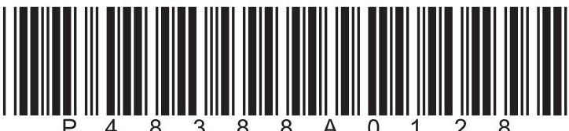

## EQUATIONS

You may find the following equations useful.

$$
\mathrm {e n e r g y t r a n s f e r r e d} = \mathrm {c u r r e n t} \times \mathrm {v o l t a g e} \times \mathrm {t i m e}
$$

$$
E = I \times V \times t
$$

$$
\mathrm {p r e s s u r e} \times \mathrm {v o l u m e} = \mathrm {c o n s t a n t}
$$

$$
p _ {1} \times V _ {1} = p _ {2} \times V _ {2}
$$

$$
\mathrm {f r e q u e n c y} = \frac {1}{\mathrm {t i m e p e r i o d}}
$$

$$
f = \frac {1}{T}
$$

$$
\mathrm {p o w e r} = \frac {\mathrm {w o r k d o n e}}{\mathrm {t i m e t a k e n}}
$$

$$
P = \frac {W}{t}
$$

$$
\mathrm {p o w e r} = \frac {\mathrm {e n e r g y t r a n s f e r r e d}}{\mathrm {t i m e t a k e n}}
$$

$$
P = \frac {W}{t}
$$

$$
\mathrm {o r b i t a l s p e e d} = \frac {2 \pi \times \mathrm {o r b i t a l r a d i u s}}{\mathrm {t i m e p e r i o d}}
$$

$$
v = \frac {2 \times \pi \times r}{T}
$$

Where necessary, assume the acceleration of free fall, g = 10 m/s $ ^{2} $

## Answer ALL questions. Write your answers in the spaces provided.

1 Doctors use ionising and non-ionising radiation in hospitals.

(a) The table lists some types of radiation.

Put a tick ( $ \checkmark $ ) in each row of the table to show which types of radiation are ionising and which are non-ionising.

One has been done for you.

<table border="1"><tr><td>Radiation</td><td>Ionising</td><td>Non-ionising</td></tr><tr><td>alpha</td><td>√</td><td></td></tr><tr><td>beta</td><td></td><td></td></tr><tr><td>gamma</td><td></td><td></td></tr><tr><td>ultrasound</td><td></td><td></td></tr></table>

(b) Give two precautions that doctors should take when using ionising radiation.

(Total for Question 1 = 5 marks)

2 Marbles is a game played with small balls of coloured glass. Each ball is known as a marble.

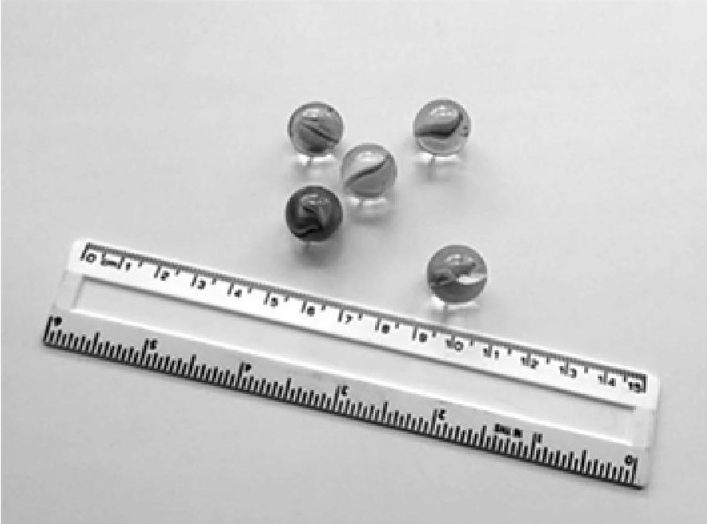

(a) Describe how a millimetre scale and two set squares can be used to measure the diameter of a marble.

You may draw a diagram to help your answer.

(b) Describe an experiment to find the density of a marble. You may draw a diagram to help your answer.

3 A student investigates a toy.

- the toy has three woodpeckers

- each woodpecker is attached to a wooden ring by a spring

- a metal rod passes through the wooden rings

- the woodpeckers have different masses

- the springs are identical

When a woodpecker is pulled back and released, it vibrates and moves down the rod.

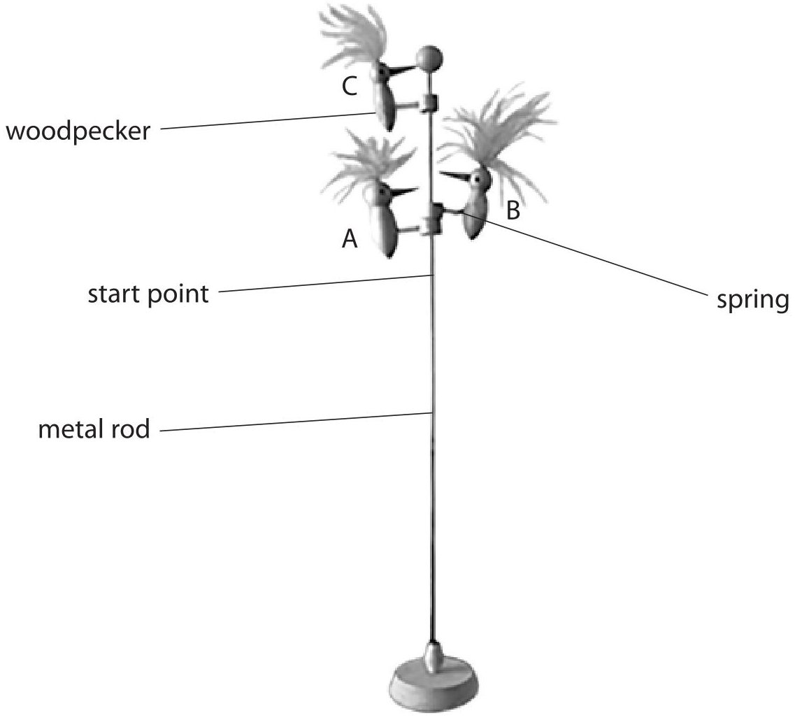

(a) A student uses this method to investigate the toy.

- measure the mass of woodpecker A

- move woodpecker A to the start point and release it

- record the time it takes for woodpecker A to travel 20cm

- repeat the test two more times

The student uses the same method for woodpeckers B and C.

The table shows the student's results.

<table border="1"><tr><td rowspan="2">Woodpecker</td><td rowspan="2">Mass in g</td><td colspan="3">Time in s</td></tr><tr><td>test1</td><td>test2</td><td>test3</td></tr><tr><td>A</td><td>11.2</td><td>11.8</td><td>11.1</td><td>10.8</td></tr><tr><td>B</td><td>8.3</td><td>3.1</td><td>5.4</td><td>5.5</td></tr><tr><td>C</td><td>5.9</td><td>8.5</td><td>9.0</td><td>8.7</td></tr></table>

(i) One of the time measurements in the table is anomalous.

Draw a circle around this anomalous measurement.

(ii) State the relationship between average speed, distance moved and time taken.

(iii) Calculate the average (mean) speed for woodpecker B.

average speed = ... cm/s

(iv) Explain what type of graph the student should use to present his data.

(b) Before carrying out his investigation, the student made this prediction.

'The smaller the mass of the woodpecker, the faster it moves down the rod.' Discuss whether the student's results support his prediction.

(Total for Question 3 = 11 marks)

4 The diagram shows the horizontal forces on a car travelling to the right along a level road.

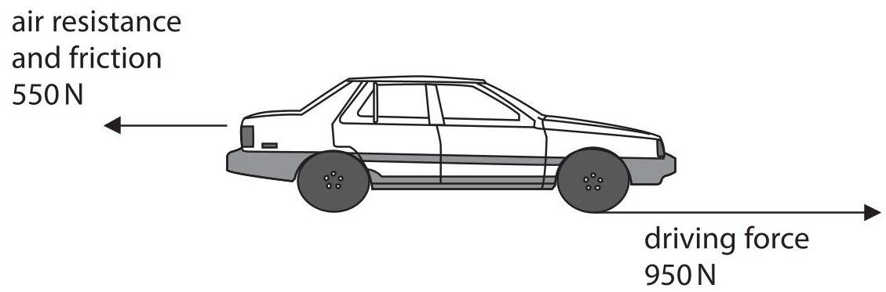

(a) How can you tell that the car is accelerating?

(b) (i) State the relationship between acceleration, change in velocity and time.

(ii) The car accelerates for 6.0 s.

The velocity of the car increases from 15 m/s to 24 m/s.

Calculate the acceleration of the car.

(c) Describe how the horizontal forces on the car change when the driver applies the brakes.

(Total for Question 4 = 6 marks)

5 A student sets up a circuit to investigate how the current in different components varies with voltage.

He investigates these components.

- a short thick copper wire

- a filament lamp

- a long thin copper wire

- a diode

(a) State four other pieces of equipment the student needs.

(b) During the investigation, the student keeps the two copper wires at a constant temperature.

(i) Give a reason why he should keep the wires at a constant temperature.

(ii) Describe how he could keep the wires at a constant temperature.

(c) The student obtains a graph for each component.

Draw a straight line linking each component to its correct graph.

(3) 

graph

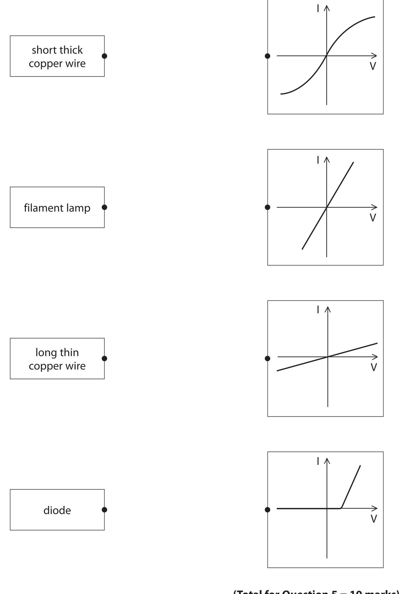

6 (a) The box lists some devices that can be used to transfer energy from one form into another.

<table border="1"><tr><td>an aerial</td><td>a loudspeaker</td><td>a microphone</td><td>a microwave oven</td></tr></table>

Select a device from the box to complete each sentence.

Sound energy is changed into electrical energy using

Electrical energy is changed into sound energy using

(b) A radio station uses a short wavelength radio wave for broadcasting information. The wavelength is 25 m.

The frequency is 12000 kHz.

(i) State the relationship between the speed, frequency and wavelength of a wave.

(ii) Calculate the speed of the short wavelength radio wave.

## BLANK PAGE

7 A filament lamp is connected to a battery.

The lamp is switched on and a data logger records the current.

The graph shows the results from the data logger.

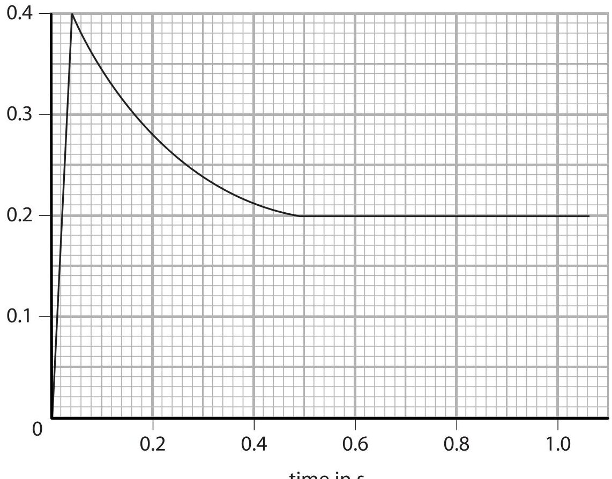

(a) Describe in detail how the current varies with time.

Refer to data from the graph in your answer.

(b) The battery has a voltage of 12 V.

The lamp reaches its normal operating temperature after a short while.

(i) State the current in the lamp when it is at its normal operating temperature.

$$
\mathrm {c u r r e n t} =
$$

(ii) State the relationship between voltage, current and resistance.

(iii) Calculate the resistance of the lamp at its normal operating temperature. Give the unit.

(iv) State the relationship between power, current and voltage.

(v) Calculate the power of the lamp at its normal operating temperature.

(c) Suggest why a filament lamp is most likely to fail when it is first switched on.

(Total for Question 7 = 14 marks)

8 This question is about planets in the solar system.

(a) Planets in the solar system have different sizes and masses.

The bar chart shows the gravitational field strength of each planet compared to Earth.

gravitational field strength compared to Earth

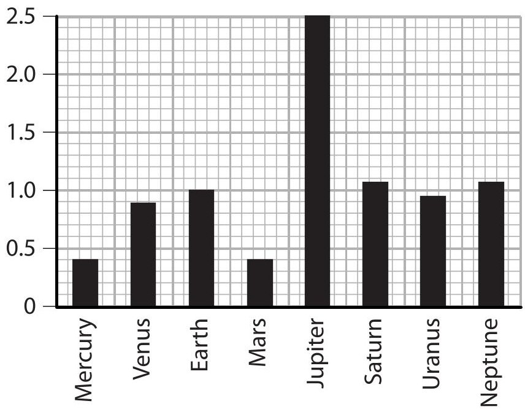

(i) Which of these statements is correct?

A A 1kg mass would weigh more on Venus than on Neptune

B A1kg mass would weigh more on Earth than on Uranus

C A 1kg mass would weigh more on Mercury than on Saturn

D A1kg mass would weigh more on Mars than on Jupiter

(ii) On Earth, the gravitational field strength is 10N/kg.

Which of these is the value for the gravitational field strength on Mars?

A 0.04 N/kg

B 0.4 N/kg

C 4 N/kg

D 25 N/kg

(b) Deimos is a natural satellite of Mars.

Deimos has an orbital time period of 1820 minutes and an orbital speed of 1350 m/s.

(i) Calculate the orbital radius of Deimos.

(ii) The diagram shows Deimos in orbit around Mars.

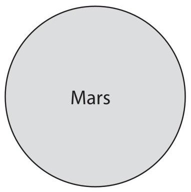

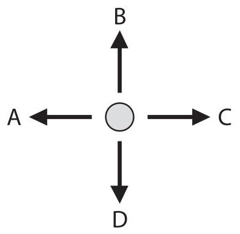

Which arrow shows the direction of the force of gravity that Mars exerts on Deimos?

(1) 

A

B

C

D

(Total for Question 8 = 7 marks)

9 The diagram shows a hydroelectric power station.

Water flows down the tunnel and turns a large turbine.

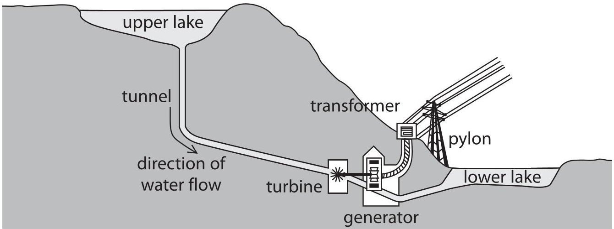

(a) What type of energy decreases when the water flows from the upper lake to the turbine?

(b) Describe how the turbine and generator produce electricity.

(c) Suggest why it is important that the turbine turns at constant speed.

(d) This is a Sankey diagram for the power station.

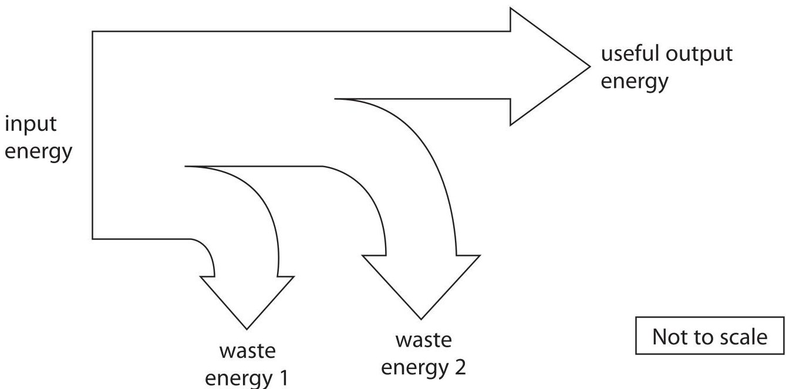

(i) State the relationship between efficiency, useful energy output and total energy input.

ii) The efficiency of the power station is 36%

The total energy input is 1050 kJ.

Calculate the total wasted energy in kJ.

total wasted energy =

(iii) Name two forms of wasted energy in this power station.

(Total for Question 9 = 12 marks)

10 (a) The diagram shows the construction of a bicycle pump.

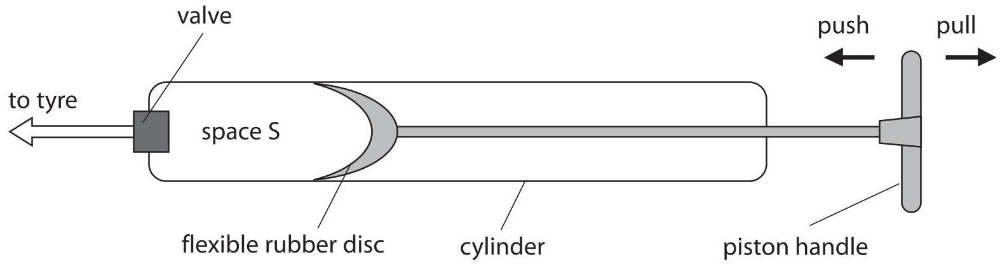

When the piston handle is pulled, air moves past the flexible rubber disc into space S.

When the piston handle is pushed, the flexible rubber disc presses against the sides of the cylinder so no air can pass the disc in either direction.

(i) When the volume of space S is $ 8 0 \mathrm{c m}^{3} $ , the air in space S has a pressure of $ 1. 0 1 \times1 0^{5} $ Pa. The valve is sealed so no air can escape from the pump.

Calculate the pressure inside space S when the piston handle is pushed in and the volume decreases to $ 1 0 \mathrm{c m}^{3}. $

(ii) State an assumption you have made about the air in space S.

(iii) When the bicycle pump is used to inflate a tyre, the pump becomes hot. Suggest why the pump becomes hot.

(b) The photograph shows a woman using a pump to lift water from a well.

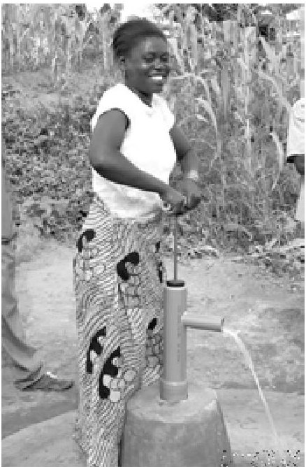

(i) State the relationship between work done, force and distance moved.

(ii) Calculate the work done in lifting 1.25 kg of water a distance of 8.70 m.

11 Binoculars are used to look at distant objects.

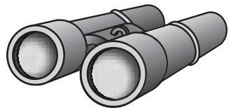

Many binoculars use right-angled prisms.

The diagram shows two parallel rays of light, AB and FG, from a distant bird, incident on a right-angled prism.

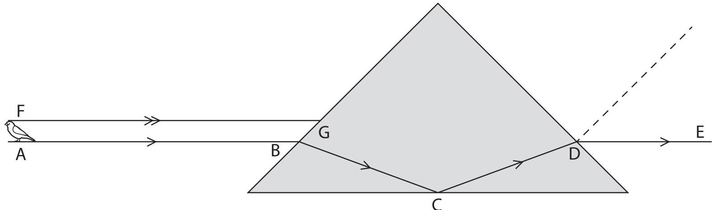

(a) (i) On the diagram, draw the normal at G.

(ii) Measure the angle of incidence at G and the angle of refraction at D.

angle of incidence at G = ...

angle of refraction at D = ...

(b) Explain what happens to the light ray at C.

(c) Complete the diagram by drawing the path that light ray FG takes through the prism.

(Total for Question 11 = 9 marks)

12 The diagram shows the main parts of a nuclear reactor.

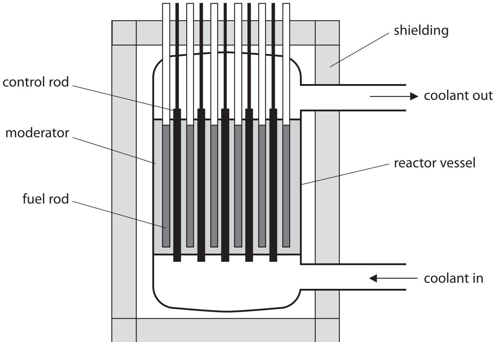

(a) Draw a straight line linking each part of the reactor to its correct purpose.

## part of reactor

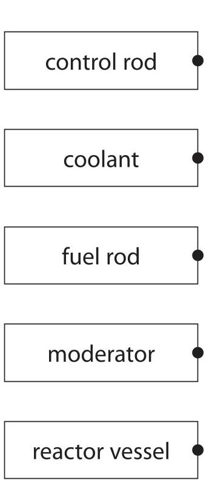

## purpose

absorbs neutrons

transfers thermal energy

keeps radioactive material inside the reactor

slows the neutrons

contains uranium

(b) Which of these is a nuclear fission product?

(1) 

A alpha particles

B electrons

C neutrons

D uranium nuclei

(c) Describe the process of nuclear fission.

(d) State three ways in which nuclear fission differs from radioactive decay.

(Total for Question 12 = 12 marks)

13 A student uses four containers, A, B, C and D, to investigate heat transfer.

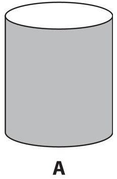

shiny metal container

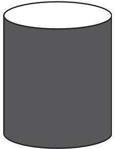

B

metal container painted black

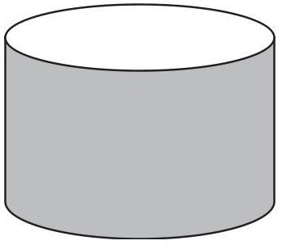

wide shiny metal container

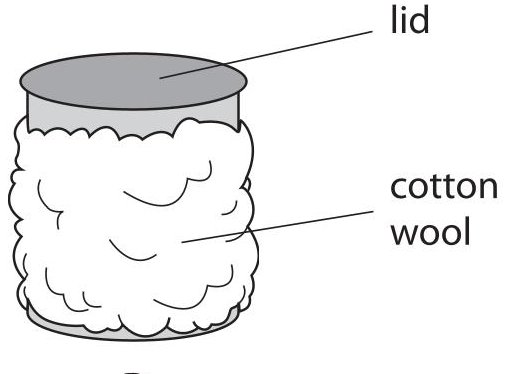

metal container wrapped in cotton wool

The student places boiling water into each of the four containers.

She then records how the temperature of the water in each container varies with time.

(a) How could the student make sure that the investigation is a fair test?

(2) 

(b) (i) Explain which container loses the most thermal energy by radiation.

(ii) Explain which container loses the most thermal energy by convection.

(c) After 20 minutes, container D has the highest temperature.

Explain why container D remains hot for the longest time.

Refer to three methods of thermal energy transfer in your answer.

(Total for Question 13 = 10 marks)

TOTAL FOR PAPER=120 MARKS

## BLANK PAGE

Every effort has been made to contact copyright holders to obtain their permission for the use of copyright material. Pearson Education Ltd. will, if notified, be happy to rectify any errors or omissions and include any such rectifications in future editions.

