<table><tr><td colspan="3">Write your name here</td></tr><tr><td>Surname</td><td colspan="2">Other names</td></tr><tr><td>Pearson Edexcel Certificate
Pearson Edexcel
International GCSE</td><td>Centre Number</td><td>Candidate Number</td></tr><tr><td colspan="3">Physics
Unit: KPH0/4PH0
Science (Double Award) KSC0/4SC0
Paper: 1P</td></tr><tr><td colspan="2">Wednesday 24 May 2017 – Afternoon
Time: 2 hours</td><td>Paper Reference
KPH0/1P 4PH0/1P
KSC0/1P 4SC0/1P</td></tr><tr><td colspan="3">You must have:
Ruler, calculator, protractor</td></tr><tr><td colspan="3">Total Marks</td></tr></table>

## Instructions

- Use black ink or ball-point pen.

- Fill in the boxes at the top of this page with your name, centre number and candidate number.

- Answer all questions.

- Answer the questions in the spaces provided

- there may be more space than you need.

- Show all the steps in any calculations and state the units.

- Some questions must be answered with a cross in a box. If you change your mind about an answer, put a line through the box and then mark your new answer with a cross.

## Information

- The total mark for this paper is 120.

- The marks for each question are shown in brackets

- use this as a guide as to how much time to spend on each question.

## Advice

- Read each question carefully before you start to answer it.

- Write your answers neatly and in good English.

- Try to answer every question.

- Check your answers if you have time at the end.

Turn over

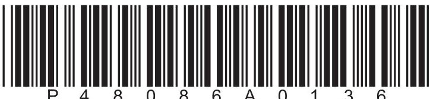

## EQUATIONS

You may find the following equations useful.

$$
\mathrm {e n e r g y t r a n s f e r r e d} = \mathrm {c u r r e n t} \times \mathrm {v o l t a g e} \times \mathrm {t i m e}
$$

$$
E = I \times V \times t
$$

$$
\mathrm {p r e s s u r e} \times \mathrm {v o l u m e} = \mathrm {c o n s t a n t}
$$

$$
p _ {1} \times V _ {1} = p _ {2} \times V _ {2}
$$

$$
\mathrm {f r e q u e n c y} = \frac {1}{\mathrm {t i m e p e r i o d}}
$$

$$
f = \frac {1}{T}
$$

$$
\mathrm {p o w e r} = \frac {\mathrm {w o r k d o n e}}{\mathrm {t i m e t a k e n}}
$$

$$
P = \frac {W}{t}
$$

$$
\mathrm {p o w e r} = \frac {\mathrm {e n e r g y t r a n s f e r r e d}}{\mathrm {t i m e t a k e n}}
$$

$$
P = \frac {W}{t}
$$

$$
\mathrm {o r b i t a l s p e e d} = \frac {2 \pi \times \mathrm {o r b i t a l r a d i u s}}{\mathrm {t i m e p e r i o d}}
$$

$$
v = \frac {2 \times \pi \times r}{T}
$$

Where necessary, assume the acceleration of free fall, g = 10 m/s $ ^{2} $

## BLANK PAGE

## Answer ALL questions.

1 (a) Which of these is an electron?

A an x-ray

B a gamma ray

C an alpha particle

D a beta particle

(b) (i) Which of these will repel an alpha particle?

A a nucleus

B an electron

C a gamma ray

D a neutron

A

(ii) Which of these could be the path of an alpha particle passing very close to a gold nucleus?

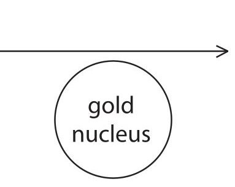

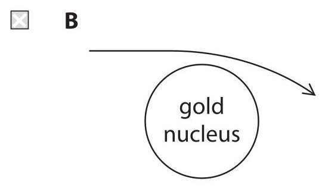

C

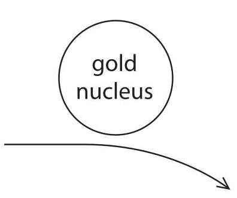

D

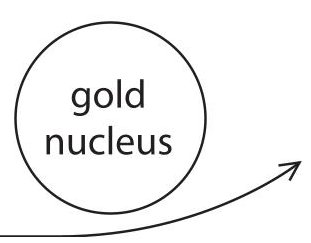

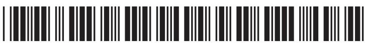

(iii) The diagram shows how the different parts of the body affect the radiation from four radioactive sources, A, B, C and D.

Which source only emits alpha particles?

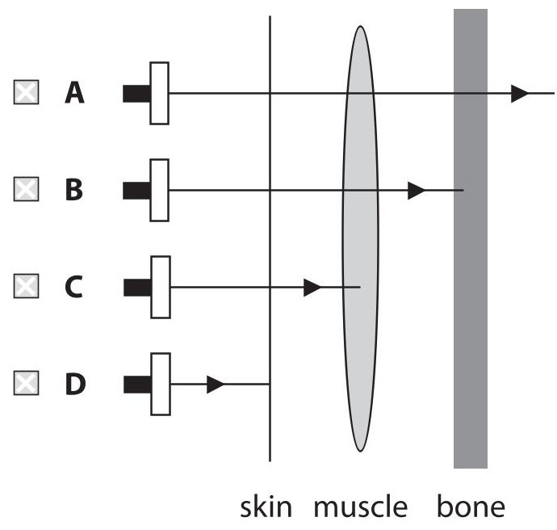

(iv) Which of these properties is the reason for using alpha particles in a smoke detector?

A high ionising ability

B low mass

C short half-life

D long range

(Total for Question 1 = 5 marks)

2 In cold countries, radiators are used to heat buildings.

Radiators are made of metal and have hot water flowing through them.

The diagram shows three radiators that are the same size but painted different colours.

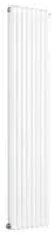

white

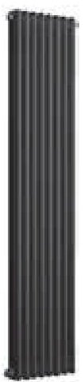

black

silver

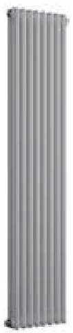

(a) Explain why radiators are made of metal.

(2) 

(b) Explain which colour is best at radiating thermal energy.

(2) 

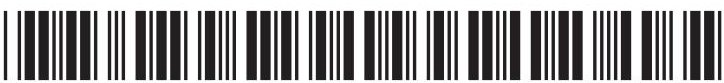

(c) A radiator also transfers thermal energy by convection.

(i) Explain how convection heats a room.

You may draw a diagram to help your answer.

(ii) Suggest how a radiator can be designed to help maximise heat transfer by convection.

(Total for Question 2 = 9 marks)

3 This question is about parts of the electromagnetic spectrum.

<table border="1"><tr><td>gamma rays</td><td>x-rays</td><td></td><td>visible light</td><td>infrared waves</td><td>microwaves</td><td>radio waves</td></tr></table>

(a) Name the missing part of this spectrum.

(b) Which part of this spectrum has the shortest wavelength?

(c) Explain how the frequency of electromagnetic waves in free space differs with increasing wavelength.

(d) Microwaves are used to heat food. State another part of the spectrum that is used to heat food.

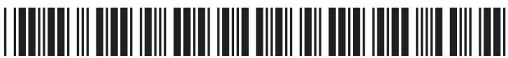

(e) Microwaves are used at airports to detect aeroplanes.

A microwave beam is emitted from a large rotating aerial and reflected back off the metal surface of the aeroplane.

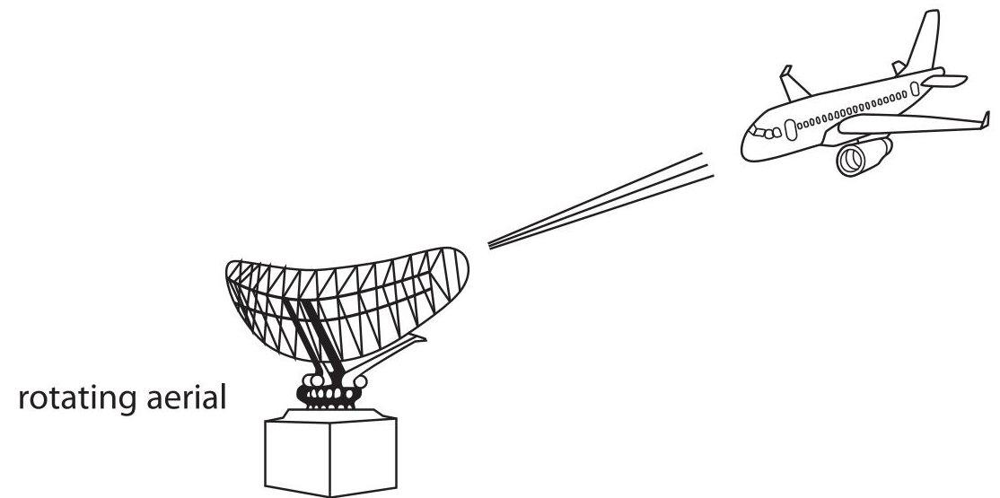

(i) Explain how microwaves are used to find the distance to an aeroplane.

(ii) Suggest why it is important for the aerial to rotate through a full circle every two seconds.

(Total for Question 3 = 9 marks)

4 (a) These terms are used on the safety labels found on electrical appliances. Explain the meaning of each term. (i) insulated wire

(ii) 5A fuse

(iii) earthed

(iv) double insulated

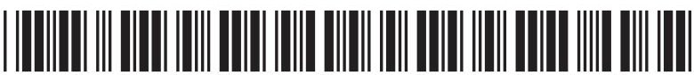

(b) Circuit breakers are often used instead of fuses. Give two advantages of using a circuit breaker.

(Total for Question 4 = 9 marks)

5 (a) The diagram shows stages in electricity generation at a nuclear power station.

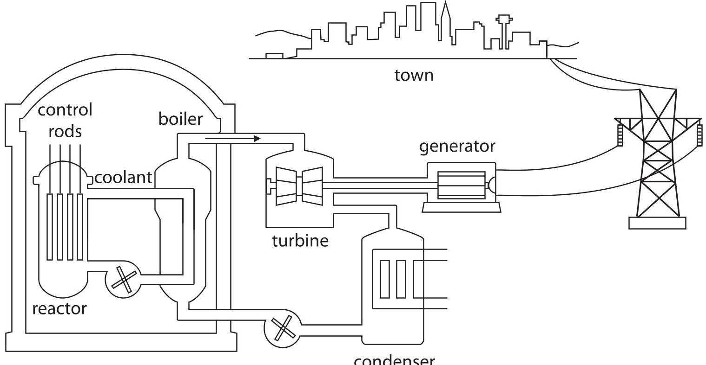

Describe the energy transfers that take place in this power station.

(4) 

(b) Which of these types of power station uses gravitational potential energy to generate electricity?

A wind farm

B geothermal power station

C hydroelectric power station

D coal-fired power station

(c) Which of these types of power station transfers thermal energy to generate electricity?

B solar farm

A coal-fired power station

C hydroelectric power station

D wind farm

(d) A power station needs an input of 188 J each second to operate a single 60 W lamp in a house.

The Sankey diagram shows what happens to the input energy at each stage.

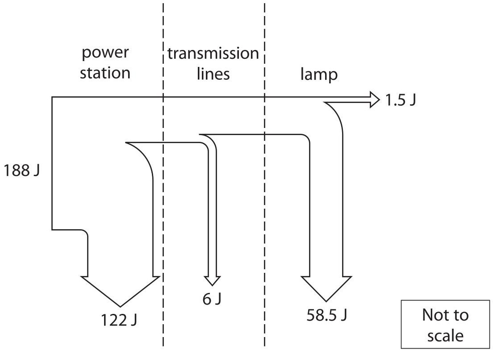

(i) Which of these is the main form of energy wasted in the lamp?

A sound

B thermal

electrical

D light

(ii) State the relationship between efficiency, useful energy output and total energy input.

(iii) Calculate the overall efficiency from power station input to lamp.

efficiency =

(Total for Question 5 = 10 marks)

6 A student uses this apparatus to investigate how the current in an LDR (light-dependent resistor) varies with the intensity of light.

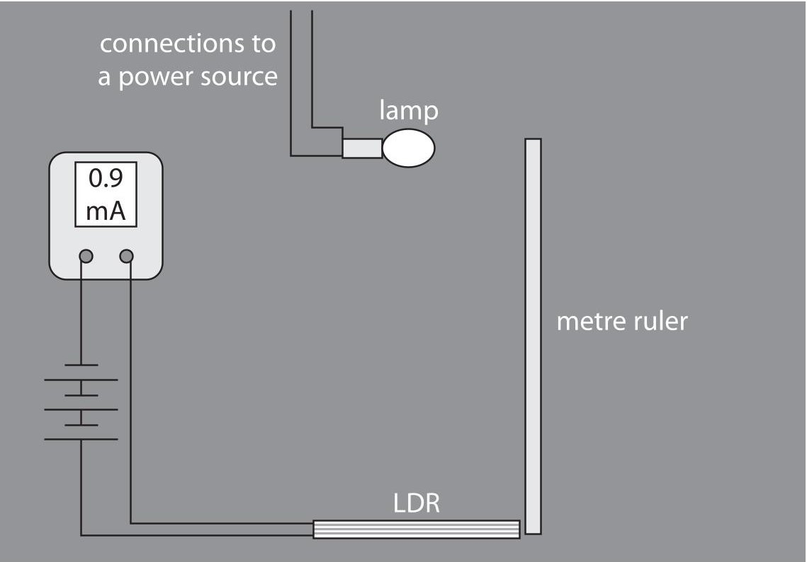

The student measures the current for a range of different intensities of light.

(a) (i) State why the student takes her readings in a dark room.

(ii) The table lists three types of variable.

Complete the table by giving an example of each type of variable for this investigation.

(3) 

<table border="1"><tr><td>Type of variable</td><td>Example</td></tr><tr><td>control</td><td></td></tr><tr><td>dependent</td><td></td></tr><tr><td>independent</td><td></td></tr></table>

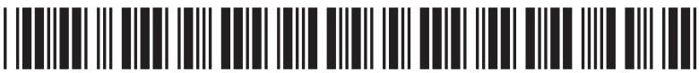

(b) The table shows her results.

<table border="1"><tr><td rowspan="2">Distance from lamp in cm</td><td colspan="4">Current in mA</td></tr><tr><td>1st reading</td><td>2nd reading</td><td>3rd reading</td><td>Average(mean)</td></tr><tr><td>10</td><td>100.1</td><td>102.8</td><td>109.6</td><td>104.2</td></tr><tr><td>20</td><td>26.9</td><td>25.1</td><td>25.8</td><td>25.9</td></tr><tr><td>30</td><td>10.6</td><td>10.7</td><td>11.7</td><td>11.0</td></tr><tr><td>40</td><td>6.1</td><td>6.2</td><td>5.8</td><td>6.0</td></tr><tr><td>50</td><td>3.9</td><td>16.0</td><td>3.8</td><td>7.9</td></tr><tr><td>60</td><td>2.9</td><td>2.7</td><td>2.9</td><td>2.8</td></tr><tr><td>80</td><td>1.6</td><td>1.5</td><td>1.5</td><td>1.5</td></tr></table>

(i) One of her readings of current is anomalous.

Circle the anomalous reading in the table.

(ii) Calculate the correct average current for the distance that has the anomalous reading.

correct average current=

(c) (i) Plot a graph of the results on the grid.

(ii) Draw the curve of best fit.

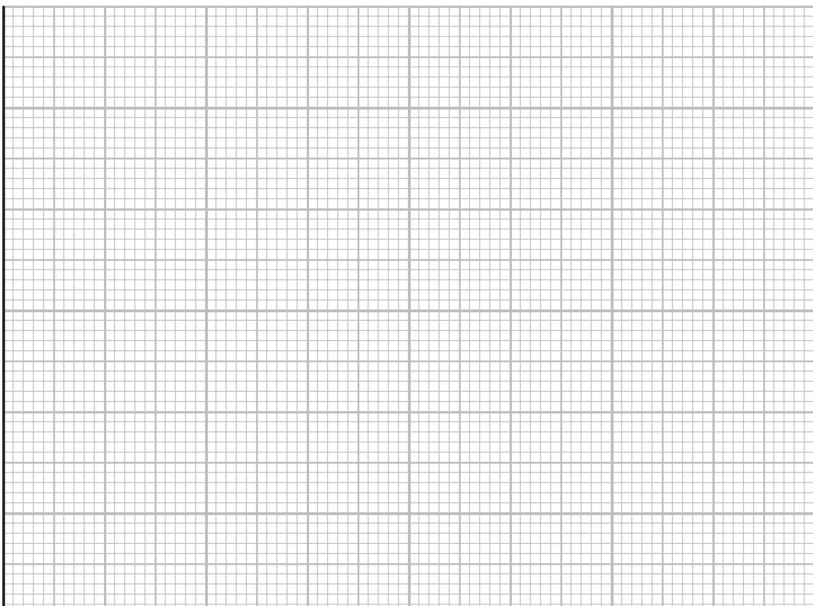

(d) (i) Describe the relationship between distance and current.

(ii) State what happens to the resistance of an LDR when the intensity of light increases.

(e) The student repeats her investigation, but this time covers the LDR with a thin sheet of tracing paper.

Explain how the curve of best fit would change.

(Total for Question 6 = 16 marks)

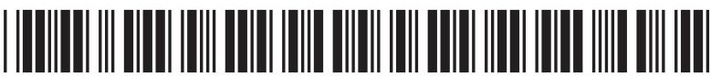

7 A student investigates the terminal velocity of steel balls falling through a thick liquid.

(a) (i) On the diagram, draw and label the forces acting on a steel ball as it falls at terminal velocity.

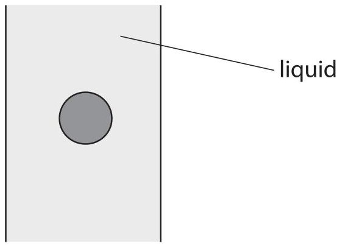

(ii) Explain, in terms of forces, what is meant by terminal velocity.

(b) The student has five steel balls of different diameter and some thick oil.

(i) Name two additional pieces of apparatus the student would need in order to investigate the terminal velocity of the steel balls falling through the oil.

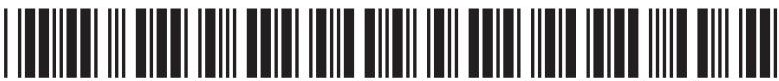

(ii) Describe a method the student could use to investigate how the diameter of a steel ball affects the terminal velocity.

In your answer, you should include

- a labelled diagram

- the measurements that the student should take

- how the student could use the measurements to find the terminal velocity.

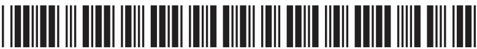

(c) Explain which type of graph the student should use to display his results.

(Total for Question 7 = 15 marks)

8 The diagram shows a lorry with a curved roof.

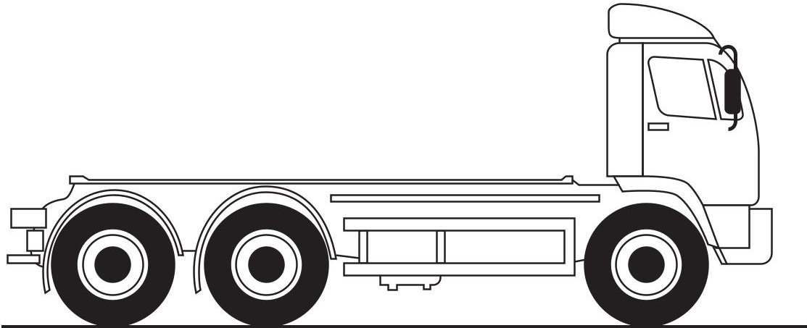

(a) Give a reason why the roof is shaped in this way.

(1) 

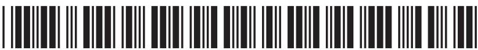

(b) The lorry travels up a hill at a constant speed.

The diagram shows the dimensions of the hill.

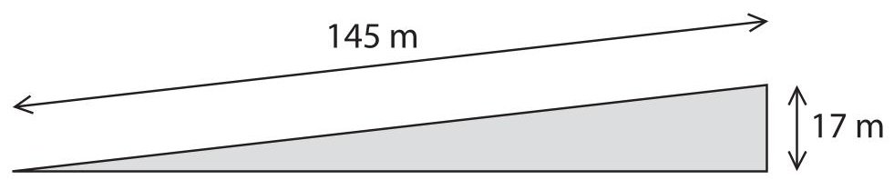

(i) State the relationship between work done, force and distance moved in the direction of the force.

(ii) The weight of the lorry is 180 kN.

Calculate the work done against gravity by the lorry in moving to the top of the hill.

(iii) The lorry takes 8.0 s to travel up the hill.

Calculate the useful power of the lorry.

Give the unit.

(c) The graph shows part of another journey.

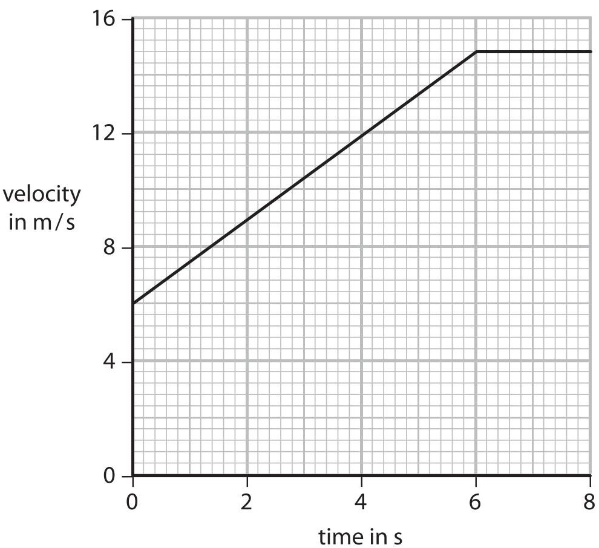

The lorry accelerates and then travels at a constant velocity.

(i) State the relationship between acceleration, change in velocity and time.

(ii) Calculate the acceleration of the lorry during the first 6 s.

$$
\mathrm {a c c e l e r a t i o n} =
$$

(iii) Calculate the distance travelled during the 8 s shown on the graph.

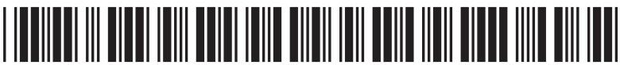

(d) The lorry has 6 tyres.

(i) State the relationship between pressure, force and area.

(ii) The pressure in each tyre is 240 kPa.

The weight of the lorry is 180 kN.

Calculate the area of each tyre that is in contact with the road.

(Total for Question 8 = 19 marks)

9 A student investigates what happens when light passes through a glass prism. He shines red light into the prism so that the light is incident at $ 9 0^{\circ} $ at A. He then completes the path of the light through the prism as shown.

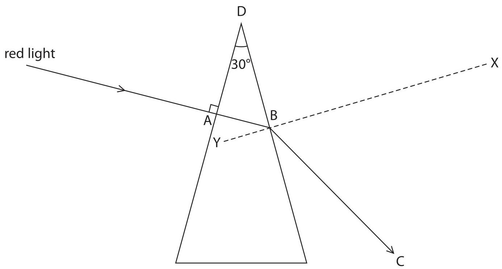

(a) (i) State the advantage of shining the light at right angles into the prism.

(ii) Suggest why the student uses light of just one colour.

(iii) State the name given to the line XY.

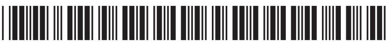

(b) (i) Measure the angle of refraction of the light at B.

$$
\mathrm {a n g l e} =
$$

(ii) State the relationship between refractive index, angle of incidence and angle of refraction.

(iii) The angle of incidence at B is $ 3 0^{\circ} $

Calculate the refractive index of the glass.

(c) The critical angle of the glass prism is $ 3 5^{\circ} $

(i) Explain what is meant by the term critical angle. You may draw a diagram to help your answer.

(ii) The student shines the light so that it hits B at a different angle. Continue the path of the ray of light on the diagram.

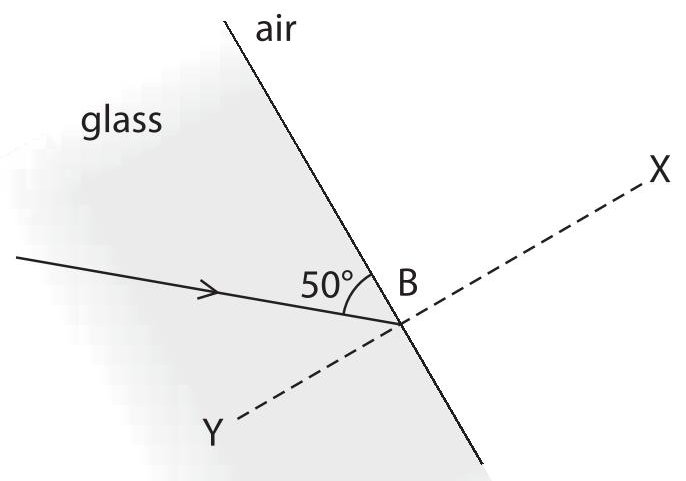

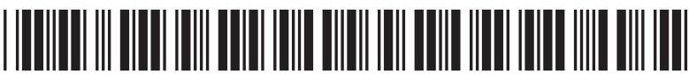

## BLANK PAGE

10 When a neutron collides with a uranium-235 nucleus, nuclear fission can occur.

The equation represents this fission process.

$$
{ } _ { 9 2 } ^ { 2 3 5 } \mathrm { U } + { } _ { 0 } ^ { 1 } \mathrm { n } \rightarrow { } _ { 5 6 } ^ { 1 4 4 } \mathrm { B a } + { } _ { 3 6 } ^ { 9 0 } \mathrm { K r } + \mathrm { n e u t r o n s }
$$

(a) (i) What is meant by the term fission?

(ii) Calculate the number of neutrons released during this fission reaction.

(iii) Explain how a chain reaction can occur in uranium-235.

(iv) With reference to the equation, explain what is meant by a daughter nucleus.

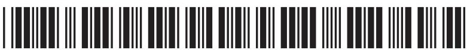

(b) Barium-144 is a radioactive isotope that emits beta particles.

Explain what happens to the mass (nucleon) number of barium-144 when it emits a beta particle.

(Total for Question 10 = 9 marks)

## BLANK PAGE

11 (a) This apparatus can be used to investigate electromagnetic induction.

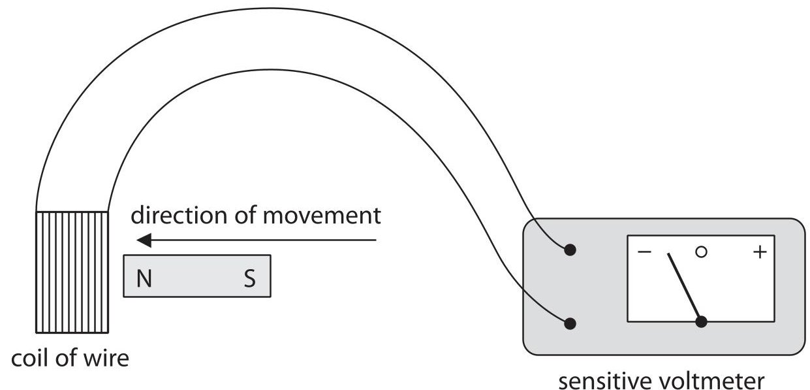

When the magnet is moved into the coil of wire, the voltmeter shows a negative reading. State two separate changes, each of which would make the voltmeter show a positive reading.

(b) The diagram shows a simple electrical generator connected to a lamp. When the coil is turned, a voltage is induced.

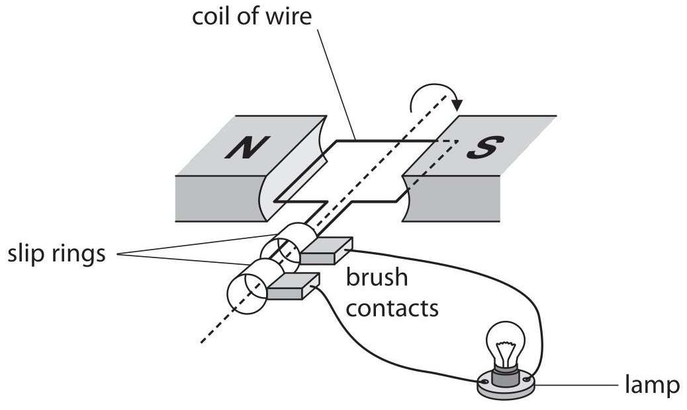

(i) Explain why a voltage is induced when the coil is turned.

(2) 

(ii) State two ways that this induced voltage can be increased.

(2) 

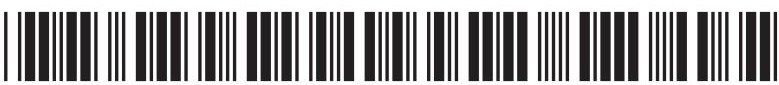

(iii) When the lamp is connected to the generator, the coil is hard to turn. When the lamp is disconnected from the generator, the coil is easy to turn. Suggest, in terms of energy, why it is harder to turn the coil when the lamp is connected.

(Total for Question 11 = 8 marks)

TOTAL FOR PAPER=120 MARKS

## BLANK PAGE

Every effort has been made to contact copyright holders to obtain their permission for the use of copyright material. Pearson Education Ltd. will, if notified, be happy to rectify any errors or omissions and include any such rectifications in future editions.

