<table><tr><td colspan="3">Please check the examination details below before entering your candidate information</td></tr><tr><td>Candidate surname</td><td colspan="2">Other names</td></tr><tr><td colspan="3">Centre Number Candidate Number</td></tr><tr><td colspan="3">Pearson Edexcel International GCSE (9-1)</td></tr><tr><td colspan="3">Wednesday 22 May 2019</td></tr><tr><td>Afternoon (Time: 2 hours)</td><td colspan="2">Paper Reference 4PH1/1PR 4SD0/1PR</td></tr><tr><td colspan="3">Physics
Unit: 4PH1
Science (Double Award) 4SD0
Paper: 1PR</td></tr><tr><td colspan="2">You must have:
Ruler, protractor, calculator</td><td>Total Marks</td></tr></table>

## Instructions

- Use black ink or ball-point pen.

- Fill in the boxes at the top of this page with your name, centre number and candidate number.

- Answer all questions.

- Answer the questions in the spaces provided - there may be more space than you need.

- Show all the steps in any calculations and state the units.

- Some questions must be answered with a cross in a box . If you change your mind about an answer, put a line through the box and then mark your new answer with a cross.

## Information

- The total mark for this paper is 110.

- The marks for each question are shown in brackets

- use this as a guide as to how much time to spend on each question.

## Advice

- Write your answers neatly and in good English.

- Try to answer every question.

- Read each question carefully before you start to answer it.

- Check your answers if you have time at the end.

Turn over

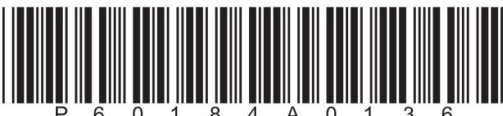

## FORMULAE

You may find the following formulae useful.

$$
\mathrm {e n e r g y t r a n s f e r r e d} = \mathrm {c u r r e n t} \times \mathrm {v o l t a g e} \times \mathrm {t i m e}
$$

$$
E = I \times V \times t
$$

$$
f r e q u e n c y = \frac {1}{t i m e p e r i o d}
$$

$$
f = \frac {1}{T}
$$

$$
\mathrm {p o w e r} = \frac {\mathrm {w o r k d o n e}}{\mathrm {t i m e t a k e n}}
$$

$$
P = \frac {W}{t}
$$

$$
\mathrm {p o w e r} = \frac {\mathrm {e n e r g y t r a n s f e r r e d}}{\mathrm {t i m e t a k e n}}
$$

$$
P = \frac {W}{t}
$$

$$
\mathrm {o r b i t a l s p e e d} = \frac {2 \pi \times \mathrm {o r b i t a l r a d i u s}}{\mathrm {t i m e p e r i o d}}
$$

$$
v = \frac {2 \times \pi \times r}{T}
$$

(final speed) $ ^{2} $ = (initial speed) $ ^{2} $ + (2 $ \times $ acceleration $ \times $ distance moved)

$$
v ^ {2} = u ^ {2} + (2 \times a \times s)
$$

pressure $ \times $ volume = constant

$$
p _ {1} \times V _ {1} = p _ {2} \times V _ {2}
$$

$$
\frac {\mathrm {p r e s s u r e}}{\mathrm {t e m p e r a t u r e}} = \mathrm {c o n s t a n t}
$$

$$
\frac {p _ {1}}{T _ {1}} = \frac {p _ {2}}{T _ {2}}
$$

Where necessary, assume the acceleration of free fall, g=10 m/s $ ^{2}. $

## BLANK PAGE

## Answer ALL questions.

1 This question is about stars.

(a) The diagram shows the orbits of two astronomical objects around a star.

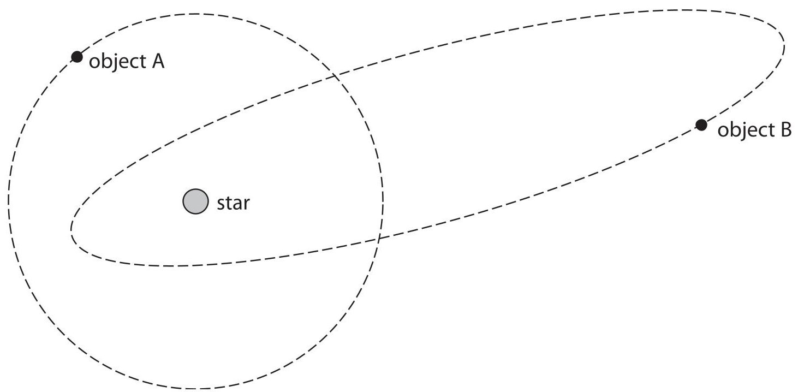

(i) Add a labelled arrow to the diagram to show the type of force from the star acting on object A.

(ii) What is object A?

A a comet

B a galaxy

C a moon

D a planet

(iii) What is object B?

A a comet

B a galaxy

C a moon

D a planet

(b) State the name given to a large collection of billions of stars.

(c) Physicists classify stars according to their colour.

Each group of stars of similar colour is called a spectral class.

The table gives information about colour and surface temperature for three spectral classes of stars.

The Sun belongs to spectral class G.

<table border="1"><tr><td>Spectral class</td><td>Colour</td><td>Surface temperature in kelvin</td></tr><tr><td>B</td><td>blue-white</td><td></td></tr><tr><td>G</td><td>yellow</td><td>5600</td></tr><tr><td>M</td><td>orange-red</td><td></td></tr></table>

Complete the table by suggesting values for the missing surface temperatures.

(d) There are stars in the universe with masses much greater than the mass of the Sun.

Describe what happens to these high-mass stars when they leave the main sequence stage of their evolution.

(Total for Question 1 = 10 marks)

2 Some of the energy stored in the nuclei of atoms can be used to generate electricity.

(a) A nuclear fission power station generates electricity.

(i) State the role of the moderator in a nuclear fission power station.

(ii) Some of the daughter nuclei produced in nuclear fission are highly radioactive and emit high energy neutrons when they decay.

Explain which feature of a nuclear fission reactor reduces the risks from these high energy neutrons.

(iii) The daughter nuclei can cause contamination and irradiation. Describe the difference between contamination and irradiation.

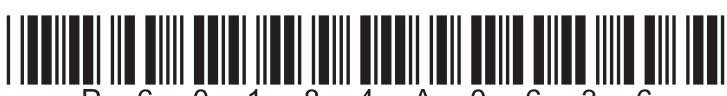

(b) Nuclear fusion is another process that could be used to generate electricity.

(i) Describe the process of nuclear fusion.

(ii) State where nuclear fusion occurs naturally.

(iii) Generating electricity from nuclear fusion is very difficult as the conditions needed are hard to achieve and maintain.

Explain the conditions required for nuclear fusion.

(Total for Question 2 = 11 marks)

3 Lead-210 is a radioactive isotope of lead and is represented using this symbol.

$$
{ } _ { 8 2 } ^ { 2 1 0 } \mathrm { P b }
$$

(a) State what is meant by the term isotope.

(b) How many protons are in the nucleus of lead-210?

A 82

B 128

C 210

D 292

(c) (i) A sample of lead-210 has an initial activity of 240 Bq. After 66 years, the activity of the sample is 30 Bq. Calculate the half-life of lead-210.

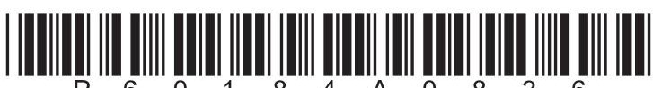

(ii) Lead-210 decays into lead-206 through a number of stages.

This involves one alpha decay and a number of beta decays.

This incomplete equation summarises these stages.

$$
{ } _ { 8 2 } ^ { 2 1 0 } \mathrm { P b } \rightarrow { } _ { 8 2 } ^ { 2 0 6 } \mathrm { P b } + \alpha + { } _ { - 1 } ^ { 0 } \beta
$$

Complete the equation by giving the missing numbers.

Write your answers in the spaces provided.

(Total for Question 3 = 7 marks)

4 Photograph 1 shows an outdoor swimming pool.

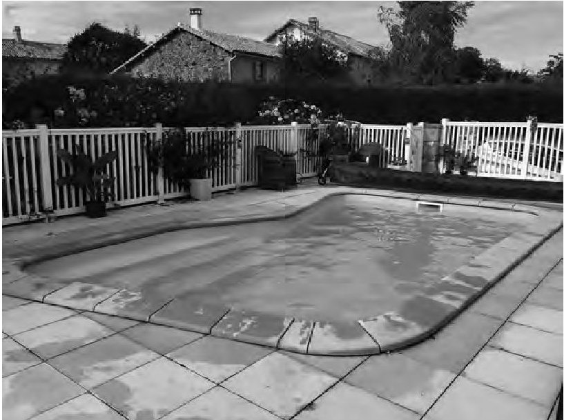

Photograph 1

(a) The water in the swimming pool is heated by the Sun during the day.

(i) State how energy is transferred from the Sun to the water.

(ii) State what happens to the average speed of the water molecules as the water is heated.

(b) The water in the swimming pool cools down at night.

(i) Suggest why the water cools down at night.

(1) 

(ii) Photograph 2 shows the swimming pool with a plastic cover over the water.

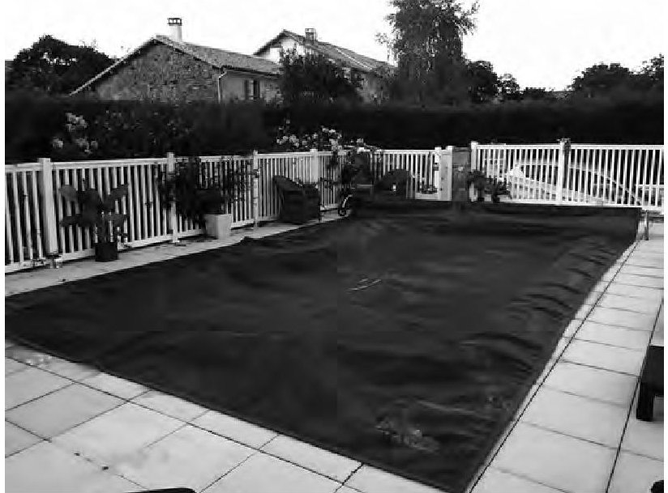

Photograph 2

Explain why the plastic cover reduces how much the water cools down at night.

(Total for Question 4 = 7 marks)

5 A student is given a type of putty that conducts electricity.

He rolls the putty into cylinders of different cross-sectional area.

The photograph shows the cylinders.

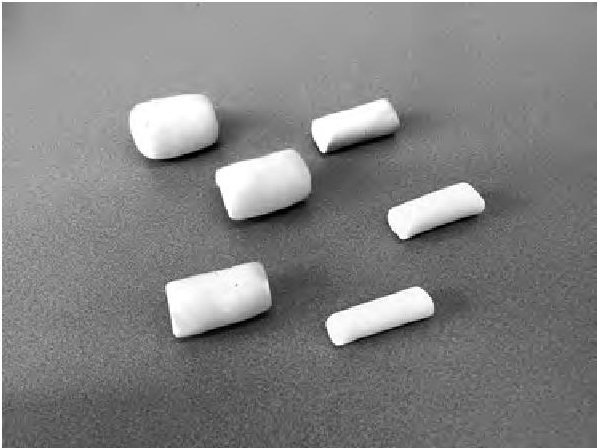

The student investigates how the electrical resistance of the putty is affected by its cross-sectional area.

(a) The diagram shows the cross-sectional area of one of the cylinders of putty.

drawn to scale

(i) Use the diagram to determine the mean diameter of the cylinder of putty.

mean diameter=

(ii) Calculate the cross-sectional area of the cylinder of putty in $ cm^{2}. $ [area of a circle $ = \pi\times $ radius $ ^{2} $]

(b) The student connects a cylinder of putty to a battery.

He measures the voltage of the cylinder and the current in the circuit.

Complete the circuit diagram, adding suitable instruments to measure the voltage of the cylinder and the current in the circuit.

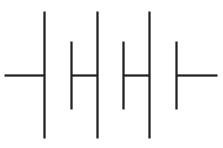

putty cylinder

(c) The student uses his voltage and current measurements to calculate the resistance of this cylinder.

He repeats this for other cylinders.

The table shows some of his results.

<table border="1"><tr><td>Cross-sectional area in $ \mathrm{cm^{2}} $</td><td>Voltage in V</td><td>Current in A</td><td>Resistance in $ \Omega $</td></tr><tr><td>4.5</td><td>4.56</td><td>0.049</td><td>91.2</td></tr><tr><td>6.2</td><td>4.56</td><td>0.059</td><td>77.3</td></tr><tr><td>9.1</td><td>4.56</td><td>0.068</td><td>67.1</td></tr><tr><td>13.9</td><td>4.56</td><td>0.085</td><td>53.6</td></tr><tr><td>18.1</td><td>4.56</td><td>0.094</td><td>48.5</td></tr><tr><td>24.6</td><td>4.56</td><td>0.107</td><td></td></tr></table>

(i) Calculate the resistance of the cylinder when the cross-sectional area of the cylinder is $ 2 4. 6 \mathrm{c m}^{2}. $

Give your answer to 3 significant figures.

(ii) Plot a graph of resistance on the y-axis and cross-sectional area on the x-axis.

(iii) Draw the curve of best fit.

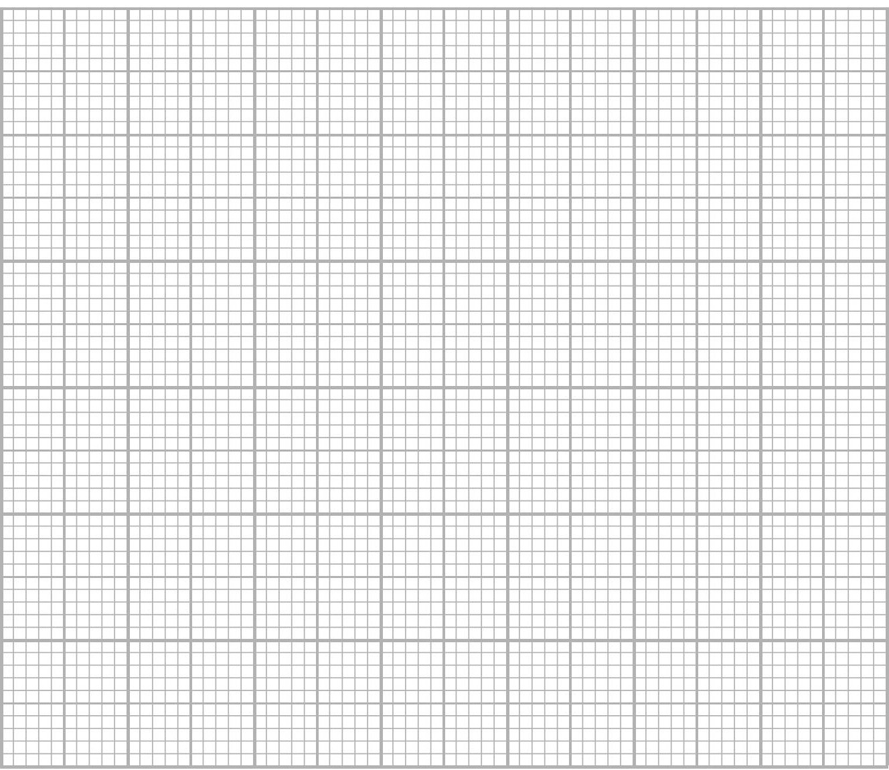

(d) The student extends his investigation by connecting two new identical cylinders to a battery.

The diagram shows the circuit he uses.

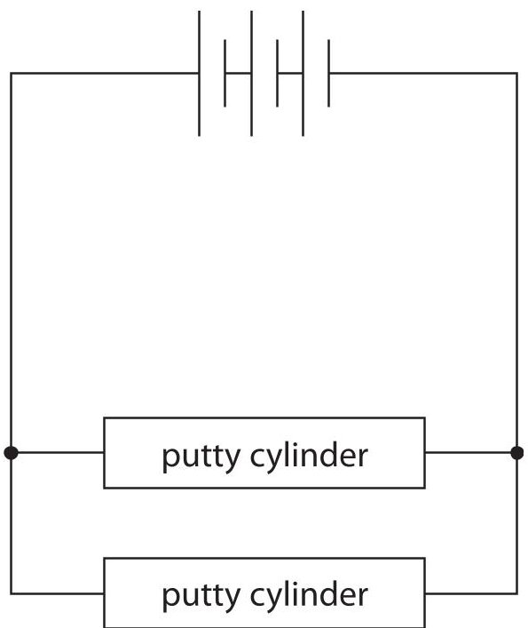

He measures the voltage of each cylinder and the total current in the circuit.

Discuss how his measurements of voltage and current compare with the measurements when only one of these cylinders is used.

(Total for Question 5 = 17 marks)

6 The photograph shows a small glass ball used to investigate density and pressure.

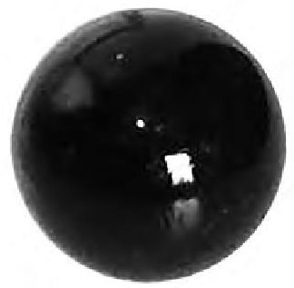

(a) The mass of the ball is 19 g.

The density of the ball is $ 2. 3 \mathrm{~ g} / \mathrm{c m}^{3} $

(i) State the formula linking density, mass and volume.

(ii) Calculate the volume of the ball.

(b) The ball is dropped into deep water and sinks to a depth of 560cm.

(i) State the formula linking pressure difference, height, density and gravitational field strength.

(ii) Calculate the increase in pressure at this depth. [density of water = 1000 kg/m $ ^{3} $]

increase in pressure = ... Pa

(Total for Question 6 = 6 marks)

7 A student investigates how the surface material of a ramp affects the average speed of a block sliding down the ramp.

(a) Design a suitable method for the student's investigation.

Your answer should include

- the measuring equipment needed

- details of the independent, dependent and control variables

- how the average speed will be determined

You may include a diagram to help your answer.

(b) Justify why the student should display their results as a bar chart.

(Total for Question 7 = 7 marks)

8 The graph shows how the velocity of a parachute jumper changes with time.

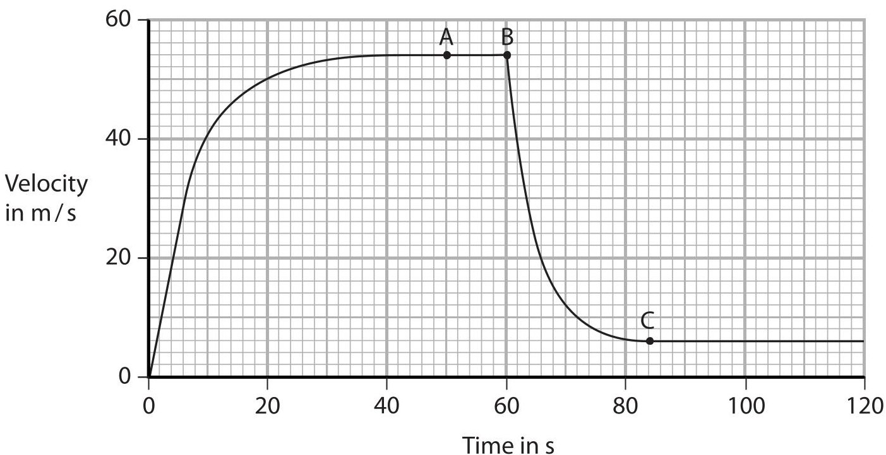

(a) At point A, the parachute jumper is falling at terminal velocity and has not yet opened her parachute.

(i) Which statement is correct about the parachute jumper at point A?

A acceleration and air resistance are equal

B acceleration and velocity are equal

C weight and acceleration are equal

D weight and air resistance are equal

(ii) Which is the best estimate of the distance fallen by the parachute jumper from the start until point A?

A 50m

B 1300m

C 2300m

D 2700m

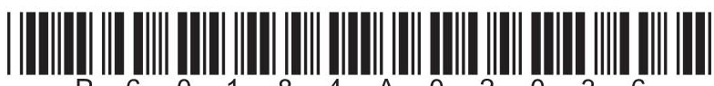

(b) The parachute jumper opens her parachute at point B.

Her velocity decreases until she reaches terminal velocity again at point C.

Explain this change in velocity.

(c) After point C, the parachute jumper continues to fall at a constant velocity.

As she falls, energy is transferred from a gravitational store.

Which store is the energy transferred into?

A chemical store

B gravitational store

C kinetic store

D thermal store

(Total for Question 8 = 7 marks)

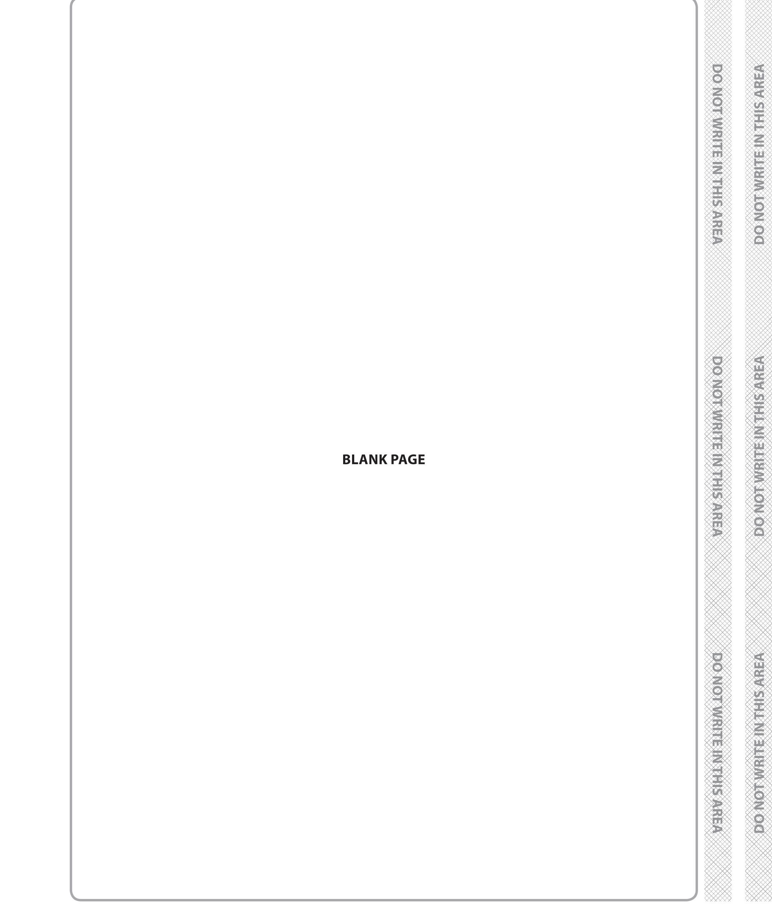

9 (a) A light ray travels from air into water.

Diagram 1 shows the direction of the light ray and the wavefronts in air.

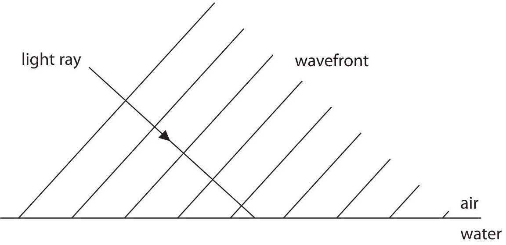

## Diagram 1

The refractive index of water is greater than the refractive index of air.

(i) Complete diagram 1 by showing

- the wavefronts in the water

- the path of the light ray in the water

(ii) Explain what happens to the wavelength of light when it passes from air into water.

(b) Diagram 2 shows what can happen when a light ray travelling in glass meets the boundary with air.

The wavefronts are not shown in this diagram.

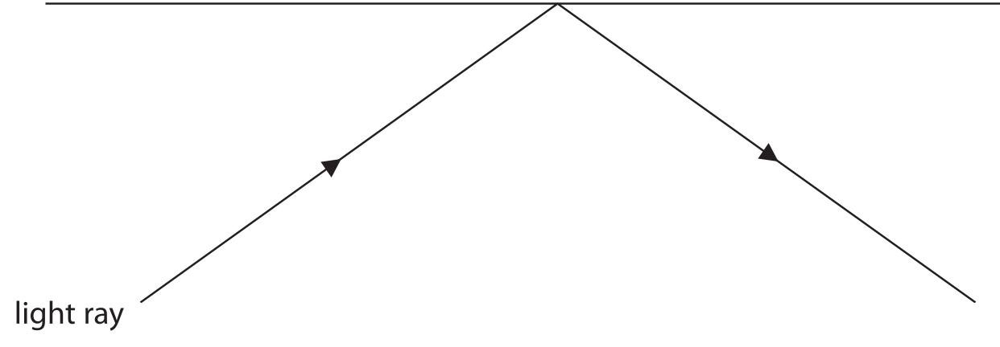

## Diagram 2

(i) Add the normal to diagram 2.

(ii) Measure the angle of incidence in diagram 2.

angle of incidence = degrees

(iii) The glass has a refractive index of 1.6 Calculate the critical angle of the glass-air boundary.

critical angle = degrees

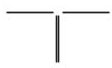

(iv) Explain the path of the light ray shown in diagram 2.

(Total for Question 9 = 13 marks)

10 (a) Diagram 1 shows a van accelerating along a horizontal road.

The horizontal forces acting on the van are shown.

driving force = 2500N

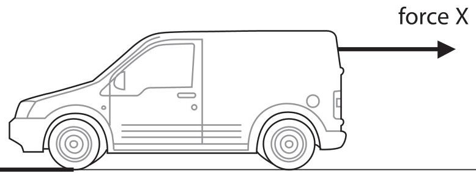

## Diagram 1

(i) Force X opposes the motion of the van. State the name of force X.

(ii) The resultant force acting on the van is 1500 N.

Calculate the magnitude of force X.

[assume X is the only horizontal force opposing the motion of the van]

force X = N

(b) Diagram 2 shows the resultant force acting on the van when it brakes.

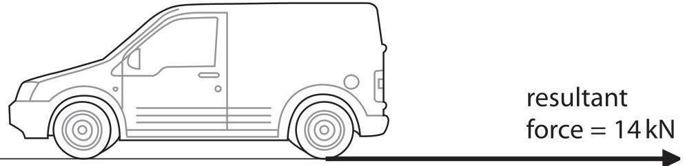

Diagram 2

(i) State the formula linking resultant force, mass and acceleration.

(ii) The mass of the van is 1900kg.

Calculate the acceleration of the van when it brakes.

Give the unit.

(iii) The van was travelling at an initial speed of 18 m/s before braking and coming to rest. Calculate the distance travelled by the van while it is braking. [assume that the acceleration remains constant]

(iv) Describe two factors that would increase the braking distance.

(c) When the van is fully loaded its mass increases to 2500 kg.

Calculate the time taken to bring the fully loaded van to rest when it is travelling at an initial speed of 18m/s.

[assume that the resultant force during braking remains at 14 kN]

(Total for Question 10 = 15 marks)

11 A student investigates the magnetic fields produced by magnets.

(a) Describe a method he could use to determine the shape and direction of the magnetic field produced by a bar magnet.

You may use a diagram to help your answer.

(b) The diagram shows the shape of the magnetic field around the bar magnet.

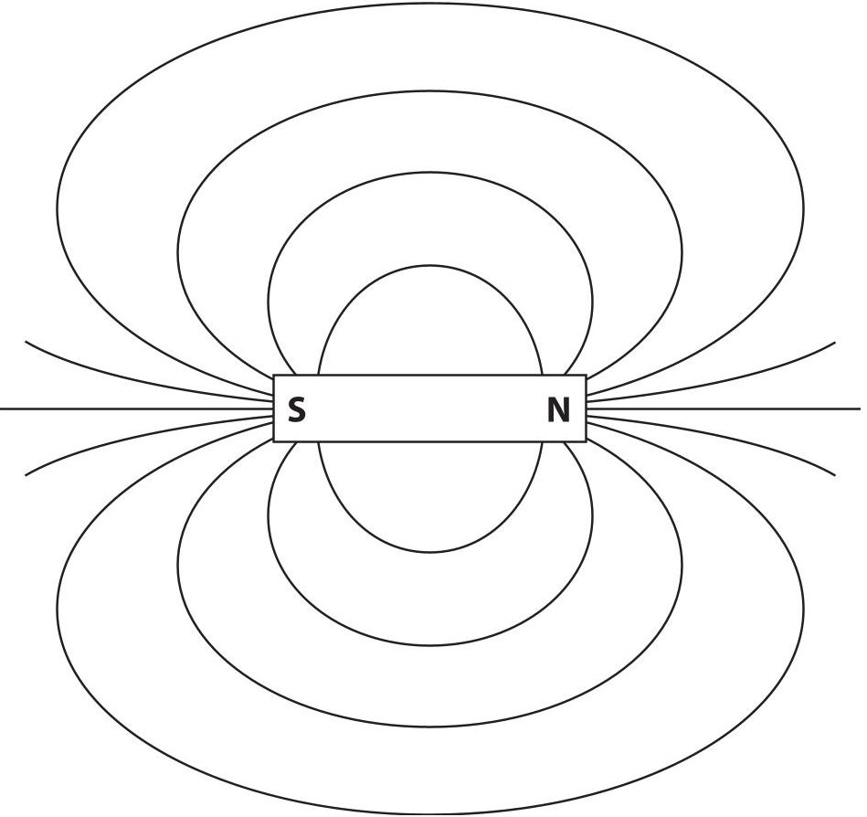

(i) Add two arrows to the diagram to show the direction of the magnetic field.

(ii) Explain how the diagram shows that the strength of the magnetic field changes.

(c) Magnetic field strength can be measured in units of milli-tesla (mT).

A student uses a different magnet.

The student measures the magnetic field strength at different distances from the north pole of this magnet.

The graph shows his results.

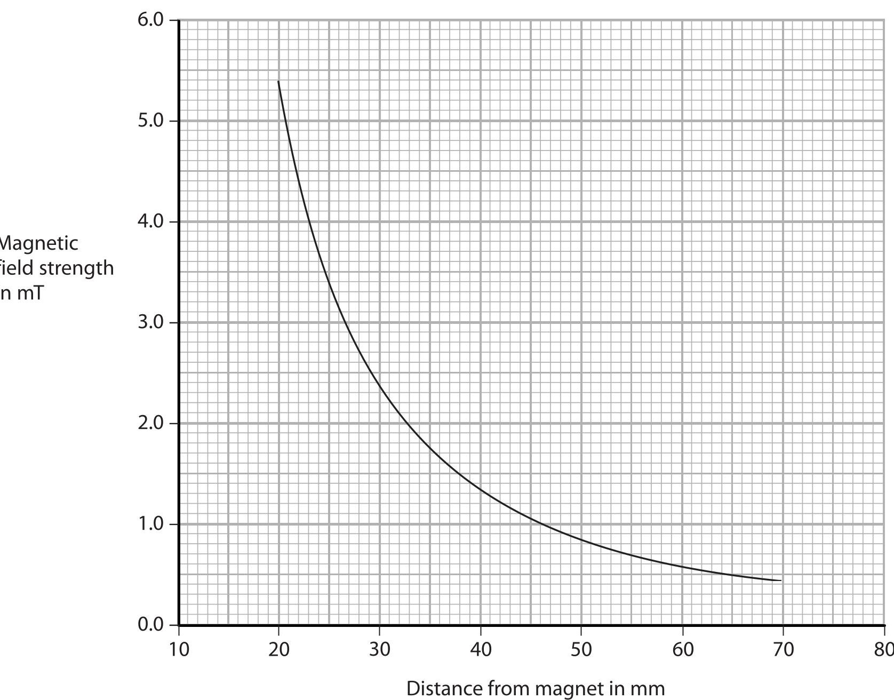

The student concludes that his results obey this relationship.

magnetic field strength $ \times $ distance $ ^{2} $ = constant

Use data from the graph to deduce whether the student's results support this conclusion.

## (Total for Question 11 = 10 marks)

## TOTAL FOR PAPER=110 MARKS

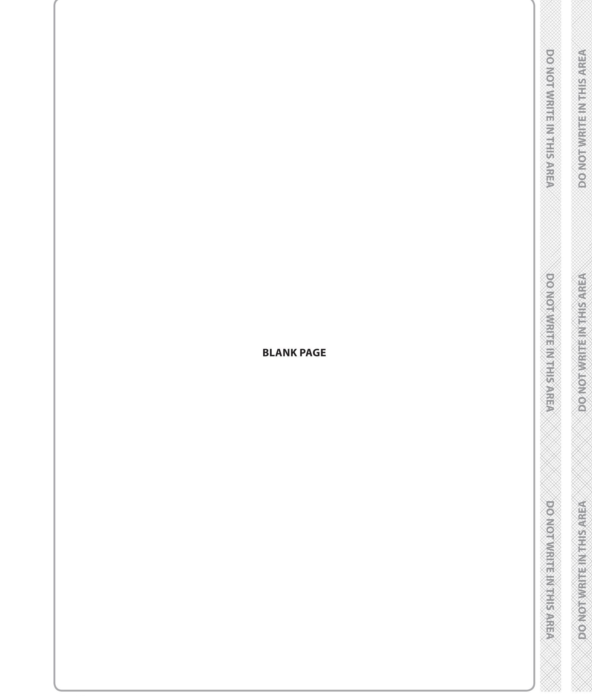

## BLANK PAGE

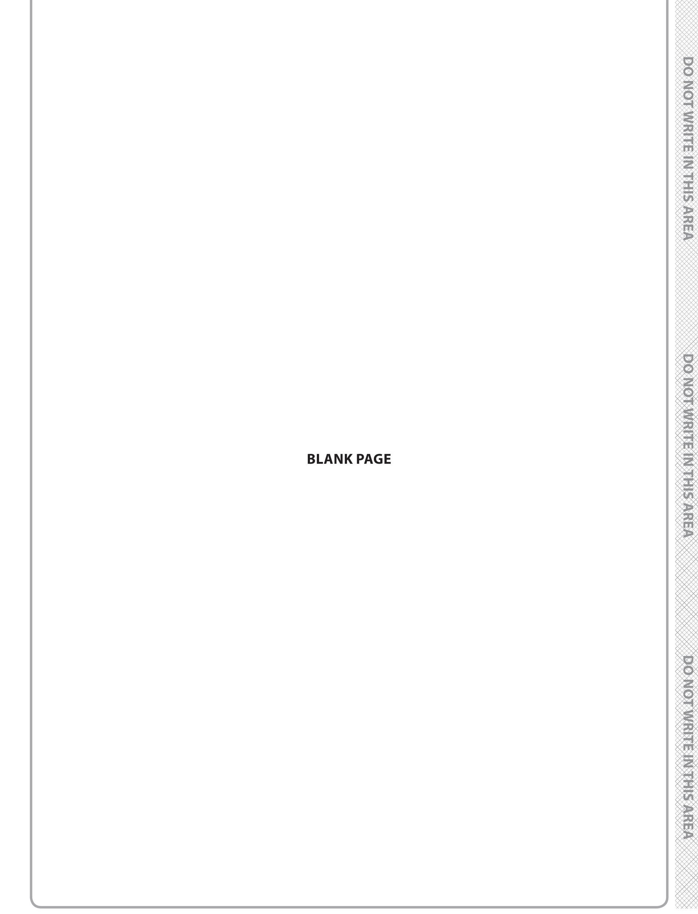

