<table><tr><td colspan="3">Please check the examination details below before entering your candidate information</td></tr><tr><td>Candidate surname</td><td colspan="2">Other names</td></tr><tr><td colspan="3">Centre Number Candidate Number</td></tr><tr><td colspan="3">Pearson Edexcel International GCSE (9-1)</td></tr><tr><td colspan="3">Monday 13 January 2020</td></tr><tr><td>Afternoon (Time: 2 hours)</td><td colspan="2">Paper Reference 4PH1/1P 4SD0/1P</td></tr><tr><td colspan="3">Physics
Unit: 4PH1
Science (Double Award) 4SD0
Paper: 1P</td></tr><tr><td colspan="2">You must have:
Calculator, ruler, protractor</td><td>Total Marks</td></tr></table>

## Instructions

- Use black ink or ball-point pen.

- Fill in the boxes at the top of this page with your name, centre number and candidate number.

- Answer all questions.

- Answer the questions in the spaces provided

- there may be more space than you need.

- Show all the steps in any calculations and state the units.

- Some questions must be answered with a cross in a box. If you change your mind about an answer, put a line through the box and then mark your new answer with a cross.

## Information

- The total mark for this paper is 110.

- The marks for each question are shown in brackets

- use this as a guide as to how much time to spend on each question.

## Advice

- Read each question carefully before you start to answer it.

- Write your answers neatly and in good English.

- Try to answer every question.

- Check your answers if you have time at the end.

Turn over

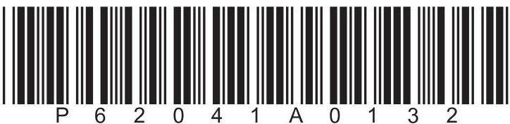

## FORMULAE

You may find the following formulae useful.

$$
\mathrm {e n e r g y t r a n s f e r r e d} = \mathrm {c u r r e n t} \times \mathrm {v o l t a g e} \times \mathrm {t i m e}
$$

$$
E = I \times V \times t
$$

$$
\mathrm {f r e q u e n c y} = \frac {1}{\mathrm {t i m e p e r i o d}}
$$

$$
f = \frac {1}{T}
$$

$$
\mathrm {p o w e r} = \frac {\mathrm {w o r k d o n e}}{\mathrm {t i m e t a k e n}}
$$

$$
P = \frac {W}{t}
$$

$$
\mathrm {p o w e r} = \frac {\mathrm {e n e r g y t r a n s f e r r e d}}{\mathrm {t i m e t a k e n}}
$$

$$
P = \frac {W}{t}
$$

$$
\mathrm {o r b i t a l s p e e d} = \frac {2 \pi \times \mathrm {o r b i t a l r a d i u s}}{\mathrm {t i m e p e r i o d}}
$$

$$
v = \frac {2 \times \pi \times r}{T}
$$

(final speed) $ ^{2} $ = (initial speed) $ ^{2} $ + (2 $ \times $ acceleration $ \times $ distance moved)

$$
v ^ {2} = u ^ {2} + (2 \times a \times s)
$$

$$
\mathrm {p r e s s u r e} \times \mathrm {v o l u m e} = \mathrm {c o n s t a n t}
$$

$$
p _ {1} \times V _ {1} = p _ {2} \times V _ {2}
$$

$$
\frac {\mathrm {p r e s s u r e}}{\mathrm {t e m p e r a t u r e}} = \mathrm {c o n s t a n t}
$$

$$
\frac {p _ {1}}{T _ {1}} = \frac {p _ {2}}{T _ {2}}
$$

Where necessary, assume the acceleration of free fall, $ g=1 0 \mathrm{~ m} / \mathrm{s}^{2}. $

## Answer ALL questions.

1 The passage describes some of the properties of magnets and magnetic fields.

Use words from the box to complete the passage.

<table border="1"><tr><td>aluminium</td><td>copper</td><td>hard</td><td>negative</td></tr><tr><td>north</td><td>positive</td><td>soft</td><td>south</td><td>steel</td></tr></table>

Each word may be used once, more than once or not at all.

The north pole of one magnet will repel the pole of another magnet.

There is attraction between ... and magnets.

Materials that are difficult to magnetise are called magnetic materials.

The direction of the magnetic field lines for a magnet is from ... to south.

Iron is a ... magnetic material.

(Total for Question 1 = 5 marks)

2 A ship floats on the sea.

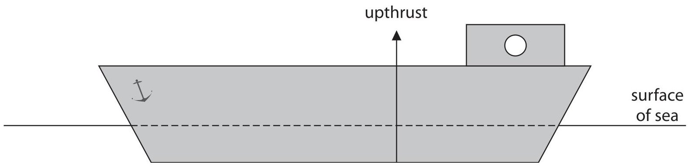

(a) The ship floats because of the forces acting on it.

i) The upward force acting on the ship is called upthrust.

This force is shown on the diagram.

Draw another labelled arrow on the diagram to show the other vertical force acting on the ship.

(ii) Forces are vector quantities.

State what is meant by the term vector quantity.

(iii) Give another example of a vector quantity.

(b) The upthrust force acting on the ship is proportional to the pressure difference between the bottom of the ship and the surface of the sea.

The pressure acting on the ship at the surface of the sea is 100 kPa.

(i) State the formula linking pressure difference, height, density and gravitational field strength (g).

(ii) The bottom of the ship is 15.8 m below the surface of the sea.

Show that the pressure acting on the bottom of the ship is approximately 260 kPa.

[density of seawater = 1030 kg/m $ ^{3} $]

(iii) Explain why the bottom of the ship is deeper below the surface of the sea when the ship is fully loaded with cargo.

3 This question is about electric circuits.

(a) Which quantity is defined as the rate of flow of charge?

A current

B power

C resistance

D voltage

(b) Which quantity is defined as the energy transferred per unit charge passed?

A current

(1) 

B power

C resistance

D voltage

(c) Diagram 1 shows an electric circuit with two resistors, R and S.

Some of the values of the current are also shown.

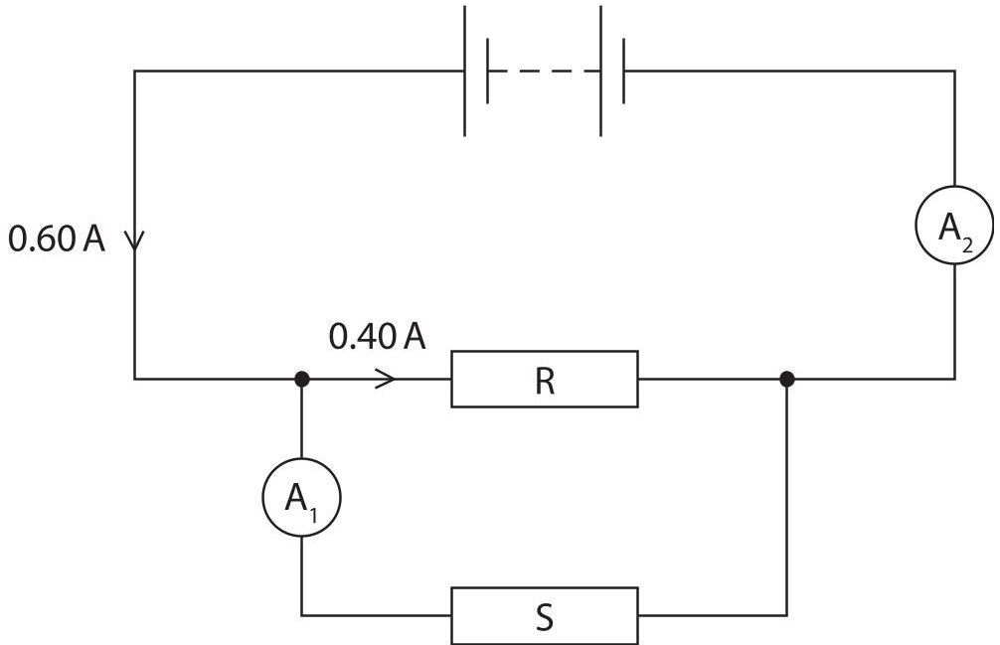

Diagram 1

(i) On Diagram 1, draw a voltmeter to measure the voltage of resistor S.

(ii) Deduce the readings on the ammeters.

$$
A _ {1}
$$

current measured by $ A_{2}= $ A

(iii) Resistor R has a resistance of 11 $ \Omega $ Calculate the voltage across resistor R.

(iv) Explain how the voltage across resistor R compares with the voltage across the battery.

(d) Diagram 2 shows a different circuit containing a battery, an ammeter and a thermistor.

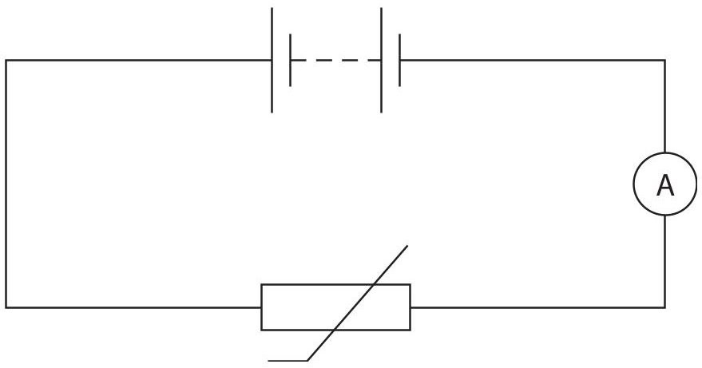

Diagram 2

Explain how the thermistor can be used to vary the current in this circuit.

(Total for Question 3 = 14 marks)

4 A student investigates how much pressure she exerts on the ground when she is standing up.

(a) The weight of the student is 520 N.

(i) State the formula linking weight, mass and gravitational field strength (g).

(ii) Calculate the mass of the student.

(b) The student measures the area of one of her feet when it is in contact with the ground. She draws around her foot on a piece of squared paper.

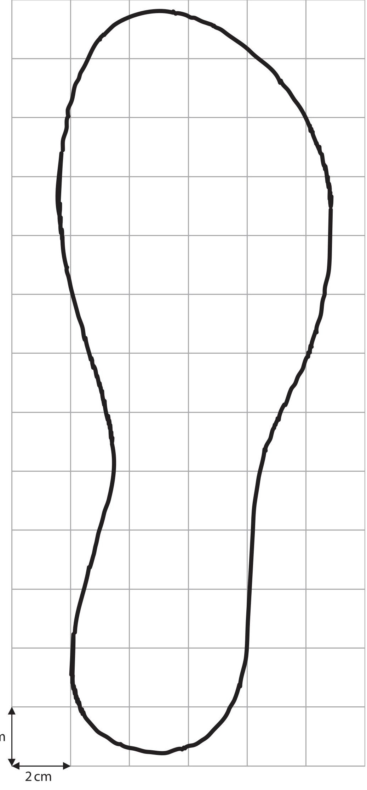

grid not to scale

(i) The squares on the paper have a side length of 2 cm.

Estimate the area of the student's foot in contact with the ground.

(ii) State the formula linking pressure, force and area.

(iii) The weight of the student is 520 N.

Calculate the pressure the student exerts on the ground when she is standing on both feet.

Give the unit.

(Total for Question 4 = 11 marks)

5 A bus transports passengers.

© Mikbiz/Shutterstock

(a) The bus stops at certain points in its journey to let passengers get on or off the bus. The distance-time graph shows part of the bus journey, with sections labelled A to G.

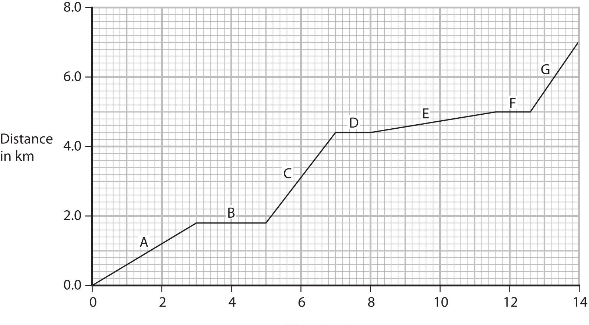

(i) Give the letters of the sections where the bus is stationary.

(ii) Calculate the speed of the bus during section C of the journey. Give your answer in m/s.

(iii) Explain what the graph shows about the speed of the bus in section E compared with the speed of the bus in section A.

(b) Another bus travels a distance of 7.0 km in a time of 14 minutes.

This bus travels at a constant velocity.

Complete the velocity-time graph to show the motion of this bus.

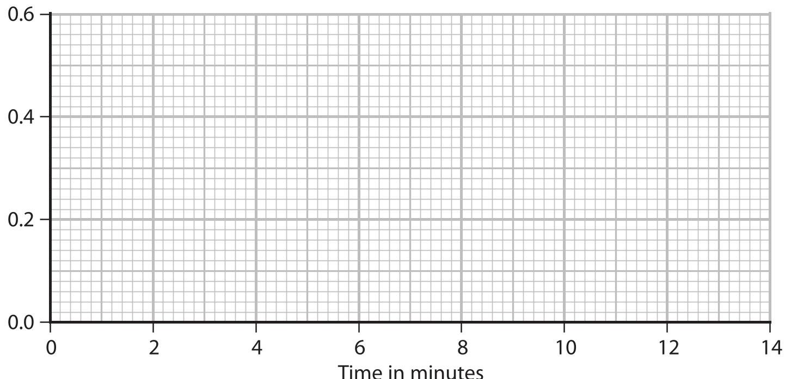

6 A teacher makes a hot drink.

He puts the drink in a cup designed to keep the drink hot.

The photograph and cross-section diagram both show the cup.

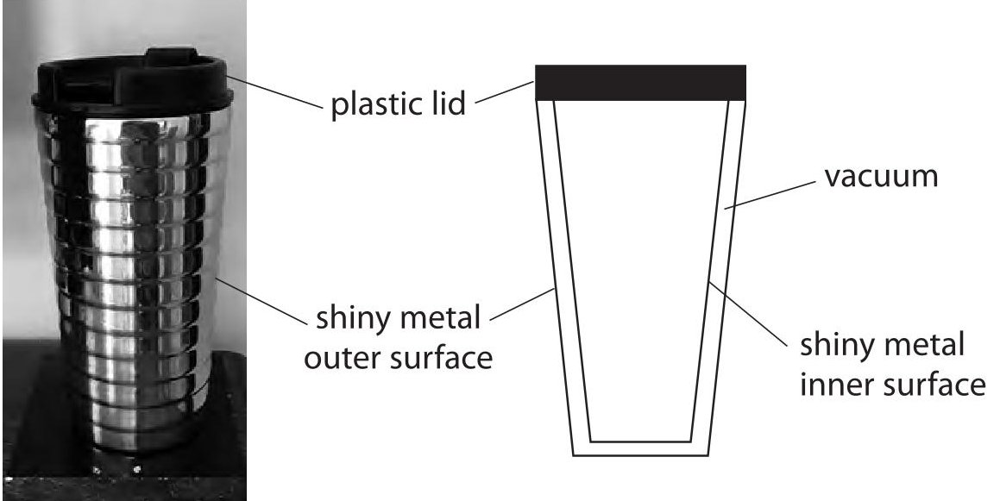

Explain how the design of the cup keeps the drink hot. Refer to methods of energy transfer in your answer.

(Total for Question 6 = 6 marks)

7 A student uses a syringe containing trapped air to investigate pressure.

Diagram 1 shows the apparatus he uses.

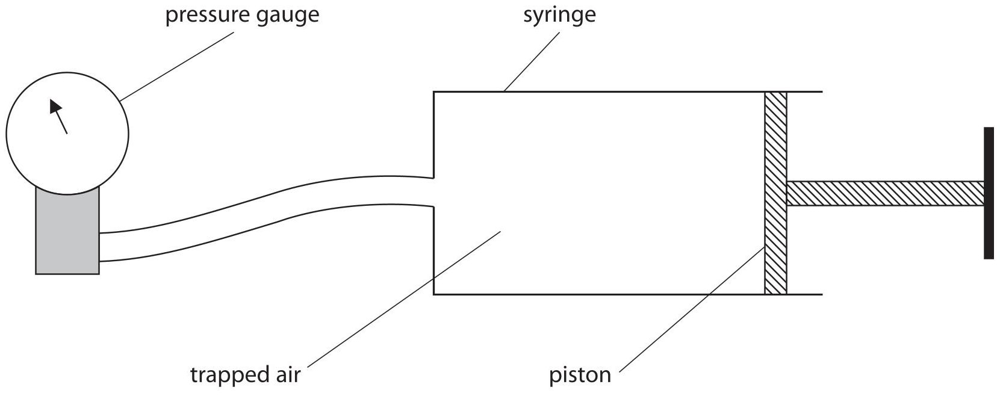

Diagram 1

(a) Diagram 2 shows the pressure gauge when the piston is at its initial position.

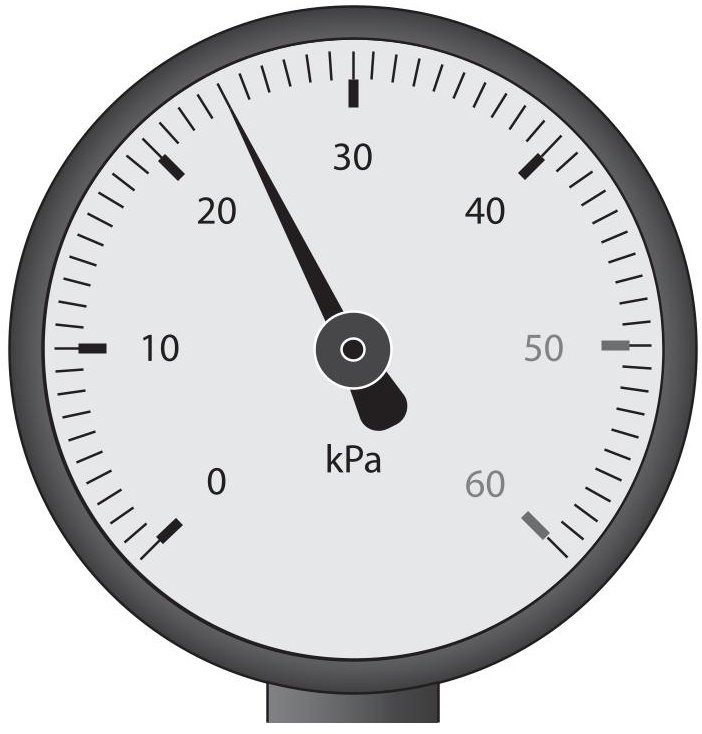

$ \textcircled{c} $ Lubos Chlubny/Shutterstock

Diagram 2

Determine the reading on the pressure gauge.

(b) The piston is pushed in so that the volume of trapped air in the syringe is halved. The temperature of the trapped air remains constant.

Explain how the reading on the pressure gauge will change when the piston is pushed in.

(c) The position of the piston is then fixed so that the volume of trapped air in the syringe is now constant.

The air in the syringe is then cooled.

(i) State how the motion of air particles inside the syringe changes when the air is cooled.

(ii) Explain how the pressure of the trapped air inside the syringe changes when the air is cooled.

Refer to particles in your answer.

(Total for Question 7 = 8 marks)

8 A car is moving along a road.

(a) The car has an initial velocity of 26 m/s.

The car then accelerates at $ 1. 2 \mathrm{~ m} / \mathrm{s}^{2} $ until it reaches a velocity of $ 3 5 \mathrm{~ m} / \mathrm{s}. $

(i) State the formula linking acceleration, change in velocity and time taken.

(ii) Calculate the time taken for the car to accelerate to 35 m/s.

(b) A radar speed gun is used to measure the speed of the moving car.

© Petar An/Shutterstock

The radar speed gun emits radio waves towards the moving car.

The moving car reflects the radio waves back to a detector on the gun.

This change in frequency is used to measure the speed of the moving car.

The detected radio waves have a different frequency from the emitted radio waves.

Explain this change in frequency when the car is moving towards the radar speed gun.

## (Total for Question 8 = 8 marks)

## BLANK PAGE

9 A teacher investigates the penetrating ability of the gamma rays from a gamma source. This is the teacher's method.

- place the gamma source at a distance of 25 cm from a radiation detector

- place a 1cm thick absorbing material between the source and the detector

- measure the radiation count from the source for a time period of 3s

- calculate the count rate in counts per second

- repeat the measurement two more times

The teacher repeats this method for different absorbing materials.

(a) Name a suitable radiation detector that the teacher could use.

(b) State the independent variable in the teacher's investigation.

(c) Explain why every absorbing material used in the investigation has a thickness of 1 cm.

(d) Suggest one improvement the teacher could make to this method.

(e) The table shows the teacher's results for seven different absorbing materials.

<table border="1"><tr><td rowspan="2">Absorbing material</td><td colspan="4">Count rate in counts per second</td></tr><tr><td>Test1</td><td>Test2</td><td>Test3</td><td>Mean</td></tr><tr><td>plastic</td><td>248</td><td>230</td><td>226</td><td>235</td></tr><tr><td>copper</td><td>138</td><td>127</td><td>147</td><td>137</td></tr><tr><td>wood</td><td>226</td><td>231</td><td>224</td><td>227</td></tr><tr><td>aluminium</td><td>204</td><td>211</td><td>190</td><td>202</td></tr><tr><td>lead</td><td>96</td><td>102</td><td>92</td><td>97</td></tr><tr><td>glass</td><td>204</td><td>192</td><td>190</td><td>195</td></tr><tr><td>stone</td><td>205</td><td>200</td><td>205</td><td>203</td></tr></table>

(i) On the grid, plot a bar chart of the mean count rate for each absorbing material.

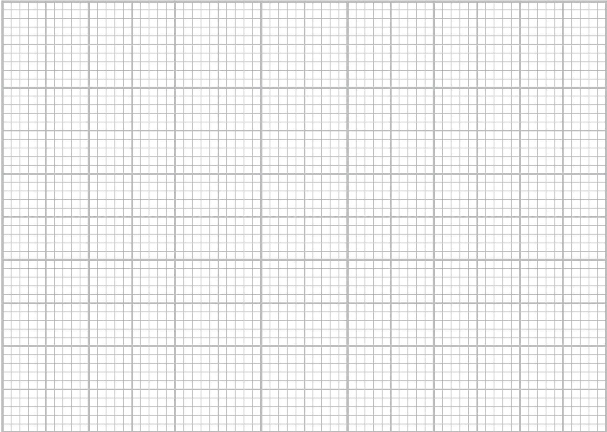

(ii) Why is a bar chart the correct way to display the results?

A absorbing material is a continuous variable

B absorbing material is not a continuous variable

count rate is a continuous variable

D count rate is not a continuous variable

(iii) A student concludes that plastic is the best absorber of gamma radiation because plastic gives the largest mean count rate.

Evaluate the student's conclusion.

(Total for Question 9 = 11 marks)

10 This question is about light.

(a) Diagram 1 shows a light ray entering a glass prism.

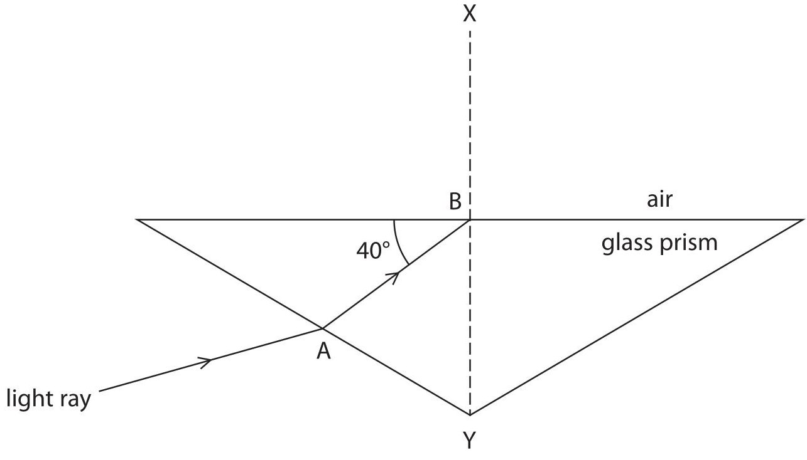

Diagram 1

(i) Describe what happens to the light ray when it enters the prism at point A.

(ii) State the name of line XY.

(iii) State the formula linking critical angle and refractive index.

(iv) The refractive index for the glass in this prism is 1.6 Calculate the critical angle for the glass in this prism.

(v) Complete Diagram 1 by continuing the path of the light ray from point B.

(b) Diagram 2 shows a similar prism that is made from a material with a different refractive index.

The critical angle for the material of this prism is $ 5 5^{\circ} $

Complete Diagram 2 by continuing the path of the light ray.

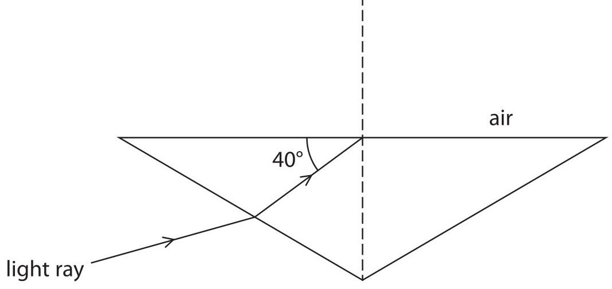

Diagram 2

(2) 

(Total for Question 10 = 11 marks)

## BLANK PAGE

11 Technetium-99m is an isotope of the element technetium.

(a) Technetium-99m has a half-life of 6 hours.

A sample of technetium-99m has an initial activity of 160 Bq.

Complete the graph to show how the activity of this sample of technetium-99m changes over a period of 24 hours.

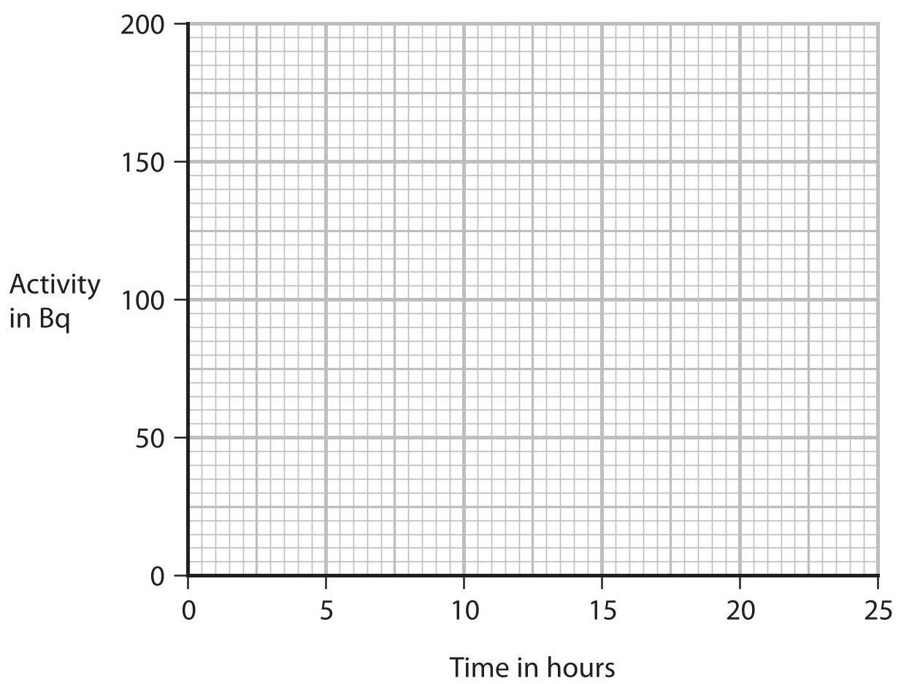

(b) Technetium-99m has a half-life of 6 hours and can be used as a medical tracer. It is injected into a patient's blood and moves around the patient's body. Technetium-99m emits gamma radiation, which is used to locate the position of the tracer in the patient's body.

(i) Technetium-99m does not exist naturally.

Suggest why technetium-99m is usually made at the hospital where it is used.

(ii) Explain why technetium-99m is an effective isotope to use as a medical tracer.

(c) The gamma radiation emitted by technetium-99m is potentially harmful to humans. Discuss the risks of using technetium-99m to doctors and to patients.

(Total for Question 11 = 9 marks)

12 The planets Mars and Saturn orbit around the same star, the Sun.

(a) The diagram shows the orbital paths of Mars and Saturn.

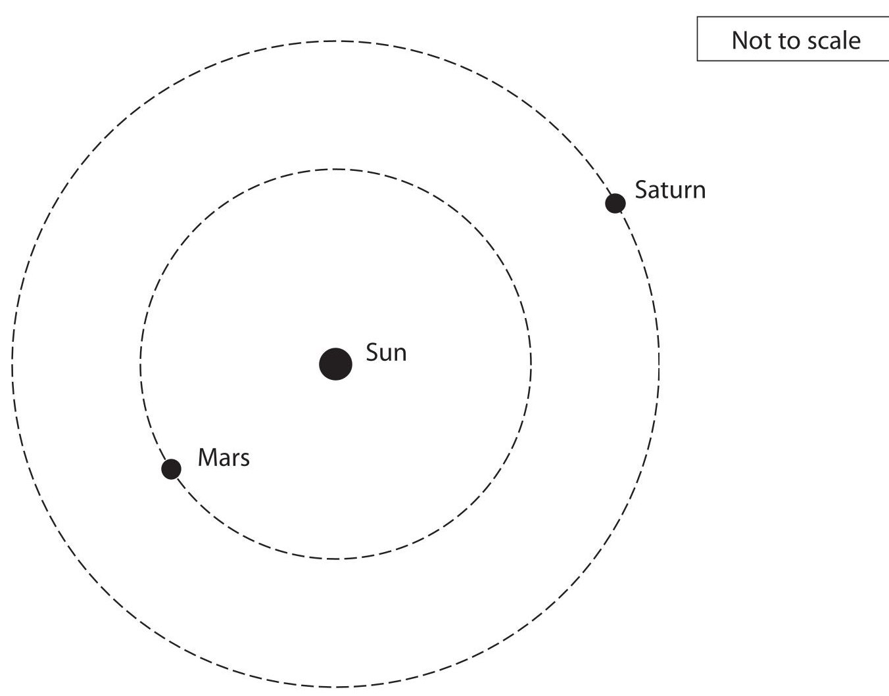

Draw an orbital path of a comet on the diagram.

(2) 

(b) The table gives some information about the orbits of Mars and Saturn.

<table border="1"><tr><td></td><td>Mars</td><td>Saturn</td></tr><tr><td>Orbital radius in km</td><td>2.28×108</td><td>1.43×109</td></tr><tr><td>Orbital speed in km/s</td><td>24.1</td><td>9.70</td></tr></table>

Mars completes a number of orbits in the time it takes for Saturn to complete one orbit.

Calculate the number of orbits that Mars completes in the time it takes for Saturn to complete one orbit.

(Total for Question 12 = 7 marks)

TOTAL FOR PAPER = 110 MARKS

## BLANK PAGE

