<table><tr><td colspan="4">Please check the examination details below before entering your candidate information</td></tr><tr><td>Candidate surname</td><td colspan="3">Other names</td></tr><tr><td colspan="4">Centre Number Candidate Number</td></tr><tr><td colspan="4">Pearson Edexcel International GCSE (9-1)</td></tr><tr><td colspan="4">Wednesday 20 May 2020</td></tr><tr><td>Afternoon (Time: 2 hours)</td><td colspan="3">Paper Reference 4PH1/1PR 4SD0/1PR</td></tr><tr><td colspan="4">Physics
Unit: 4PH1
Science (Double Award) 4SD0
Paper: 1PR</td></tr><tr><td colspan="3">You must have:
Ruler, calculator</td><td>Total Marks</td></tr></table>

## Instructions

- Use black ink or ball-point pen.

- Fill in the boxes at the top of this page with your name, centre number and candidate number.

- Answer all questions.

- Answer the questions in the spaces provided

- there may be more space than you need.

- Show all the steps in any calculations and state the units.

- Some questions must be answered with a cross in a box. If you change your mind about an answer, put a line through the box and then mark your new answer with a cross.

## Information

- The total mark for this paper is 110.

- The marks for each question are shown in brackets

- use this as a guide as to how much time to spend on each question.

## Advice

- Read each question carefully before you start to answer it.

- Write your answers neatly and in good English.

- Try to answer every question.

- Check your answers if you have time at the end.

Turn over

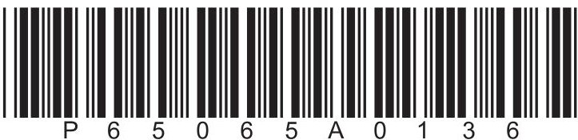

## FORMULAE

You may find the following formulae useful.

energy transferred = current $ \times $ voltage $ \times $ time

$$
E = I \times V \times t
$$

$$
f r e q u e n c y = \frac {1}{t i m e p e r i o d}
$$

$$
f = \frac {1}{T}
$$

$$
\mathrm {p o w e r} = \frac {\mathrm {w o r k d o n e}}{\mathrm {t i m e t a k e n}}
$$

$$
P = \frac {W}{t}
$$

$$
\mathrm {p o w e r} = \frac {\mathrm {e n e r g y t r a n s f e r r e d}}{\mathrm {t i m e t a k e n}}
$$

$$
P = \frac {W}{t}
$$

$$
\mathrm {o r b i t a l s p e e d} = \frac {2 \pi \times \mathrm {o r b i t a l r a d i u s}}{\mathrm {t i m e p e r i o d}}
$$

$$
v = \frac {2 \times \pi \times r}{T}
$$

(final speed) $ ^{2} $ = (initial speed) $ ^{2} $ + (2 $ \times $ acceleration $ \times $ distance moved)

$$
v ^ {2} = u ^ {2} + (2 \times a \times s)
$$

pressure $ \times $ volume=constant

$$
p _ {1} \times V _ {1} = p _ {2} \times V _ {2}
$$

$$
\frac {\mathrm {p r e s s u r e}}{\mathrm {t e m p e r a t u r e}} = \mathrm {c o n s t a n t}
$$

$$
\frac {p _ {1}}{T _ {1}} = \frac {p _ {2}}{T _ {2}}
$$

Where necessary, assume the acceleration of free fall, $ g=1 0 \mathrm{m} / \mathrm{s}^{2}. $

## BLANK PAGE

## Answer ALL questions.

1 This question is about astrophysics.

( a ) Complete the sentences by writing a suitable word or phrase in each blank space. (3)

Space and all the galaxies in it is called the

A large collection of billions of stars is called a

The Sun and its collection of planets and moons is called the

(b) The diagram shows the orbit of a comet around the Sun.

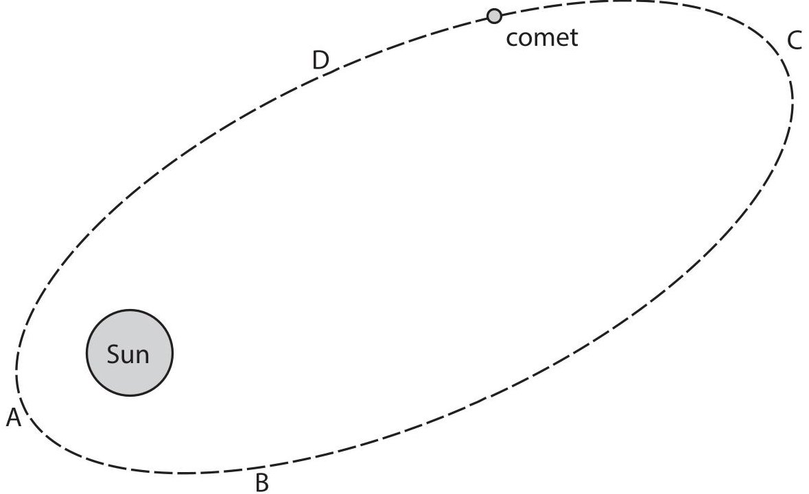

(i) At which point in its orbit is the comet moving fastest?

A

B

C

D

(ii) Name the force that keeps the comet in orbit around the Sun.

(c) The boxes give some units of time and some definitions.

Draw a straight line from each unit of time to its correct definition.

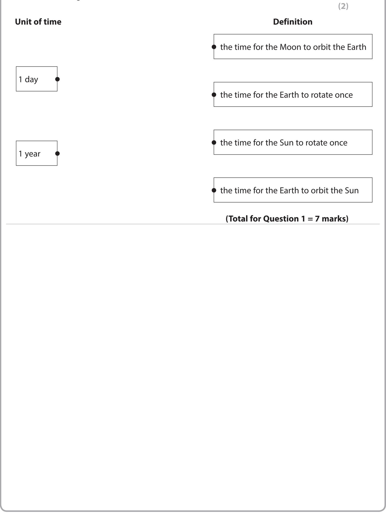

2 This question is about a nuclear fission chain reaction.

(a) Uranium-235 is an isotope of uranium that can undergo nuclear fission.

The table gives some statements about this fission process.

Add ticks ( $ \checkmark $ ) to the table to show which statements are correct.

<table border="1"><tr><td>Statement</td><td>Correct(√)</td></tr><tr><td>uranium-235 loses a proton to become uranium-236</td><td></td></tr><tr><td>uranium-235 absorbs a neutron to become uranium-236</td><td></td></tr><tr><td>daughter cells are produced when uranium-236 splits</td><td></td></tr><tr><td>the nuclear energy store of uranium-236 increases when it splits</td><td></td></tr><tr><td>two or three neutrons are usually released when uranium-236 splits</td><td></td></tr><tr><td>energy is transferred to the kinetic store of the fission products when uranium-236 splits</td><td></td></tr></table>

(b) State which product of nuclear fission causes the next uranium-235 nucleus to split in the chain reaction.

(c) Uranium-235 is radioactive and emits alpha radiation. Which of these statements describes alpha radiation?

A an electromagnetic wave

B a helium nucleus

C a high energy electron

D a high energy neutron

(d) Some of the products of nuclear fission are radioactive because their nuclei have too many neutrons.

These nuclei become more stable when a neutron changes into a proton.

State which type of radiation is emitted by radioactive nuclei with too many neutrons.

(Total for Question 2 = 6 marks)

3 When a meteor explodes, light waves and sound waves are produced at the same time.

(a) (i) State the formula linking average speed, distance moved and time taken.

(ii) A person standing 1860m away from the site of a meteor explosion hears the sound of the explosion 5.6s later.

Calculate the speed of sound in air.

$$
s p e e d o f s o u n d =
$$

(iii) A scientist stands a long way from the meteor explosion.

Explain why he hears the explosion at a different time to when he sees it.

(b) Sound is a longitudinal wave.

Describe what is meant by the term longitudinal wave.

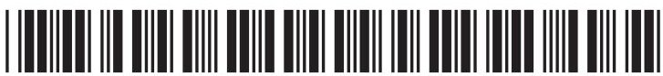

(c) In 2013, a meteor exploded above Russia.

Just before the meteor exploded, it was travelling at a speed of 19.2 km/s.

The mass of the meteor was estimated to be $ 1.25\times10^{7} \mathrm{~kg}. $

(i) State the formula linking kinetic energy, mass and speed.

(ii) Calculate the energy in the kinetic store of the meteor just before the meteor exploded.

energy in kinetic store =

(Total for Question 3 = 10 marks)

4 This question is about Rigel, a very large star with a high surface temperature.

(a) Stars can appear as different colours because of their different surface temperatures. Which of these colours shows the highest surface temperature for a star?

A blue-white

B orange

C red

D yellow

(b) Describe how a star is formed in a nebula.

(c) Rigel is a main sequence star.

A star joins the main sequence when nuclear fusion of hydrogen starts in its core.

Describe the process of nuclear fusion in a star.

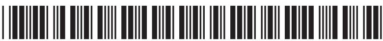

(d) Astronomers think that Rigel will become a supernova in the future.

(i) Which property of a star determines whether it will become a supernova?

A colour

B distance from Earth

D temperature

C mass

(ii) Describe the evolution of Rigel after it leaves the main sequence.

(Total for Question 4 = 10 marks)

5 A toaster is an electrical device used for toasting bread.

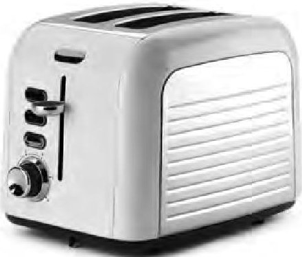

© Levent Konuk/Shutterstock

The toaster contains thin metal wires.

These wires get hot when there is a current in them.

The wires transfer energy to the bread by heating and by radiation.

(a) Give a reason why the wires in the toaster are connected in parallel.

(b) (i) State the formula linking power, current and voltage.

(ii) The power rating of the toaster is 2.8kW. Calculate the total current in the toaster. [mains voltage = 230V]

(iii) The toaster contains 48 thin metal wires.

Calculate the current in each of the thin metal wires.

(Total for Question 5 = 6 marks)

6 A student needs to identify a sample of an unknown liquid.

She decides to do this by finding the density of the liquid.

(a) Describe how the student should measure the mass of the liquid.

(b) Describe how the student should use a measuring cylinder to obtain an accurate measurement of the liquid's volume.

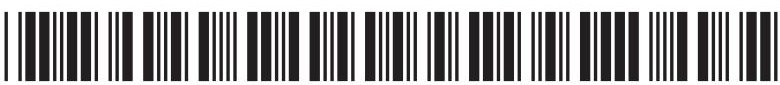

(c) The table gives the values of the densities for some liquids.

<table border="1"><tr><td>Liquid</td><td>Density in g/cm3</td></tr><tr><td>brine</td><td>1.23</td></tr><tr><td>glucose</td><td>1.44</td></tr><tr><td>olive oil</td><td>0.82</td></tr><tr><td>pure water</td><td>1.00</td></tr><tr><td>sodium hydroxide</td><td>1.25</td></tr><tr><td>sunflower oil</td><td>0.92</td></tr></table>

The student measures the mass of the sample of unknown liquid as 150 g and the volume as $ 1 6 3 \mathrm{c m}^{3}. $

Deduce the name of the unknown liquid.

(Total for Question 6 = 7 marks)

7 The photographs show two different breeds of cat.

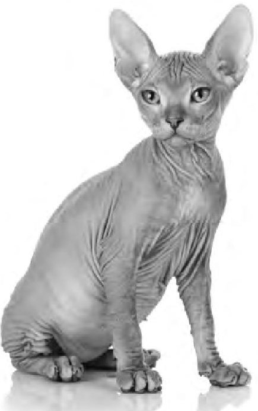

Kucher Serhii/Shutterstock

Cat X

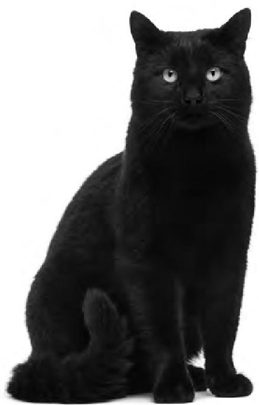

© Eric Isselee/Shutterstock

Cat Y

Cat X has no fur and light-coloured skin.

Cat Y has thick, black fur.

Both cats have the same body temperature and transfer energy to their surroundings when they are outside on a cold day.

Compare how cat X and cat Y transfer energy to their surroundings. Refer to conduction, convection and radiation in your answer.

(Total for Question 7 = 6 marks)

## BLANK PAGE

8 A student uses this apparatus to investigate how the efficiency of an electric motor varies with its input voltage.

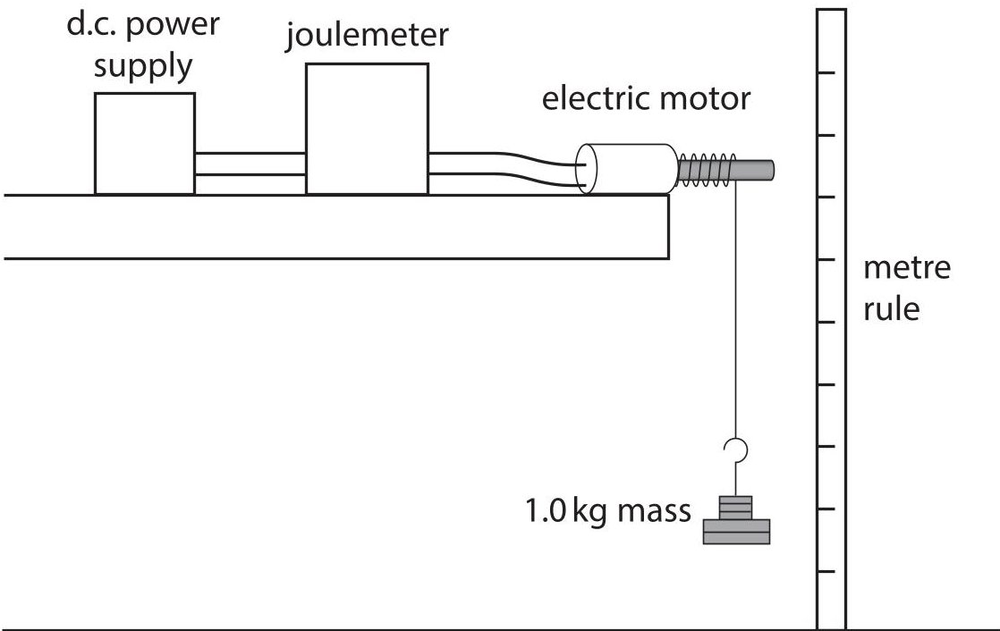

This is the student's method.

- connect the electric motor to a d.c. power supply and a joulemeter

- attach a 1.0kg mass to the electric motor using a length of string

- set the voltage of the power supply to 10V and switch on the power supply

- switch off the power supply when the mass has been lifted through a distance of 50cm

- record the input energy to the motor from the joulemeter

- calculate the energy transferred to the gravitational store of the mass

- calculate the efficiency of the motor

The student repeats this process, setting the power supply to a different voltage each time.

(a) State how the student could improve the reliability of her results.

(b) Give two control variables for the investigation.

(c) Show that the gravitational store of the 1.0kg mass increases by 5.0 J when it is lifted through a distance of 50 cm.

(d) The table shows the student's results.

<table border="1"><tr><td>Power supply voltage inV</td><td>Joulemeter reading inJ</td><td>Motor efficiency(%)</td></tr><tr><td>3.0</td><td>99.4</td><td>5.0</td></tr><tr><td>3.5</td><td>25.5</td><td>19.6</td></tr><tr><td>4.0</td><td>16.5</td><td>30.3</td></tr><tr><td>5.0</td><td>13.5</td><td>37.0</td></tr><tr><td>6.0</td><td>12.6</td><td>39.7</td></tr><tr><td>8.0</td><td>12.8</td><td>39.1</td></tr><tr><td>10.0</td><td>12.7</td><td></td></tr></table>

(i) Calculate the motor efficiency when the power supply is set to a voltage of 10V.

(ii) Plot a graph of the motor efficiency on the y-axis against the power supply voltage on the x-axis.

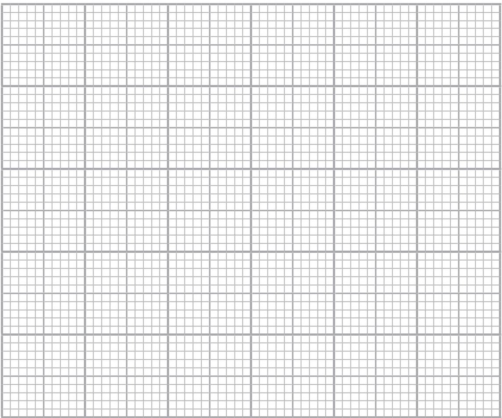

(iii) Draw a curve of best fit.

(iv) Using the graph, determine the minimum power supply voltage that will allow the electric motor to operate at maximum efficiency.

power supply voltage =

(Total for Question 8 = 14 marks)

9 The diagram shows part of a circuit used for an outdoor lighting system.

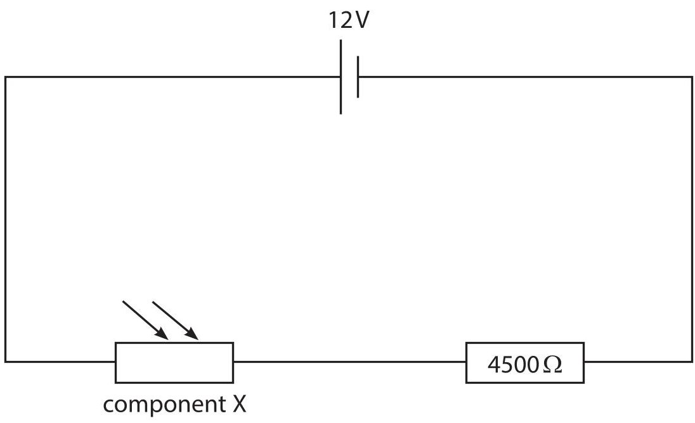

(a) Draw a voltmeter on the diagram to measure the voltage of the 4500 $ \Omega $ resistor.

(b) Give the name of component X.

(c) The voltage across component X is 3.0V.

(i) Calculate the voltage across the 4500 $ \Omega $ resistor.

(ii) Calculate the current in the circuit. [voltage = current $ \times $ resistance]

current = A

(iii) Calculate the resistance of component X. Give your answer in $ k\Omega $

## resistance=

(d) Explain where a lamp should be connected in this circuit, so that the voltage across it increases as the light received by component X decreases.

(Total for Question 9 = 12 marks)

## BLANK PAGE

10 This question is about bar magnets.

(a) Describe an investigation to show the shape and direction of the magnetic field for a bar magnet.

You may draw a diagram to help your answer.

(b) A bar magnet is used in a bicycle dynamo.

The diagram shows a cross-section of a bicycle dynamo.

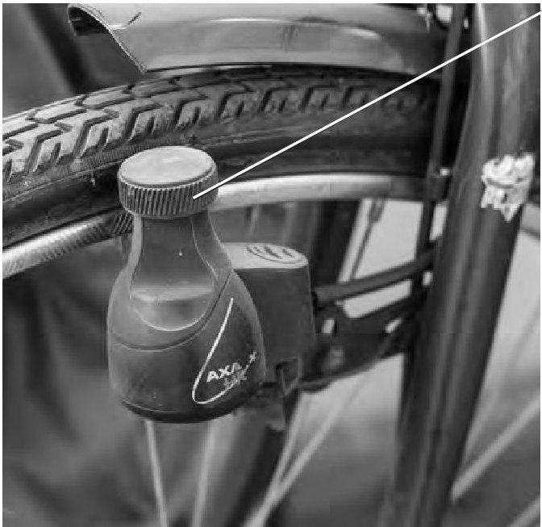

$ \textcircled{c} $ 1000 Words Images/Shutterstock

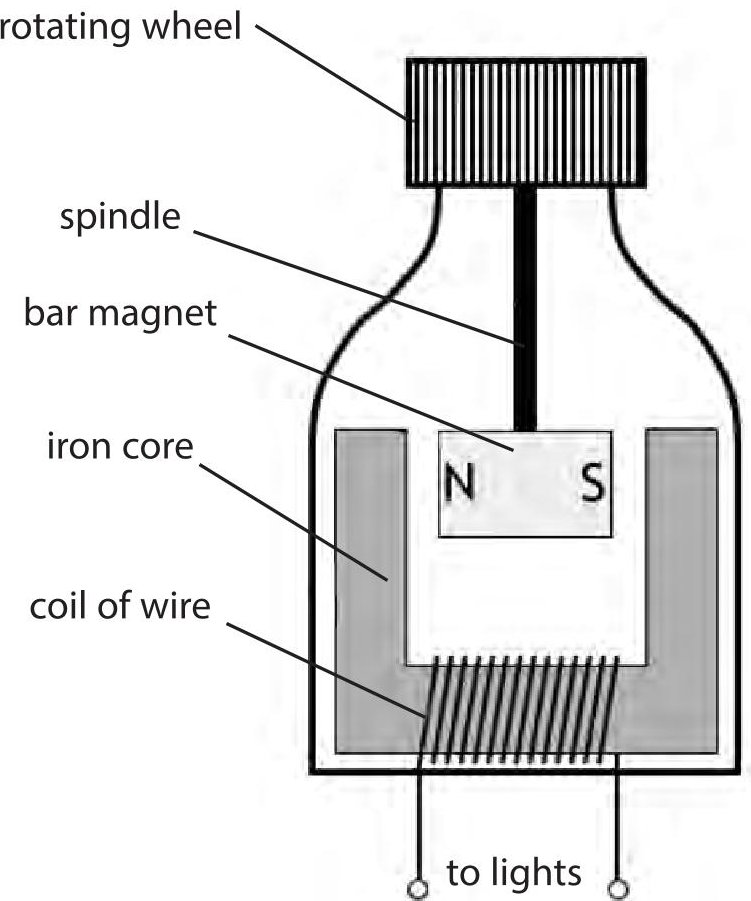

The dynamo has a rotating wheel that presses against the tyre of the bicycle.

The rotating wheel is connected to a bar magnet by a spindle.

When the rotating wheel spins, the bar magnet spins.

(i) The dynamo is connected to the lights on the bicycle.

Explain how the dynamo causes the lights to turn on when the bicycle is moving.

(ii) Suggest a disadvantage of using the dynamo to power the bicycle lights.

(Total for Question 10 = 8 marks)

11 The graph shows how the thinking distance and braking distance of a car vary with its initial speed.

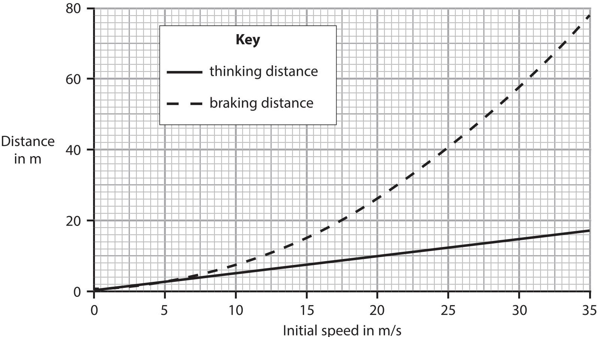

(a) A car has an initial speed of 35 m/s.

The brakes are applied and the car comes to a complete stop in the braking distance shown by the graph.

Calculate the mean braking acceleration of the car.

(b) Evaluate how the thinking distance and the braking distance vary for different values of initial speed.

Refer to information from the graph in your answer.

## (Total for Question 11 = 9 marks)

12 This question is about refraction.

(a) Diagram 1 shows a ray of light incident on the boundary between a liquid called acetone and air.

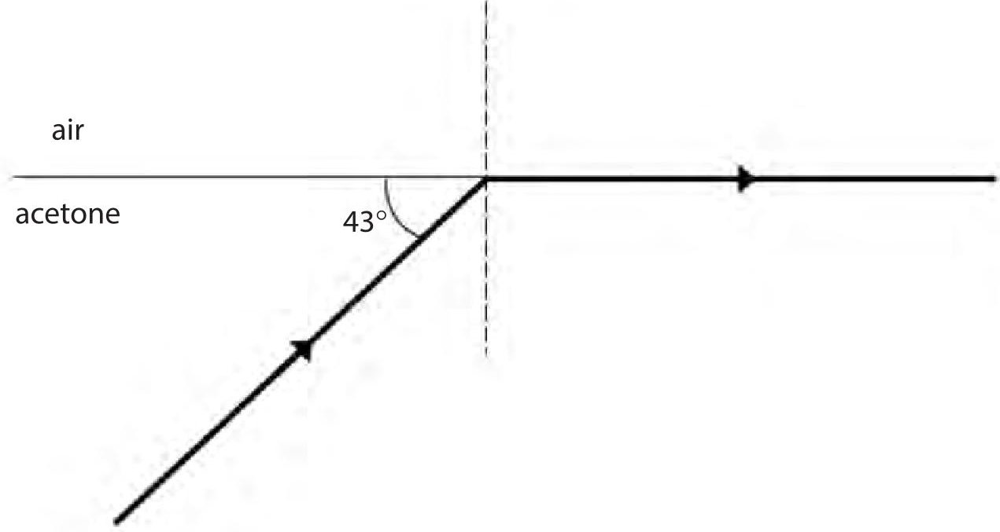

Diagram 1

(i) Calculate the critical angle for the boundary between acetone, and air.

$$
\mathrm {c r i t i c a l} \angle =
$$

(ii) State the formula linking critical angle and refractive index.

(iii) Calculate the refractive index of acetone.

(b) Diagram 2 shows a ray of light incident on the boundary between water and air.

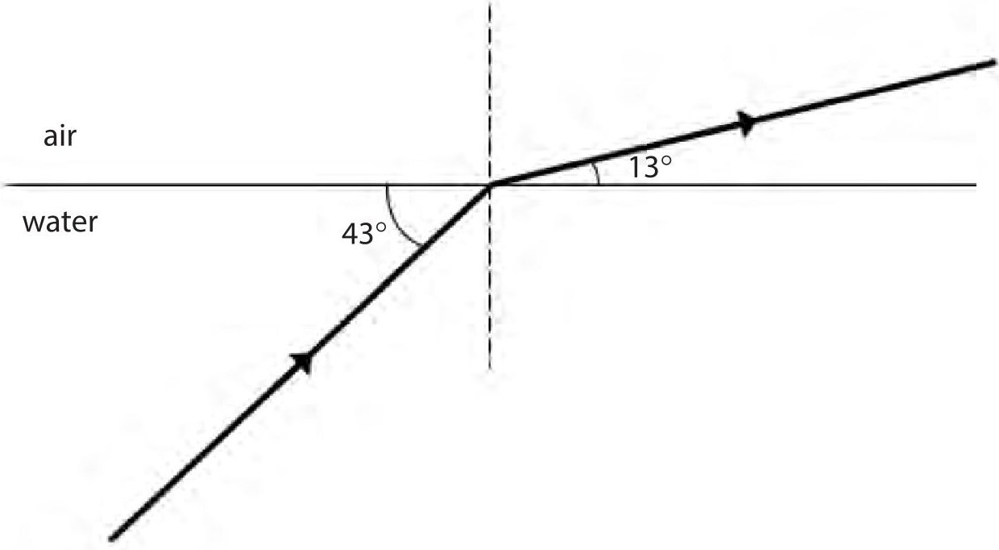

Diagram 2

Explain how the refractive index of water compares to the refractive index of acetone.

(Total for Question 12 = 7 marks)

13 This question is about pressure in gases.

(a) Photograph 1 shows an open conical flask containing air.

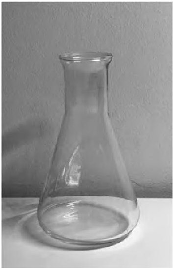

## Photograph 1

The air in the flask is heated to a temperature of 85 $ ^{\circ} \mathrm{C}. $

(i) Calculate the temperature of the air in the flask in kelvin.

$$
t e m p e r a t u r e = \dots \dots

(ii) Describe how the motion of the molecules in the flask changes when the temperature of the air inside the flask increases.

(iii) The pressure of the air in the flask does not change when the temperature of the air increases.

State what happens to the number of air molecules in the flask when the temperature of the air inside the flask increases.

(b) Photograph 2 shows a boiled egg, without its shell, placed in the top of the conical flask containing hot air.

The flask is no longer being heated.

The egg seals the flask so that no air escapes.

Photograph 3 shows the egg and the flask a short time later.

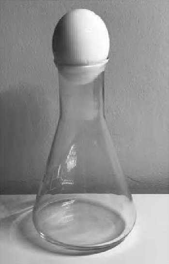

Photograph 2

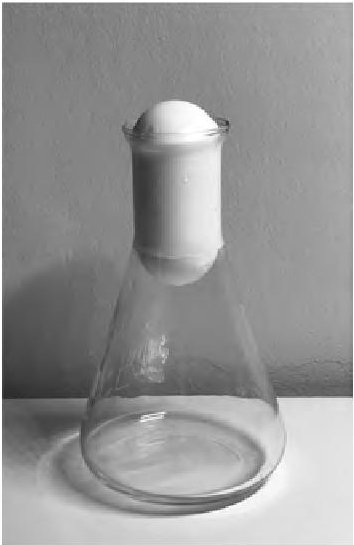

Photograph 3

Explain why the egg moves down into the flask and then stops moving. Refer to ideas about pressure in your answer.

(Total for Question 13 = 8 marks)

TOTAL FOR PAPER = 110 MARKS

## BLANK PAGE

## BLANK PAGE

## BLANK PAGE

