<table><tr><td colspan="3">Please check the examination details below before entering your candidate information</td></tr><tr><td>Candidate surname</td><td colspan="2">Other names</td></tr><tr><td colspan="3">Centre Number Candidate Number</td></tr><tr><td colspan="3">Pearson Edexcel International GCSE (9-1)</td></tr><tr><td colspan="3">Wednesday 20 May 2020</td></tr><tr><td>Afternoon (Time: 2 hours)</td><td colspan="2">Paper Reference 4PH1/1P 4SD0/1P</td></tr><tr><td colspan="3">Physics
Unit: 4PH1
Science (Double Award) /4SD0
Paper: 1P</td></tr><tr><td colspan="2">You must have:
Ruler, calculator</td><td>Total Marks</td></tr></table>

## Instructions

- Use black ink or ball-point pen.

- Fill in the boxes at the top of this page with your name, centre number and candidate number.

- Answer all questions.

- Answer the questions in the spaces provided

- there may be more space than you need.

- Show all the steps in any calculations and state the units.

## Information

- The total mark for this paper is 110.

- The marks for each question are shown in brackets

- use this as a guide as to how much time to spend on each question.

## Advice

- Read each question carefully before you start to answer it.

- Write your answers neatly and in good English.

- Try to answer every question.

- Check your answers if you have time at the end.

Turn over

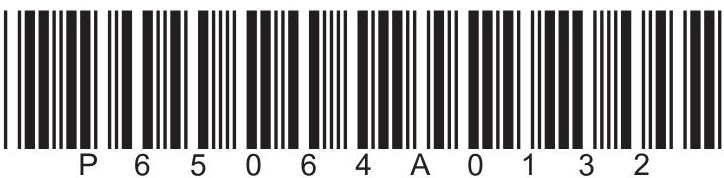

## FORMULAE

You may find the following formulae useful.

energy transferred = current $ \times $ voltage $ \times $ time

$$
E = I \times V \times t
$$

$$
\mathrm {f r e q u e n c y} = \frac {1}{\mathrm {t i m e p e r i o d}}
$$

$$
f = \frac {1}{T}
$$

$$
\mathrm {p o w e r} = \frac {\mathrm {w o r k d o n e}}{\mathrm {t i m e t a k e n}}
$$

$$
P = \frac {W}{t}
$$

$$
\mathrm {p o w e r} = \frac {\mathrm {e n e r g y t r a n s f e r r e d}}{\mathrm {t i m e t a k e n}}
$$

$$
P = \frac {W}{t}
$$

$$
\mathrm {o r b i t a l s p e e d} = \frac {2 \pi \times \mathrm {o r b i t a l r a d i u s}}{\mathrm {t i m e p e r i o d}}
$$

$$
v = \frac {2 \times \pi \times r}{T}
$$

(final speed) $ ^{2} $ = (initial speed) $ ^{2} $ + (2 $ \times $ acceleration $ \times $ distance moved)

$$
v ^ {2} = u ^ {2} + (2 \times a \times s)
$$

pressure $ \times $ volume=constant

$$
p _ {1} \times V _ {1} = p _ {2} \times V _ {2}
$$

$$
\frac {\mathrm {p r e s s u r e}}{\mathrm {t e m p e r a t u r e}} = \mathrm {c o n s t a n t}
$$

$$
\frac {p _ {1}}{T _ {1}} = \frac {p _ {2}}{T _ {2}}
$$

Where necessary, assume the acceleration of free fall, $ g=1 0 \mathrm{m} / \mathrm{s}^{2}. $

## BLANK PAGE

## Answer ALL questions.

1 This question is about wave behaviour.

(a) The boxes give three types of wave behaviour and the diagrams give three examples of wave behaviour.

Draw one straight line from each wave behaviour to the example that best shows that behaviour.

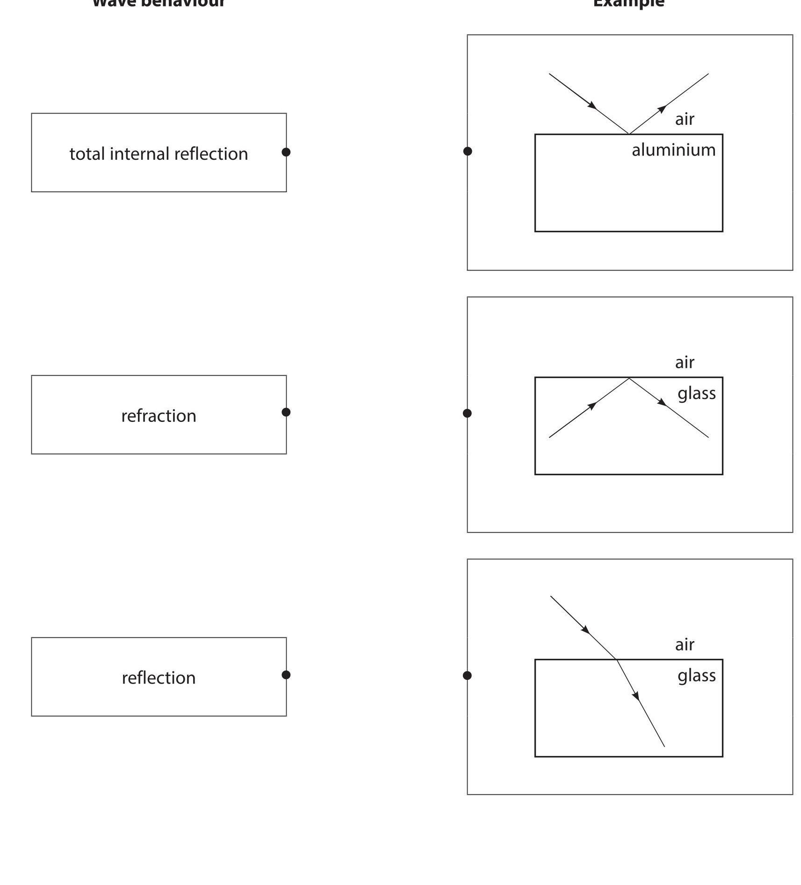

(b) State two properties that all waves have in common.

(Total for Question 1 = 5 marks)

2 This question is about the movement of a train.

The diagram shows the train on a track.

The train starts braking at point P and stops moving at point Q.

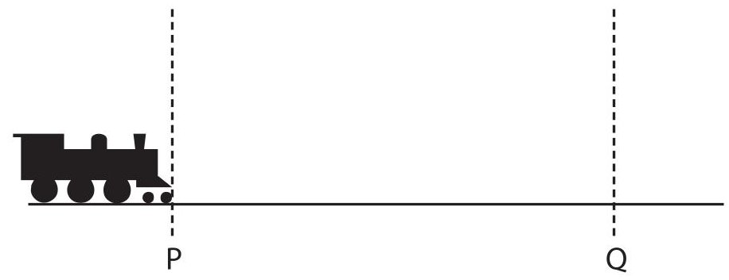

The graph shows how the train's velocity changes with time as the train travels from P to Q.

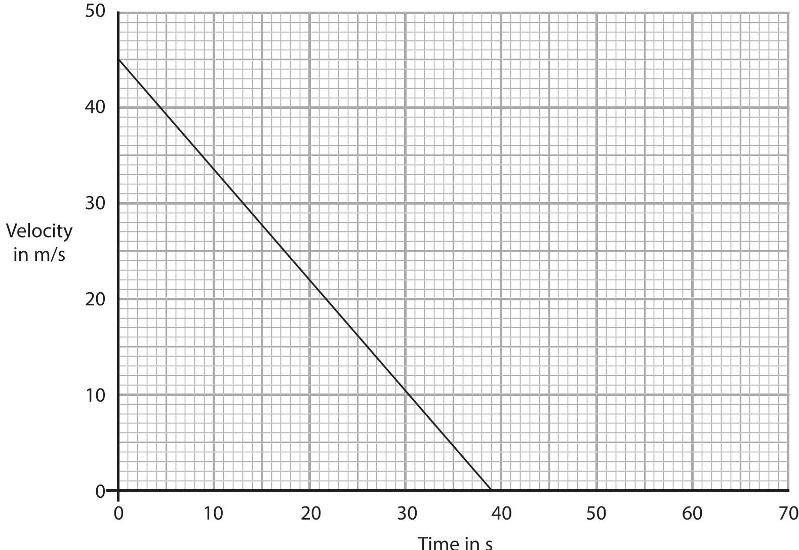

(a) Calculate the acceleration of the train.

$$
\mathrm {a c c e l e r a t i o n} =
$$

(b) Calculate the distance travelled by the train from P to Q.

(c) Draw a line on the graph to show how the train's velocity will change if its initial velocity is the same but the braking force is lower.

(Total for Question 2 = 8 marks)

3 This question is about stars.

(a) Describe the stages in the evolution of a star similar in mass to the Sun.

(b) The process of energy release in the core of a star is different to the process of energy release in a nuclear reactor in a power station.

Describe how these processes of energy release are different.

(Total for Question 3 = 7 marks)

4 (a) (i) State Hooke's Law.

(ii) The graph shows how the extension of a rubber band varies with the force applied.

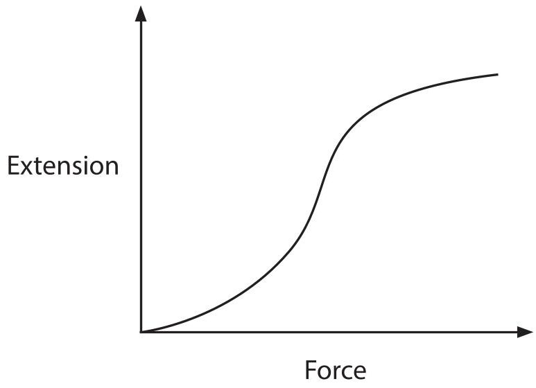

Explain how the graph shows that the rubber band does not obey Hooke's Law.

(b) Diagram 1 shows a model aeroplane powered by a rubber band.

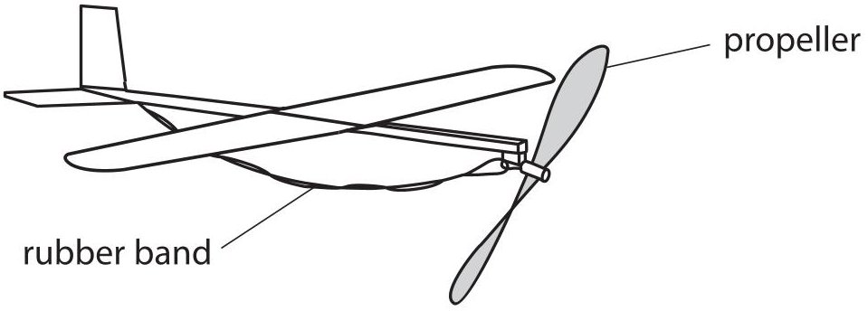

## Diagram 1

A person rotates the propeller of the model aeroplane, which twists the rubber band.

Energy transfer occurs during this process.

The box lists words associated with energy.

He then releases the propeller and it spins.

<table border="1"><tr><td>kinetic</td><td>gravitational</td><td>electrostatic</td></tr><tr><td>mechanical</td><td>elastic</td><td>magnetic</td></tr><tr><td>heating</td><td>chemical</td><td>radiation</td></tr></table>

Use words from the box to complete the passage.

The person does ... work to twist the rubber band.

As the person twists the rubber band it extends, increasing the

energy store of the rubber band. When the rubber band is released it does mechanical work,

increasing the energy store of the propeller.

(c) Diagram 2 shows the aeroplane flying horizontally to the right.

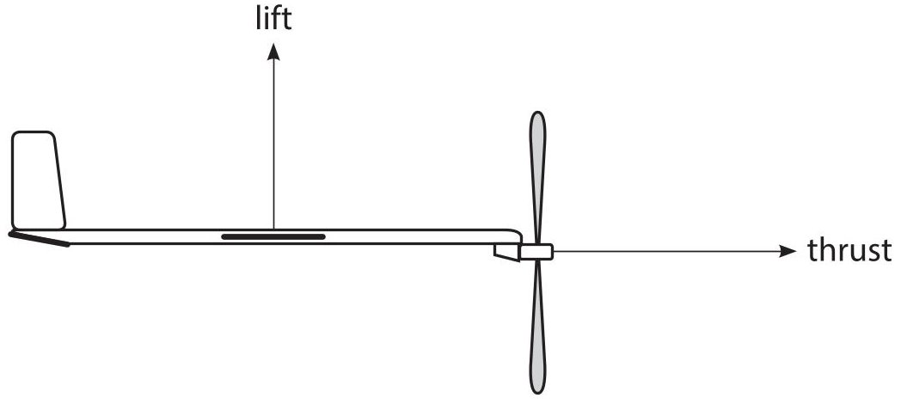

## Diagram 2

Diagram 2 shows two forces acting on the aeroplane.

The aeroplane flies at a constant speed.

Draw labelled arrows on diagram 2 to show two more forces acting on the aeroplane.

(Total for Question 4 = 11 marks)

## BLANK PAGE

5 A student does an investigation to determine the current-voltage graph for an unknown component, X.

- component X

The student uses this equipment

- cell

- ammeter

- variable resistor

- connecting wires

- voltmeter

(a) Complete the circuit diagram to show how the student should set up this equipment for her investigation.

(b) The student completes her investigation.

The table shows her results.

<table border="1"><tr><td>Voltage inV</td><td>Current inmA</td></tr><tr><td>0.00</td><td>0</td></tr><tr><td>0.10</td><td>0</td></tr><tr><td>0.20</td><td>0</td></tr><tr><td>0.30</td><td>0</td></tr><tr><td>0.40</td><td>0</td></tr><tr><td>0.50</td><td>2</td></tr><tr><td>0.60</td><td>8</td></tr><tr><td>0.70</td><td>33</td></tr><tr><td>0.80</td><td>140</td></tr></table>

(i) Plot a graph of the student's results on the grid.

Plot current on the y-axis and voltage on the x-axis.

(ii) Draw a curve of best fit.

(iii) State the name of component X.

6 The diagram shows an electric circuit.

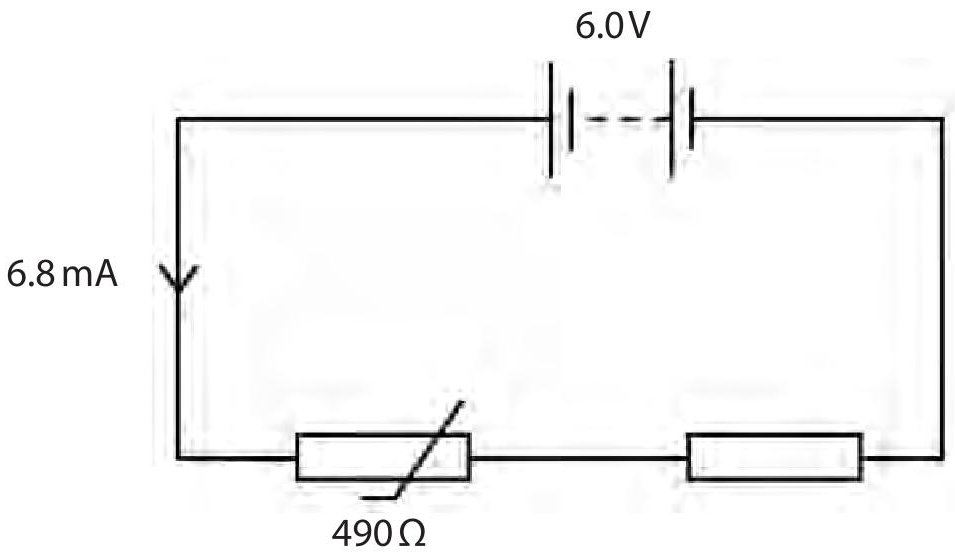

(a) When the thermistor is in hot water, its resistance is 490 $ \Omega $ Show that the resistance of the fixed resistor is about 400 $ \Omega $

(b) Explain how the voltage across the fixed resistor changes when the hot water is replaced with cold water.

7 This is a question about Io, a moon of Jupiter.

The diagram shows two jets of gas from volcanoes on Io.

One jet of gas is from the volcano Prometheus and the other is from the volcano Tvashtar.

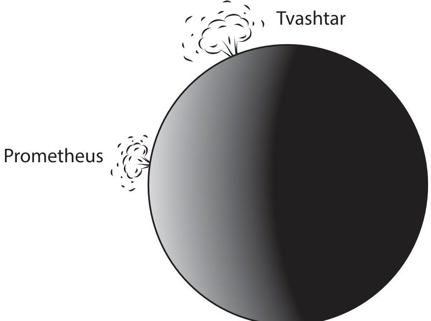

(a) Gas particles in the Prometheus jet leave the surface of Io and move vertically upwards.

The particles reach their maximum height when their speed is zero.

Some particles in the Prometheus jet reach a maximum height of 92 km.

Calculate the initial speed of these particles as they leave the surface of lo.

[acceleration due to gravity on $ \mathrm{l o}=1. 8 \mathrm{m} / \mathrm{s}^{2} $]

initial speed=

(b) Before the gas particles leave the surface of lo, they are trapped in a chamber.

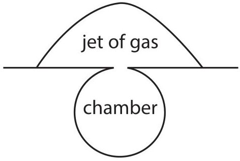

(i) Explain how the gas particles exert a pressure on the walls of the chamber.

(ii) The Tvashtar chamber has the same volume as the Prometheus chamber and contains the same number of molecules of the same type of gas.

The temperature of the gas in the Prometheus chamber is 1200 K.

The temperature of the gas in the Tvashtar chamber is 1600 K.

The pressure of the gas in the Prometheus chamber is 8.2 kPa.

Calculate the pressure of the gas in the Tvashtar chamber.

(iii) Explain why the pressure inside the chambers increases when the temperature increases.

Use ideas about particles in your answer.

(iv) Explain why the particles from the Tvashtar chamber reach a greater maximum height than the particles from the Prometheus chamber.

(Total for Question 7 = 15 marks)

## BLANK PAGE

8 This question is about atmospheric optical illusions.

(a) A mirage is an optical illusion formed due to total internal reflection of light from the sky at the boundary between cold air and hot air.

Diagram 1 shows how a mirage is formed.

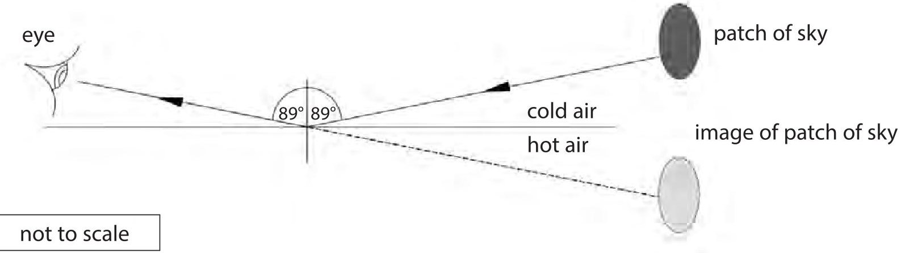

Diagram 1

(i) State the formula linking critical angle and refractive index.

(1) 

(ii) The critical angle of the cold air at the boundary is $ 8 8. 5 0 0^{\circ} $

Calculate the refractive index of the cold air.

Give your answer to 5 significant figures.

(b) (i) Diagram 2 shows a ray of light from the Sun.

The refractive index of the atmosphere is greater than the refractive index of space. Complete the diagram by drawing the path of the ray of light through the atmosphere.

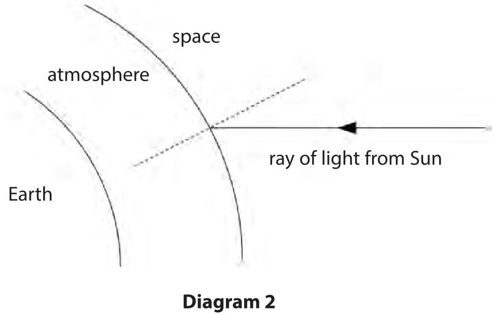

(ii) Diagram 3 shows a ray of light from the Sun when the Sun is directly overhead.

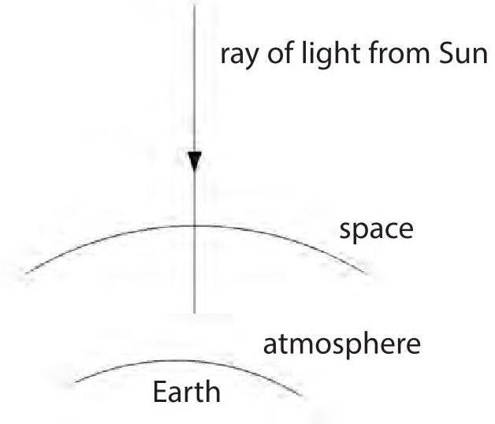

Diagram 3

Explain why the ray of light does not change direction when it enters the atmosphere.

(2) 

(iii) Explain why the wavelength of the light reduces when it enters the atmosphere.

(iv) Suggest why the Sun appears not to be circular when it is close to the horizon at sunset.

(Total for Question 8 = 11 marks)

9 This question is about a radio powered by a person turning a handle.

The radio has a battery which stores energy when the handle is turned.

(a) The diagram shows the part of the radio called a generator.

The generator produces a voltage which does electrical work on the battery.

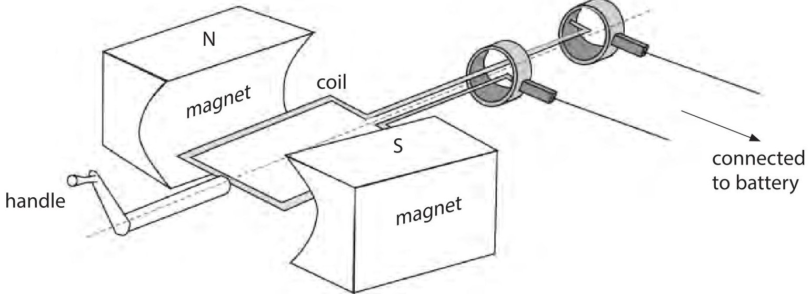

Explain how the generator produces a voltage.

(3) 

(b) The radio receives a radio wave of frequency 93 MHz.

(i) State the formula linking speed, frequency and wavelength of a wave.

(ii) Calculate the wavelength of the radio wave. [speed of radio waves $ = 3. 0 \times1 0^{8} \mathrm{~ m / s} $]

wavelength=

(c) The signal received by the radio is converted into an alternating current (a.c.) signal.

(i) Describe how the loudspeaker in the radio converts this a.c. signal into a sound wave.

(ii) State a modification that would increase the force on the loudspeaker coil.

(Total for Question 9 = 12 marks)

10 Technetium-98 and technetium-99 are isotopes of the element technetium.

(a) (i) Describe the difference between the nuclei of technetium-98 and technetium-99

(ii) Technetium-99 is formed when the element molybdenum-99 decays.

Complete the nuclear equation for the decay of molybdenum into technetium-99

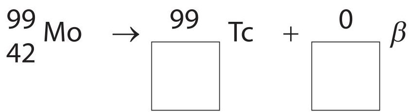

(b) Describe an experiment that a scientist could use to demonstrate that the emission from technetium-99 is gamma radiation.

Include details of a safety precaution in your answer.

(c) A scientist measures the count rate at different distances from the technetium source. The graph shows how the count rate changes with distance from the technetium source.

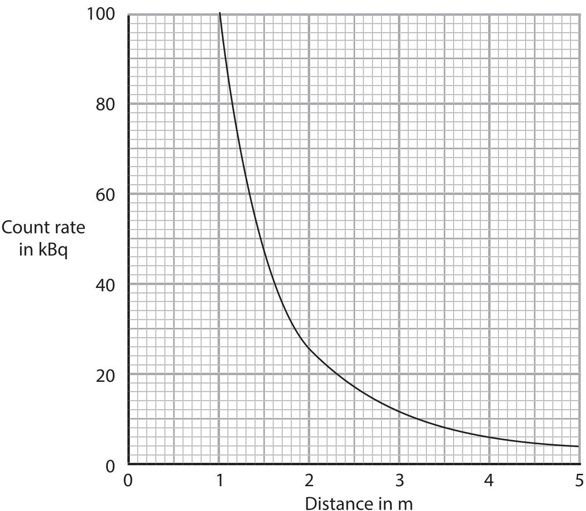

The scientist suggests that the relationship between the count rate and distance is (distance) $ ^{2} \times $ count rate = constant

Use data from the graph to determine whether these results support this relationship.

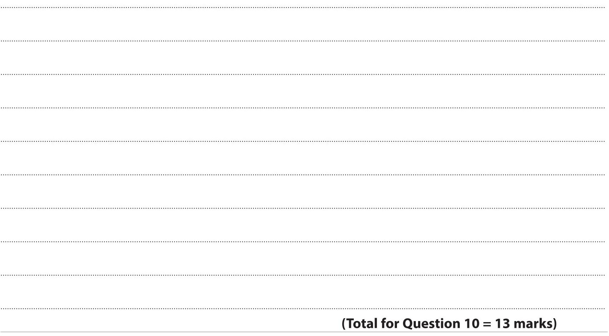

11 This question is about satellites and their orbits.

(a) (i) State a difference between an artificial satellite's orbit and a planet's orbit.

(ii) State a similarity between an artificial satellite's orbit and a moon's orbit.

(b) KALPANA-1 was an artificial satellite used to monitor the weather.

(i) The diagram shows the orbit of the satellite.

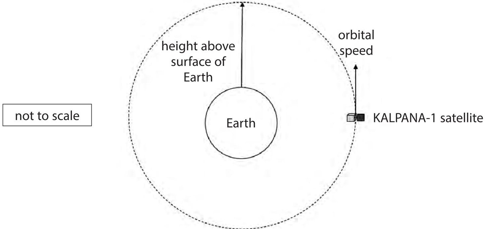

KALPANA-1 has an orbital speed of 3.1 km/s and completes one orbit in 24 hours.

Calculate the height of KALPANA-1's orbit above the Earth's surface.

[radius of Earth=6400km]

height above surface = ... km

(ii) The Doppler effect occurs when there is relative motion between the source of waves and the observer of the waves.

Explain how the Doppler effect causes a change in the observed frequency of the waves.

(iii) Suggest why the radio waves from KALPANA-1 detected on the Earth's surface are not affected by the Doppler effect.

## (Total for Question 11 = 11 marks)

## TOTAL FOR PAPER=110 MARKS

## BLANK PAGE

## BLANK PAGE

## BLANK PAGE

