<table><tr><td colspan="3">Please check the examination details below before entering your candidate information</td></tr><tr><td colspan="2">Candidate surname</td><td>Other names</td></tr><tr><td>Centre Number</td><td colspan="2">Candidate Number</td></tr><tr><td colspan="3">Pearson Edexcel International GCSE (9-1)</td></tr><tr><td>Time 2 hours</td><td>Paper reference</td><td>4PH1/1PR 4SD0/1PR</td></tr><tr><td colspan="3">Physics
UNIT: 4PH1
Science (Double Award) 4SD0
PAPER: 1PR</td></tr><tr><td colspan="2">You must have:
Ruler, protractor, calculator, Equation Booklet (enclosed)</td><td>Total Marks</td></tr></table>

## Instructions

- Use black ink or ball-point pen.

- Fill in the boxes at the top of this page with your name, centre number and candidate number.

- Answer all questions.

- Answer the questions in the spaces provided

- there may be more space than you need.

- Show all the steps in any calculations and state the units.

## Information

- The total mark for this paper is 110.

- The marks for each question are shown in brackets

- use this as a guide as to how much time to spend on each question.

## Advice

- Read each question carefully before you start to answer it.

- Write your answers neatly and in good English.

- Try to answer every question.

- Check your answers if you have time at the end.

Turn over

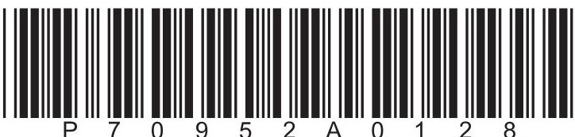

## FORMULAE

You may find the following formulae useful.

$$
\mathrm {e n e r g y t r a n s f e r r e d} = \mathrm {c u r r e n t} \times \mathrm {v o l t a g e} \times \mathrm {t i m e}
$$

$$
E = I \times V \times t
$$

$$
\mathrm {f r e q u e n c y} = \frac {1}{\mathrm {t i m e p e r i o d}}
$$

$$
f = \frac {1}{T}
$$

$$
\mathrm {p o w e r} = \frac {\mathrm {w o r k d o n e}}{\mathrm {t i m e t a k e n}}
$$

$$
P = \frac {W}{t}
$$

$$
\mathrm {p o w e r} = \frac {\mathrm {e n e r g y t r a n s f e r r e d}}{\mathrm {t i m e t a k e n}}
$$

$$
P = \frac {W}{t}
$$

$$
\mathrm {o r b i t a l s p e e d} = \frac {2 \pi \times \mathrm {o r b i t a l r a d i u s}}{\mathrm {t i m e p e r i o d}}
$$

$$
v = \frac {2 \times \pi \times r}{T}
$$

(final speed) $ ^{2} $ = (initial speed) $ ^{2} $ + (2 $ \times $ acceleration $ \times $ distance moved)

$$
v ^ {2} = u ^ {2} + (2 \times a \times s)
$$

$$
\mathrm {p r e s s u r e} \times \mathrm {v o l u m e} = \mathrm {c o n s t a n t}
$$

$$
p _ {1} \times V _ {1} = p _ {2} \times V _ {2}
$$

$$
\frac {\mathrm {p r e s s u r e}}{\mathrm {t e m p e r a t u r e}} = \mathrm {c o n s t a n t}
$$

$$
\frac {p _ {1}}{T _ {1}} = \frac {p _ {2}}{T _ {2}}
$$

Where necessary, assume the acceleration of free fall, $ g=1 0 \mathrm{~ m} / \mathrm{s}^{2}. $

## Answer ALL questions.

Some questions must be answered with a cross in a box. If you change your mind about an answer, put a line through the box and then mark your new answer with a cross.

1 This question is about astrophysics.

(    ) Which of these do planets orbit?

A an artificial satellite

B a comet

C a moon

D a star

(b) Which of these has the largest diameter?

A a galaxy

B the Solar System

C the Sun

D the universe

(c) Which of these has the smallest diameter?

A a galaxy

B the Moon

C a star

D the Solar System

(d) At the surface of the Earth, the gravitational field strength is 10N/kg. At the surface of the Moon, the gravitational field strength is 1.7N/kg. Give a reason for the difference in gravitational field strength.

(Total for Question 1 = 4 marks)

2 This question is about electromagnetic waves.

(a) Draw a straight line from each electromagnetic wave to its correct use. One has been done for you.

Electromagnetic wave

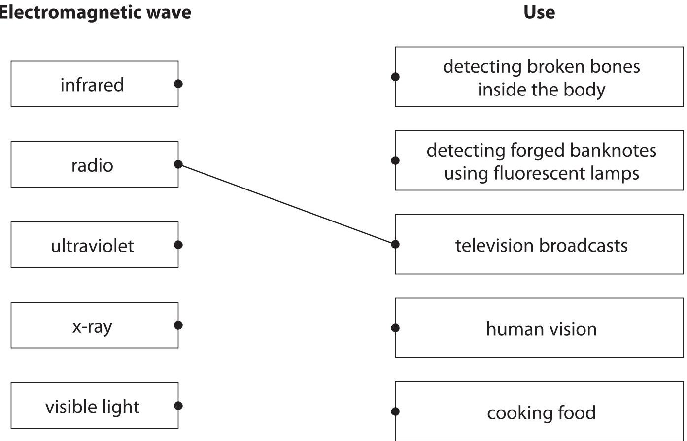

(b) State a hazard to humans of excessive exposure to infrared waves.

(c) State a precaution that would reduce a person's risk of exposure to ultraviolet waves.

(Total for Question 2 = 6 marks)

3 The diagram shows an electric circuit containing component X and a lamp connected in series.

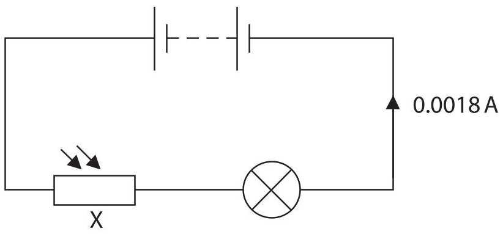

(a) (i) Add another component to the diagram to measure the voltage of component X.

(ii) Give the name of component X.

(b) The graph shows how the resistance of component X changes with light intensity.

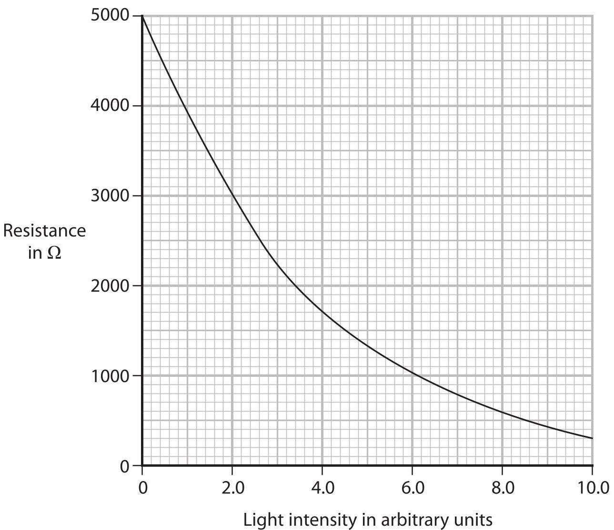

(i) Use the graph to determine the resistance of component X when the light intensity is 4.0 arbitrary units.

resistance =

(ii) The current in the circuit is 0.0018 A.

Calculate the voltage across component X at a light intensity of 4.0 arbitrary units.

(iii) Explain what happens to the brightness of the lamp when component X is covered with a dark sheet of paper.

(Total for Question 3 = 9 marks)

4 Diagram 1 shows an ice cube floating at rest in a beaker of water.

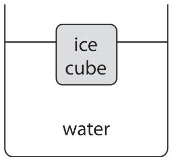

Diagram 1

(a) State the value of the resultant force on the ice cube.

$$
\mathrm {r e s u l t a n t f o r c e} =
$$

(b) Diagram 2 shows the ice cube pushed down into the water by force X.

The ice cube is at rest in this new position.

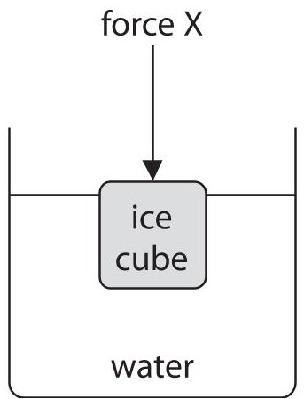

Diagram 2

(i) State the formula linking pressure difference, height, density and gravitational field strength.

(1) 

(ii) The bottom of the ice cube is 0.041 m below the surface of the water.

The density of water is $ 1 0 0 0 \mathrm{k g} / \mathrm{m}^{3}. $

Show that the pressure difference between the bottom of the ice cube and the surface of the water is about 400 Pa.

(iii) State the formula linking pressure, force and area.

(iv) The area of the base of the ice cube is $ 0.0017 \mathrm{m}^{2}. $

Calculate the upward force on the bottom of the cube from the water due to the pressure difference.

upward force =

(v) Explain why the ice cube will accelerate upwards when force X is removed.

(Total for Question 4 = 9 marks)

5 Table 1 shows the colour of some stars.

<table border="1"><tr><td>Star</td><td>Colour</td></tr><tr><td>Sun</td><td>yellow</td></tr><tr><td>Rigel</td><td>blue</td></tr><tr><td>Betelgeuse</td><td>red</td></tr><tr><td>Arcturus</td><td>orange</td></tr><tr><td>Sirius</td><td>white</td></tr></table>

Table 1

(a) Complete table 2 by giving the stars in order of increasing surface temperature.

The hottest star, Rigel, has been done for you.

<table border="1"><tr><td colspan="5">Coolest→Hottest</td></tr><tr><td></td><td></td><td></td><td></td><td>Rigel</td></tr></table>

Table 2

(b) A star has a much larger mass than the Sun.

Describe the evolution of this star after it has left the main sequence.

(c) The graph shows the relationship between the peak wavelength of light emitted by a star and the surface temperature of the star.

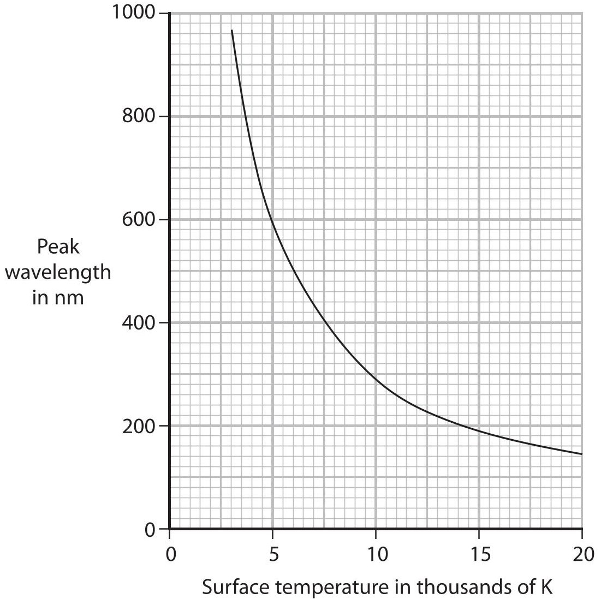

A scientist suggests that the two variables are linked by this formula. peak wavelength $ \times $ surface temperature = constant

Use data from the graph to justify this formula.

(4) 

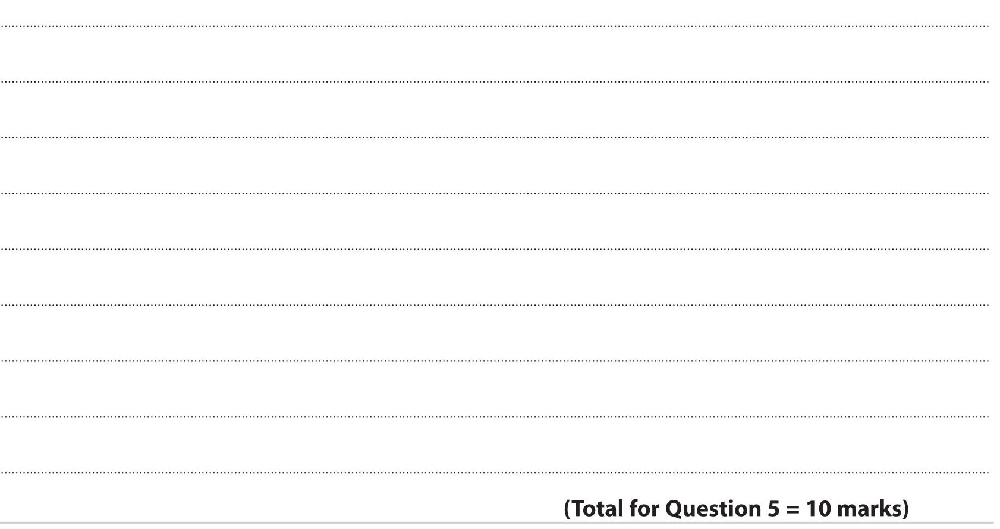

6 Diagram 1 shows a simple loudspeaker.

The coil is connected to an alternating current (a.c.) supply.

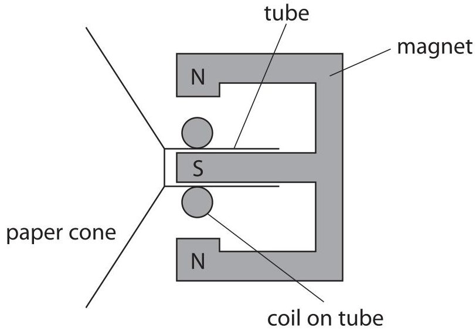

Diagram 1

(a) Describe how the loudspeaker produces sound.

(4) 

(b) Diagram 2 shows two loudspeakers connected in series with a variable resistor.

The variable resistor is set to 5.0 $ \Omega. $

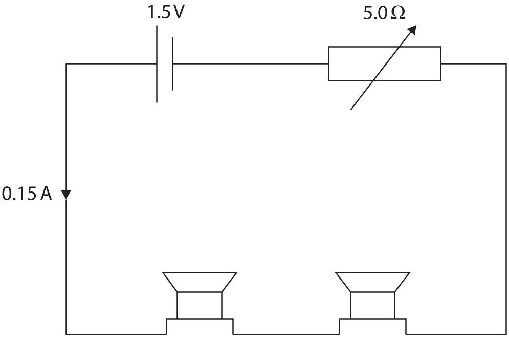

Diagram 2

(i) The total voltage across the two loudspeakers is 0.75V and the current in the circuit is 0.15 A.

Show that the total power of the two loudspeakers is about 0.1 W.

[power=current×voltage]

(2) 

(ii) A student varies the resistance of the variable resistor.

The table shows the power of the loudspeakers for different resistance values of the variable resistor.

<table border="1"><tr><td>Resistance of variable resistor in Ω</td><td>Power of loudspeakers inW</td></tr><tr><td>0.0</td><td>0.000</td></tr><tr><td>2.5</td><td>0.100</td></tr><tr><td>5.0</td><td>0.113</td></tr><tr><td>7.5</td><td>0.108</td></tr><tr><td>10.0</td><td>0.100</td></tr><tr><td>12.5</td><td>0.092</td></tr><tr><td>15.0</td><td>0.084</td></tr></table>

Plot the student's results on the grid.

(iii) Draw a curve of best fit.

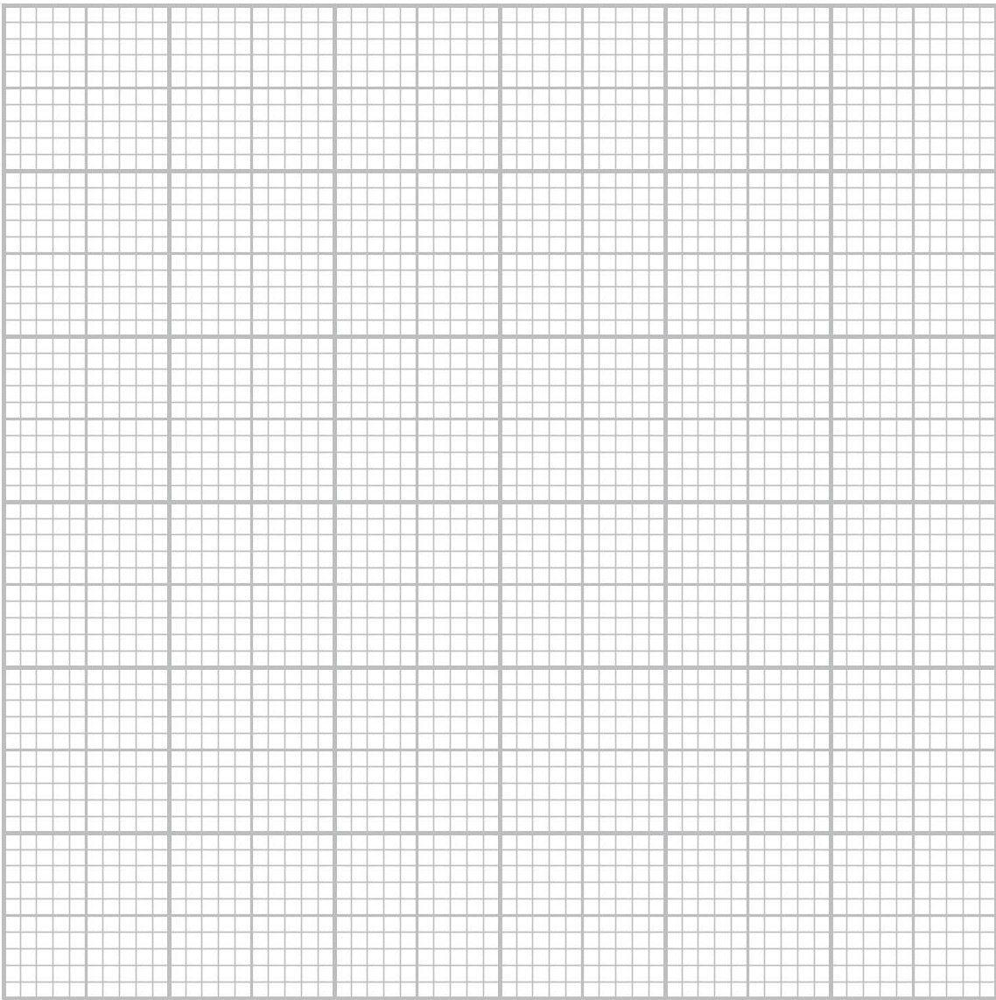

(c) Diagram 3 shows the loudspeakers connected in series to a cell.

Diagram 4 shows the loudspeakers connected in parallel to the same cell.

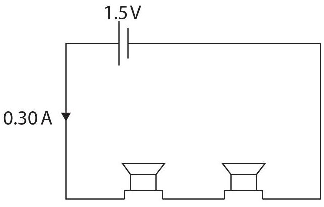

Diagram 3

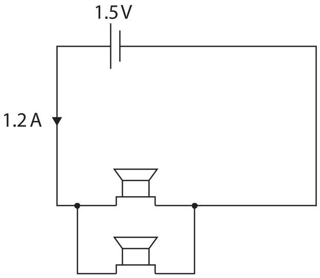

Diagram 4

Comment on how the total resistance of the loudspeakers in diagram 3 compares with the total resistance of the loudspeakers in diagram 4.

(Total for Question 6 = 15 marks)

7 Radon is a radioactive gas that contributes to background radiation.

(a) Describe what is meant by the term background radiation.

(b) The graph shows the activity of a sample of radon-222.

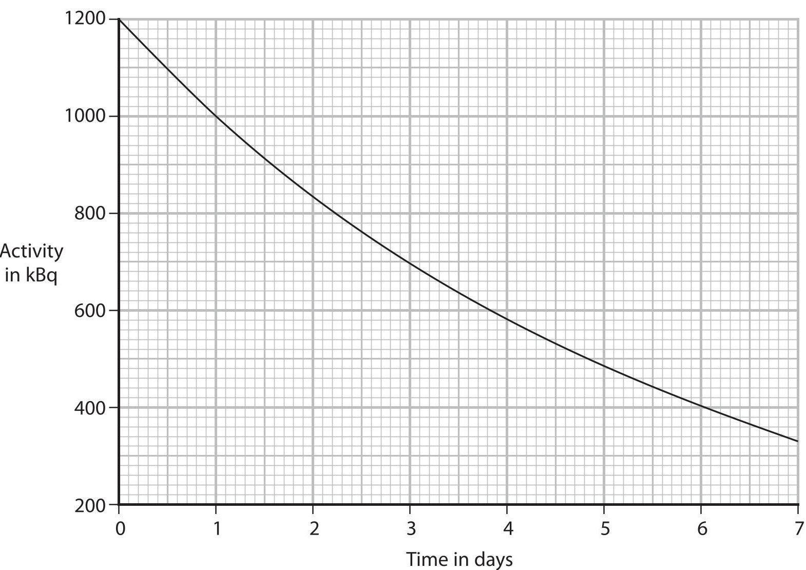

(i) State what is meant by the term half-life.

(ii) Use the graph to determine the half-life of radon-222.

$$
\mathrm {h a l f - l i f e} =
$$

(c) Radon-222 is formed by multiple alpha decays of uranium-234.

Complete the nuclear equation by giving the missing information.

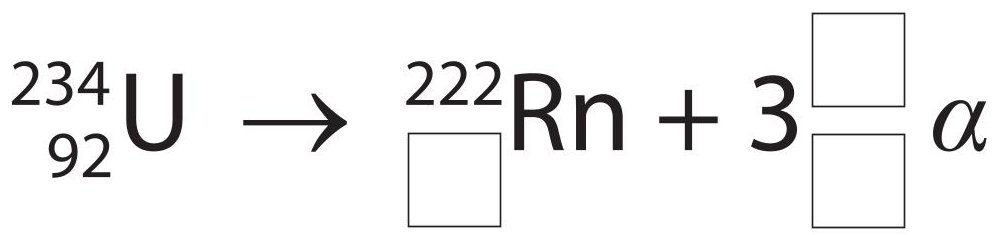

(d) Radon-222 also emits alpha radiation.

Explain the hazard to humans of breathing in air contaminated with radon-222.

(Total for Question 7 = 11 marks)

8 Hailstones are small pieces of ice that sometimes fall to the ground during storms.

(a) (i) Describe how to determine the density of a hailstone. Assume that hailstones are spherical.

(ii) The mean volume of a hailstone is $ 1. 1 \mathrm{c m}^{3}. $

The mean mass of a hailstone is 0.94 g.

Calculate the mean density of a hailstone.

Give the unit.

$$
d e n s i t y =
$$

(b) Hailstones can be lifted to the top of clouds.

The diagram shows the movement of some hailstones in a cloud.

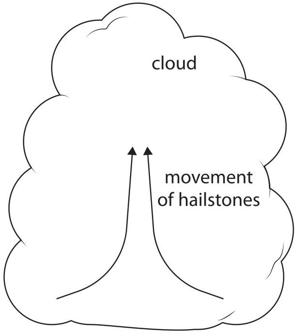

warm ground

Suggest how hailstones are lifted to the top of the cloud by convection.

(Total for Question 8 = 9 marks)

9 The diagram shows an empty metal container that has a hole in the top.

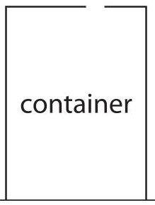

(a) Describe how the air molecules in the container exert a pressure on its inner walls.

(b) The container is heated for a long time.

Explain what happens to the number of air molecules in the container.

(c) A lid is placed on the hot container.

The lid seals the hole and the container is allowed to cool.

As the container cools, it collapses.

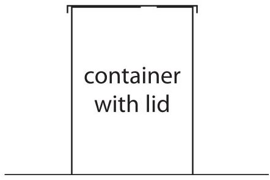

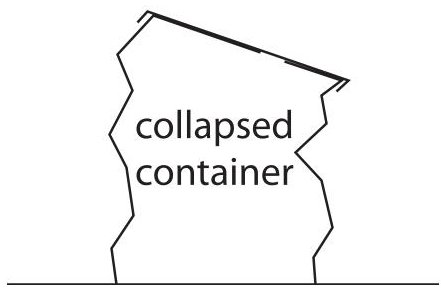

(2) 

Explain why the container collapses.

(Total for Question 9 = 7 marks)

10 Diagram 1 shows a trolley seen from above.

A copper rod is attached to the front of the trolley.

The rod is connected to a voltmeter fixed to the trolley.

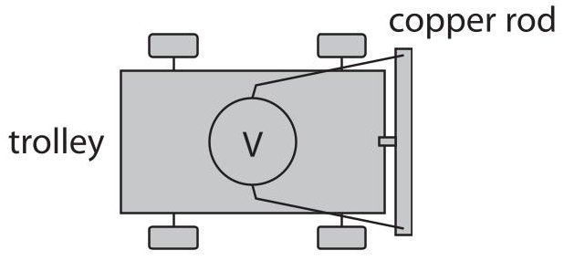

Diagram 1

(a) Diagram 2 shows the path of the trolley, backwards and forwards through a very strong magnetic field directed into the page.

The shaded area shows the magnetic field.

<table border="1"><tr><td>magnetic field into page</td><td>path of trolley</td></tr></table>

Diagram 2

(i) A voltage is induced in the copper rod as the trolley moves through the magnetic field.

Explain why the sign of the voltmeter reading changes as the trolley moves backwards and forwards.

(ii) Give a reason why the magnitude of the induced voltage might change.

(b) The voltmeter is replaced by a resistor.

A charge of $ 1. 4 \times1 0^{-4} \mathrm{C} $ flows in the resistor during a time of 0.78 s.

(i) Calculate the mean current in the resistor.

## mean current=

(ii) The thermal energy store of the resistor increases by $ 2. 3 \times1 0^{-6} $ J as energy is transferred to it electrically.

Calculate the mean voltage across the resistor when a charge of $ 1. 4 \times1 0^{-4} \mathrm{C} $ transfers this energy.

(Total for Question 10 = 10 marks)

11 (a) Diagram 1 shows water waves just before they reflect off the side of a stationary boat.

wavefronts

side of boat

## Diagram 1

(i) Draw the normal at the point where the direction of travel of the waves meets the side of the boat.

(ii) Measure the angle of incidence of the water waves.

$$
\mathrm {a n g l e o f i n c i d e n c e} =
$$

(iii) Complete the diagram to show the wavefronts after they reflect off the side of the boat.

(b) The boat starts to move, creating its own waves on the surface of the water.

(i) Surface water waves are transverse.

Describe the difference between transverse waves and longitudinal waves.

(ii) Diagram 2 shows the boat moving towards an observer.

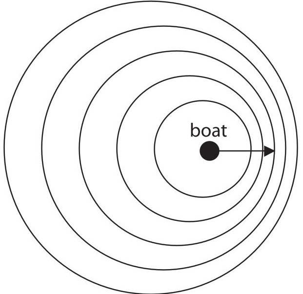

Diagram 2

Explain why the frequency of the water waves measured by the observer is larger than the frequency of the water waves created by the boat.

(Total for Question 11 = 10 marks)

12 This question is about a parachutist.

(a) A parachutist leaves a helicopter that is hovering above the ground.

The parachutist is initially at rest and falls vertically downwards.

Calculate the speed of the parachutist after they have fallen through a distance of 1300 m.

Ignore the effect of air resistance.

(b) When the parachutist is much nearer to the ground, they open their parachute. The parachutist slows down.

(i) Explain the change in speed of the parachutist. Use ideas about forces in your answer.

(ii) It is observed that from when the parachute opens to just before the parachutist touches the ground, the GPE store and the KE store of the parachutist both decrease, yet energy is still conserved.

Justify these observations.

(Total for Question 12 = 10 marks)

TOTAL FOR PAPER=110 MARKS

## BLANK PAGE

<table><tr><td colspan="2">Pearson Edexcel International GCSE (9–1)</td></tr><tr><td colspan="2">May–June 2022 Assessment Window</td></tr><tr><td>Paper reference</td><td>4PH1/1PR 4SD0/1PR</td></tr><tr><td colspan="2">Physics</td></tr><tr><td colspan="2">UNIT: 4PH1 Science (Double Award) 4SD0 PAPER: 1PR</td></tr><tr><td colspan="2">Equation Booklet Do not return this Booklet with the question paper.</td></tr></table>

Turn over

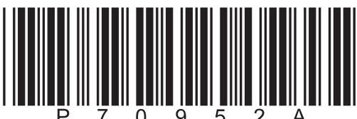

These equations may be required for both International GCSE Physics (4PH1) and International GCSE Combined Science (4SD0) papers.

<table border="1"><tr><td colspan="2">1. Forces and Motion</td></tr><tr><td colspan="2">average speed $=\frac{distance\ moved}{time\ taken}$</td></tr><tr><td>acceleration $=\frac{change\ in\ velocity}{time\ taken}$</td><td>$a=\frac{(v-u)}{t}$</td></tr><tr><td colspan="2">$(final\ speed)^2=(initial\ speed)^2+(2\times acceleration\times distance\ moved)$
$v^2=u^2+(2\times a\times s)$</td></tr><tr><td>force $=$ mass $\times$ acceleration</td><td>F=m$\times$a</td></tr><tr><td>weight $=$ mass $\times$ gravitational field strength</td><td>W=m$\times$g</td></tr><tr><td colspan="2">2. Electricity</td></tr><tr><td>power $=$ current $\times$ voltage</td><td>P=I$\times$V</td></tr><tr><td>energy transferred $=$ current $\times$ voltage $\times$ time</td><td>E=I$\times$V$\times$t</td></tr><tr><td>voltage $=$ current $\times$ resistance</td><td>V=I$\times$R</td></tr><tr><td>charge $=$ current $\times$ time</td><td>Q=I$\times$t</td></tr><tr><td>energy transferred $=$ charge $\times$ voltage</td><td>E=Q$\times$V</td></tr><tr><td colspan="2">3. Waves</td></tr><tr><td>wave speed $=$ frequency $\times$ wavelength</td><td>v=f$\times$λ</td></tr><tr><td>frequency $=\frac{1}{time\ period}$</td><td>f=$\frac{1}{T}$</td></tr><tr><td>refractive index $=\frac{\sin(\angle\ of\ incidence)}{\sin(\angle\ of\ refraction)}$</td><td>n=$\frac{\sin i}{\sin r}$</td></tr><tr><td>$\sin(\mathrm{critical\ angle})=\frac{1}{\mathrm{refractive\ index}}$</td><td>$\sin c=\frac{1}{n}$</td></tr></table>

<table border="1"><tr><td colspan="2">4. Energy resources and energy transfers</td></tr><tr><td colspan="2">efficiency $=\frac{\text{useful energy output}}{\text{total energy output}}\times100\%$</td></tr><tr><td>work done = force $\times$ distance moved</td><td>W=F$\times$d</td></tr><tr><td colspan="2">gravitational potential energy = mass $\times$ gravitational field strength $\times$ height</td></tr><tr><td colspan="2">GPE=m$\times$g$\times$h</td></tr><tr><td>kinetic energy $=\frac{1}{2}\times$ mass $\times$ speed$^{2}$</td><td>KE=$\frac{1}{2}\times$ m$\times$v$^{2}$</td></tr><tr><td>power $=\frac{\text{work done}}{\text{time taken}}$</td><td>P=$\frac{W}{t}$</td></tr><tr><td colspan="2">5. Solids, liquids and gases</td></tr><tr><td>density $=\frac{\text{mass}}{\text{volume}}$</td><td>$\rho=\frac{m}{V}$</td></tr><tr><td>pressure $=\frac{\text{force}}{\text{area}}$</td><td>$p=\frac{F}{A}$</td></tr><tr><td colspan="2">pressure difference = height $\times$ density $\times$ gravitational field strength</td></tr><tr><td colspan="2">p=h$\times$\rho$\times$g</td></tr><tr><td>$\frac{\text{pressure}}{\text{temperature}}=\text{constant}$</td><td>$\frac{p_{1}}{T_{1}}=\frac{p_{2}}{T_{2}}$</td></tr><tr><td>pressure $\times$ volume = constant</td><td>$p_{1}\times V_{1}=p_{2}\times V_{2}$</td></tr><tr><td colspan="2">8. Astrophysics</td></tr><tr><td>orbital speed $=\frac{2\times\pi\times\text{orbital radius}}{\text{time period}}$</td><td>$v=\frac{2\times\pi\times r}{T}$</td></tr></table>

The equations on the following page will only be required for International GCSE Physics.

<table border="1"><tr><td colspan="2">1. Forces and Motion</td></tr><tr><td>momentum=mass×velocity</td><td>p=m×v</td></tr><tr><td>force=$\frac{\text{change in momentum}}{\text{time taken}}$</td><td>F=$\frac{(mv-mu)}{t}$</td></tr><tr><td colspan="2">moment=force×perpendicular distance from the pivot</td></tr><tr><td colspan="2">5. Solids, liquids and gases</td></tr><tr><td colspan="2">change in thermal energy=mass×specific heat capacity×change in temperature
$\Delta Q=m\times c\times \Delta T$</td></tr><tr><td colspan="2">6. Magnetism and electromagnetism</td></tr><tr><td colspan="2">relationship between input and output voltages for a transformer
$\frac{\text{input (primary) voltage}}{\text{output (secondary) voltage}}=\frac{\text{primary turns}}{\text{secondary turns}}$</td></tr><tr><td colspan="2">input power=output power
$V_{p}I_{p}=V_{s}I_{s}$
for 100% efficiency</td></tr><tr><td colspan="2">8. Astrophysics</td></tr><tr><td>$\frac{\text{change in wavelength}}{\text{reference wavelength}}=\frac{\text{velocity of a galaxy}}{\text{speed of light}}$</td><td>$\frac{\lambda-\lambda_{0}}{\lambda_{0}}=\frac{\Delta\lambda}{\lambda_{0}}=\frac{v}{c}$</td></tr></table>

END OF EQUATION LIST

