<table><tr><td colspan="3">Please check the examination details below before entering your candidate information</td></tr><tr><td>Candidate surname</td><td colspan="2">Other names</td></tr><tr><td>Centre Number</td><td colspan="2">Candidate Number</td></tr><tr><td colspan="3">Pearson Edexcel International GCSE (9-1)</td></tr><tr><td>Time 2 hours</td><td>Paper reference</td><td>4PH1/1P 4SD0/1P</td></tr><tr><td colspan="3">Physics
UNIT: 4PH1
Science (Double Award) 4SD0
PAPER: 1P</td></tr><tr><td colspan="2">You must have:
Ruler, calculator, protractor</td><td>Total Marks</td></tr></table>

## Instructions

- Use black ink or ball-point pen.

- If pencil is used for diagrams/sketches/graphs it must be dark (HB or B).

- Fill in the boxes at the top of this page with your name, centre number and candidate number.

- Answer all questions.

- Answer the questions in the spaces provided

- there may be more space than you need.

- Show all the steps in any calculations and state the units.

## Information

- The total mark for this paper is 110.

- The marks for each question are shown in brackets

- use this as a guide as to how much time to spend on each question.

## Advice

- Read each question carefully before you start to answer it.

- Write your answers neatly and in good English.

- Try to answer every question.

- Check your answers if you have time at the end.

Turn over

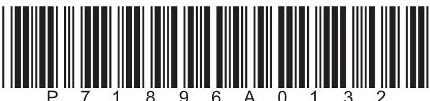

## FORMULAE

You may find the following formulae useful.

$$
\mathrm {e n e r g y t r a n s f e r r e d} = \mathrm {c u r r e n t} \times \mathrm {v o l t a g e} \times \mathrm {t i m e}
$$

$$
E = I \times V \times t
$$

$$
\mathrm {f r e q u e n c y} = \frac {1}{\mathrm {t i m e p e r i o d}}
$$

$$
f = \frac {1}{T}
$$

$$
\mathrm {p o w e r} = \frac {\mathrm {w o r k d o n e}}{\mathrm {t i m e t a k e n}}
$$

$$
P = \frac {W}{t}
$$

$$
\mathrm {p o w e r} = \frac {\mathrm {e n e r g y t r a n s f e r r e d}}{\mathrm {t i m e t a k e n}}
$$

$$
P = \frac {W}{t}
$$

$$
\mathrm {o r b i t a l s p e e d} = \frac {2 \pi \times \mathrm {o r b i t a l r a d i u s}}{\mathrm {t i m e p e r i o d}}
$$

$$
v = \frac {2 \times \pi \times r}{T}
$$

(final speed) $ ^{2} $ = (initial speed) $ ^{2} $ + (2 $ \times $ acceleration $ \times $ distance moved)

$$
v ^ {2} = u ^ {2} + (2 \times a \times s)
$$

$$
\mathrm {p r e s s u r e} \times \mathrm {v o l u m e} = \mathrm {c o n s t a n t}
$$

$$
p _ {1} \times V _ {1} = p _ {2} \times V _ {2}
$$

$$
\frac {\mathrm {p r e s s u r e}}{\mathrm {t e m p e r a t u r e}} = \mathrm {c o n s t a n t}
$$

$$
\frac {p _ {1}}{T _ {1}} = \frac {p _ {2}}{T _ {2}}
$$

Where necessary, assume the acceleration of free fall, $ g=1 0 \mathrm{~ m} / \mathrm{s}^{2}. $

## Answer ALL questions.

Some questions must be answered with a cross in a box. If you change your mind about an answer, put a line through the box and then mark your new answer with a cross.

1 A material is stretched by applying an increasing load.The material shows elastic behaviour as it is stretched.

(a) Describe what is meant by elastic behaviour.

(b) The material obeys Hooke's law.

Sketch a graph for this material to show that it obeys Hooke's law as it is stretched.

You should label both axes with appropriate physical quantities.

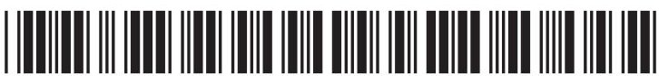

2 Diagram 1 shows the magnetic field between the poles of two strong bar magnets.

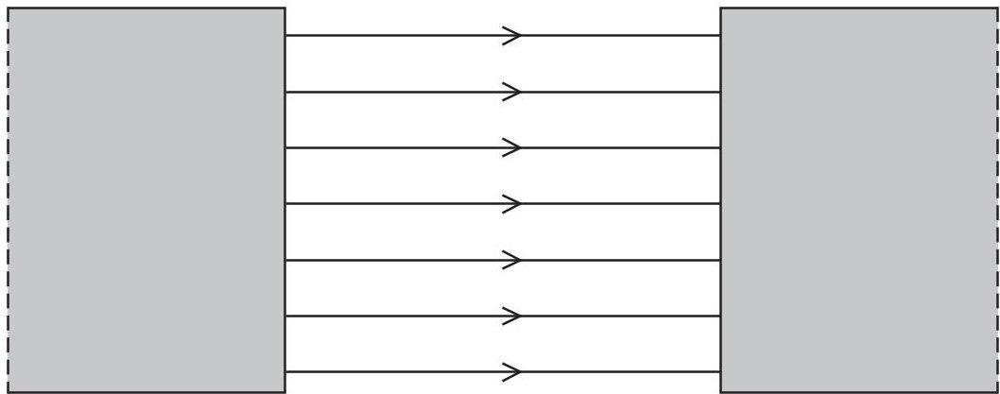

## Diagram 1

(a) Add labels to diagram 1 to show the poles of the bar magnets.

(b) The bar magnets are made from steel.

Give one reason why steel is a good material for making bar magnets.

(c) Explain how diagram 1 shows a uniform magnetic field.

(d) Diagram 2 shows a metal wire being moved downwards through the uniform field between the poles of the same bar magnets.The orientation of the magnets has not been changed.

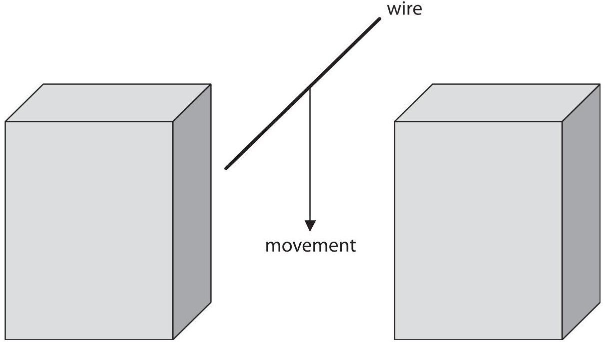

## Diagram 2

(i) Give a reason why a voltage is induced between the ends of the metal wire as it moves between the poles of the bar magnets.

(ii) State two changes that could be made to this arrangement that would increase the magnitude of the induced voltage.

(Total for Question 2 = 7 marks)

3 A winch is used to pull a truck along a horizontal road.

The winch is connected to the truck by a thick rope.

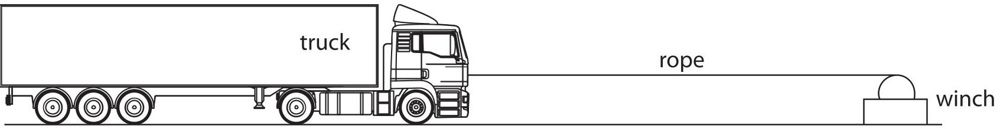

(Source: $ \textcircled{c} $ A. Bizgaimer/Shutterstock)

(a) The winch does 41 kJ of useful work on the truck when the truck is pulled a horizontal distance of 15 m.

(i) State the formula linking work done, force and distance moved in the direction of the force.

(ii) Calculate the force that the rope exerts on the truck.

(b) The winch includes a small engine. The engine burns petrol to power the motor in the winch.

The winch transfers energy mechanically to the truck.

(i) The winch has an efficiency of 25% when pulling the truck. Draw a Sankey diagram for this energy transfer.

(ii) The winch can also be used to pull the truck uphill at a constant speed.

The table gives some energy stores.

Add one tick ( $ \checkmark $ ) to each row to show what happens to the energy in each store as the truck is pulled uphill.

<table border="1"><tr><td>Energy store</td><td>Decreases</td><td>Increases</td><td>Stays the same</td></tr><tr><td>chemical store of petrol in winch</td><td></td><td></td><td></td></tr><tr><td>gravitational store of truck</td><td></td><td></td><td></td></tr><tr><td>kinetic store of truck</td><td></td><td></td><td></td></tr><tr><td>thermal store of surroundings</td><td></td><td></td><td></td></tr></table>

(Total for Question 3 = 11 marks)

## BLANK PAGE

4 A teacher investigates the count rate detected from a radioactive source.

(a) (i) State one source of background radiation.

(ii) Describe how the teacher could measure the count rate from a radioactive source and correct the count rate for background radiation.

(b) The teacher places a piece of lead sheet between the radioactive source and a radiation detector.

The teacher determines the corrected count rate from the radioactive source three times and calculates the mean.

They repeat this process using different thicknesses of lead sheet.

The table shows their results.

<table border="1"><tr><td rowspan="2">Thickness of lead in mm</td><td colspan="4">Count rate in Bq</td></tr><tr><td>trial1</td><td>trial2</td><td>trial3</td><td>mean</td></tr><tr><td>0.0</td><td>480</td><td>504</td><td>469</td><td>484</td></tr><tr><td>2.0</td><td>374</td><td>337</td><td>357</td><td>356</td></tr><tr><td>4.0</td><td>247</td><td>239</td><td>229</td><td>238</td></tr><tr><td>6.0</td><td>141</td><td>154</td><td>148</td><td></td></tr><tr><td>8.0</td><td>110</td><td>104</td><td>131</td><td>115</td></tr><tr><td>10.0</td><td>88</td><td>91</td><td>85</td><td>88</td></tr></table>

(i) Calculate the mean count rate when the thickness of lead is 6.0 mm.

(ii) Plot a graph of mean count rate against thickness of lead.

(iii) Draw the curve of best fit.

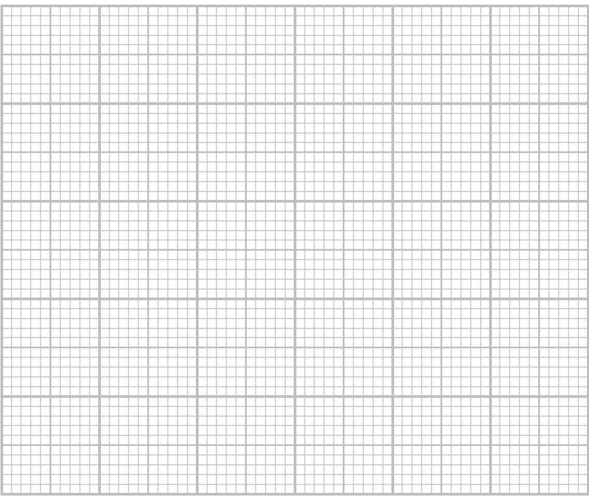

(iv) When there is not a sheet of lead between the radioactive source and the radiation detector, the mean count rate is 484 Bq.

Use the graph to determine the thickness of lead needed to reduce the mean count rate by 25%.

thickness=

(c) The radioactive source emits only one type of radiation.

Explain which type of radiation this radioactive source emits.

(Total for Question 4 = 15 marks)

5 The graph shows how the thinking distance and the braking distance vary with the speed of a car.

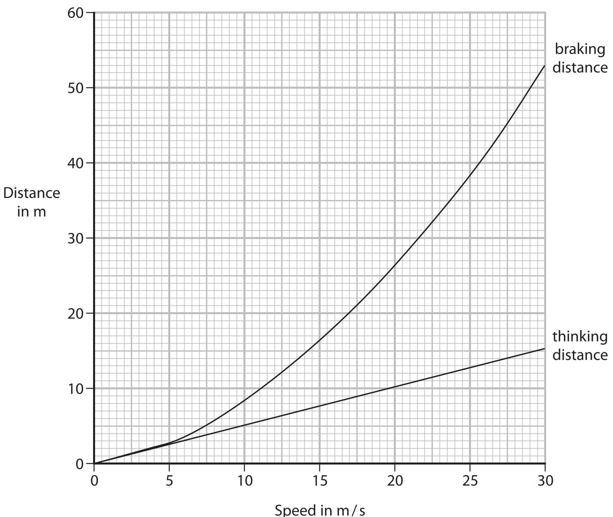

(a) Which of these does not affect thinking distance?

A alcohol consumed by the driver

B condition of the road

C speed of the car

D tiredness of the driver

(b) Which of these would increase the braking distance of the car?

A faster reaction time of driver

B ice on the road

more powerful brakes

D tyres with more grip

(c) Determine the stopping distance of the car when the speed of the car is 20 m/s.

$$
stopping distance =
$$

(d) (i) State the formula linking average speed, distance moved and time taken.

(ii) Determine the reaction time of the driver of the car.

(e) Calculate the mean braking acceleration of the car as it brakes to a stop from an initial speed of 30m/s.

(Total for Question 5 = 13 marks)

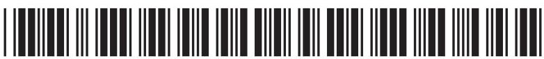

6 This question is about optical fibres.

(a) Optical fibres use light waves for communication.

Which of these is a correct statement about waves?

A waves transfer energy, information and matter

B waves do not transfer energy, information, or matter

C waves transfer energy without transferring information or matter

D waves transfer energy and information without transferring matter

(b) A ray of light passes from air into a glass optical fibre.

Diagram 1 shows the path of the ray of light after it has passed through the boundary between air and the optical fibre.

(i) Draw the path of the ray of light in air before it passed through the boundary.

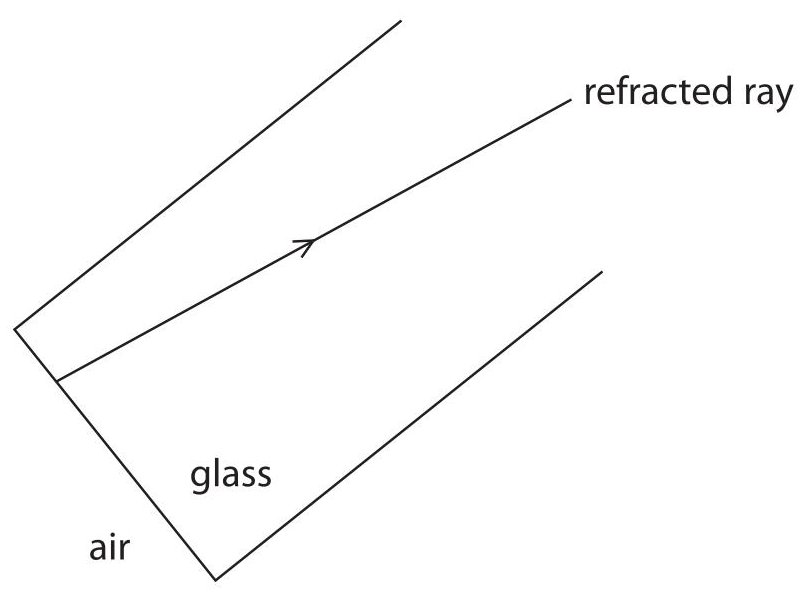

## Diagram 1

(ii) State the name of the wave behaviour responsible for the path of the ray of light as it passes from air into the optical fibre.

(c) Diagram 2 shows the path of the ray of light as it travels through the optical fibre.

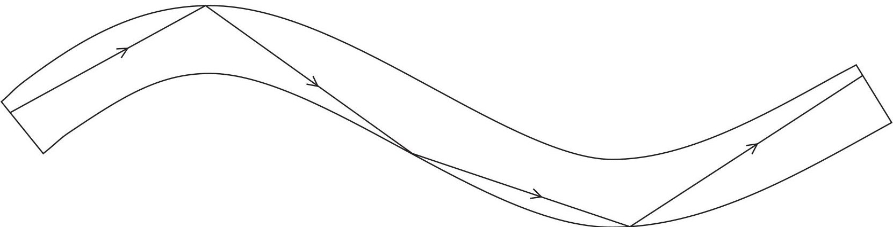

## Diagram 2

Explain the path of the ray of light as it travels through the optical fibre.

(Total for Question 6 = 6 marks)

## BLANK PAGE

7 A student uses the circuit shown in diagram 1 to investigate how the current changes with voltage for a filament lamp.

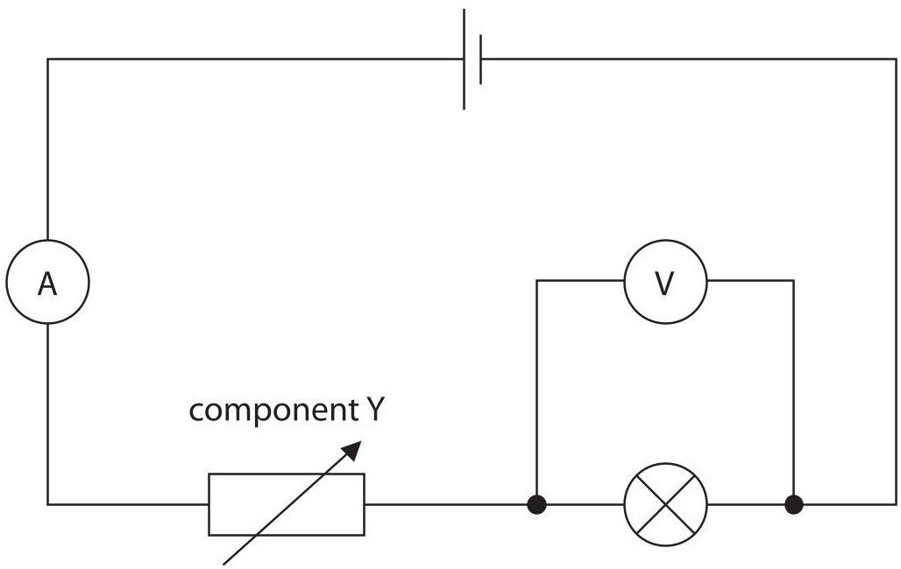

Diagram 1

(a) (i) Give the name of component Y.

(ii) Give a reason why component Y is included in the circuit.

(b) The graph shows some of the student's results.

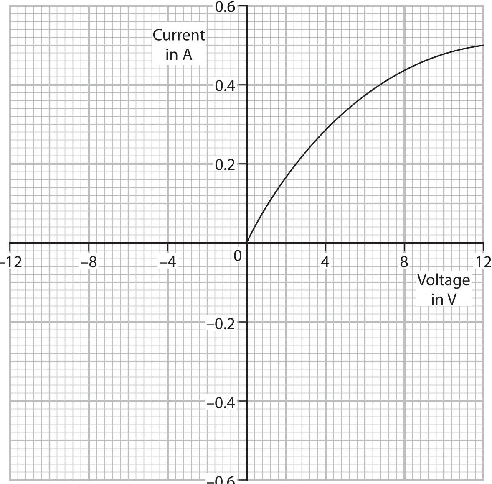

(i) State the formula linking charge, current and time.

(ii) Determine the current in the lamp when the voltage across the lamp is 10V.

(iii) Calculate the charge transferred through the lamp in 30s when the voltage across the lamp is 10V.

Give the unit.

(iv) Calculate the time for the lamp to transfer 250 J of energy when the voltage across the lamp is 10V.

(v) The student disconnects the cell and reconnects it with its terminals reversed.

Complete the graph to show how the current in the lamp varies with voltage across the lamp when the cell is connected with its terminals reversed.

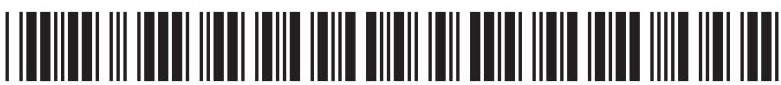

(c) The student replaces the filament lamp with a light emitting diode (LED) and replaces the cell with an alternating current (a.c.) power supply, as shown in diagram 2.

The student also removes the ammeter and voltmeter from the circuit.

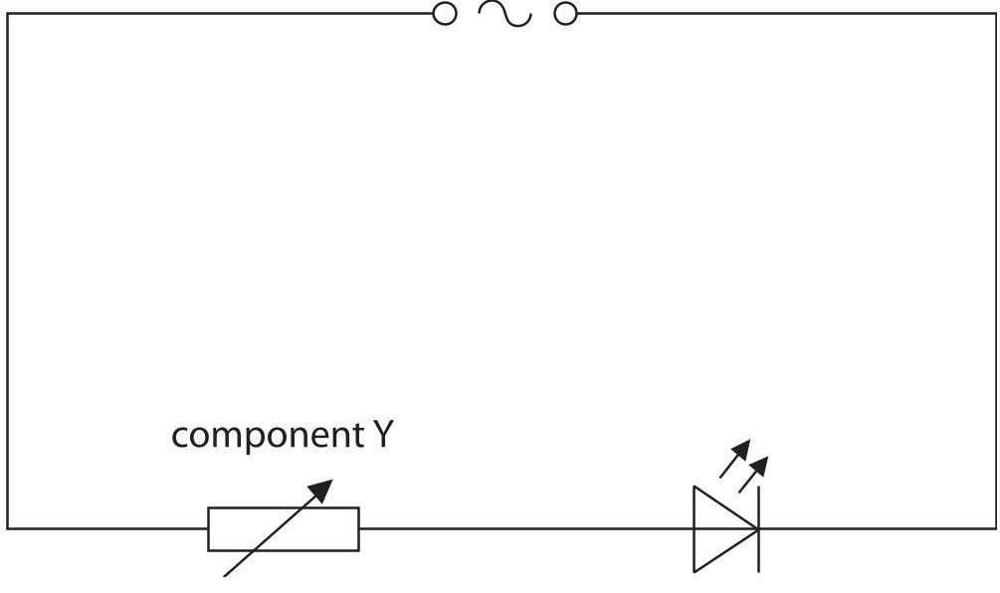

Diagram 2

Explain why the LED flashes on and off in this circuit.

(2) 

(Total for Question 7 = 14 marks)

## BLANK PAGE

8 The table gives information about four stars.

<table border="1"><tr><td>Star</td><td>Colour</td><td>Mass in solar masses</td></tr><tr><td>Sirius</td><td>blue-white</td><td>2</td></tr><tr><td>Polaris</td><td>yellow-white</td><td>5</td></tr><tr><td>Betelgeuse</td><td>red</td><td>17</td></tr><tr><td>Rigel</td><td>blue</td><td>21</td></tr></table>

(a) Explain which of these stars has the highest surface temperature.

(b) Discuss the evolution of the stars Rigel and Sirius.

(6) 

## (Total for Question 8 = 8 marks)

## BLANK PAGE

9 This question is about waves.

(a) The diagram represents a wave.

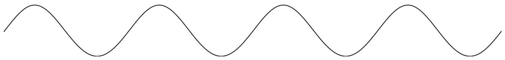

(i) Determine the amplitude of the wave by measuring it with a ruler.

$$
\mathrm {a m p l i t u d e} =
$$

(ii) Determine the wavelength of the wave by measuring it with a ruler.

$$
w a v e l e n g t h =
$$

(b) Microwaves are part of the electromagnetic spectrum.

(i) Name the part of the electromagnetic spectrum that has a lower frequency than microwaves.

(ii) Microwaves travel at a speed of $ 3. 0 \times1 0^{8} \mathrm{~ m / s} $ in air.

A microwave has a wavelength of 2.7 cm.

Calculate the frequency of this microwave. [wave speed = frequency $ \times $ wavelength]

(c) A student uses a microwave source and a receiver to investigate microwaves.

Photograph 1 shows how the student sets up their apparatus.

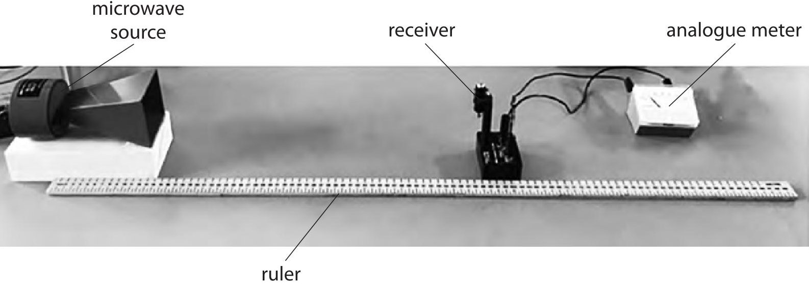

## Photograph 1

The meter shows the strength of the microwaves detected by the receiver.

The strength of the microwaves is measured in arbitrary units.

The student varies the distance between the microwave source and the receiver, and records the meter readings.

(i) Photograph 2 shows the analogue meter for one of the readings.

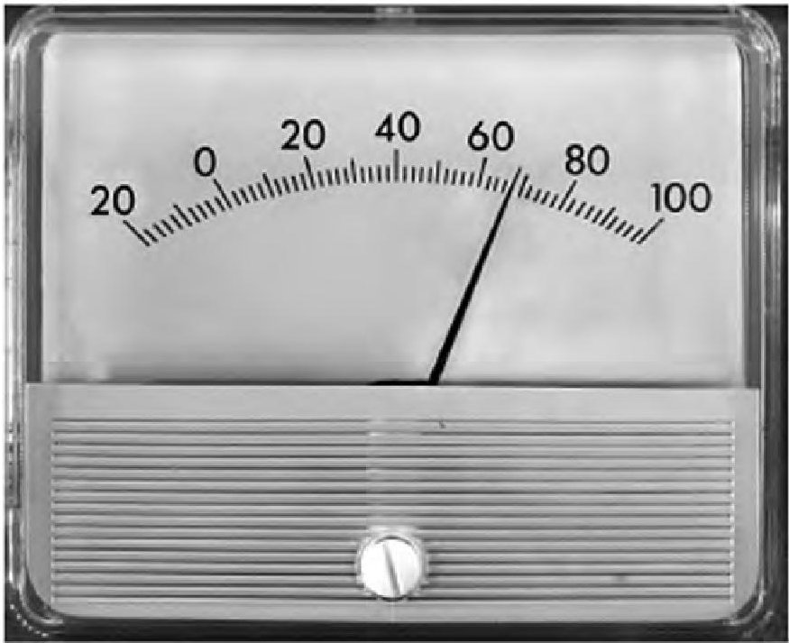

## Photograph 2

Give the reading on the analogue meter.

reading = arbitrary units

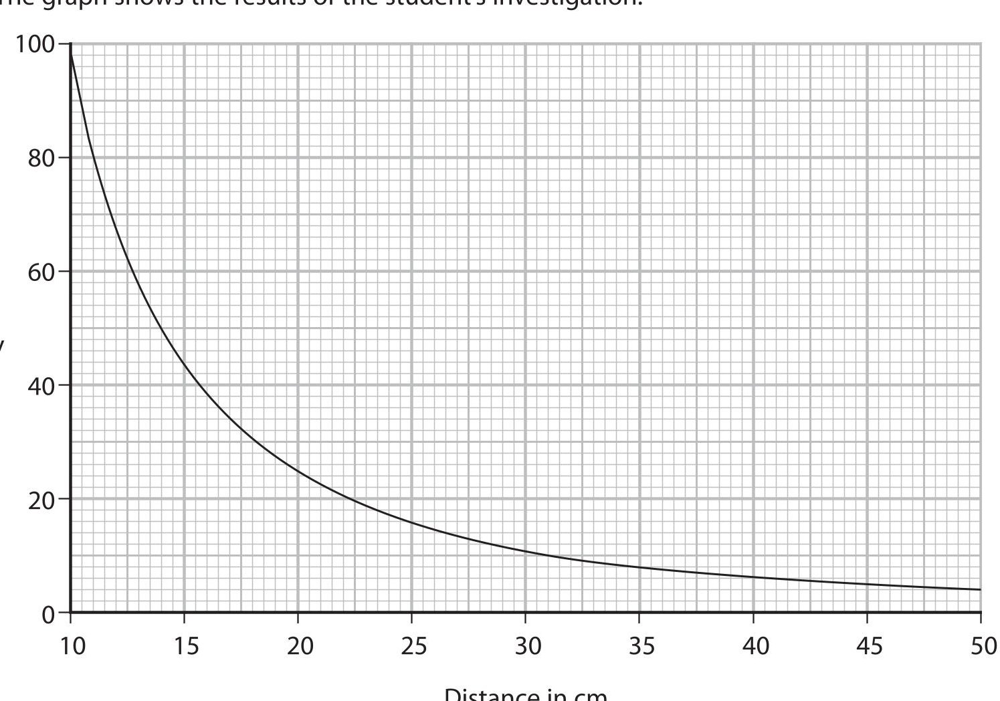

The student concludes that the meter reading is inversely proportional to the distance between the microwave source and the receiver.

To be inversely proportional

meter reading $ \times $ distance = constant

Comment on the student's conclusion.

You should use data from the graph in your answer.

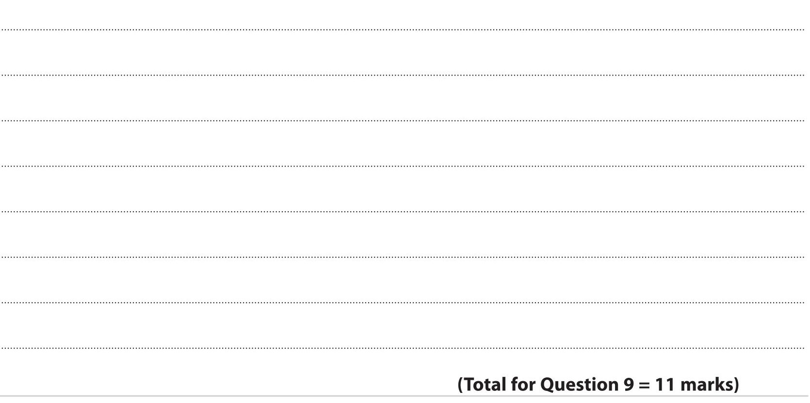

10 A student pours a known volume of hot water into a metal container. They place the metal container into an insulated plastic cup containing an equal volume of cold water.

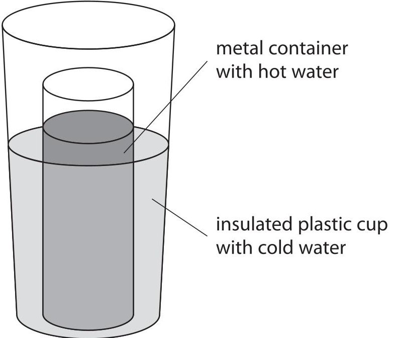

The student uses temperature probes to measure the temperatures of both the water in the metal container and the water in the plastic cup.

The hot water has an initial temperature of 70 $ ^{\circ} \mathrm{C} $ and the cold water has an initial temperature of 5 $ ^{\circ} \mathrm{C} $

(a) On the axes, sketch how the temperature of the hot water and the temperature of the cold water vary with time.

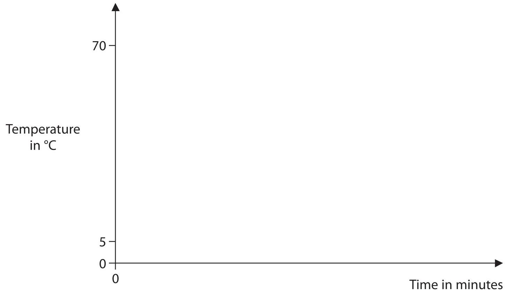

(b) Explain why the temperatures of the hot water and the cold water change. You should refer to different types of thermal energy transfer in your answer.

(c) Explain how placing a lid on the plastic cup would affect the results.

(Total for Question 10 = 11 marks)

11 (a) Diagram 1 represents the atoms of a gas inside a container.

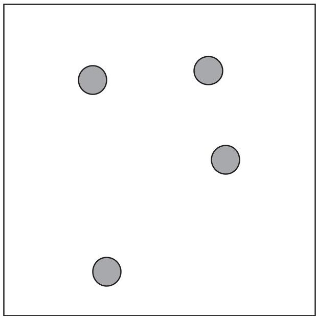

Diagram 1

(i) Explain how the atoms exert a pressure on the walls of the container.

(ii) Explain why the pressure of the gas in the container decreases as its temperature decreases.

The volume of the container does not change.

(b) Diagram 2 shows a device called a magneto-optical trap (MOT).

Physicists use the device to cool gases to extremely low temperatures.

The MOT uses laser beams and magnetic fields to trap a small collection of atoms with extremely small kinetic energies.

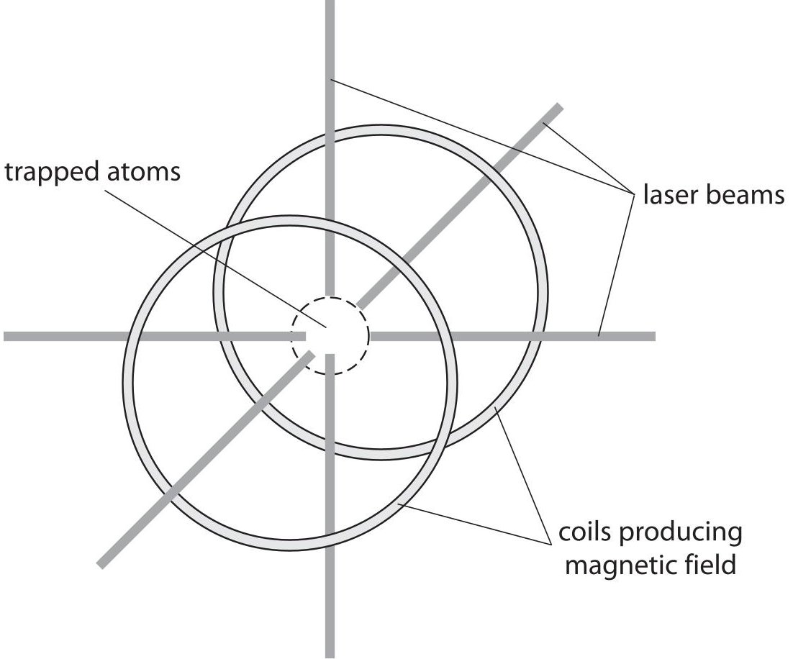

## Diagram 2

Each trapped atom has a mass of $ 5. 0 \times1 0^{-2 7} \mathrm{k g} $ and a mean speed of $ 7 3 \mathrm{m / s}. $

Calculate the temperature of the trapped atoms.

[mean kinetic energy of an atom $ = 2. 1 \times1 0^{-2 3} \times $ temperature in kelvin]

(Total for Question 11 = 9 marks)

TOTAL FOR PAPER = 110 MARKS

## BLANK PAGE

