<table><tr><td colspan="2">Write your name here</td></tr><tr><td>Surname</td><td>Other names</td></tr><tr><td>Centre Number</td><td>Candidate Number</td></tr><tr><td colspan="2">Pearson Edexcel International GCSE (9 - 1)</td></tr><tr><td colspan="2">Physics
Paper 1</td></tr><tr><td colspan="2">Sample Assessment Material for first teaching September 2017
Time: 2 hours</td><td>Paper Reference
4PH1/1P
4SD0/1P</td></tr><tr><td colspan="2">You must have:
Calculator, ruler</td><td>Total Marks</td></tr></table>

## Instructions

- Use black ink or ball-point pen.

- Fill in the boxes at the top of this page with your name, centre number and candidate number.

- Answer all questions.

- Answer the questions in the spaces provided

- there may be more space than you need.

- Calculators may be used.

- Some questions must be answered with a cross in a box. If you change your mind about an answer, put a line through the box and then mark your new answer with a cross.

## Information

- The total mark for this paper is 110.

- The marks for each question are shown in brackets

- use this as a guide as to how much time to spend on each question.

## Advice

- Read each question carefully before you start to answer it.

- Try to answer every question.

- Check your answers if you have time at the end.

## EQUATIONS

You may find the following equations useful.

$$
\mathrm {e n e r g y t r a n s f e r r e d} = \mathrm {c u r r e n t} \times \mathrm {v o l t a g e} \times \mathrm {t i m e}
$$

$$
E = I \times V \times t
$$

$$
\mathrm {f r e q u e n c y} = \frac {1}{\mathrm {t i m e p e r i o d}}
$$

$$
f = \frac {1}{T}
$$

$$
\mathrm {p o w e r} = \frac {\mathrm {w o r k d o n e}}{\mathrm {t i m e t a k e n}}
$$

$$
P = \frac {W}{t}
$$

$$
\mathrm {p o w e r} = \frac {\mathrm {e n e r g y t r a n s f e r r e d}}{\mathrm {t i m e t a k e n}}
$$

$$
P = \frac {W}{t}
$$

$$
\mathrm {o r b i t a l s p e e d} = \frac {2 \pi \times \mathrm {o r b i t a l r a d i u s}}{\mathrm {t i m e p e r i o d}}
$$

$$
V = \frac {2 \times \pi \times r}{T}
$$

(final speed) $ ^{2} $ = (initial speed) $ ^{2} $ + (2 $ \times $ acceleration $ \times $ distance moved)

$$
v ^ {2} = u ^ {2} + (2 \times a \times s)
$$

$$
\mathrm {p r e s s u r e} \times \mathrm {v o l u m e} = \mathrm {c o n s t a n t}
$$

$$
p _ {1} \times V _ {1} = p _ {2} \times V _ {2}
$$

$$
\frac {\mathrm {p r e s s u r e}}{\mathrm {t e m p e r a t u r e}} = \mathrm {c o n s t a n t}
$$

$$
\frac {p _ {1}}{T _ {1}} = \frac {p _ {2}}{T _ {2}}
$$

Where necessary, assume the acceleration of free fall, $ \mathrm{g}=1 0 \mathrm{m} / \mathrm{s}^{2}. $

## Answer ALL questions. Write your answers in the spaces provided.

(a) Which of these objects orbits a planet?

A comet

B dwarf star

C galaxy

D moon

(b) What is the correct name for our galaxy?

A Crab Nebula

B Milky Way

C Solar System

D Universe

(c) Which of these objects has the largest mass?

A artificial satellite

B comet

C Earth

D Sun

(d) Which of these stars is the coolest?

A blue star

B orange star

C red star

D yellow star

(Total for Question 1 = 4 marks)

2 This question is about the motion of a ball.

(a) A ball is at rest on a trapdoor.

Complete the diagram to show the forces acting on the ball.

Label the forces.

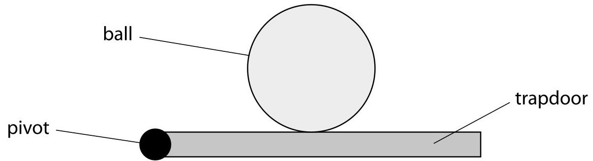

(b) The trapdoor swings open and the ball falls to the ground.

The ball does not bounce when it hits the ground.

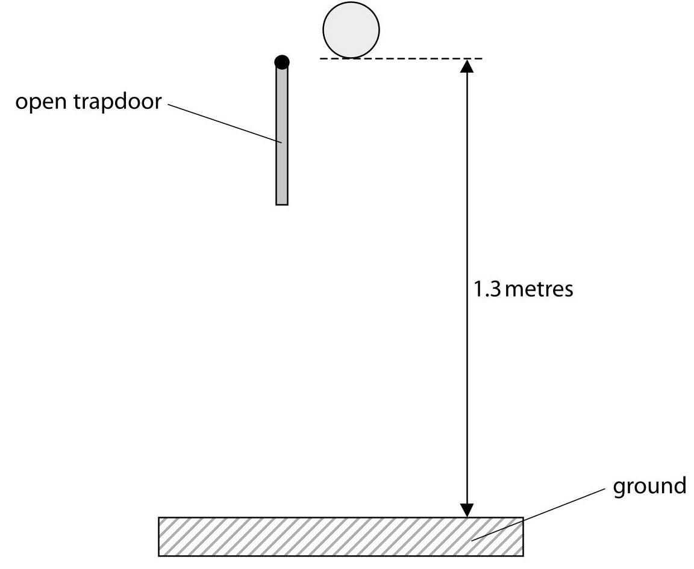

Show that the final speed of the ball at the instant before it hits the ground is about 5 m/s.

(c) The graph shows how the distance travelled by the ball changes with time.

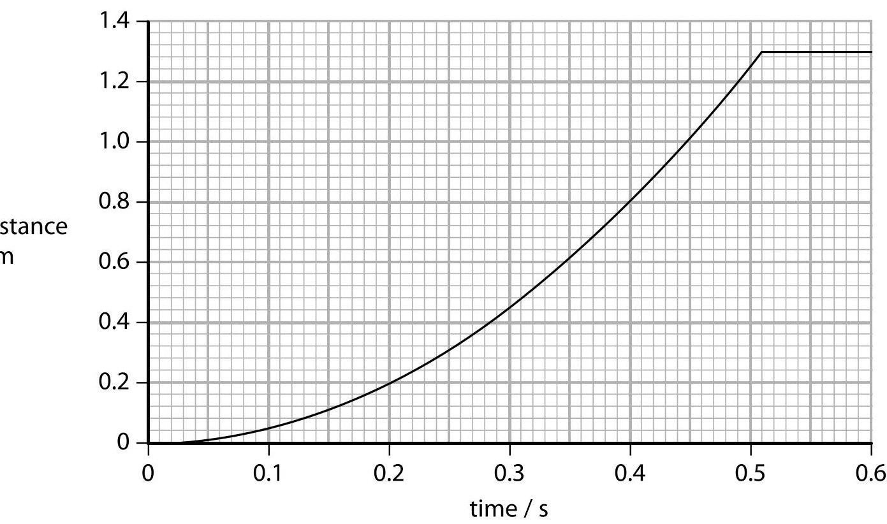

(i) Determine the time taken for the ball to hit the ground.

(ii) State the equation relating average speed, distance moved and time taken.

(iii) Calculate the average speed of the ball after 0.40 s.

(iv) Explain how the graph shows that the ball accelerates when it falls.

(Total for Question 2 = 12 marks)

## BLANK PAGE

TURN OVER FOR QUESTION 3

3 A 12V battery is connected to a component, X, and a fixed resistor, R, as shown.

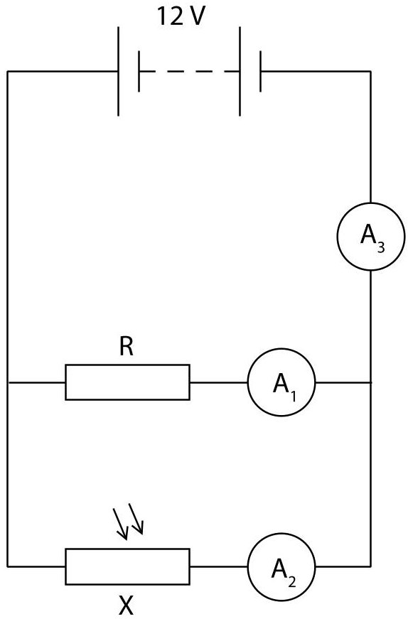

(a) (i) State the name of component X.

(ii) Draw a voltmeter on the circuit diagram connected to show the voltage of component X.

(b) The voltage across component X is 12V.

The resistor R has a value of 840 $ \Omega $.

Show that the current in ammeter $ A_{1} $ is approximately 0.01 A.

Use the equation

voltage = current $ \times $ resistance

(c) When the circuit is placed in daylight, the current in $ A_{2} $ is 0.011 A.

(i) Calculate the value of the current through $ A_{3}. $

(ii) Explain what happens to the current through $ A_{3} $ when the circuit is placed in a darkened room.

(Total for Question 3 = 8 marks)

4 This question is about waves.

(a) The diagram shows a wave.

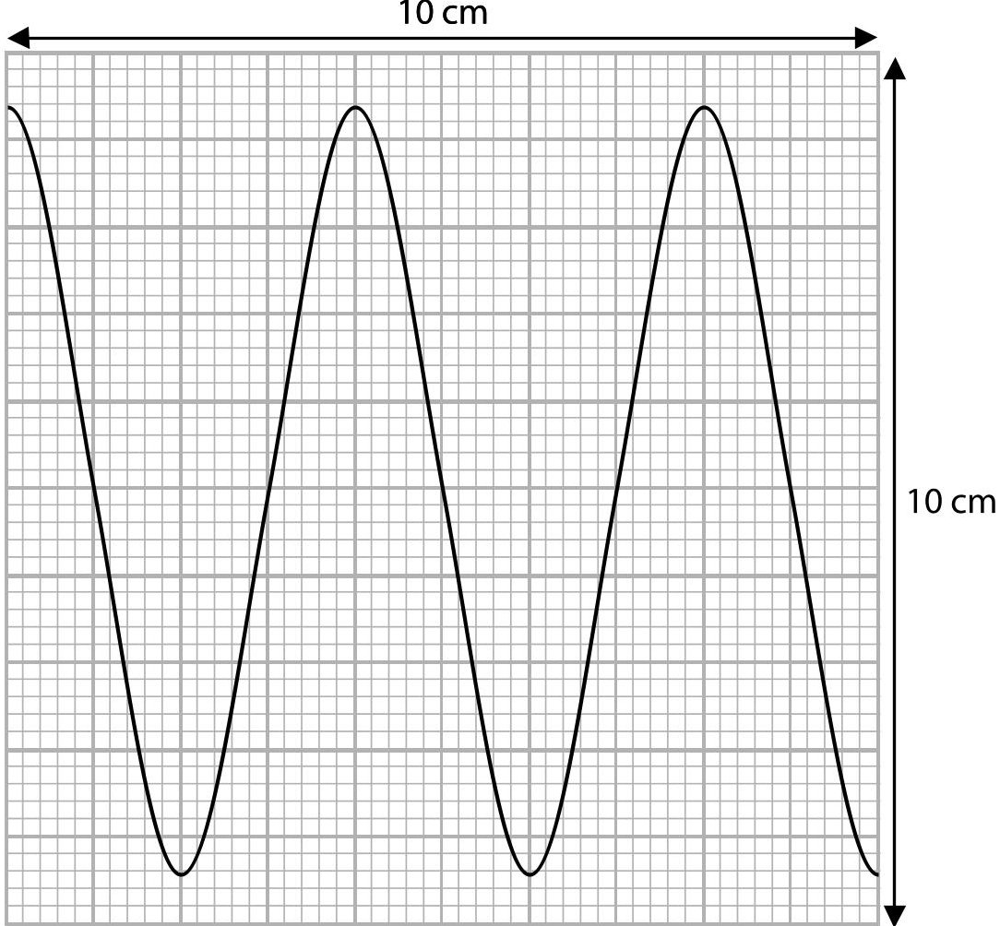

(i) What is the wavelength of the wave?

A 4.0cm

B 4.4cm

C 5.0cm

D 8.8cm

(ii) What is the amplitude of the wave?

A 4.0cm

B 4.4cm

C 5.0cm

D 8.8cm

(b) The diagram shows the types of radiation in the electromagnetic spectrum.

<table border="1"><tr><td>radio waves</td><td>microwaves</td><td>infrared</td><td>visible light</td><td>ultraviolet</td><td>x-rays</td><td>gamma rays</td></tr></table>

(i) Which of the following statements about electromagnetic waves is correct?

A they all have the same amplitude

(1) 

B they all have the same frequency

C they all have the same speed in free space

D they all have the same wavelength

(ii) Electromagnetic waves have many different uses.

Explain the uses of three different radiations in the electromagnetic spectrum.

(6) 

2...

Use.

(Total for Question 4 = 9 marks)

5 A gas is contained inside a sealed syringe.

plunger

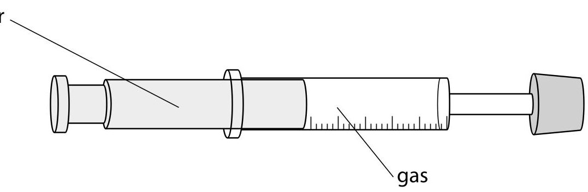

(a) The plunger is pushed so that the gas is compressed and its volume reduces at constant temperature.

(i) Before compression, the gas pressure is 100 kPa and the volume of the gas is $ 7. 5 \mathrm{c m}^{3}. $

After compression, the volume of the gas is $ 5. 0 \mathrm{c m}^{3}. $

Calculate the pressure of the gas after compression.

(ii) Explain why decreasing the volume changes the pressure of the gas in the syringe.

You should use ideas about particles in your answer.

(b) The plunger of the syringe is released and the gas returns to its original pressure of 100 kPa.

The plunger is then held in position so that the volume of the gas cannot change.

The gas is now heated and its temperature increases.

(i) Describe how the average kinetic energy of the gas particles changes when the temperature of the gas increases.

(ii) The temperature of the gas increases from $ 2 0^{\circ} \mathrm{C} $ to $ 6 5^{\circ} \mathrm{C} $ Calculate the pressure of the gas after it is heated.

(Total for Question 5 = 13 marks)

## BLANK PAGE

The student places an electric fan in front of the wind turbine.

The wind turbine is connected to a voltmeter.

6 A student investigates a wind turbine.

When the wind turbine turns, it generates a voltage.

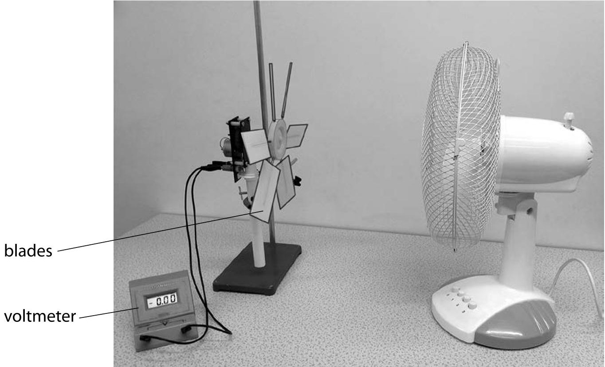

(a) The student decides to investigate how the angle of the blades of the wind turbine affects the voltage it generates.

State two control variables for this investigation.

(b) The student obtains the following results.

<table border="1"><tr><td>Blade angle/degree</td><td>Voltage/V</td></tr><tr><td>0</td><td>0.0</td></tr><tr><td>10</td><td>2.0</td></tr><tr><td>20</td><td>2.2</td></tr><tr><td>30</td><td>2.0</td></tr><tr><td>40</td><td>1.7</td></tr><tr><td>50</td><td>1.4</td></tr><tr><td>60</td><td>1.0</td></tr><tr><td>70</td><td>0.6</td></tr><tr><td>80</td><td>0.2</td></tr><tr><td>90</td><td>0.0</td></tr></table>

(i) Plot the student's results on the grid.

(3) 

(ii) Draw a curve of best fit on the graph.

(iii) Describe the relationship between the blade angle and the voltage.

(c) The student decides to change the investigation to see how the voltage is affected by the number of blades.

(i) State the type of graph the student should use to display the results.

(ii) Justify your choice of graph.

(Total for Question 6 = 11 marks)

7 The circuit shows a car battery charging from an alternating current (a.c.) supply.

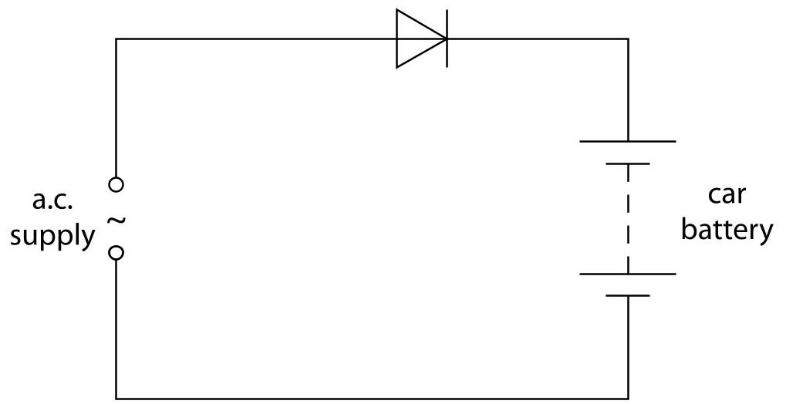

(a) Sketch a graph to show what is meant by a.c.

(b) State the reason why the circuit contains a diode.

(c) The 12V car battery is connected to two identical filament lamps so that the voltage across each lamp is 6.0V.

(i) Draw the circuit diagram.

(ii) State the equation relating power, current and voltage.

(iii) The power of each lamp is 330 mW Calculate the current in a lamp.

8 Sound travels as a wave.

(a) Which of these statements about sound waves is incorrect?

A they can be reflected

B they can travel through a vacuum

C they can be refracted

D they transfer energy

(b) Sound waves are a type of wave known as longitudinal waves.

(i) Name the other type of wave.

(ii) Give one example of this other type of wave.

(c) A buzzer produces a sound wave of frequency 2.9 kHz and wavelength 12 cm.

(i) State the equation relating wave speed, frequency and wavelength.

(ii) Calculate the speed of the sound wave.

(d) Two students investigate the Doppler effect by throwing a buzzer to each other.

Student A throws the buzzer to student B.

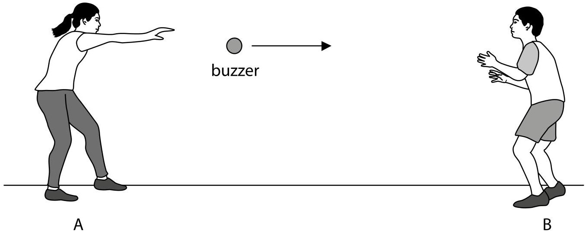

When the buzzer is thrown, student A notices that the sound produced changes.

Explain how the sound heard by student A changes.

You may include a diagram in your answer.

9 This is a question about nuclear energy.

(a) Nuclear fusion can take place between different isotopes of hydrogen to produce an isotope of helium.

(i) Complete the nuclear equation for this process.

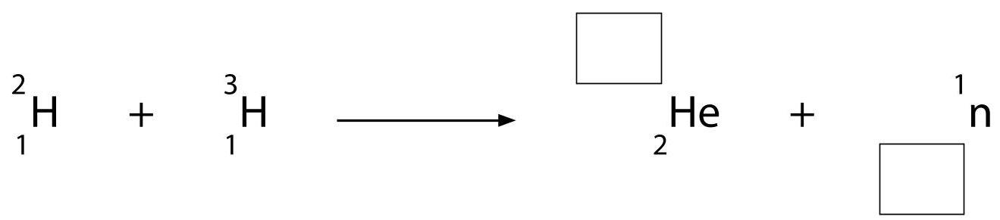

(ii) This process also results in the release of energy. State where the fusion process takes place naturally.

(iii) Explain why the isotopes of hydrogen must be heated to a very high temperature for fusion to take place.

(b) Nuclear fission also results in a release of energy.

Explain how nuclear fission differs from nuclear fusion.

(Total for Question 9 = 8 marks)

10 The International Space Station (ISS) is a satellite that orbits the Earth at a height of 409 km above the surface of the Earth.

The ISS has an orbital speed of 7.66 km/s and a period of 92.7 minutes.

(a) (i) Calculate the orbital radius of the ISS.

Give your answer to 3 significant figures.

(ii) Calculate the radius of the Earth using your value for the orbital radius.

(Total for Question 10 = 5 marks)

11 Main sequence stars can vary in brightness, colour and mass.

Describe the evolution of both low mass stars and high mass stars after they join the main sequence.

## (Total for Question 11 = 6 marks)

The adaptations help them to maintain a constant body temperature of 39 $ ^{\circ} \mathrm{C} $ Penguins also crowd together in groups of many penguins.

12 Penguins are adapted to survive in cold conditions.

(a) A student wants to investigate how the temperature of a penguin is affected when they crowd together in groups.

She uses this apparatus.

Each test tube represents a penguin.

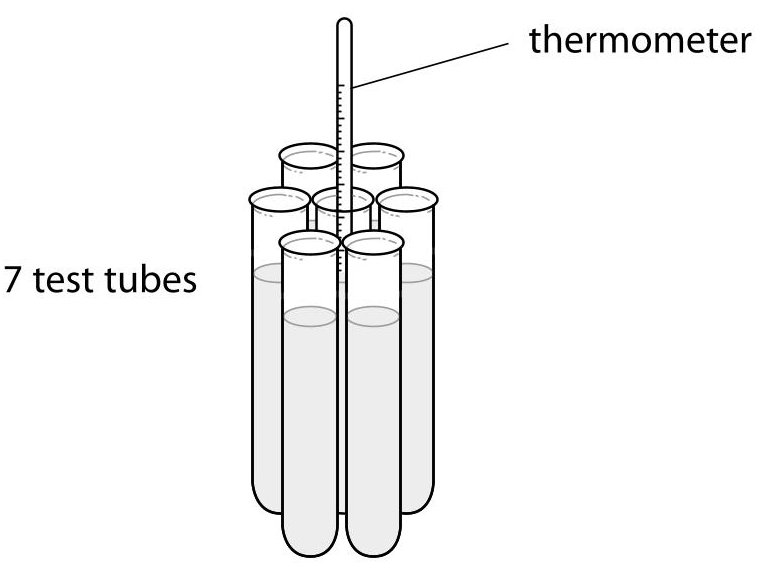

represents a huddle of 7 penguins

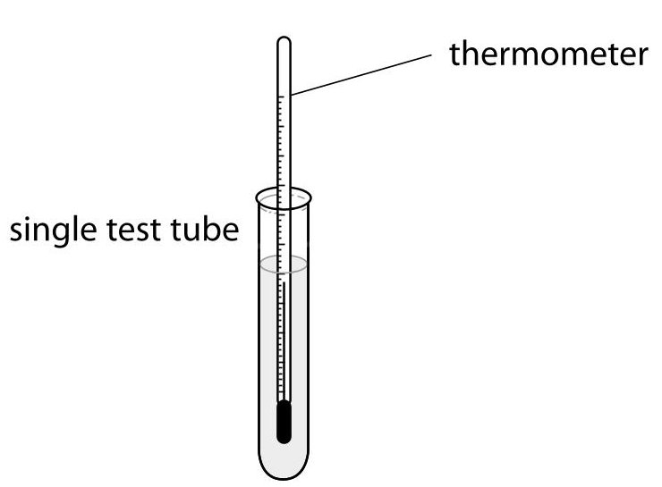

represents a single penguin

(i) These statements describe the method she should use.

The statements are in the wrong order.

Put them into the correct order by numbering the boxes.

Some have been done for you.

<table border="1"><tr><td>Statements</td><td>Order</td></tr><tr><td>record the data in a table</td><td>8</td></tr><tr><td>take the temperature of the two test tubes</td><td></td></tr><tr><td>tie 7 test tubes together</td><td>1</td></tr><tr><td>heat the water to 90℃</td><td>2</td></tr><tr><td>take the temperatures every minute</td><td></td></tr><tr><td>place equal volumes of water in all test tubes</td><td></td></tr><tr><td>put thermometers into the middle test tube and single test tube</td><td></td></tr><tr><td>record data for 15 minutes</td><td></td></tr></table>

(ii) The student draws a table to record her results.

Add suitable headings to her table.

<table border="1"><tr><td rowspan="2">Time/...</td><td colspan="2"></td></tr><tr><td>...</td><td>...</td></tr></table>

(iii) Predict how the temperature change for the single test tube will differ from the temperature change for the group of test tubes.

(iv) Draw a sketch graph of the results you predict the student will obtain. Label and use the axes below.

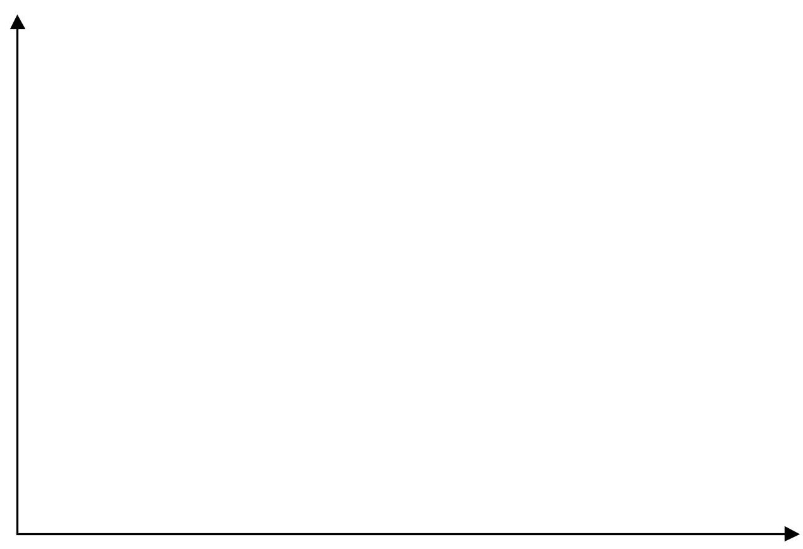

(v) Explain your prediction using ideas about thermal energy transfer.

(b) Here are two adaptations that help penguins to maintain a constant body temperature.

- Most of their bodies are covered with layers of fat.

- They have flat overlapping feathers.

Explain why these features help penguins to maintain a constant body temperature.

Layers of fat.

Flat overlapping feathers.

(Total for Question 12 = 16 marks)

TOTAL FOR PAPER = 110 MARKS