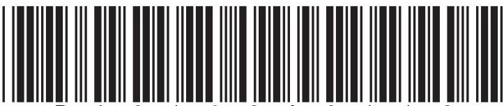
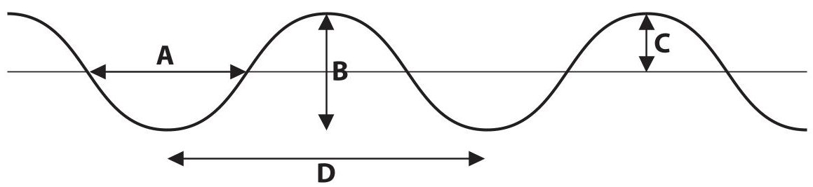
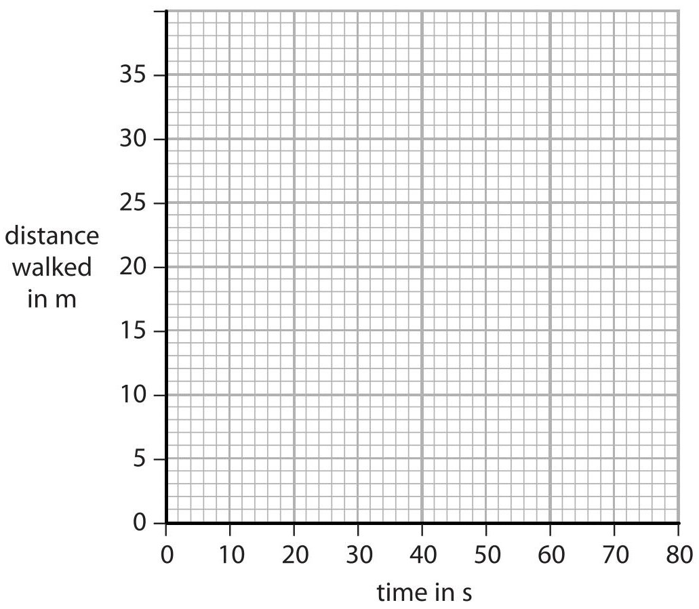
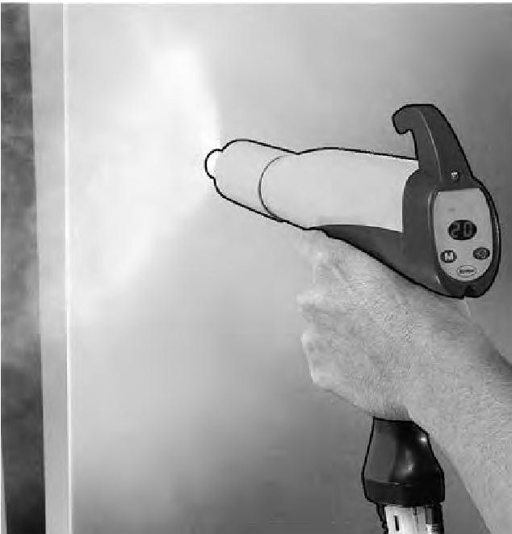
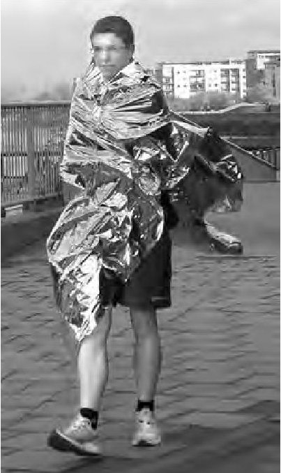
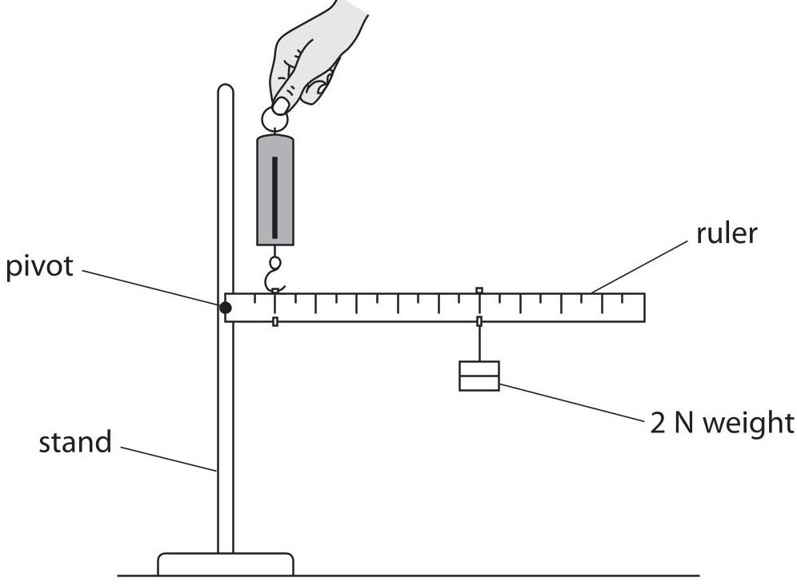
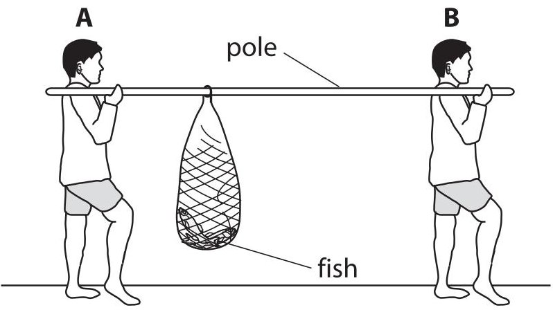
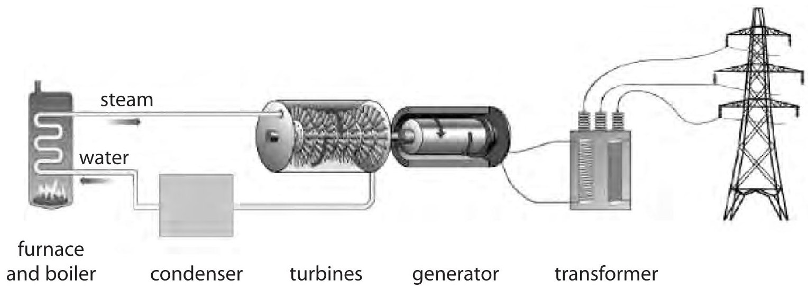
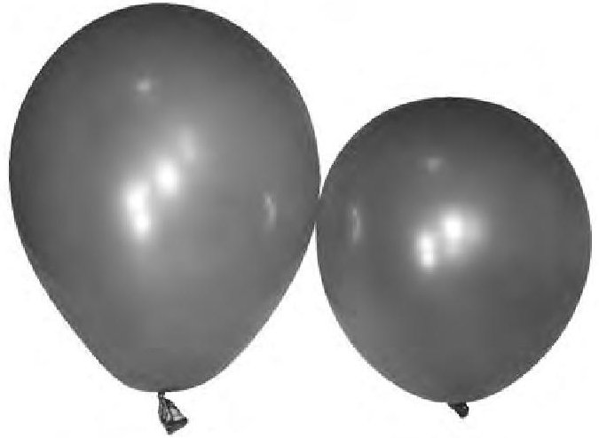
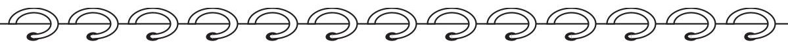

<table><tr><td colspan="3">Write your name here</td></tr><tr><td>Surname</td><td colspan="2">Other names</td></tr><tr><td>Edexcel International GCSE</td><td>Centre Number</td><td>Candidate Number</td></tr><tr><td colspan="3">Physics
Unit: 4PH0
Paper: 2P</td></tr><tr><td colspan="2">Wednesday 18 January 2012 – Morning
Time: 1 hour</td><td>Paper Reference
4PH0/2P</td></tr><tr><td colspan="2">Materials required for examination.
Ruler, calculator</td><td>Total Marks</td></tr></table>

## Instructions

- Use black ink or ball-point pen.

- Fill in the boxes at the top of this page with your name, centre number and candidate number.

- Answer all questions.

- Answer the questions in the spaces provided

- there may be more space than you need.

- Show all the steps in any calculations and state the units.

- Some questions must be answered with a cross in a box. If you change your mind about an answer, put a line through the box and then mark your new answer with a cross.

## Information

- The total mark for this paper is 60.

- The marks for each question are shown in brackets

- use this as a guide as to how much time to spend on each question.

## Advice

- Read each question carefully before you start to answer it.

- Keep an eye on the time.

- Write your answers neatly and in good English.

- Try to answer every question.

- Check your answers if you have time at the end.

## EQUATIONS

You may find the following equations useful.

$$
\mathrm {e n e r g y t r a n s f e r r e d} = \mathrm {c u r r e n t} \times \mathrm {v o l t a g e} \times \mathrm {t i m e}
$$

$$
E = I \times V \times t
$$

$$
\mathrm {p r e s s u r e} \times \mathrm {v o l u m e} = \mathrm {c o n s t a n t}
$$

$$
p _ {1} \times V _ {1} = p _ {2} \times V _ {2}
$$

$$
\mathrm {f r e q u e n c y} = \frac {1}{\mathrm {t i m e p e r i o d}}
$$

$$
f = \frac {1}{T}
$$

$$
\mathrm {p o w e r} = \frac {\mathrm {w o r k d o n e}}{\mathrm {t i m e t a k e n}}
$$

$$
P = \frac {W}{t}
$$

$$
\mathrm {p o w e r} = \frac {\mathrm {e n e r g y t r a n s f e r r e d}}{\mathrm {t i m e t a k e n}}
$$

$$
P = \frac {W}{t}
$$

$$
\mathrm {o r b i t a l s p e e d} = \frac {2 \pi \times \mathrm {o r b i t a l r a d i u s}}{\mathrm {t i m e p e r i o d}}
$$

$$
v = \frac {2 \times \pi \times r}{T}
$$

$$
\frac {\mathrm {p r e s s u r e}}{\mathrm {t e m p e r a t u r e}} = \mathrm {c o n s t a n t}
$$

$$
\frac {p _ {1}}{T _ {1}} = \frac {p _ {2}}{T _ {2}}
$$

$$
\mathrm {f o r c e} = \frac {\mathrm {c h a n g e i n m o m e n t u m}}{\mathrm {t i m e t a k e n}}
$$

Where necessary, assume the acceleration of free fall, $ g=1 0 \mathrm{~ m} / \mathrm{s}^{2}. $

## Answer ALL questions.

1 The diagram shows a wave on the sea.

(a) (i) Which letter shows the wavelength of the wave?

A

B

C

D

(ii) Which letter shows the amplitude of the wave?

(b) A man watches some waves pass his boat. He sees the crest of the waves pass him every 5 s. Calculate the frequency of these waves.

Frequency=

(Total for Question 1 = 4 marks)

2 Two students, Jenny and Cho, are investigating motion. Jenny walks in a straight line. Cho measures the distance Jenny has walked at 10 s intervals. (a) State two measuring instruments the students should use.

(b) The table shows their measurements.

<table border="1"><tr><td>Time in s</td><td>Distance walked in m</td></tr><tr><td>0</td><td>0</td></tr><tr><td>10</td><td>14</td></tr><tr><td>20</td><td>19</td></tr><tr><td>30</td><td>24</td></tr><tr><td>40</td><td>28</td></tr><tr><td>50</td><td>30</td></tr><tr><td>60</td><td>31</td></tr></table>

Draw a graph of distance against time for this data.

(c) How far had Jenny walked after 35 s?

(d) (i) Describe how Jenny's speed changed during the investigation.

(ii) What feature of the graph shows this change?

3 This question is about electrostatic charges.

(a) Complete the sentences using words from the box.

Each word may be used once, more than once or not at all.

(2) 

electrons

negative

neutral

neutrons

positive

protons

When a plastic rod is rubbed with a cloth, the plastic rod gains ...

After the plastic rod has been rubbed with the cloth, the plastic rod has a

charge.

(b) Electrostatic charges can be useful during paint spraying.

(i) The droplets of paint are given the same charge as they leave the sprayer. Explain why this is an advantage.

(ii) The droplets of paint are positively charged.

The object being painted is given a negative charge.

Explain why this is an advantage.

(c) Give one hazard caused by electrostatic charges and state how the risk from this hazard can be reduced.

(Total for Question 3 = 8 marks)

4 The picture shows a runner.

(a) As he runs, the runner gets hot.

To avoid overheating, his body sweats.

As the sweat evaporates, it cools his body.

Use ideas about particles to explain why evaporation leads to cooling.

(b) At the end of a long race, runners are given a shiny foil sheet to wear.

This stops them cooling down too quickly.

(i) Suggest why a runner might cool down too quickly if he does not wear a foil sheet.

(ii) Explain how the foil sheet reduces heat loss.

5 A student investigates the principle of moments.

He connects a ruler to a stand with a pivot.

He hangs a 2 N weight from the 60 cm mark on the ruler.

He uses a forcemeter to hold the ruler horizontal.

The scale on the forcemeter reads from 0 N to 10 N.

(a) How could the student check that the ruler is horizontal?

(b) (i) State the equation linking moment, force and distance from the pivot.

(ii) Calculate the moment of the 2 N weight. State the unit.

(c) The student holds the ruler horizontal with the forcemeter at the 10 cm mark. He expects the reading on the forcemeter to be 12 N. The actual reading is 10 N.

(i) Explain why the correct reading should be larger than 12 N.

(ii) Explain why the actual reading is only 10 N.

(d) A picture in the student's textbook shows two fishermen using a pole to carry some fish.

Fisherman A and fisherman B feel different forces on their shoulders. Use ideas about moments to explain why fisherman A feels the larger force.

6 The diagram shows a coal-fired power station.

(a) (i) In which part of the power station is heat energy usefully converted to kinetic energy?

A boiler

B turbine

C generator

D wires

(ii) In which part of the power station is kinetic energy usefully converted to electrical energy?

A boiler

B turbine

C generator

D wires

(b) A transformer is used to convert the 25 kV output from the power station to 115 kV.

(i) State the equation linking power, voltage and current.

(ii) Compare the input current and the output current of the transformer. Assume there are no energy losses in the transformer.

(iii) State one advantage of transmitting electricity at high voltages.

(c) Some power stations use uranium as a fuel.

Describe the problems that arise from the disposal of waste from this type of power station.

(Total for Question 6 = 11 marks)

7 A student blows up two balloons to the same size.

She puts one balloon into a freezer.

After a while, the student compares the two balloons.

The balloon that has been cooled is smaller.

(a) Use ideas about particles to explain why the cooled balloon is smaller.

(b) The student decides to investigate the link between temperature and the size of the balloon.

She writes a plan.

I will change the temperature of the balloon by putting it into a freezer.

To get a range of different temperatures I will put the balloon into the freezer for different times.

I will measure the temperature of the balloon using a thermometer.

To measure the size of the balloon I will take it out of the freezer and line it up next to a ruler.

To make sure it is a fair test I will repeat the experiment three times.

I will plot a graph of size against temperature.

There are several faults in the student's plan.

Identify three of these faults and suggest an improvement to correct each one.

(Total for Question 7 = 10 marks)

TOTAL FOR PAPER = 60 MARKS

## BLANK PAGE

