<table><tr><td colspan="3">Write your name here</td></tr><tr><td>Surname</td><td colspan="2">Other names</td></tr><tr><td>Edexcel Certificate</td><td>Centre Number</td><td>Candidate Number</td></tr><tr><td>Edexcel International GCSE</td><td></td><td></td></tr><tr><td colspan="3">Physics
Unit: KPH0/4PH0
Paper: 2P</td></tr><tr><td colspan="2">Wednesday 30 May 2012 – Afternoon
Time: 1 hour</td><td>Paper Reference
KPH0/2P
4PH0/2P</td></tr><tr><td colspan="3">Materials required for examination.
Ruler, calculator</td></tr><tr><td colspan="3">Total Marks</td></tr></table>

## Instructions

- Use black ink or ball-point pen.

- Fill in the boxes at the top of this page with your name, centre number and candidate number.

- Answer all questions.

- Answer the questions in the spaces provided

- there may be more space than you need.

- Show all the steps in any calculations and state the units.

- Some questions must be answered with a cross in a box. If you change your mind about an answer, put a line through the box and then mark your new answer with a cross.

## Information

- The total mark for this paper is 60.

- The marks for each question are shown in brackets

- use this as a guide as to how much time to spend on each question.

## Advice

- Read each question carefully before you start to answer it.

- Keep an eye on the time.

- Write your answers neatly and in good English.

- Try to answer every question.

- Check your answers if you have time at the end.

## EQUATIONS

You may find the following equations useful.

$$
\mathrm {e n e r g y t r a n s f e r r e d} = \mathrm {c u r r e n t} \times \mathrm {v o l t a g e} \times \mathrm {t i m e}
$$

$$
E = I \times V \times t
$$

$$
\mathrm {p r e s s u r e} \times \mathrm {v o l u m e} = \mathrm {c o n s t a n t}
$$

$$
p _ {1} \times V _ {1} = p _ {2} \times V _ {2}
$$

$$
\mathrm {f r e q u e n c y} = \frac {1}{\mathrm {t i m e p e r i o d}}
$$

$$
f = \frac {1}{T}
$$

$$
\mathrm {p o w e r} = \frac {\mathrm {w o r k d o n e}}{\mathrm {t i m e t a k e n}}
$$

$$
P = \frac {W}{t}
$$

$$
\mathrm {p o w e r} = \frac {\mathrm {e n e r g y t r a n s f e r r e d}}{\mathrm {t i m e t a k e n}}
$$

$$
P = \frac {W}{t}
$$

$$
\mathrm {o r b i t a l s p e e d} = \frac {2 \pi \times \mathrm {o r b i t a l r a d i u s}}{\mathrm {t i m e p e r i o d}}
$$

$$
v = \frac {2 \times \pi \times r}{T}
$$

$$
\frac {\mathrm {p r e s s u r e}}{\mathrm {t e m p e r a t u r e}} = \mathrm {c o n s t a n t}
$$

$$
\frac {p _ {1}}{T _ {1}} = \frac {p _ {2}}{T _ {2}}
$$

$$
\mathrm {f o r c e} = \frac {\mathrm {c h a n g e i n m o m e n t u m}}{\mathrm {t i m e t a k e n}}
$$

Where necessary, assume the acceleration of free fall, g = 10 m/s $ ^{2}. $

## Answer ALL questions.

1 The diagram shows the orbits of some objects in the Solar System.

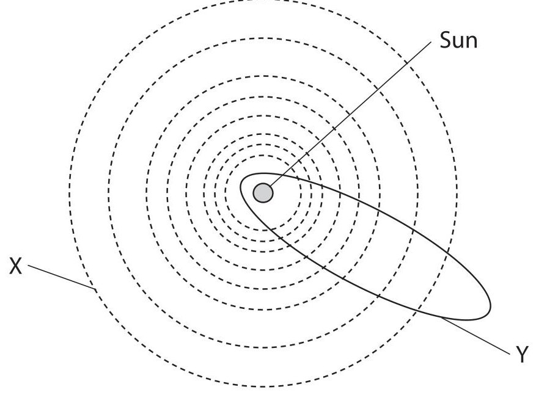

(a) (i) Path X is the orbit of a

A comet

B galaxy

C planet

D star

(ii) Path Y is the orbit of a

A comet

B galaxy

C planet

D star

(b) The objects are held in orbit by

A electrostatic force

B frictional force

C gravitational force

D magnetic force

(Total for Question 1 = 3 marks)

2 A microphone is connected to an oscilloscope to display a sound wave.

The diagram shows the trace on the oscilloscope screen.

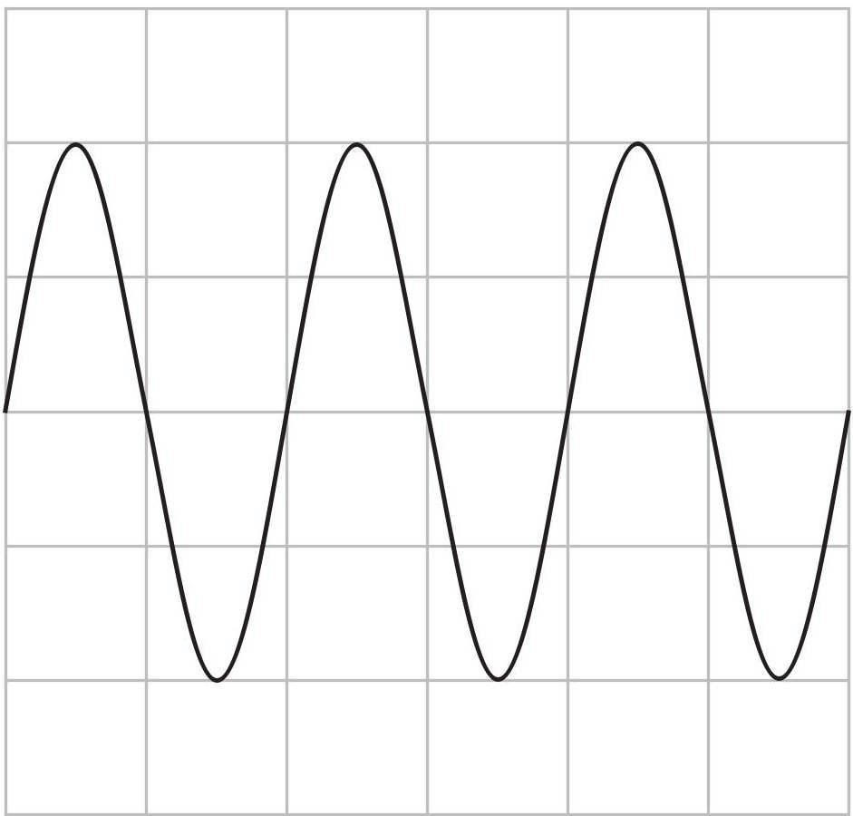

The oscilloscope settings are:

Y direction: 1 square=1 V

X direction: 1 square = 0.001 s

(a) (i) How many time periods are shown on the trace?

(ii) What is the frequency of the sound wave?

Frequency = ... Hz

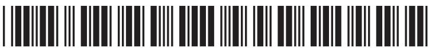

(b) On the grid below, sketch the trace of a sound wave with a smaller amplitude and a higher frequency than the wave shown by the dotted line.

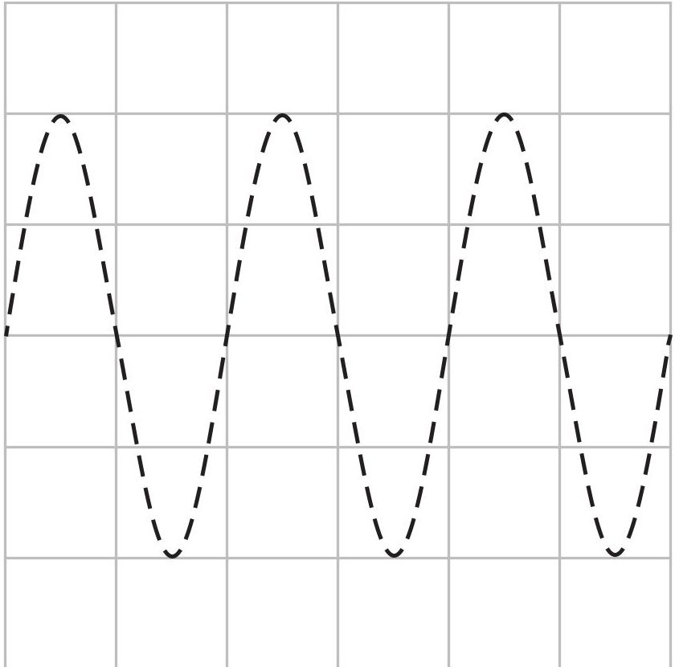

(Total for Question 2 = 5 marks)

3 (a) State what is meant by the term magnetic field line.

(b) The diagram shows a cross-section through a wire placed between two magnetic poles. The wire carries electric current into the page at X.

The shape of the magnetic field is shown.

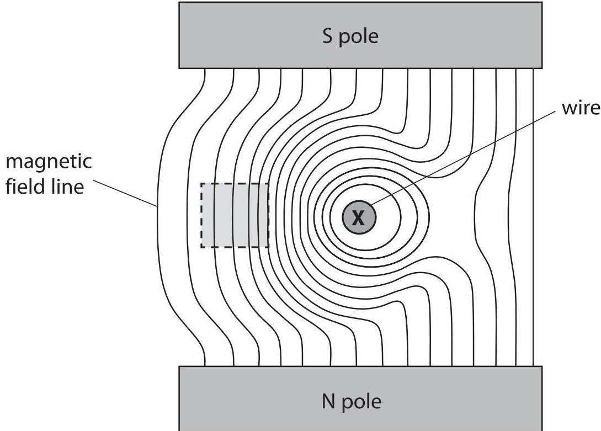

(i) Add arrows to any two lines to show the direction of the magnetic field.

(ii) Draw an arrow on the diagram to show the direction of the force on the wire. Label this arrow F.

(c) Describe the magnetic field in the region inside the dotted square.

(Total for Question 3 = 6 marks)

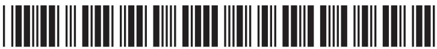

4 A student measures the diameter of a coin.

She uses the digital caliper shown in the photograph.

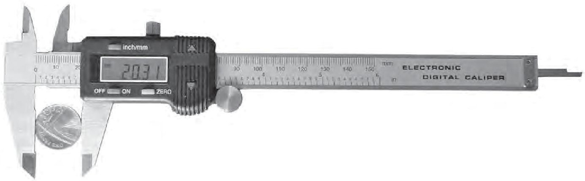

The digital caliper gives readings to the nearest 0.01 mm.

(a) The student measures the diameter of the coin eight times.

Her readings are shown below.

<table><tr><td>mm 20.31</td><td>mm 20.33</td></tr><tr><td>mm 20.35</td><td>mm 20.34</td></tr><tr><td>mm 20.44</td><td>mm 20.30</td></tr><tr><td>mm 20.33</td><td>mm 20.30</td></tr></table>

(i) Circle the anomalous reading.

(ii) Calculate the average diameter of the coin.

(b) The student wants to find the thickness of a coin.

She takes several similar coins and measures them together as shown.

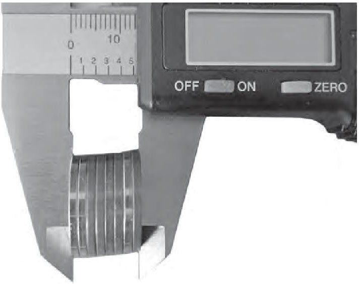

## She says:

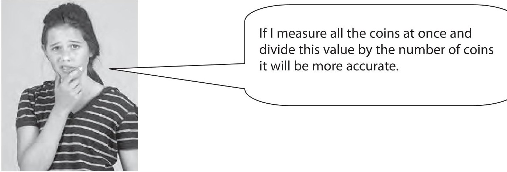

Do you agree with the student?

Explain why.

(2) 

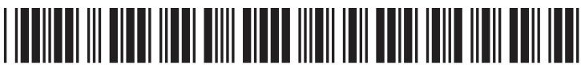

(c) The student wants to find the density of the coin.

She uses her values for the diameter and thickness of the coin to calculate its volume.

What else must she do to find the density of the coin?

(Total for Question 4 = 9 marks)

5 A student uses a rectangular glass block to determine the refractive index of glass. The diagram shows a ray of red light in air as it enters the glass block at P. The normal at P is shown as a dotted line.

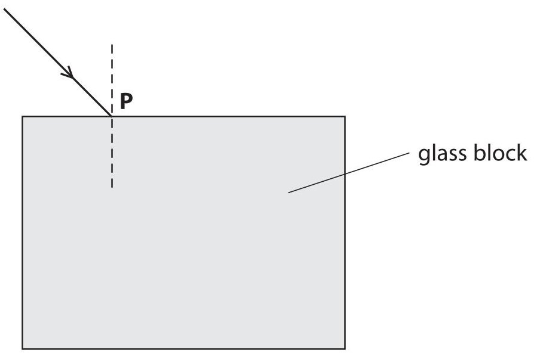

(a) Complete the diagram by

- drawing the ray that continues inside the block

- labelling the angle of incidence (i) and the angle of refraction (r)

- drawing the ray that leaves the block.

(b) The student measures values for the angle of incidence (i) and the angle of refraction (r).

<table border="1"><tr><td>i</td><td>60°</td></tr><tr><td>r</td><td>34°</td></tr><tr><td>sin i</td><td></td></tr><tr><td>sin r</td><td></td></tr></table>

(i) Complete the table by inserting values for sin i and sin r.

(ii) State the equation that links refractive index, angle of incidence (i) and angle of refraction (r).

(iii) Calculate the refractive index of the glass.

Refractive index =

(c) How should the student continue the investigation to obtain a more accurate value for the refractive index of glass?

(Total for Question 5 = 11 marks)

6 A washing machine has an electric motor and an electric heater.

The resistance of the heater is 22 $ \Omega. $

The mains voltage is 230 V.

(a) (i) State the equation linking voltage, current and resistance.

(ii) Show that the current in the heater is about 10 A when it is working.

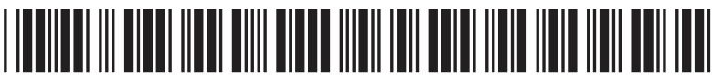

(b) The washing machine is fitted with a fuse rated at 13 A.

(i) Explain why the washing machine is fitted with a fuse.

(ii) When the motor is working, the current in it is 1.74 A.

Explain why it would not be sensible to replace the 13 A fuse with a 2 A fuse.

(Total for Question 6 = 7 marks)

7 Supermarkets use conveyer belts to move shopping at the till.

The diagram shows a carton of milk being pulled along by a horizontal conveyer belt.

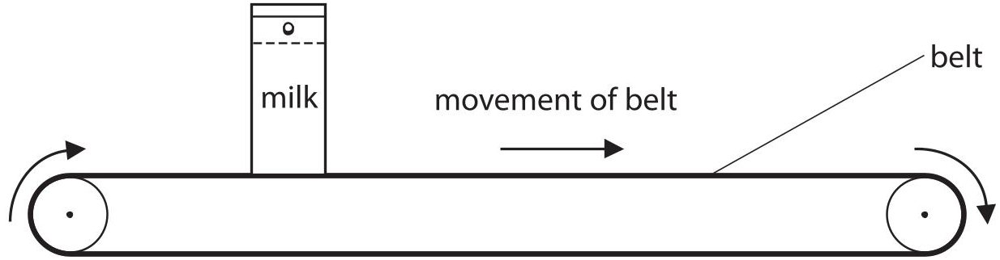

The horizontal force on the carton from the belt is 1.7 N.

The carton moves a distance of 0.46 m.

(a) (i) State the equation linking work done, force and distance.

(ii) Calculate the work done moving the carton.

Work done = ... J

(iii) State how much energy is transferred to the carton.

Energy transferred = ... J

(b) The belt stops suddenly and the carton falls over.

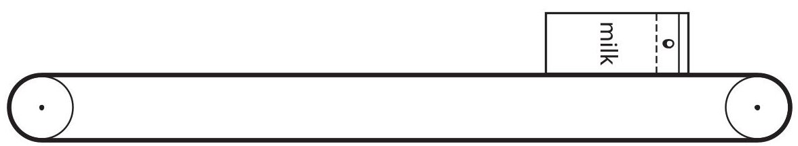

(i) How does this affect the kinetic energy of the carton?

(ii) Why does falling over reduce the gravitational potential energy of the carton?

(Total for Question 7 = 6 marks)

8 The table shows the nature of alpha and beta particles.

<table border="1"><tr><td>Particle</td><td>Nature</td></tr><tr><td>alpha</td><td>helium nucleus</td></tr><tr><td>beta</td><td>electron</td></tr></table>

Explain why alpha particles and beta particles have different penetrating powers.

(Total for Question 8 = 5 marks)

9 A student is playing a game with some empty tins.

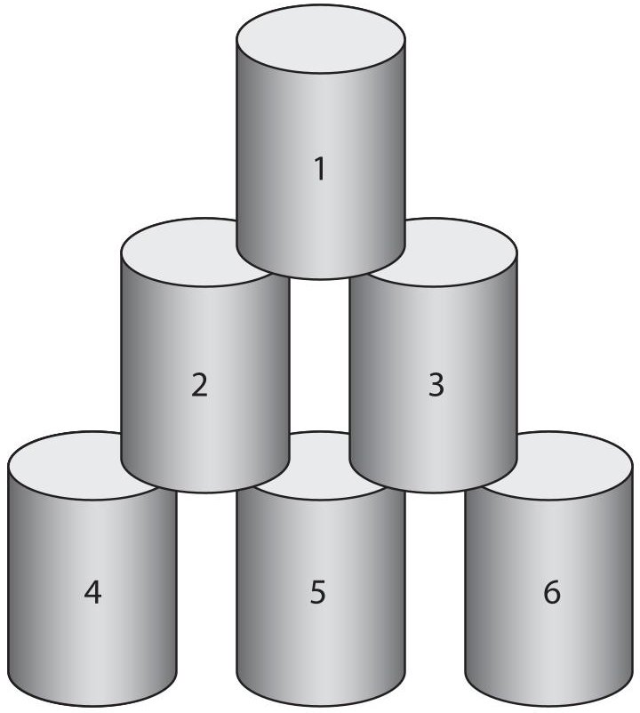

(a) He throws a wet cloth of mass 0.15 kg at the tins.

The wet cloth moves at a velocity of 6.0 m/s.

(i) State the equation linking momentum, mass and velocity.

(ii) Calculate the momentum of the wet cloth and give the unit.

(iii)The wet cloth sticks to tin 1.

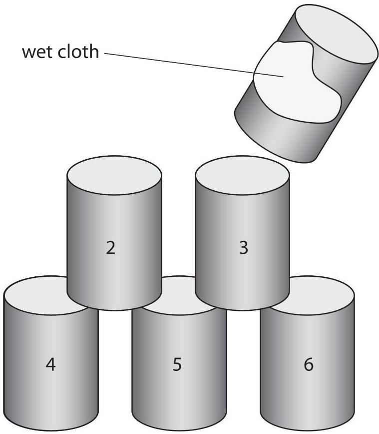

The mass of tin 1 is 0.050 kg.

The cloth and tin 1 move away together.

Calculate their velocity.

Velocity = ... m/s

(b) The student throws a bigger wet cloth at the remaining tins.

This wet cloth sticks to tins 2 and 3 and they move away together.

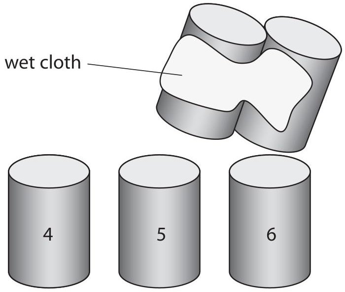

The student concludes

I threw the cloth the same way, so the velocity of tins 2 and 3 is the same as the velocity of tin 1.

Do you agree with this conclusion?

Explain why.

(Total for Question 9 = 8 marks)

TOTAL FOR PAPER=60 MARKS

## BLANK PAGE

