<table><tr><td colspan="2">Write your name here</td></tr><tr><td>Surname</td><td>Other names</td></tr><tr><td>Edexcel International GCSE</td><td>Centre Number Candidate Number</td></tr><tr><td colspan="2">Physics
Unit: 4PH0
Paper: 2PR</td></tr><tr><td>Wednesday 5 June 2013 – Afternoon
Time: 1 hour</td><td>Paper Reference
4PH0/2PR</td></tr><tr><td colspan="2">You must have:
Ruler, calculator</td><td>Total Marks</td></tr></table>

## Instructions

- Use black ink or ball-point pen.

- Fill in the boxes at the top of this page with your name, centre number and candidate number.

- Answer all questions.

- Answer the questions in the spaces provided

- there may be more space than you need.

- Show all the steps in any calculations and state the units.

- Some questions must be answered with a cross in a box. If you change your mind about an answer, put a line through the box and then mark your new answer with a cross.

## Information

- The total mark for this paper is 60.

- The marks for each question are shown in brackets

- use this as a guide as to how much time to spend on each question.

## Advice

- Read each question carefully before you start to answer it.

- Keep an eye on the time.

- Write your answers neatly and in good English.

- Try to answer every question.

- Check your answers if you have time at the end.

## EQUATIONS

You may find the following equations useful.

$$
\mathrm {e n e r g y t r a n s f e r r e d} = \mathrm {c u r r e n t} \times \mathrm {v o l t a g e} \times \mathrm {t i m e}
$$

$$
E = I \times V \times t
$$

$$
\mathrm {p r e s s u r e} \times \mathrm {v o l u m e} = \mathrm {c o n s t a n t}
$$

$$
p _ {1} \times V _ {1} = p _ {2} \times V _ {2}
$$

$$
\mathrm {f r e q u e n c y} = \frac {1}{\mathrm {t i m e p e r i o d}}
$$

$$
f = \frac {1}{T}
$$

$$
\mathrm {p o w e r} = \frac {\mathrm {w o r k d o n e}}{\mathrm {t i m e t a k e n}}
$$

$$
P = \frac {W}{t}
$$

$$
\mathrm {p o w e r} = \frac {\mathrm {e n e r g y t r a n s f e r r e d}}{\mathrm {t i m e t a k e n}}
$$

$$
P = \frac {W}{t}
$$

$$
\mathrm {o r b i t a l s p e e d} = \frac {2 \pi \times \mathrm {o r b i t a l r a d i u s}}{\mathrm {t i m e p e r i o d}}
$$

$$
v = \frac {2 \times \pi \times r}{T}
$$

$$
\frac {\mathrm {p r e s s u r e}}{\mathrm {t e m p e r a t u r e}} = \mathrm {c o n s t a n t}
$$

$$
\frac {p _ {1}}{T _ {1}} = \frac {p _ {2}}{T _ {2}}
$$

$$
\mathrm {f o r c e} = \frac {\mathrm {c h a n g e i n m o m e n t u m}}{\mathrm {t i m e t a k e n}}
$$

Where necessary, assume the acceleration of free fall, g = 10 m/s $ ^{2}. $

## Answer ALL questions.

1 These questions are about radioactivity.

(a) Which of these is measured in becquerel (Bq)?

A activity

B frequency

C half-life

D radiation

(b) Which of these has a mass (nucleon) number of 4?

A alpha particle

B beta particle

C gamma ray

D x-ray

(c) Which of these is the same as an electron?

A alpha particle

B beta particle

C gamma ray

D x-ray

(d) Which of these is the most ionising?

A alpha particle

B beta particle

C gamma ray

D x-ray

(Total for Question 1 = 4 marks)

2 (a) Which of these is a unit for the moment of a force?

(1) 

A N

B Nm

C N/m

D $ N / m^{2} $

(b) A painter sets up a uniform plank so he can paint a wall.

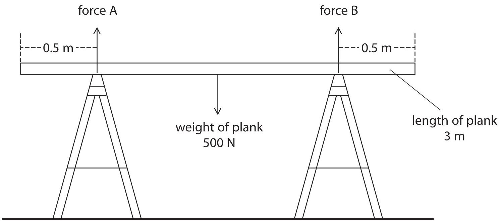

The plank is 3 m long and weighs 500 N.

(i) Use the principle of moments to show that the upward force A is 250 N.

(4) 

(ii) State the value of force B.

force B =...N

(c) The painter stands on the plank as shown.

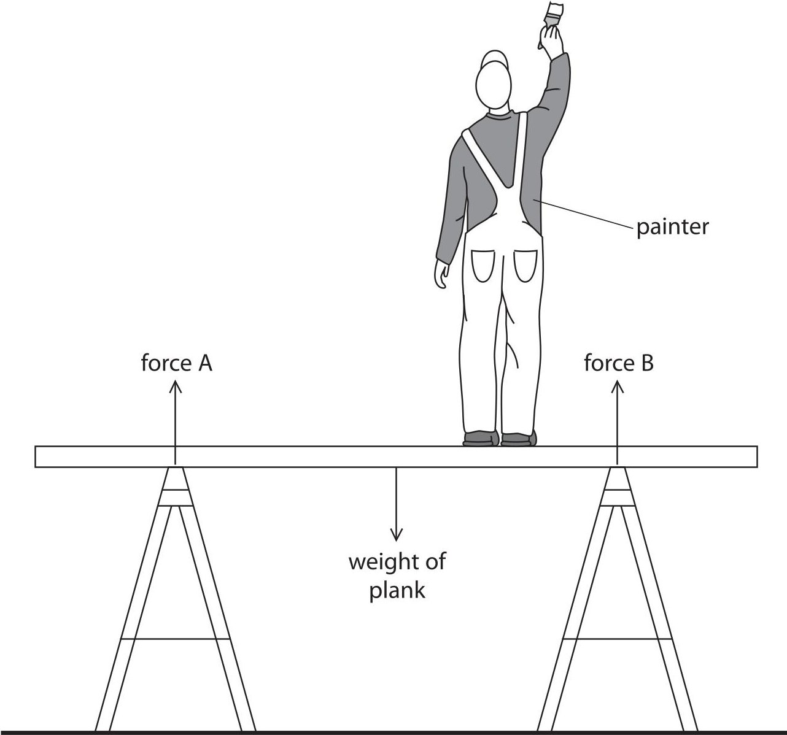

(i) Draw an arrow on the diagram to show the weight of the painter.

(ii) Describe the changes in forces A and B when the painter stands on the plank.

(Total for Question 2 = 9 marks)

3 A student investigates friction between a block of wood and different types of surface.

(a) The student uses the equipment shown in photograph A to measure the force needed to move the block of wood.

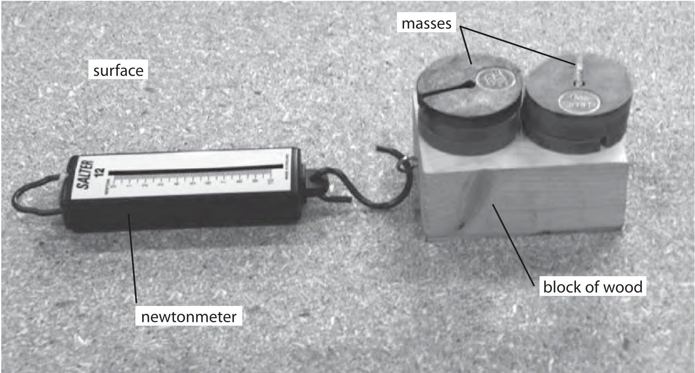

Photograph A

(i) Suggest why the student places masses on the block.

(ii) Explain why he keeps the masses constant during the experiment.

(b) The student investigates five different types of surface.

The table shows his results.

<table border="1"><tr><td></td><td colspan="3">Force in N</td></tr><tr><td>Type of surface</td><td>1st reading</td><td>2nd reading</td><td>Average</td></tr><tr><td>chipboard</td><td>3.0</td><td>3.0</td><td>3.0</td></tr><tr><td>wood</td><td>2.5</td><td>2.5</td><td>2.5</td></tr><tr><td>coarse sandpaper</td><td>4.7</td><td>4.3</td><td></td></tr><tr><td>fine sandpaper</td><td>5.6</td><td>5.8</td><td>5.7</td></tr><tr><td>ice</td><td>0.5</td><td>0.5</td><td>0.5</td></tr></table>

(i) Give an example of a non-continuous variable in this investigation.

(ii) Complete the table by inserting the missing average.

(iii) Display the average force results for this investigation on the grid.

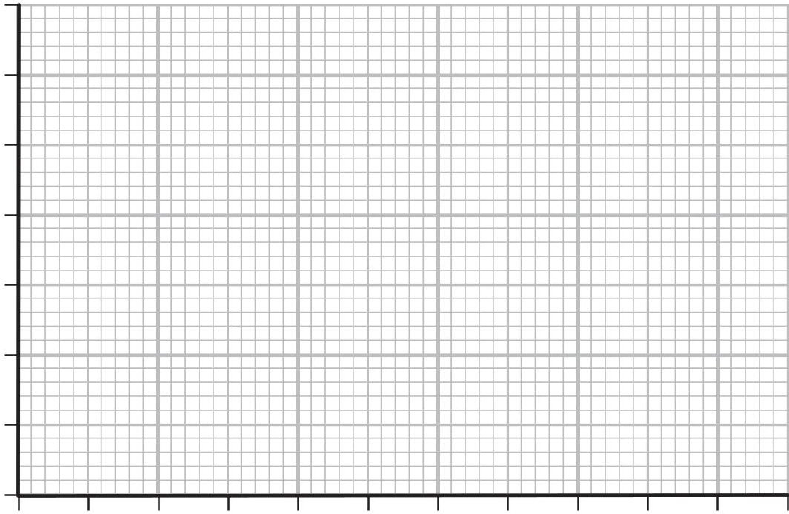

(c) The student compares his results with others in the class. He finds that they have different values for the forces. Suggest why.

(d) The student repeats the investigation using another block of wood as shown in photograph B.

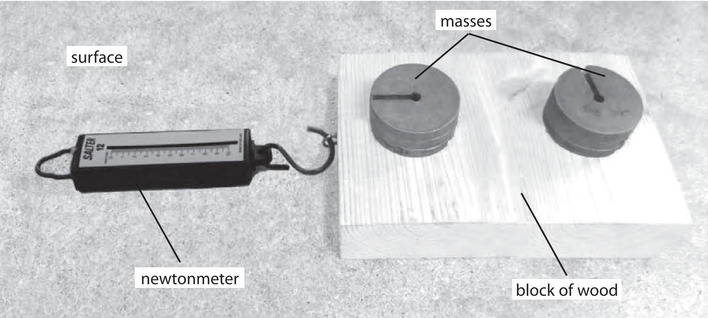

Photograph B

This block of wood has the same mass but a different area of contact.

Explain how this change affects the pressure on the surface.

(e) Suggest two ways in which the student could reduce friction between the two surfaces.

(Total for Question 3 = 14 marks)

4 This question is about static electricity.

(a) Which of these materials is an electrical conductor?

A paper

B plastic

C silver

wood D

(b) A forensic scientist uses an electrostatic dust print lifter (EDPL) to take impressions of footprints.

The diagram shows a simplified EDPL and a description of how it works.

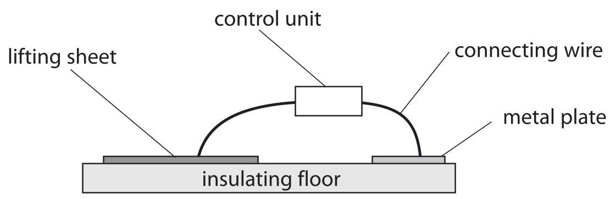

## This is how it works

A lifting sheet is placed over the footprint.

The metal plate is placed near it.

The control unit applies a voltage of 10 kV between the lifting sheet and the metal plate.

The lifting sheet becomes negatively charged and the metal plate becomes positively charged.

A dust print forms on the lower surface of the lifting sheet.

Use the idea of charge movement to explain how the lifting sheet becomes negatively charged and the metal plate becomes positively charged.

(c) The photograph shows a typical dust print on a lifting sheet.

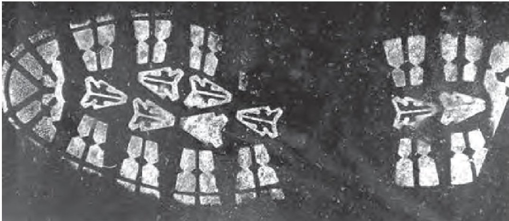

Suggest why dust particles are lifted off the floor on to the lifting sheet.

(d) This photograph shows a charged polythene rod placed next to a stream of water flowing from a tap.

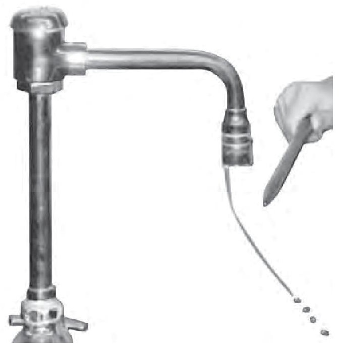

Suggest why the water is deflected.

(Total for Question 4 = 7 marks)

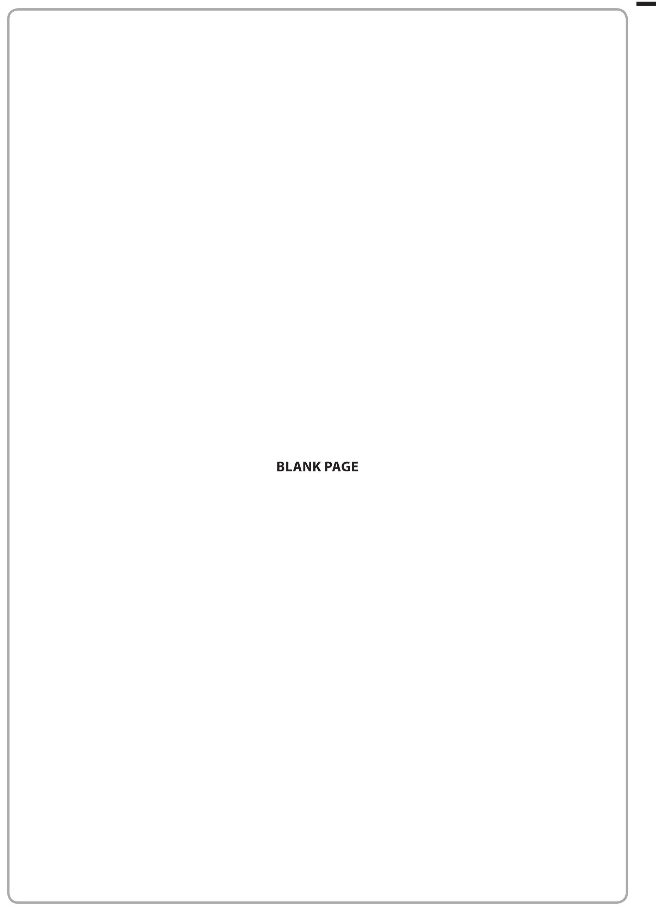

5 Some energy sources are renewable and other energy sources are non-renewable.

(a) (i) Explain what is meant by the term non-renewable.

(ii) Give an example of a non-renewable energy source.

(b) The photograph shows a wind farm that generates electricity for the National Grid.

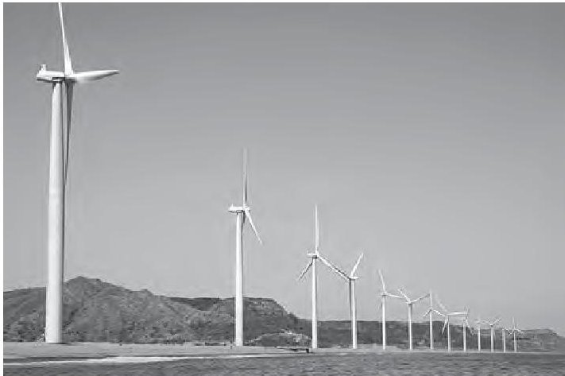

(i) Some wind farms are in remote areas.

Explain how the electrical energy from a remote wind farm is transmitted to large cities.

(ii) Some people think that wind farms are a good idea.

Others disagree.

Discuss the advantages and disadvantages of building more wind farms.

(Total for Question 5 = 11 marks)

6 Newton's Cradle consists of a set of identical solid metal balls hanging by threads from a frame so that they are in contact with each other.

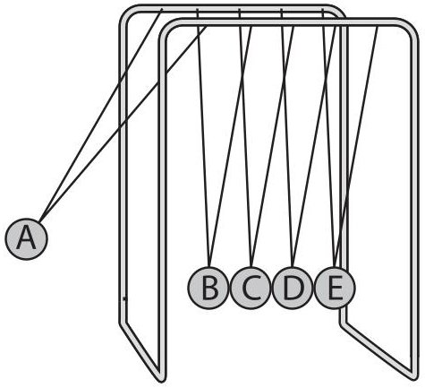

Newton's Cradle

(a) A student initially pulls ball A to the side as shown.

The student releases ball A and it collides with ball B.

(i) State the equation linking momentum, mass and velocity.

(ii) Each ball has a mass of 100 g.

At the time of collision, ball A has a velocity of 3m/s.

Calculate the momentum of ball A at the time of impact and give the unit.

momentum unit

(iii) After the collision, ball A stops.

Ball E moves away.

The other balls remain still.

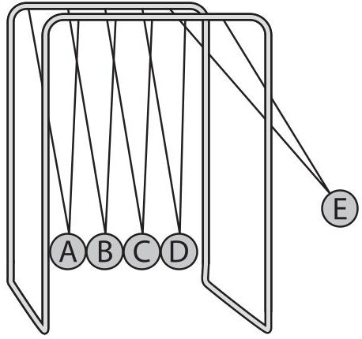

The momentum of ball E as it moves away is the same as the momentum of ball A at the time of impact.

Give the reason for this.

(b) The student then releases balls A and B together as shown below.

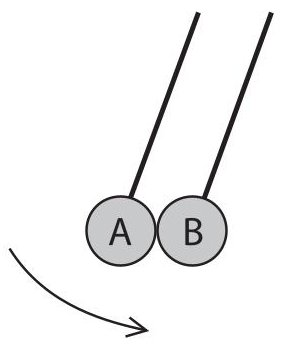

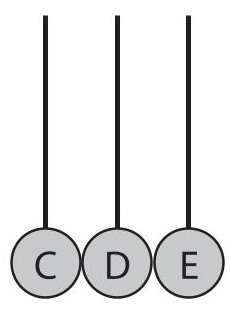

Predict what will happen to the other balls after the collision and give a reason for your answer.

(Total for Question 6 = 7 marks)

7 Some waves travel across the sea. They all have the same wavelength.

(a) What is meant by the term wavelength?

(b) The waves travel across the sea at 3.0 m/s and have a frequency of 1.5 Hz.

(i) State the equation linking wave speed, frequency and wavelength.

(ii) Calculate the wavelength of the waves.

wavelength m

(c) This photograph was taken from an aeroplane. It shows a sea defence, with a gap in the sea wall.

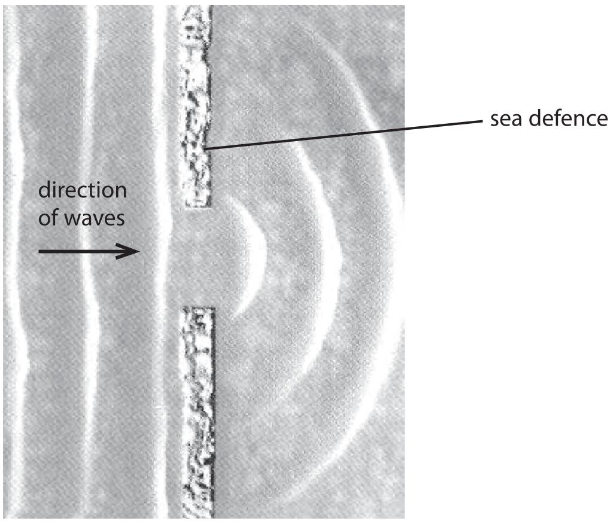

Parallel waves pass through the sea defence at the gap in the sea wall, making the curved pattern shown in the photograph.

(i) Explain how this wave pattern is produced.

(ii) Explain why light waves do not make a similar pattern as they pass through the same gap.

(Total for Question 7 = 8 marks)

TOTAL FOR PAPER=60 MARKS

## BLANK PAGE

