<table><tr><td colspan="2">Write your name here</td></tr><tr><td>Surname</td><td>Other names</td></tr><tr><td>Pearson Edexcel Certificate
Pearson Edexcel
International GCSE</td><td>Centre Number
Candidate Number</td></tr><tr><td colspan="2">Physics
Unit: KPH0/4PH0
Paper: 2P</td></tr><tr><td colspan="2">Thursday 12 June 2014 – Morning
Time: 1 hour</td><td>Paper Reference
KPH0/2P
4PH0/2P</td></tr><tr><td colspan="2">You must have:
Ruler, calculator</td><td>Total Marks</td></tr></table>

## Instructions

- Use black ink or ball-point pen.

- Fill in the boxes at the top of this page with your name, centre number and candidate number.

- Answer all questions.

- Answer the questions in the spaces provided

- there may be more space than you need.

- Show all the steps in any calculations and state the units.

- Some questions must be answered with a cross in a box. If you change your mind about an answer, put a line through the box and then mark your new answer with a cross.

## Information

- The total mark for this paper is 60.

- The marks for each question are shown in brackets

- use this as a guide as to how much time to spend on each question.

## Advice

- Read each question carefully before you start to answer it.

- Keep an eye on the time.

- Write your answers neatly and in good English.

- Try to answer every question.

- Check your answers if you have time at the end.

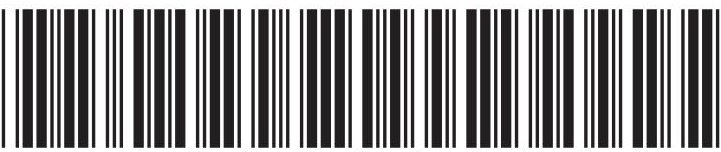

## EQUATIONS

You may find the following equations useful.

$$
\mathrm {e n e r g y t r a n s f e r r e d} = \mathrm {c u r r e n t} \times \mathrm {v o l t a g e} \times \mathrm {t i m e}
$$

$$
E = I \times V \times t
$$

$$
\mathrm {p r e s s u r e} \times \mathrm {v o l u m e} = \mathrm {c o n s t a n t}
$$

$$
p _ {1} \times V _ {1} = p _ {2} \times V _ {2}
$$

$$
f r e q u e n c y = \frac {1}{t i m e p e r i o d}
$$

$$
f = \frac {1}{T}
$$

$$
\mathrm {p o w e r} = \frac {\mathrm {w o r k d o n e}}{\mathrm {t i m e t a k e n}}
$$

$$
P = \frac {W}{t}
$$

$$
\mathrm {p o w e r} = \frac {\mathrm {e n e r g y t r a n s f e r r e d}}{\mathrm {t i m e t a k e n}}
$$

$$
P = \frac {W}{t}
$$

$$
\mathrm {o r b i t a l s p e e d} = \frac {2 \pi \times \mathrm {o r b i t a l r a d i u s}}{\mathrm {t i m e p e r i o d}}
$$

$$
v = \frac {2 \times \pi \times r}{T}
$$

$$
\frac {\mathrm {p r e s s u r e}}{\mathrm {t e m p e r a t u r e}} = \mathrm {c o n s t a n t}
$$

$$
\frac {p _ {1}}{T _ {1}} = \frac {p _ {2}}{T _ {2}}
$$

$$
\mathrm {f o r c e} = \frac {\mathrm {c h a n g e i n m o m e n t u m}}{\mathrm {t i m e t a k e n}}
$$

Where necessary, assume the acceleration of free fall, g = 10 m/s $ ^{2} $

## Answer ALL questions.

1 A student investigates ice, water and steam.

She heats up a sample of ice.

When it has all melted, she carries on heating until the water has all boiled to steam.

(a) Complete the diagram to show how the particles are arranged in ice, water and steam. One particle in each box has been drawn for you.

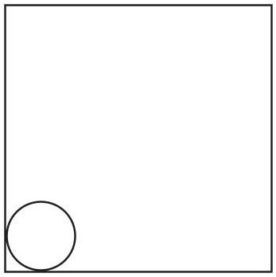

ice

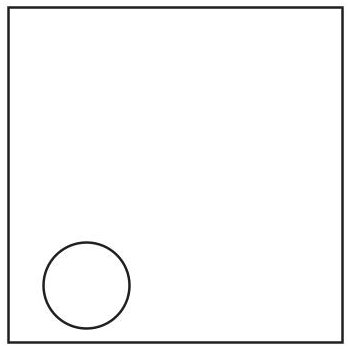

water

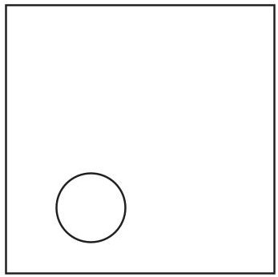

steam

(b) Complete the table by describing how the particles move in ice, water and steam.

(3) 

<table border="1"><tr><td>Substance</td><td>How the particles move</td></tr><tr><td>ice</td><td></td></tr><tr><td>water</td><td></td></tr><tr><td>steam</td><td></td></tr></table>

(Total for Question 1 = 7 marks)

2 When a plastic rod is rubbed with a cloth,the rod gains charge.

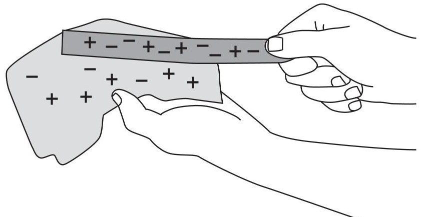

(a) How could you show that the plastic rod gains charge?

(b) Explain how the plastic rod gains charge when it is rubbed.

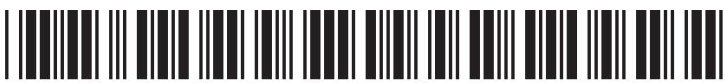

(c) There are two types of charge.

Describe how you could demonstrate this using different insulating rods and a cloth.

In your answer, you should name any other equipment you would use.

(Total for Question 2 = 6 marks)

3 Some quantities are vectors, others are scalars.

(a) Complete the table ticking the boxes to show which quantities are vectors and which are scalars.

One has been done for you.

<table border="1"><tr><td>Quantity</td><td>Vector</td><td>Scalar</td></tr><tr><td>distance</td><td></td><td></td></tr><tr><td>force</td><td></td><td></td></tr><tr><td>momentum</td><td>√</td><td></td></tr><tr><td>speed</td><td></td><td></td></tr><tr><td>velocity</td><td></td><td></td></tr></table>

(b) A car travels at 20 m/s.

The mass of the car is 1500 kg.

(i) State the equation linking momentum, mass and velocity.

(ii) Calculate the momentum of the car.

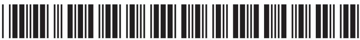

(c) In a crash test, a car runs into a wall and stops.

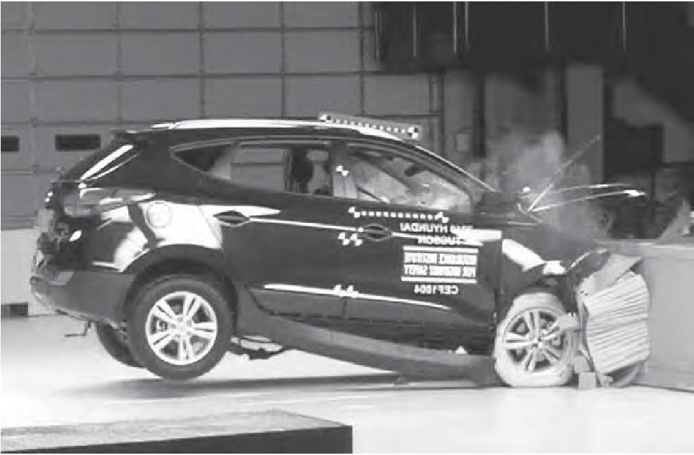

(Author: Brady Holt, 2010)

The momentum of the car before the crash is 22500 kg m/s.

The car stops in 0.14 s.

(i) Calculate the average force on the car during the crash.

$$
a v e r a g e f o r c e =
$$

(ii) Use ideas about momentum to explain how seat belts can reduce injuries to passengers during a crash.

(Total for Question 3 = 10 marks)

4 Use the following information to help you answer the questions.

## The gold foil experiment

Scientists used to think that electrons were spread out through a positively charged atom.

They called this the 'plum pudding' model.

To test this idea, scientists aimed alpha particles at thin gold foil. They expected the alpha particles to pass straight through.

The results showed that almost all the alpha particles did pass straight through, but a few did not. About 1 in every 8000 was deflected away at a very large angle.

It was these 'anomalous' results that led to a new understanding of the atom.

(a) What was the prediction in this experiment?

(b) (i) What do scientists mean by anomalous results?

(ii) How should scientists deal with anomalous results?

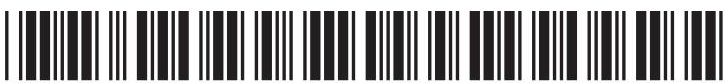

(c) Explain how these anomalous results led to the idea of a positive charge at the centre of an atom.

(d) Give two reasons why it is important to carry out experiments in physics.

(Total for Question 4 = 7 marks)

5 A signal generator produces sounds from a loudspeaker.

(a) (i) Which property of the sound wave should be increased in order to make the sound louder?

A amplitude

B frequency

C speed

D wavelength

(ii) Which property of the sound wave should be increased in order to make a higher pitched sound?

A amplitude

B frequency

D wavelength

C speed

(b) Sound waves travel as longitudinal waves.

Other waves are transverse.

(i) Give an example of a transverse wave.

(ii) Describe how the vibrations of longitudinal waves and transverse waves differ.

(Total for Question 5 = 5 marks)

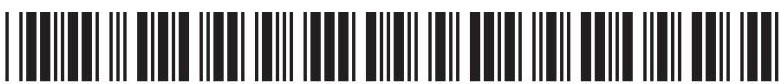

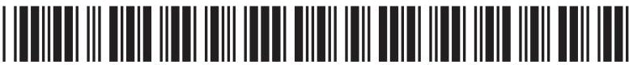

6 A student investigates refraction using a glass block.

She wants to find the refractive index of the glass.

She sends rays of light into the block at different angles and measures the angle of incidence and the angle of refraction.

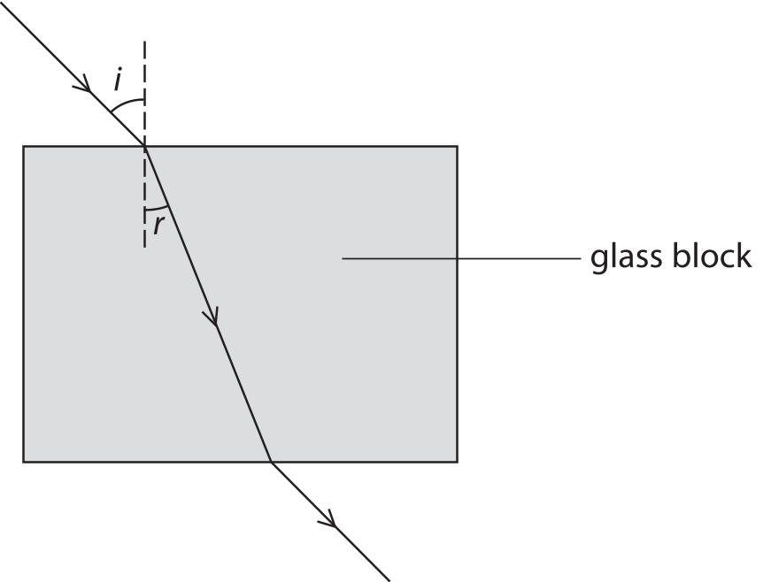

The table shows her results.

<table border="1"><tr><td>Angle of incidence,i</td><td>Angle of refraction,r</td><td>sin i</td><td>sin r</td></tr><tr><td>0°</td><td>0°</td><td>0.00</td><td>0.00</td></tr><tr><td>15°</td><td>10°</td><td>0.26</td><td>0.17</td></tr><tr><td>25°</td><td>16°</td><td>0.42</td><td></td></tr><tr><td>35°</td><td>22°</td><td>0.57</td><td></td></tr><tr><td>45°</td><td>28°</td><td>0.71</td><td>0.47</td></tr></table>

(a) (i) Complete the table by calculating the missing values of sin r.

(1) 

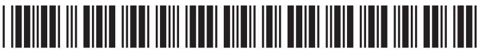

(ii) Draw a graph of sin i (y-axis) against sin r (x-axis).

(iii) Use your graph to find the refractive index of the glass.

(b) Suggest two reasons why using a graph to find the refractive index is a better method than simply calculating it using a pair of angles from the table.

(Total for Question 6 = 10 marks)

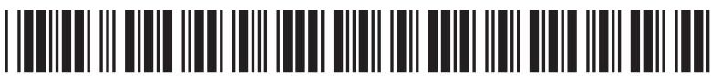

## BLANK PAGE

7 The diagram shows a transformer that is 100% efficient.

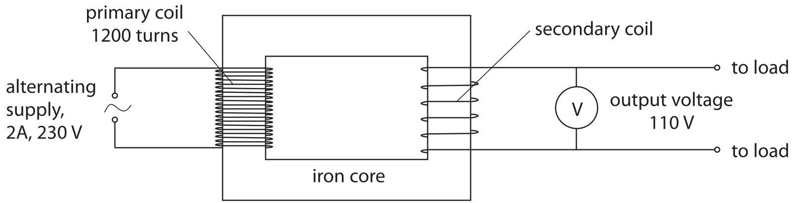

(a) (i) State the equation linking input power and output power for the transformer.

(ii) Calculate the output current of the transformer.

output current=

(b) (i) State the equation linking input voltage, output voltage and turns ratio for the transformer.

(ii) Calculate the number of turns on the secondary coil of the transformer.

number of turns=

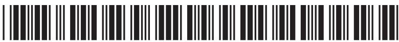

(c) Explain how a transformer works.

In your answer, you should include the reasons for using

- two coils

- an iron core

- an alternating supply

(Total for Question 7 = 11 marks)

8 An energy company plans to build a new power station.

The company must decide between two renewable energy projects, a geothermal power station or a solar power station.

Geothermal power station

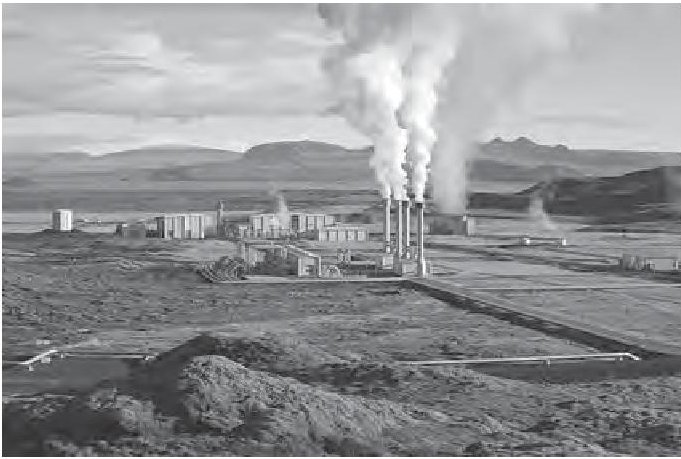

(Author: Gretar Ivarsson, geologist at Nesjavellir, 2006)

Solar power station

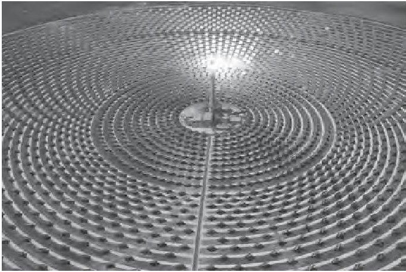

(Author: Torresol Energy, 2011)

Explain how the location and the climate might affect the type of power station that the company chooses.

location

(Total for Question 8 = 4 marks)

TOTAL FOR PAPER=60 MARKS

## BLANK PAGE

## BLANK PAGE

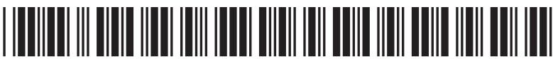
