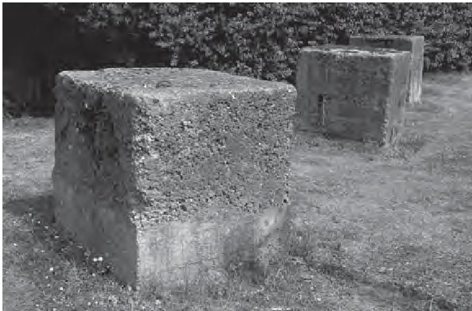
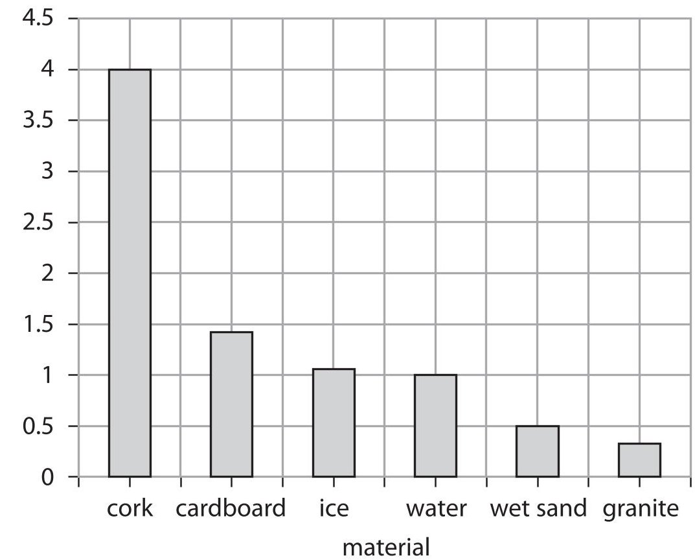
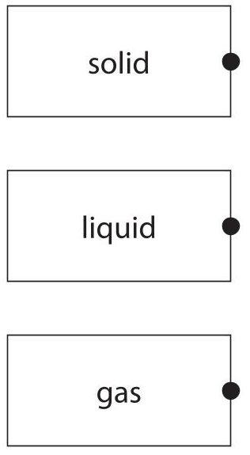
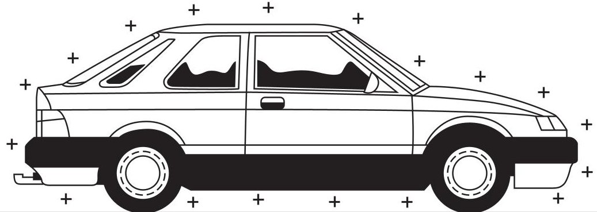
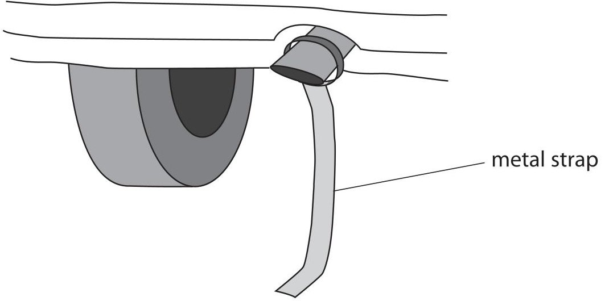
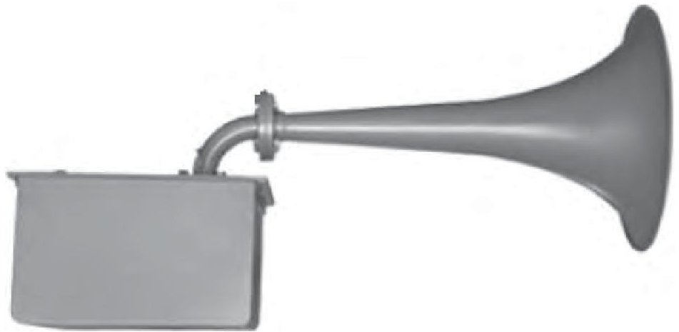
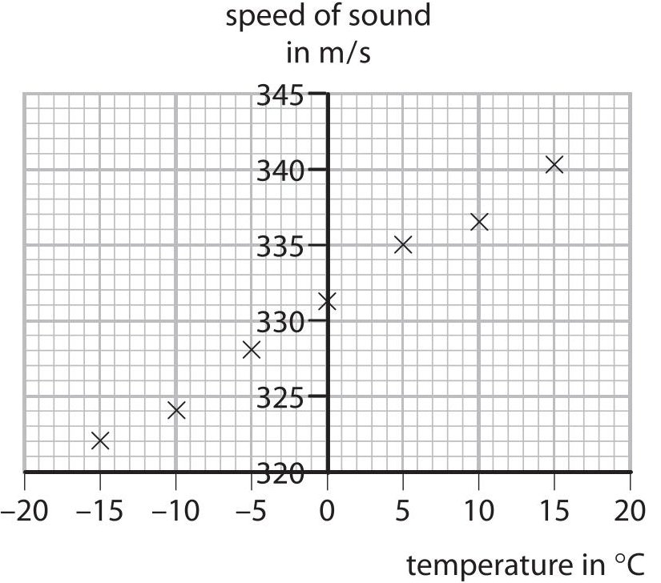
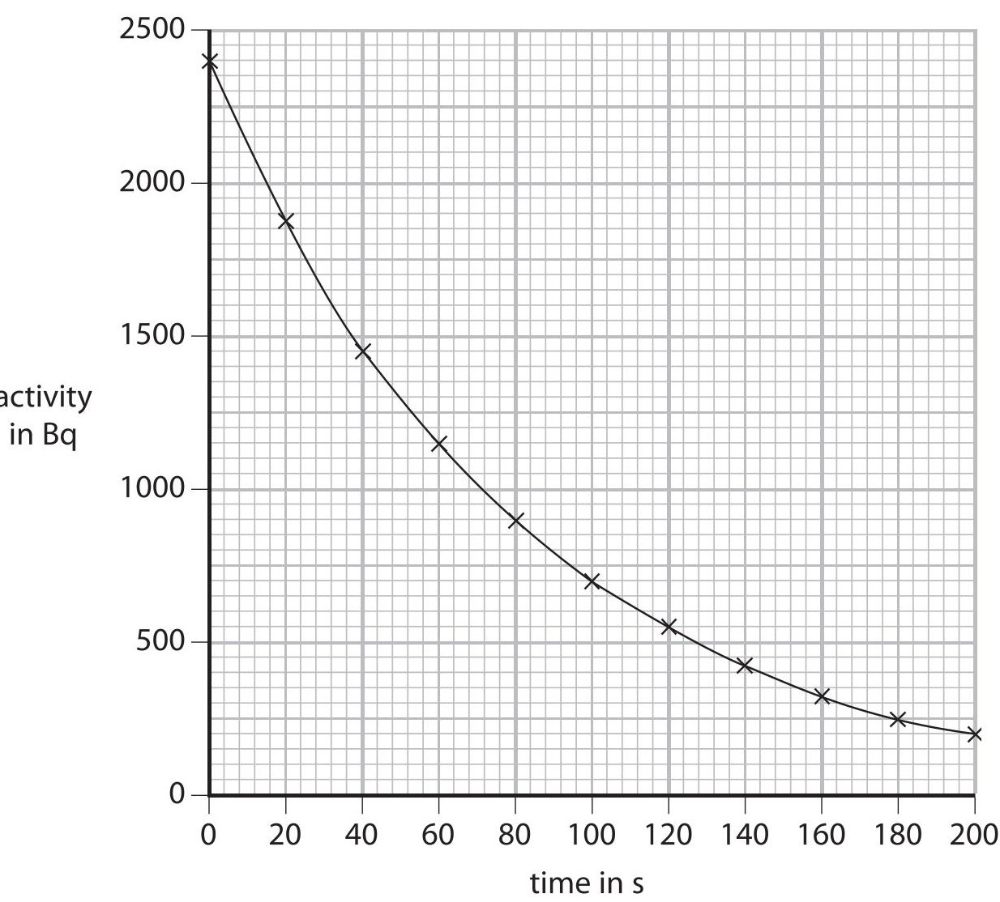
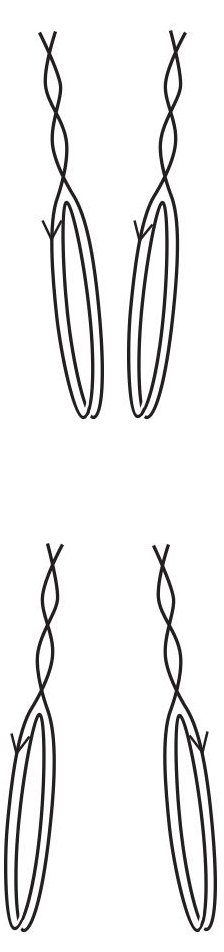
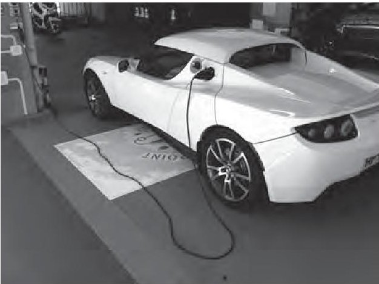

<table><tr><td colspan="3">Write your name here</td></tr><tr><td>Surname</td><td colspan="2">Other names</td></tr><tr><td>Pearson Edexcel Certificate</td><td>Centre Number</td><td>Candidate Number</td></tr><tr><td>Pearson Edexcel International GCSE</td><td></td><td></td></tr><tr><td colspan="3">Physics
Unit: KPH0/4PH0
Paper: 2P</td></tr><tr><td colspan="2">Monday 25 January 2016 – Afternoon
Time: 1 hour</td><td>Paper Reference
KPH0/2P
4PH0/2P</td></tr><tr><td colspan="3">You must have:
Ruler, calculator</td></tr><tr><td colspan="3">Total Marks</td></tr></table>

## Instructions

- Use black ink or ball-point pen.

- Fill in the boxes at the top of this page with your name, centre number and candidate number.

- Answer all questions.

- Answer the questions in the spaces provided

- there may be more space than you need.

- Show all the steps in any calculations and state the units.

- Some questions must be answered with a cross in a box. If you change your mind about an answer, put a line through the box and then mark your new answer with a cross.

## Information

- The total mark for this paper is 60.

- The marks for each question are shown in brackets

- use this as a guide as to how much time to spend on each question.

## Advice

- Read each question carefully before you start to answer it.

- Write your answers neatly and in good English.

- Try to answer every question.

- Check your answers if you have time at the end.

## EQUATIONS

You may find the following equations useful.

$$
\mathrm {e n e r g y t r a n s f e r r e d} = \mathrm {c u r r e n t} \times \mathrm {v o l t a g e} \times \mathrm {t i m e}
$$

$$
E = I \times V \times t
$$

$$
\mathrm {p r e s s u r e} \times \mathrm {v o l u m e} = \mathrm {c o n s t a n t}
$$

$$
p _ {1} \times V _ {1} = p _ {2} \times V _ {2}
$$

$$
f r e q u e n c y = \frac {1}{t i m e p e r i o d}
$$

$$
f = \frac {1}{T}
$$

$$
\mathrm {p o w e r} = \frac {\mathrm {w o r k d o n e}}{\mathrm {t i m e t a k e n}}
$$

$$
P = \frac {W}{t}
$$

$$
\mathrm {p o w e r} = \frac {\mathrm {e n e r g y t r a n s f e r r e d}}{\mathrm {t i m e t a k e n}}
$$

$$
P = \frac {W}{t}
$$

$$
\mathrm {o r b i t a l s p e e d} = \frac {2 \pi \times \mathrm {o r b i t a l r a d i u s}}{\mathrm {t i m e p e r i o d}}
$$

$$
v = \frac {2 \times \pi \times r}{T}
$$

$$
\frac {\mathrm {p r e s s u r e}}{\mathrm {t e m p e r a t u r e}} = \mathrm {c o n s t a n t}
$$

$$
\frac {p _ {1}}{T _ {1}} = \frac {p _ {2}}{T _ {2}}
$$

$$
\mathrm {f o r c e} = \frac {\mathrm {c h a n g e i n m o m e n t u m}}{\mathrm {t i m e t a k e n}}
$$

Where necessary, assume the acceleration of free fall, g=10 m/s $ ^{2}. $

## Answer ALL questions.

(a) Which of these is a vector quantity?

A density

B force

C mass

D speed

(b) Which of these is a scalar quantity?

A acceleration

B energy

C momentum

D velocity

(c) When a book from a low shelf is placed on a higher shelf, the book gains

A gravitational potential energy

B mass

C weight

D work

(d) When an object falls at terminal velocity

A it accelerates at $ 1 0 \mathrm{m} / \mathrm{s}^{2} $

B it has no weight

C the resultant vertical force is downwards

D the vertical forces on it are balanced

(Total for Question 1 = 4 marks)

2 The photograph shows some large concrete cubes.

The mass of one of the concrete cubes is 1000 kg.

(a) State the weight of this concrete cube.

Give the unit.

$$
\mathrm {w e i g h t o f c o n c r e t e c u b e} =
$$

(b) The density of this concrete cube is $ 2 3 0 0 \mathrm{k g} / \mathrm{m}^{3}. $

(i) State the equation linking density, mass and volume.

(ii) Calculate the volume of this concrete cube.

volume of concrete cube =

(c) The graph shows the volumes of 1000 kg of some other materials.

(i) State the type of graph shown.

(ii) Give a reason why a line graph is not an appropriate way to display this data.

(iii) Use information from the graph to compare the densities of cork and water.

3 The particles in the different states of matter behave differently.

(a) Draw a straight line linking each state of matter with the description of its particles.

state of matter

description of particles

- close together, moving about and can slide past one another

far apart, moving quickly and at random

close together, vibrating about fixed positions

(b) Ethyne is a substance that is a gas at room temperature.

At a temperature of $ - 8 1^{\circ} \mathrm{C} $ , ethyne can exist as a solid, a liquid or a gas.

This temperature is called the triple point of ethyne.

(i) Complete the table by giving the missing temperatures.

<table border="1"><tr><td></td><td>Temperature in℃</td><td>Temperature inkelvin</td></tr><tr><td>room temperature</td><td></td><td>291</td></tr><tr><td>triple point of ethyne</td><td>-81</td><td></td></tr></table>

(ii) State what happens to the average kinetic energy of the gas molecules as the temperature is lowered from room temperature to the triple point of ethyne.

(iii) State what happens to the volume of an ethyne molecule when the gas changes to a solid at the triple point.

(Total for Question 3 = 6 marks)

4 A car becomes electrically charged as it travels along a road.

(a) (i) Explain how a moving car becomes electrically charged.

(ii) Why does this charge remain on the car after it has stopped moving?

(b) Some people prefer to prevent their car from becoming charged. They do this by fixing a metal strap underneath the car. The metal strap rubs on the ground as the car moves.

(i) Suggest why it is safer to have no electrical charge on a car.

(ii) Explain how the metal strap prevents a car from becoming charged.

(Total for Question 4 = 6 marks)

5 A foghorn makes a loud, low-pitched warning sound when a ship is moving in fog.

(a) What is the relationship between the frequency of a sound wave and the pitch of the sound?

(b) The foghorn emits sound waves with a frequency of 160 Hz.

The speed of sound is 340 m/s.

(i) State the equation linking wave speed, frequency and wavelength.

(ii) Calculate the wavelength of these sound waves.

(c) A student investigates how the speed of sound in air varies with temperature.

The student's results are shown on the graph.

(i) Draw a straight line of best fit on the graph.

(ii) Use the graph to find the speed of sound when the air temperature is $ 2 0^{\circ} \mathrm{C}. $

$$
s p e e d o f s o u n d =
$$

(d) The air temperature decreases while the foghorn continues to emit sound waves with a frequency of 160 Hz.

Explain how this decrease in temperature affects the wavelength of the sound waves.

(Total for Question 5 = 9 marks)

6 A teacher investigates the half-life of a radioactive isotope that decays quickly.

(a) The teacher measures the background activity.

Explain how this value should be used in the investigation.

(b) Explain what is meant by the term half-life.

(c) The graph shows how the activity of a sample of the radioactive isotope changes with time.

(i) Use the graph to find the half-life of the isotope.

(ii) The teacher takes a new reading every 20 s.

Suggest why the teacher measures the activity so frequently.

(Total for Question 6 = 6 marks)

7 (a) A direct current passes around a flat, circular coil as shown.

On the diagram, sketch the magnetic field caused by the current in the coil.

(b) The coil is suspended vertically so that it is free to swing. A second, identical coil is placed beside it.

When direct currents pass, as shown, the two coils move together.

When the current in the right-hand coil is reversed, the two coils move apart.

Explain why the coils move in this way.

(3) 

8 An electric vehicle has a rechargeable battery.

The battery is recharged by connecting it to a charging station.

© Epattloamer

(a) The battery voltage is 385 V.

(i) State the amount of energy transferred when one coulomb of charge passes through a potential difference of 385 V.

energy transferred =

(ii) Show that, when a charge of 180000 C passes through the battery, the total amount of energy transferred to the battery is about 70 MJ.

(iii) During the charging process, energy is also transferred to the charging station from the mains supply.

Explain why the amount of energy transferred from the mains supply is more than 70 MJ.

(b) Charging takes 110 minutes and causes a total charge of 180000 C to pass through the battery.

(i) State the equation linking charge, current and time.

(ii) Calculate the average charging current in the battery.

(Total for Question 8 = 9 marks)

9 Explain how the transmission of electrical power is made more efficient by using step-up and step-down transformers.

(Total for Question 9 = 5 marks)

TOTAL FOR PAPER=60 MARKS

## BLANK PAGE

## BLANK PAGE

Every effort has been made to contact copyright holders to obtain their permission for the use of copyright material. Pearson Education Ltd. will, if notified, be happy to rectify any errors or omissions and include any such rectifications in future editions.

