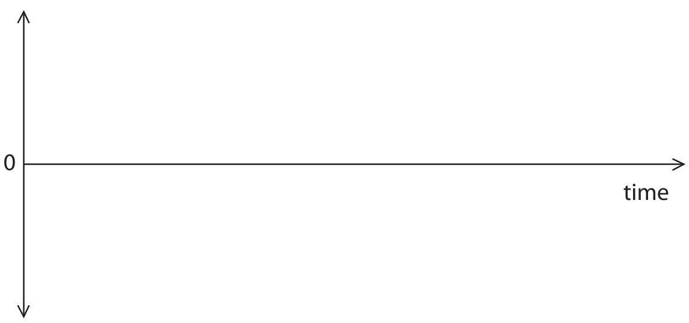
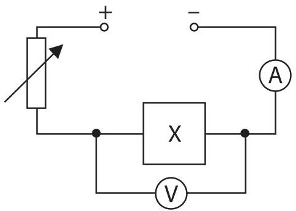
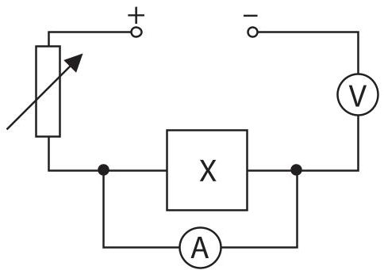
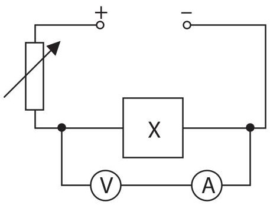
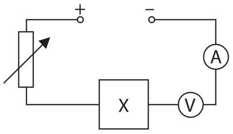
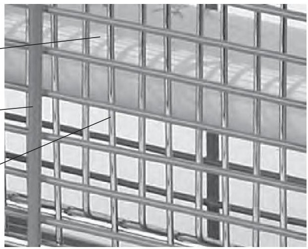
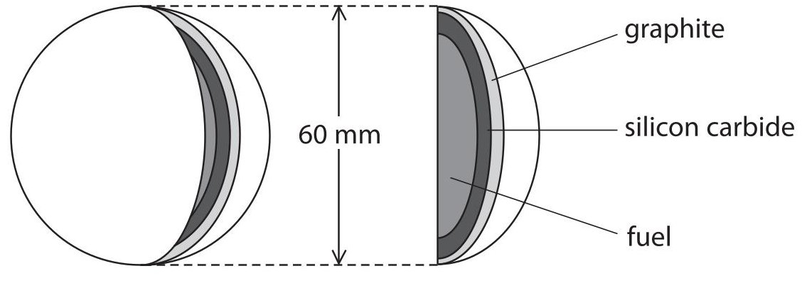
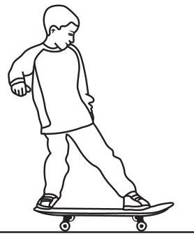
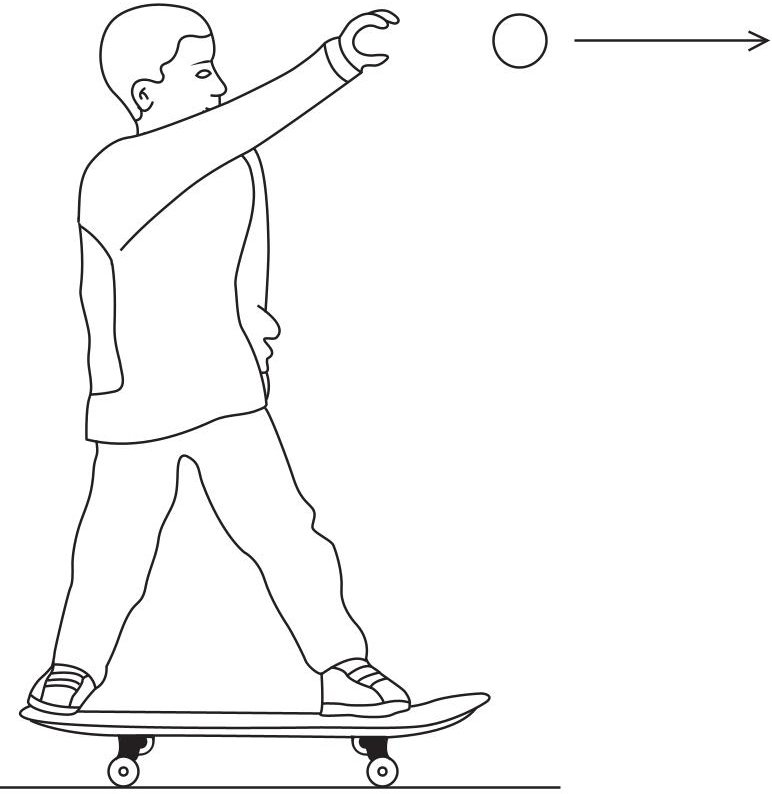
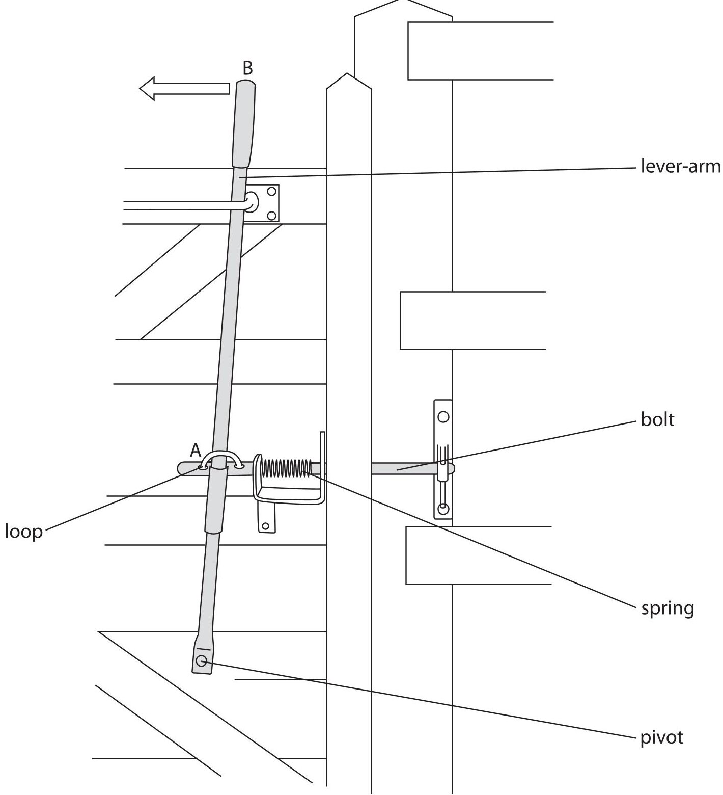

<table><tr><td colspan="3">Write your name here</td></tr><tr><td>Surname</td><td colspan="2">Other names</td></tr><tr><td>Pearson Edexcel International GCSE</td><td>Centre Number</td><td>Candidate Number</td></tr><tr><td colspan="3">Physics
Unit: 4PH0
Paper: 2PR</td></tr><tr><td colspan="2">Friday 17 June 2016 – Morning
Time: 1 hour</td><td>Paper Reference
4PH0/2PR</td></tr><tr><td colspan="3">You must have:
Ruler, calculator</td></tr><tr><td colspan="3">Total Marks</td></tr></table>

## Instructions

- Use black ink or ball-point pen.

- Fill in the boxes at the top of this page with your name, centre number and candidate number.

- Answer all questions.

- Answer the questions in the spaces provided

- there may be more space than you need.

- Show all the steps in any calculations and state the units.

- Some questions must be answered with a cross in a box. If you change your mind about an answer, put a line through the box and then mark your new answer with a cross.

## Information

- The total mark for this paper is 60.

- The marks for each question are shown in brackets

- use this as a guide as to how much time to spend on each question.

## Advice

- Read each question carefully before you start to answer it.

- Write your answers neatly and in good English.

- Try to answer every question.

- Check your answers if you have time at the end.

## EQUATIONS

You may find the following equations useful.

$$
\mathrm {e n e r g y t r a n s f e r r e d} = \mathrm {c u r r e n t} \times \mathrm {v o l t a g e} \times \mathrm {t i m e}
$$

$$
E = I \times V \times t
$$

$$
\mathrm {p r e s s u r e} \times \mathrm {v o l u m e} = \mathrm {c o n s t a n t}
$$

$$
p _ {1} \times V _ {1} = p _ {2} \times V _ {2}
$$

$$
f r e q u e n c y = \frac {1}{t i m e p e r i o d}
$$

$$
f = \frac {1}{T}
$$

$$
\mathrm {p o w e r} = \frac {\mathrm {w o r k d o n e}}{\mathrm {t i m e t a k e n}}
$$

$$
P = \frac {W}{t}
$$

$$
\mathrm {p o w e r} = \frac {\mathrm {e n e r g y t r a n s f e r r e d}}{\mathrm {t i m e t a k e n}}
$$

$$
P = \frac {W}{t}
$$

$$
\mathrm {o r b i t a l s p e e d} = \frac {2 \pi \times \mathrm {o r b i t a l r a d i u s}}{\mathrm {t i m e p e r i o d}}
$$

$$
v = \frac {2 \times \pi \times r}{T}
$$

$$
\frac {\mathrm {p r e s s u r e}}{\mathrm {t e m p e r a t u r e}} = \mathrm {c o n s t a n t}
$$

$$
\frac {p _ {1}}{T _ {1}} = \frac {p _ {2}}{T _ {2}}
$$

$$
\mathrm {f o r c e} = \frac {\mathrm {c h a n g e i n m o m e n t u m}}{\mathrm {t i m e t a k e n}}
$$

Where necessary, assume the acceleration of free fall, g = 10 m/s $ ^{2} $

## BLANK PAGE

## Answer ALL questions.

1 Communication signals are often transmitted in digital form.

(a) Sketch a graph to show how a digital signal varies with time.

(b) Describe the advantages of using digital signals rather than analogue signals.

(Total for Question 1 = 4 marks)

2 A student is given an unknown electrical component, X.

He uses a circuit to investigate how the current in X varies with the voltage across it.

(a) Which of these circuits is correct for his investigation?

(1) 

A

B

C

D

(b) The table shows the student's results.

## current in A

<table border="1"><tr><td>Voltage across X in V</td><td>Current in X in A</td></tr><tr><td>0</td><td>0</td></tr><tr><td>3.0</td><td>0.5</td></tr><tr><td>14.5</td><td>2.3</td></tr><tr><td>19.5</td><td>2.9</td></tr><tr><td>25.0</td><td>3.2</td></tr><tr><td>29.5</td><td>3.3</td></tr></table>

(i) Plot a graph of these results and draw a curve of best fit.

(ii) State the equation linking voltage, current and resistance.

(iii) Calculate the resistance of component X when the voltage across it is 10.0 V. Give the unit.

$$
\mathrm {r e s i s t a n c e} =
$$

(iv) Describe the pattern shown by this graph.

(v) Suggest a conclusion for the investigation.

3 Many food shops have devices that attract and kill flying insects. The devices consist of

- an ultraviolet lamp

- a plastic mesh on the outside

- an electrified wire grid below the plastic mesh

- a transformer that is connected to the wire grid

ultraviolet lamp

plastic mesh

electrified wire grid

(a) The ultraviolet lamp attracts many flying insects towards the device. Ultraviolet is an electromagnetic wave.

(i) State two properties of electromagnetic waves.

(2) 

(ii) Which of these electromagnetic radiations has a frequency greater than ultraviolet?

A infrared

(1) 

B gamma rays

radio waves

D visible light

(b) The transformer supplies an output voltage of 2000 V a.c. to the wire grid. The input voltage to the transformer is 230 V a.c.

(i) Give the name of this type of transformer.

(ii) State the relationship between input (primary) voltage, output (secondary) voltage, primary turns and secondary turns.

(iii) There are 110 turns on the primary coil. Calculate the number of turns on the secondary coil.

number of turns

(iv) Suggest a reason why there is a plastic mesh on the outside of the device.

(Total for Question 3 = 9 marks)

4 (a) The diagram shows the fuel used in some nuclear reactors.

The fuel is contained inside spheres.

The silicon carbide layer of each sphere is designed to contain the fission products for at least one million years.

section through a fuel sphere

(i) Give the name of a fuel that could be used.

(ii) Explain what is meant by the term fission products.

(iii) Explain why it is important to contain these fission products for such a long time.

(iv) The graphite layer in every fuel sphere acts as a moderator. What is the function of the moderator in a nuclear reactor?

(v) The nuclear reactor also contains boron control rods.

Explain why it is dangerous to remove most of the control rods from the reactor.

(b) The reactor is cooled with helium gas.

The gas enters the reactor at 500 $ ^{\circ} \mathrm{C}. $

(i) What is this temperature in kelvin?

(ii) Helium gas enters the reactor at a pressure of 8.40 MPa and leaves the reactor at a temperature of 1170 K.

Calculate the pressure of the helium gas as it leaves the reactor. [assume the volume of the gas does not change]

(Total for Question 4 = 12 marks)

5 (a) A boy of mass 43.2 kg runs and jumps onto a stationary skateboard.

The boy lands on the skateboard with a horizontal velocity of 4.10 m/s.

(i) State the relationship between momentum, mass and velocity.

(ii) The skateboard has a mass of 2.50 kg.

Using ideas about conservation of momentum, calculate the combined velocity of the boy and skateboard just after the boy lands on it.

(b) The boy holds a heavy ball as he stands on a stationary skateboard.

The boy throws the ball forwards while still standing on the skateboard.

Explain what happens to the boy and the skateboard.

(2) 

(Total for Question 5 = 7 marks)

6 The table gives information about some ways to generate electrical power.

<table border="1"><tr><td>Type of power station</td><td>Maximum power output in MW</td><td>Time to reach maximum power</td><td>Relative fuel cost</td></tr><tr><td>wind farm</td><td>20</td><td>variable</td><td>none</td></tr><tr><td>gas turbine</td><td>600</td><td>15 minutes</td><td>medium</td></tr><tr><td>tidal scheme</td><td>6000</td><td>variable</td><td>none</td></tr><tr><td>nuclear power station</td><td>1200</td><td>2 days</td><td>low</td></tr><tr><td>coal-fired power station</td><td>1800</td><td>3 hours</td><td>high</td></tr></table>

An electricity supply company has enough power stations to cover the normal demand for electricity but not enough for cold conditions.

On cold days the demand for electrical power can suddenly increase by 20 000 MW.

The company needs to build new power stations to meet this increased demand.

Using only information in the table, evaluate which types of power station would be the most suitable to meet this increased demand.

(Total for Question 6 = 5 marks)

7 The diagram shows a gate with a lever-operated catch.

A loop on the bolt fits around the lever-arm at A.

(a) (i) Describe how the lever-arm is used to move the bolt.

(1) 

(ii) Suggest why the spring is needed.

(1) 

(b) The lever-arm operates using the principle of moments.

(i) State the principle of moments.

) The force applied at point B is 22 N.

The pivot is 110 cm from point B and 38 cm from point A.

Calculate the force exerted on the lever-arm at point A by the spring.

force at point A = ... N

(iii) Explain how the force applied at point B would need to change if the distance from the pivot to point A is increased.

## (Total for Question 7 = 8 marks)

## TOTAL FOR PAPER = 60 MARKS

## BLANK PAGE

## BLANK PAGE

## BLANK PAGE

Every effort has been made to contact copyright holders to obtain their permission for the use of copyright material. Pearson Education Ltd. will, if notified, be happy to rectify any errors or omissions and include any such rectifications in future editions.

