<table><tr><td colspan="3">Write your name here</td></tr><tr><td>Surname</td><td colspan="2">Other names</td></tr><tr><td>Pearson Edexcel Certificate
Pearson Edexcel
International GCSE</td><td>Centre Number</td><td>Candidate Number</td></tr><tr><td colspan="3">Physics
Unit: KPH0/4PH0
Paper: 2P</td></tr><tr><td colspan="2">Thursday 19 January 2017 – Afternoon
Time: 1 hour</td><td>Paper Reference
KPH0/2P
4PH0/2P</td></tr><tr><td colspan="3">You must have:
Ruler, calculator</td><td>Total Marks</td></tr></table>

## Instructions

- Use black ink or ball-point pen.

- Fill in the boxes at the top of this page with your name, centre number and candidate number.

- Answer all questions.

- Answer the questions in the spaces provided

- there may be more space than you need.

- Show all the steps in any calculations and state the units.

- Some questions must be answered with a cross in a box. If you change your mind about an answer, put a line through the box and then mark your new answer with a cross.

## Information

- The total mark for this paper is 60.

- The marks for each question are shown in brackets

- use this as a guide as to how much time to spend on each question.

## Advice

- Read each question carefully before you start to answer it.

- Write your answers neatly and in good English.

- Try to answer every question.

- Check your answers if you have time at the end.

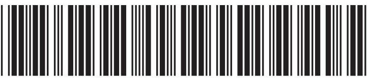

## EQUATIONS

You may find the following equations useful.

$$
\mathrm {e n e r g y t r a n s f e r r e d} = \mathrm {c u r r e n t} \times \mathrm {v o l t a g e} \times \mathrm {t i m e}
$$

$$
E = I \times V \times t
$$

$$
\mathrm {p r e s s u r e} \times \mathrm {v o l u m e} = \mathrm {c o n s t a n t}
$$

$$
p _ {1} \times V _ {1} = p _ {2} \times V _ {2}
$$

$$
f r e q u e n c y = \frac {1}{t i m e p e r i o d}
$$

$$
f = \frac {1}{T}
$$

$$
\mathrm {p o w e r} = \frac {\mathrm {w o r k d o n e}}{\mathrm {t i m e t a k e n}}
$$

$$
P = \frac {W}{t}
$$

$$
\mathrm {p o w e r} = \frac {\mathrm {e n e r g y t r a n s f e r r e d}}{\mathrm {t i m e t a k e n}}
$$

$$
P = \frac {W}{t}
$$

$$
\mathrm {o r b i t a l s p e e d} = \frac {2 \pi \times \mathrm {o r b i t a l r a d i u s}}{\mathrm {t i m e p e r i o d}}
$$

$$
v = \frac {2 \times \pi \times r}{T}
$$

$$
\frac {\mathrm {p r e s s u r e}}{\mathrm {t e m p e r a t u r e}} = \mathrm {c o n s t a n t}
$$

$$
\frac {p _ {1}}{T _ {1}} = \frac {p _ {2}}{T _ {2}}
$$

$$
\mathrm {f o r c e} = \frac {\mathrm {c h a n g e i n m o m e n t u m}}{\mathrm {t i m e t a k e n}}
$$

Where necessary, assume the acceleration of free fall, g = 10 m/s $ ^{2} $

## Answer ALL questions.

1 (a) The table gives some properties of different types of radiation.

<table border="1"><tr><td>Type of radiation</td><td>Nature</td><td>Relative charge</td><td>Ionising ability</td></tr><tr><td>alpha(α)</td><td>helium nucleus</td><td></td><td>high</td></tr><tr><td>beta(β)</td><td></td><td>-1</td><td>medium</td></tr><tr><td>gamma(γ)</td><td>electromagnetic wave</td><td>0</td><td>low</td></tr></table>

(i) Complete the table by giving the two missing properties.

(ii) Which type of radiation from the table has the lowest penetrating power?

(iii) Which types of radiation from the table can be completely absorbed by 5 mm of aluminium?

(b) Carbon-14 is a radioactive isotope of carbon.

It decays by beta emission to form an isotope of nitrogen.

Complete the nuclear equation for the decay of carbon-14.

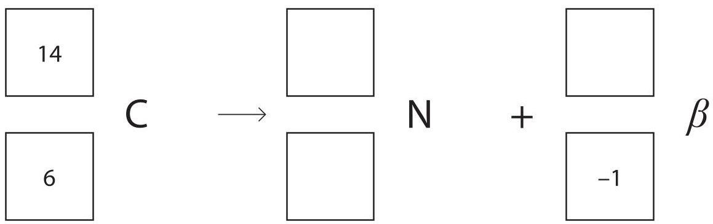

2 (a) State the principle of moments.

(b) A student uses the principle of moments to find the weight of a rock. This is the student's method.

- he balances a metre rule at its mid-point on a pivot

- he hangs a beaker from the 40 cm mark on the rule

- he places the rock in the beaker

- he then hangs a 0.2 N plastic strip from the rule on the other side of the pivot

- he adjusts the position of the plastic strip until the rule balances

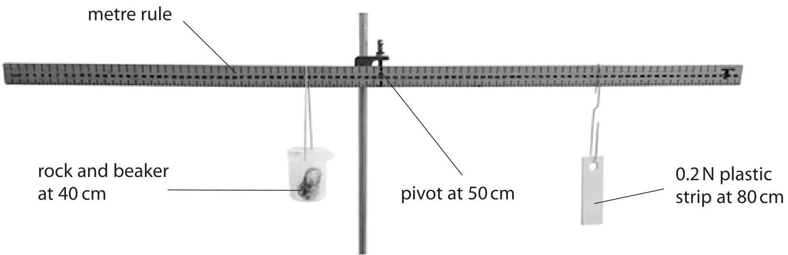

(i) Describe how the student could use an electronic balance to check that the plastic strip weighs 0.2N.

(ii) Suggest how the student could improve the precision of one of his measurements. (1)

(iii) State the equation linking moment, force and perpendicular distance from the pivot.

(iv) Use the principle of moments to calculate the force acting on the metre rule at the 40 cm mark.

(v) Suggest a reason why the weight of the rock will be different from your calculated force.

(Total for Question 2 = 10 marks)

3 (a) Which of these statements about sound waves is not correct?

A sound waves can be refracted

B sound waves are transverse

C sound waves can be diffracted

D sound waves transmit energy

(b) A student uses a microphone and an oscilloscope to display a sound wave. The diagram shows the trace on the oscilloscope screen.

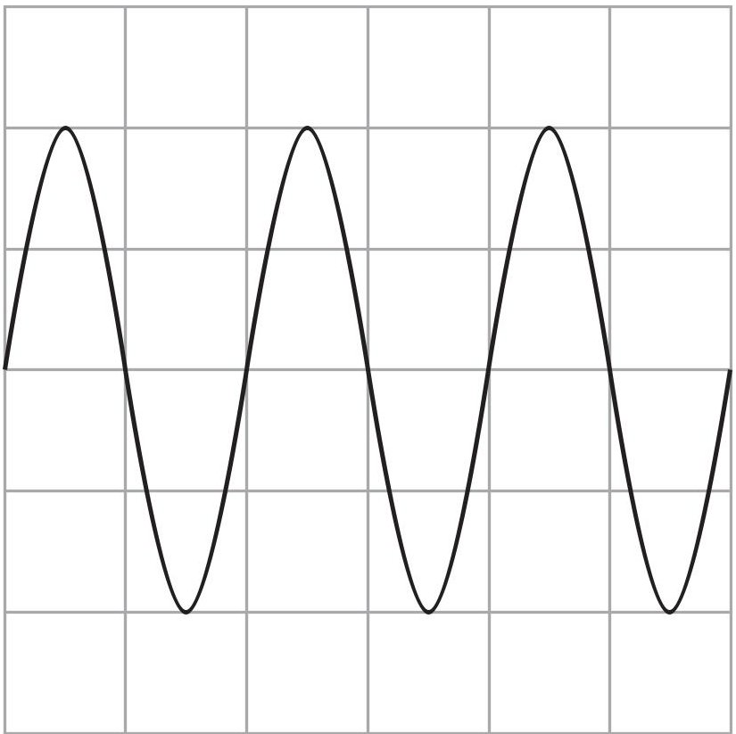

oscilloscope settings:

y direction: 1 square=1V

x direction: 1 square=0.01s

(i) Calculate the frequency of this sound wave.

frequency=

(ii) On the diagram, draw the signal for a quieter sound wave of a higher pitch.

(Total for Question 3 = 6 marks)

4 A student investigates how adding insulation to a beaker of hot water changes the rate at which the water cools down.

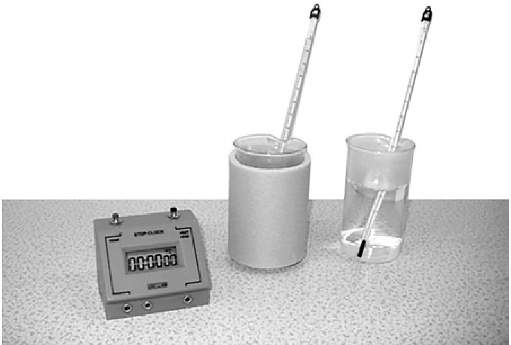

(a) The student writes this plan for her investigation.

I will use five beakers of the same size.

I will wrap each beaker with a different number of layers of the same type of insulation.

I will pour $ 3 0 0 \mathrm{c m}^{3} $ of boiling water into each beaker and wait until the temperature of the water falls to $ 8 5^{\circ} \mathrm{C} $

I will then start a timer and record the final temperature of the water after 15 minutes.

(i) State the independent variable in the student's investigation.

(ii) State the dependent variable in the student's investigation.

(b) The table shows the student's results.

<table border="1"><tr><td>Number of layers of insulation</td><td>Final temperature in℃</td><td>Temperature difference in℃</td></tr><tr><td>0</td><td>43</td><td>42</td></tr><tr><td>1</td><td></td><td>38</td></tr><tr><td>2</td><td></td><td>35</td></tr><tr><td>3</td><td></td><td>35</td></tr><tr><td>4</td><td></td><td>35</td></tr></table>

(i) Complete the table by calculating the final temperatures.

The first one has been done for you.

(ii) Draw a bar chart to show the relationship between number of layers of insulation and temperature difference.

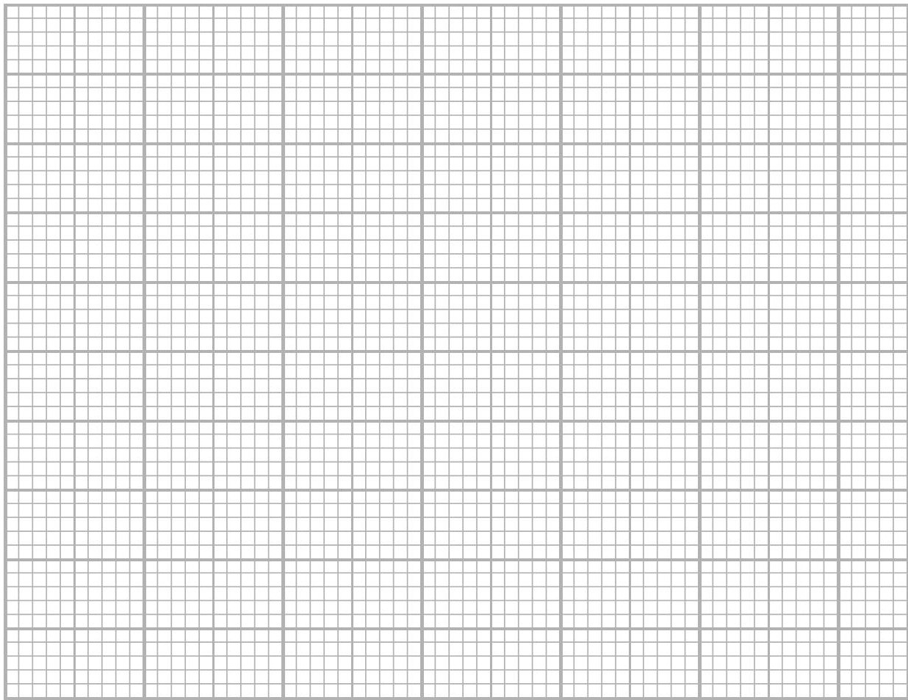

(iii) Describe the relationship between the number of layers of insulation and the temperature difference.

(iv) Suggest how the student could improve the reliability of her results.

(Total for Question 4 = 11 marks)

5 The photograph shows a halogen lamp.

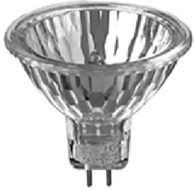

(a) The halogen lamp has a power of 50 W when operating at its normal voltage. Calculate the amount of electrical energy transferred to the halogen lamp in 40 hours.

(b) A student notices that in addition to producing light, the lamp also gets hot. She concludes that the lamp cannot be 100% efficient. Explain whether the student's conclusion is correct.

(c) The lamp must not be connected directly to mains voltage.

A step-down transformer must be used.

Describe the structure of a step-down transformer.

You may draw a diagram to help your answer.

(d) A step-down transformer reduces voltage from 230 V to 12 V.

The secondary current is 4.2 A.

(i) State the equation linking input power and output power for a transformer. [assume that the transformer is 100% efficient]

(ii) Calculate the primary current.

6 (a) Which of these quantities is a scalar?

A acceleration

B energy

C force

D velocity

(b) The diagram shows the horizontal forces acting on a van at a particular instant, as it accelerates.

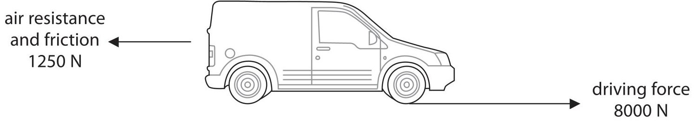

(i) Calculate the resultant horizontal force acting on the van.

(ii) State the equation linking resultant force, mass and acceleration.

(iii) The mass of the van is 2500 kg.

Calculate the acceleration of the van.

Give the unit.

acceleration = ... unit

(c) The graph shows how the velocity of a van changes with time.

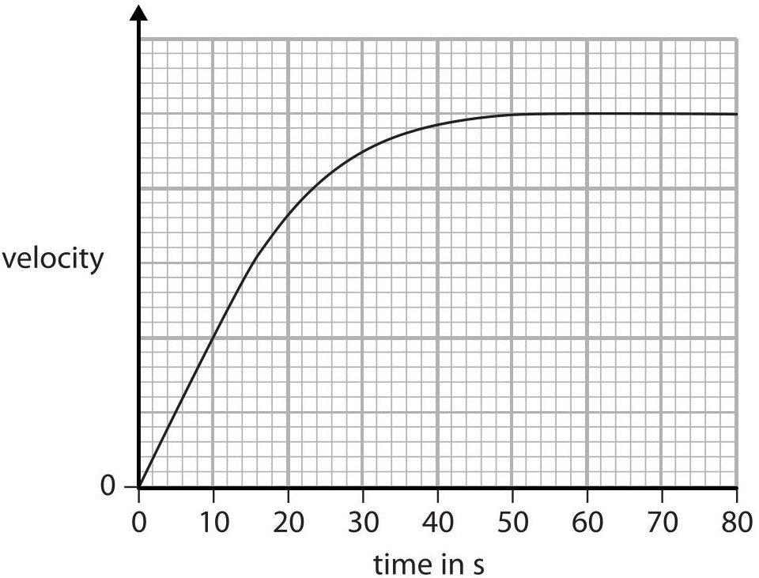

Explain the shape of the graph.

Use ideas about forces in your answer.

(5) 

7 A student uses a pressure sensor to measure the pressure of air in a sealed flask.

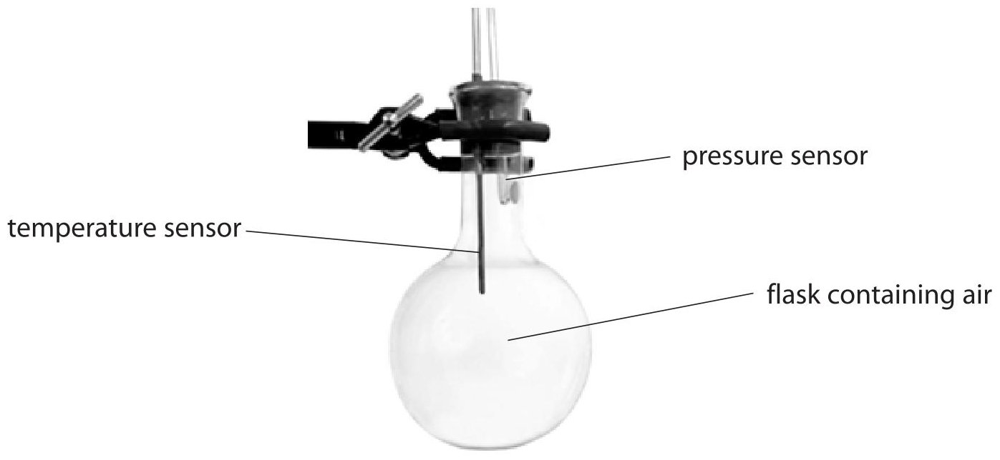

(a) The pressure sensor measures pressure in pascals (Pa) Which of these is equivalent to pascals (Pa)?

A joules per metre (J/m)

B joules per square metre (J/m $ ^{2} $)

C newtons per metre (N/m)

D newtons per square metre (N/m $ ^{2} $)

(b) The student places the flask in a beaker containing hot water.

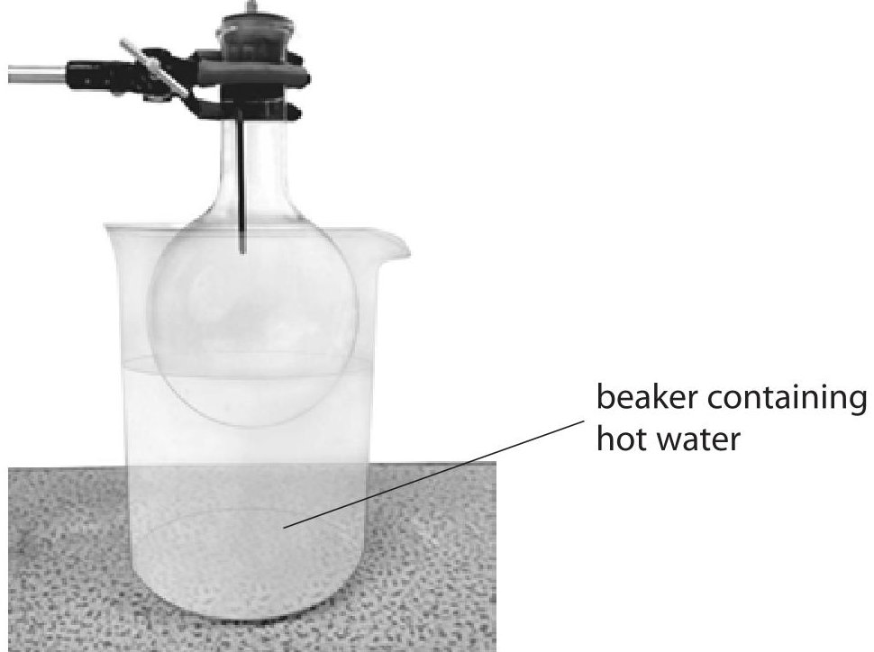

The pressure of the air in the flask increases.

Explain why the pressure of the air in the flask increases.

Use ideas about molecules in your answer.

(Total for Question 7 = 4 marks)

TOTAL FOR PAPER=60 MARKS

## BLANK PAGE

Every effort has been made to contact copyright holders to obtain their permission for the use of copyright material. Pearson Education Ltd. will, if notified, be happy to rectify any errors or omissions and include any such rectifications in future editions.

