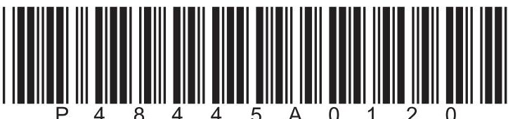
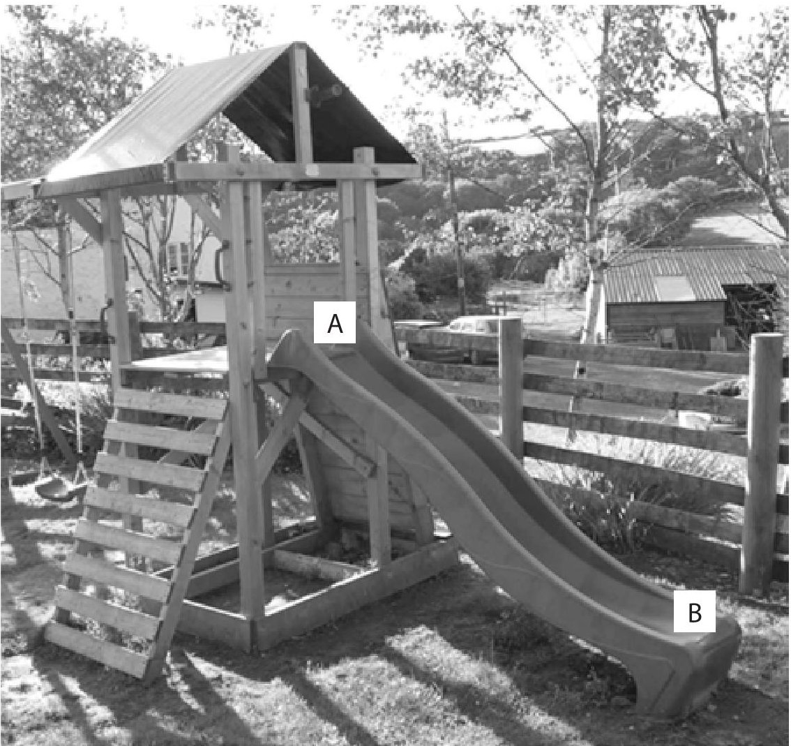
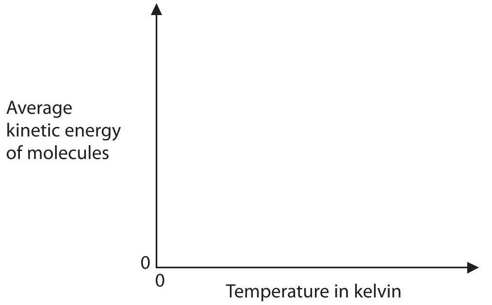
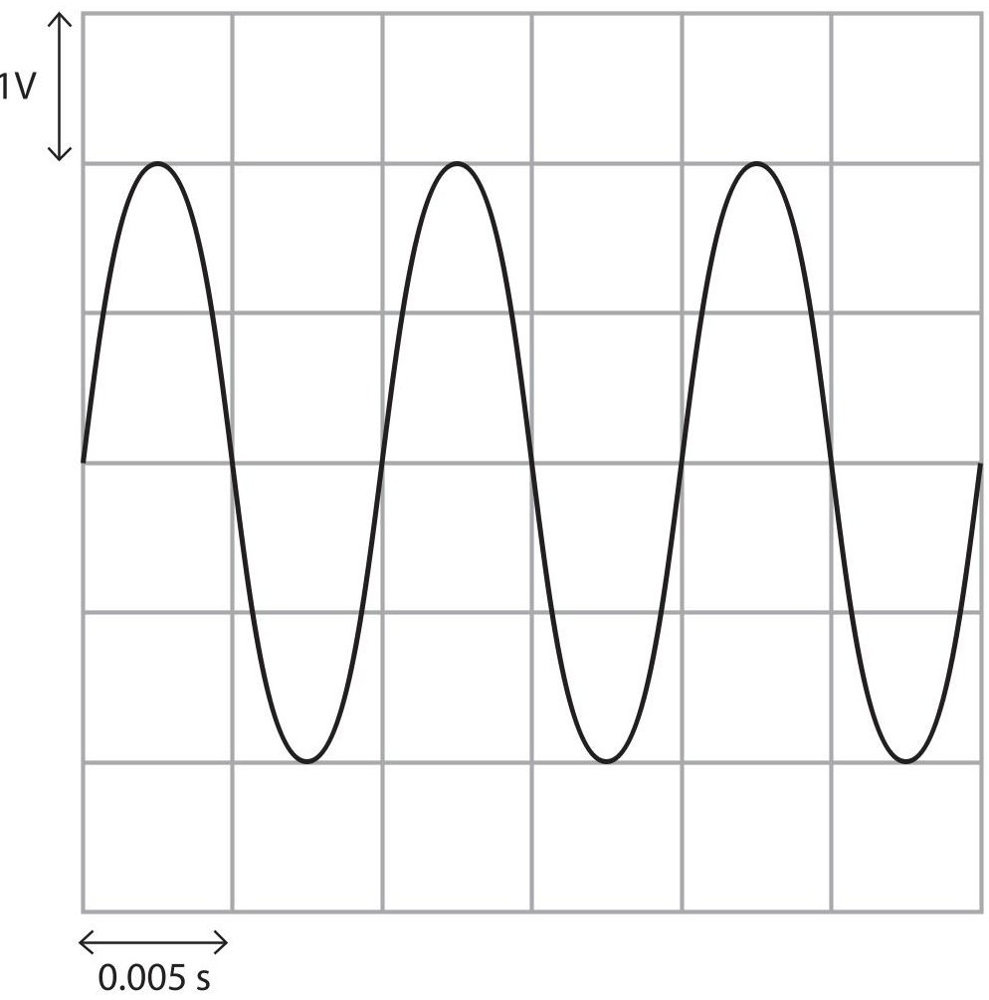
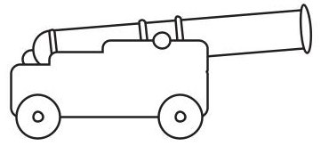
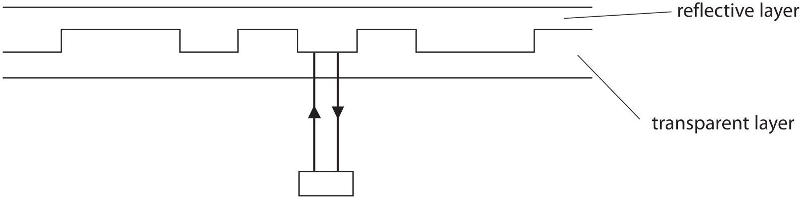
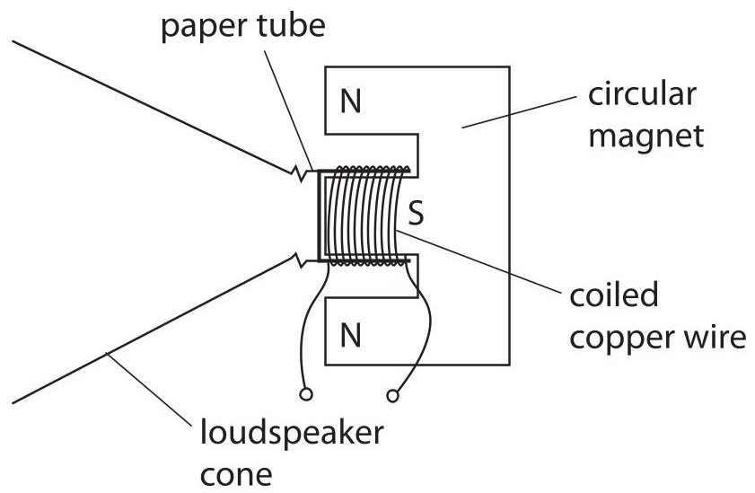

<table><tr><td colspan="3">Write your name here</td></tr><tr><td>Surname</td><td colspan="2">Other names</td></tr><tr><td>Pearson Edexcel International GCSE</td><td>Centre Number</td><td>Candidate Number</td></tr><tr><td colspan="3">Physics
Unit: 4PH0
Paper: 2PR</td></tr><tr><td colspan="2">Friday 16 June 2017 – Morning
Time: 1 hour</td><td>Paper Reference
4PH0/2PR</td></tr><tr><td colspan="3">You must have:
Ruler, calculator</td></tr><tr><td colspan="3">Total Marks</td></tr></table>

## Instructions

- Use black ink or ball-point pen.

- Fill in the boxes at the top of this page with your name, centre number and candidate number.

- Answer all questions.

- Answer the questions in the spaces provided

- there may be more space than you need.

- Show all the steps in any calculations and state the units.

- Some questions must be answered with a cross in a box. If you change your mind about an answer, put a line through the box and then mark your new answer with a cross.

## Information

- The total mark for this paper is 60.

- The marks for each question are shown in brackets

- use this as a guide as to how much time to spend on each question.

## Advice

- Read each question carefully before you start to answer it.

- Write your answers neatly and in good English.

- Try to answer every question.

- Check your answers if you have time at the end.

Turn over

## EQUATIONS

You may find the following equations useful.

$$
\mathrm {e n e r g y t r a n s f e r r e d} = \mathrm {c u r r e n t} \times \mathrm {v o l t a g e} \times \mathrm {t i m e}
$$

$$
E = I \times V \times t
$$

$$
\mathrm {p r e s s u r e} \times \mathrm {v o l u m e} = \mathrm {c o n s t a n t}
$$

$$
p _ {1} \times V _ {1} = p _ {2} \times V _ {2}
$$

$$
f r e q u e n c y = \frac {1}{t i m e p e r i o d}
$$

$$
f = \frac {1}{T}
$$

$$
\mathrm {p o w e r} = \frac {\mathrm {w o r k d o n e}}{\mathrm {t i m e t a k e n}}
$$

$$
P = \frac {W}{t}
$$

$$
\mathrm {p o w e r} = \frac {\mathrm {e n e r g y t r a n s f e r r e d}}{\mathrm {t i m e t a k e n}}
$$

$$
P = \frac {W}{t}
$$

$$
\mathrm {o r b i t a l s p e e d} = \frac {2 \pi \times \mathrm {o r b i t a l r a d i u s}}{\mathrm {t i m e p e r i o d}}
$$

$$
v = \frac {2 \times \pi \times r}{T}
$$

$$
\frac {\mathrm {p r e s s u r e}}{\mathrm {t e m p e r a t u r e}} = \mathrm {c o n s t a n t}
$$

$$
\frac {p _ {1}}{T _ {1}} = \frac {p _ {2}}{T _ {2}}
$$

$$
\mathrm {f o r c e} = \frac {\mathrm {c h a n g e i n m o m e n t u m}}{\mathrm {t i m e t a k e n}}
$$

Where necessary, assume the acceleration of free fall, g=10 m/s $ ^{2} $

## Answer ALL questions.

1 Table 1 lists some disadvantages associated with different types of power station in the UK.

Table 1

<table border="1"><tr><td>Name of power station</td><td>Disadvantages</td></tr><tr><td>Dinorwig</td><td>large area of land must be flooded damages the habitat of river wildlife</td></tr><tr><td>Drax</td><td>produces polluting gases such as CO2 and oxides of nitrogen high transportation costs to bring fuel to the power station</td></tr><tr><td>Fullabrook</td><td>takes up a lot of land noise pollution power output depends on the weather</td></tr><tr><td>Torness</td><td>produces radioactive waste high decommissioning costs</td></tr></table>

Complete table 2 by placing one tick ( $ \checkmark $ ) in each row to show the type of each power station.

Table 2

<table border="1"><tr><td rowspan="2">Name of power station</td><td colspan="4">Type of power station</td></tr><tr><td>fossil fuel</td><td>hydroelectric</td><td>nuclear</td><td>wind turbine</td></tr><tr><td>Dinorwig</td><td></td><td></td><td></td><td></td></tr><tr><td>Drax</td><td></td><td></td><td></td><td></td></tr><tr><td>Fullabrook</td><td></td><td></td><td></td><td></td></tr><tr><td>Torness</td><td></td><td></td><td></td><td></td></tr></table>

(Total for Question 1 = 4 marks)

2 A girl slides from point A to point B on a plastic slide.

(a) State the main type of energy lost as the girl travels from A to B.

(1) 

(b) As the girl slides down, she becomes charged and her hair stands on end.

$ \textcircled{c} $ Chris Darling (Wikipedia)

(i) The passage explains how the girl becomes charged.

Use words from the box to complete the passage.

Each word may be used once, more than once, or not at all.

(3) 

conduction electrons friction negative positive protons

The girl becomes charged because of between the slide and her clothes.

As the girl travels down the slide, the slide loses ...

When the girl reaches point B, the slide has a charge.

(ii) Explain why the girl's hair stands on end.

(c) The girl grabs hold of a metal post and her hair falls back down. Explain why her hair falls back down.

(Total for Question 2 = 9 marks)

## BLANK PAGE

3 There are several isotopes of the element protactinium.

(a) Compare two different isotopes of protactinium.

(b) A teacher wants to find the half-life of an isotope of protactinium.

She measures the count rate of a sample of this isotope.

Describe how the teacher could correct her count rate for background radiation.

(c) She measures the count rate every 20 seconds.

The table shows her corrected results.

<table border="1"><tr><td>Time in seconds</td><td>Corrected count rate in counts per second</td></tr><tr><td>0</td><td>52</td></tr><tr><td>20</td><td>43</td></tr><tr><td>40</td><td>35</td></tr><tr><td>60</td><td>29</td></tr><tr><td>80</td><td>24</td></tr><tr><td>100</td><td>19</td></tr><tr><td>120</td><td>16</td></tr><tr><td>140</td><td>13</td></tr></table>

(i) Plot a graph to show how the count rate changes with time, and draw the curve of best fit.

(ii) Use your graph to estimate the half-life of this isotope.

half-life = ... s

(Total for Question 3 = 12 marks)

4 A student heats a liquid in a beaker and measures the highest temperature reached when the liquid becomes a gas.

(a) (i) Name the process when a liquid changes into a gas.

(ii) Describe the changes in the arrangement and movement of molecules when a liquid becomes a gas.

(b) The student collects the gas in a flask.

He seals the flask to make sure the volume of the gas remains constant.

He then heats the flask.

(i) Before being heated, the gas is at a temperature of 350 K and a pressure of 100 kPa. Calculate the pressure of the gas when the temperature is increased to 450 K.

(ii) Complete the graph to show how the average kinetic energy of the gas molecules changes as the temperature of the gas increases.

(Total for Question 4 = 9 marks)

5 (a) What is the frequency range for human hearing?

(1) 

A 20Hz-20000Hz

B 20Hz-25000Hz

C 200Hz-20000Hz

D 200Hz-25000Hz

(b) A student makes a sound by blowing over the top of a bottle containing water.

$ \textcircled{c} $Scientific American

The student uses a microphone and an oscilloscope to display the sound wave produced.

The diagram shows the trace on the oscilloscope screen.

(i) Calculate the frequency of this sound wave.

(ii) The student empties some water from the bottle and blows over the top.

The sound she produces has the same loudness but a lower pitch.

On the diagram, draw a trace for this new sound. [assume the oscilloscope settings remain the same]

6 (a) A student measures the weight of a cannonball as 50 N.

(i) Name a piece of equipment he could use to measure the weight.

(ii) State the equation relating weight, mass and g.

(iii) Calculate the mass of the cannonball.

(b) Describe how the student could find the density of the cannonball.

You should include details of any further measurements he would need to make.

(c) A cannonball is fired from a cannon.

When the cannonball is fired, the cannon moves in the opposite direction, as shown in the diagram.

direction of cannon

Using ideas about momentum, explain why the cannon moves in the opposite direction to the cannonball.

(Total for Question 6 = 10 marks)

7 A compact disc (CD) is used to record and store information. This information is stored in a digital format.

(a) Describe the differences between analogue and digital signals. You may draw a diagram to support your answer.

(b) The diagram shows an enlarged cross-section of a CD.

laser and detector

Light is emitted from the laser. It is then reflected from the reflective layer of the CD and received at the detector.

The equation linking average speed, distance moved and time taken is

$$
\mathrm {a v e r a g e s p e e d} = \frac {\mathrm {d i s t a n c e m o v e d}}{\mathrm {t i m e t a k e n}}
$$

The distance between the reflective layer and the laser is 2.1 mm.

The laser light travels at an average speed of $ 2. 8 \times1 0^{8} $ m/s between the laser and the detector.

Calculate the time taken for the laser light to be received at the detector after it is emitted from the laser.

(c) A loudspeaker is used to listen to music recorded on the CD.

The loudspeaker transforms an electrical signal into a sound wave.

The diagram shows the construction of the loudspeaker.

Explain how the loudspeaker produces a sound wave.

(4) 

(Total for Question 7 = 10 marks)

TOTAL FOR PAPER=60 MARKS

## BLANK PAGE

## BLANK PAGE

Every effort has been made to contact copyright holders to obtain their permission for the use of copyright material. Pearson Education Ltd. will, if notified, be happy to rectify any errors or omissions and include any such rectifications in future editions.

