<table><tr><td colspan="3">Write your name here</td></tr><tr><td>Surname</td><td colspan="2">Other names</td></tr><tr><td>Pearson Edexcel Certificate
Pearson Edexcel
International GCSE</td><td>Centre Number</td><td>Candidate Number</td></tr><tr><td colspan="3">Physics
Unit: KPH0/4PH0
Paper: 2P</td></tr><tr><td colspan="2">Friday 16 June 2017 – Morning
Time: 1 hour</td><td>Paper Reference
KPH0/2P
4PH0/2P</td></tr><tr><td colspan="3">You must have:
Ruler, calculator</td><td>Total Marks</td></tr></table>

## Instructions

- Use black ink or ball-point pen.

- Fill in the boxes at the top of this page with your name, centre number and candidate number.

- Answer all questions.

- Answer the questions in the spaces provided

- there may be more space than you need.

- Show all the steps in any calculations and state the units.

- Some questions must be answered with a cross in a box. If you change your mind about an answer, put a line through the box and then mark your new answer with a cross.

## Information

- The total mark for this paper is 60.

- The marks for each question are shown in brackets

- use this as a guide as to how much time to spend on each question.

## Advice

- Read each question carefully before you start to answer it.

- Write your answers neatly and in good English.

- Try to answer every question.

- Check your answers if you have time at the end.

Turn over

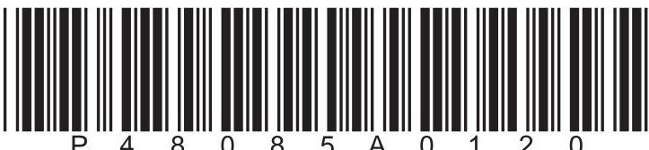

## EQUATIONS

You may find the following equations useful.

$$
\mathrm {e n e r g y t r a n s f e r r e d} = \mathrm {c u r r e n t} \times \mathrm {v o l t a g e} \times \mathrm {t i m e}
$$

$$
E = I \times V \times t
$$

$$
\mathrm {p r e s s u r e} \times \mathrm {v o l u m e} = \mathrm {c o n s t a n t}
$$

$$
p _ {1} \times V _ {1} = p _ {2} \times V _ {2}
$$

$$
f r e q u e n c y = \frac {1}{t i m e p e r i o d}
$$

$$
f = \frac {1}{T}
$$

$$
\mathrm {p o w e r} = \frac {\mathrm {w o r k d o n e}}{\mathrm {t i m e t a k e n}}
$$

$$
P = \frac {W}{t}
$$

$$
\mathrm {p o w e r} = \frac {\mathrm {e n e r g y t r a n s f e r r e d}}{\mathrm {t i m e t a k e n}}
$$

$$
P = \frac {W}{t}
$$

$$
\mathrm {o r b i t a l s p e e d} = \frac {2 \pi \times \mathrm {o r b i t a l r a d i u s}}{\mathrm {t i m e p e r i o d}}
$$

$$
v = \frac {2 \times \pi \times r}{T}
$$

$$
\frac {\mathrm {p r e s s u r e}}{\mathrm {t e m p e r a t u r e}} = \mathrm {c o n s t a n t}
$$

$$
\frac {p _ {1}}{T _ {1}} = \frac {p _ {2}}{T _ {2}}
$$

$$
\mathrm {f o r c e} = \frac {\mathrm {c h a n g e i n m o m e n t u m}}{\mathrm {t i m e t a k e n}}
$$

Where necessary, assume the acceleration of free fall, g = 10 m/s $ ^{2} $

## Answer ALL questions.

1 (a) Which of these is a scalar quantity?

A weight

B mass

C momentum

D velocity

(b) Which of these is a vector quantity?

A acceleration

B temperature

C charge

D density

(c) The diagrams show the forces acting on four balls falling in air. Which diagram shows a ball decelerating as it falls?

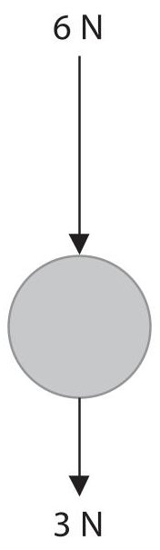

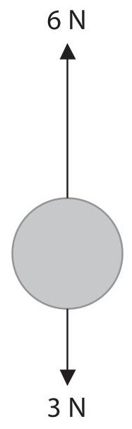

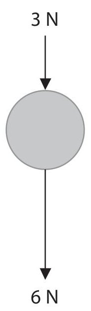

C

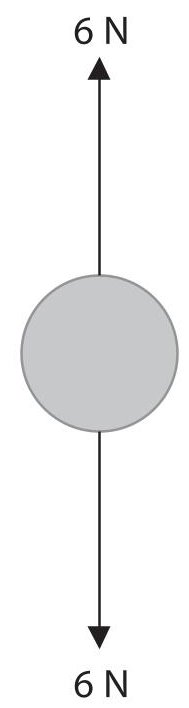

(Total for Question 1 = 3 marks)

## BLANK PAGE

2 (a) A student passes a thick wire vertically through the centre of a horizontal card. He then passes a current through the wire in an upwards direction, as shown in the diagram.

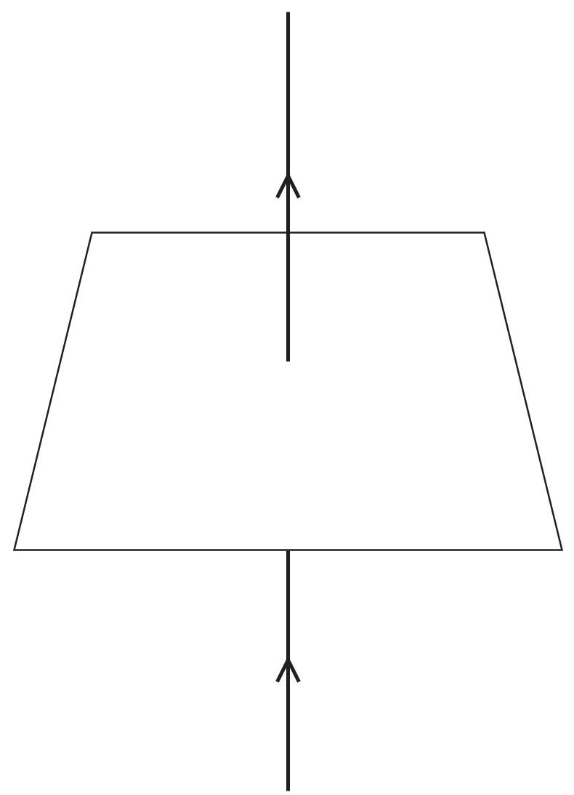

(i) On the diagram, draw the shape and direction of the magnetic field produced by the current in the wire.

(ii) Describe a method that the student could use to show that a magnetic field is produced by the current in the wire.

(b) In a relay, an electromagnet is used to operate a switch.

The diagram shows how the relay is used to turn a lamp on and off in another circuit.

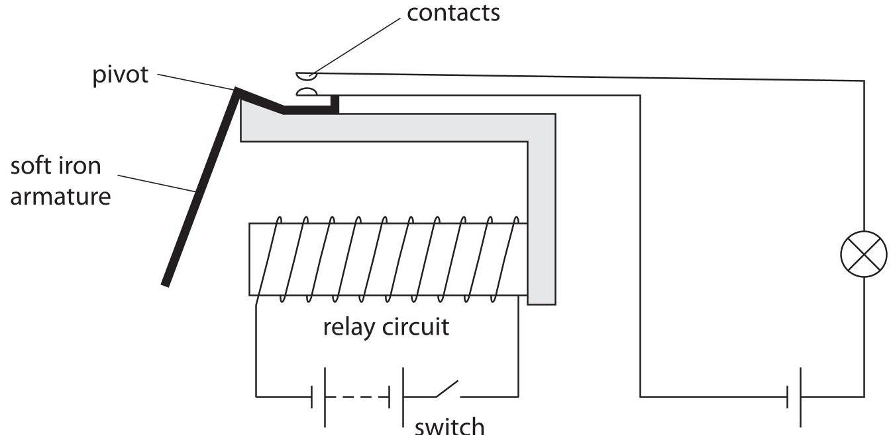

(i) The table gives some statements about how the relay works.

Put numbers in the boxes to show the correct order sequence needed to turn on the lamp.

One has been done for you.

<table border="1"><tr><td>Statements</td><td>Order</td></tr><tr><td>the switch is closed</td><td></td></tr><tr><td>the lamp is on</td><td>6</td></tr><tr><td>the armature is attracted</td><td></td></tr><tr><td>the contacts are pushed together</td><td></td></tr><tr><td>the electromagnet is magnetised</td><td></td></tr><tr><td>the armature rotates</td><td></td></tr></table>

(ii) Explain why the lamp turns off when the switch is opened.

(Total for Question 2 = 10 marks)

3 A teacher uses this apparatus to demonstrate atmospheric pressure.

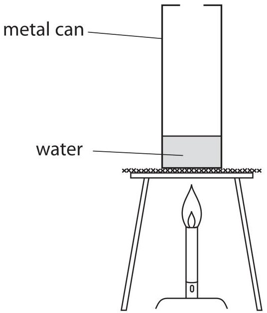

The teacher puts a small amount of water into a metal can and heats it until the water boils.

(a) Describe what happens to the water particles inside the can when the water is heated.

(b) Water in the can boils to form steam.

Describe how the arrangement of particles in the water differs from the arrangement of particles in the steam.

You may draw diagrams to help your answer.

(c) The teacher quickly inverts the can containing boiling water into a bowl of cold water, as shown in the diagram.

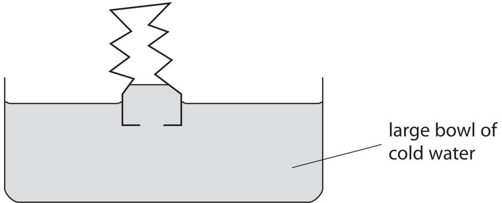

When the can is inverted in the cold water, the can collapses.

Use ideas about particles and pressure to explain why the can collapses.

(Total for Question 3 = 7 marks)

4 This question is about electric charge.

(a) When a balloon is rubbed with a cloth, the balloon becomes negatively charged.Tick （ $ \surd $ ）the two correct statements in the table.

<table border="1"><tr><td>Statement</td><td>Tick</td></tr><tr><td>negatively charged particles move from the cloth onto the balloon</td><td></td></tr><tr><td>positively charged particles are rubbed off the balloon</td><td></td></tr><tr><td>negatively charged particles on the balloon are protons</td><td></td></tr><tr><td>the cloth becomes positively charged</td><td></td></tr></table>

(b) When petrol passes through a delivery pipe, electrostatic charge can build up as shown in the diagram.

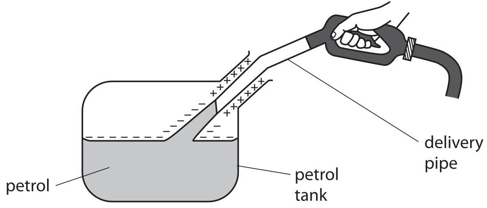

(i) Give a reason why a build-up of charge can be dangerous.

(ii) State how the build-up of electrostatic charge can be prevented.

(c) The diagram shows coffee granules passing through a funnel into a container.

As the granules pass through the funnel, they gain an electrostatic charge and spread out as they fall.

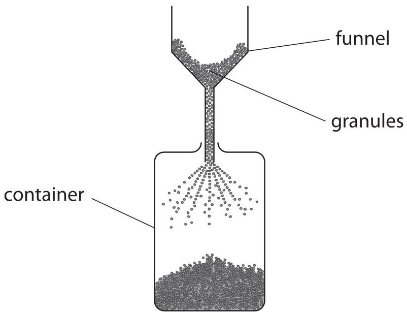

Explain, in terms of charges, why the granules spread out.

(Total for Question 4 = 6 marks)

5 A student uses a dog whistle to produce a high frequency sound wave that cannot be heard by humans.

(a) State the frequency range for human hearing.

(b) The student uses an oscilloscope to display the sound wave.

(i) Name the other piece of apparatus the student would need in order to display the sound wave.

(ii) Describe how the student should use the apparatus to determine the frequency of the sound.

(iii) The student obtains this trace on the oscilloscope.

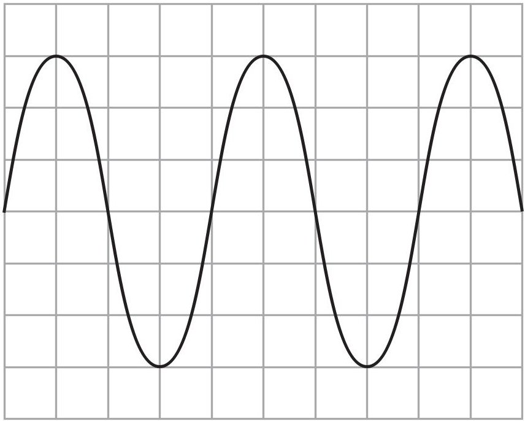

On the grid, draw a trace of a quieter sound with double the frequency.

(Total for Question 5 = 8 marks)

## BLANK PAGE

6 (a) The table shows how the activity of a sample of plutonium-238 varies with time.

<table border="1"><tr><td>Time in years</td><td>0</td><td>50</td><td>100</td><td>150</td><td>200</td><td>250</td></tr><tr><td>Activity in Bq</td><td>980</td><td>660</td><td>450</td><td>305</td><td>205</td><td>140</td></tr></table>

(i) Plot a graph of activity (y-axis) against time (x-axis).

(ii) Draw the curve of best fit.

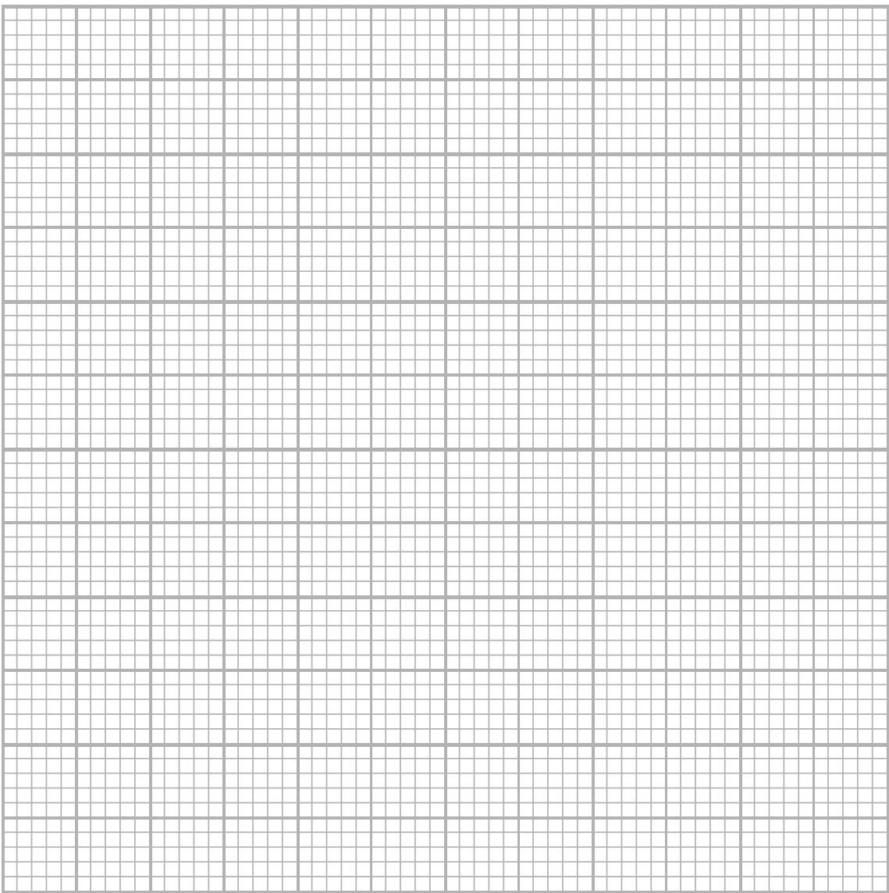

(iii) Use your graph to find the half-life of plutonium-238. Show your working.

(b) Plutonium-238 transfers thermal energy as it decays. This energy is used to power heater units in spacecraft.

The diagram shows a module from a heater unit.

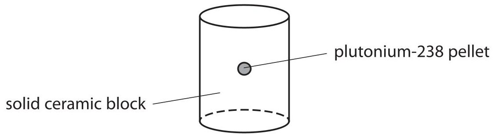

(i) Plutonium-238 transfers thermal energy at a rate of 0.56 W for every gram of plutonium.

Calculate the rate of thermal energy output from a pellet of plutonium-238 with mass 2.7 g.

$$
\mathrm {r a t e o f t h e r m a l e n e r g y o u t p u t} = \mathrm {W}
$$

(ii) When plutonium-238 decays, it only emits alpha particles.

Explain why a technician can hold a module from the heater unit safely in their hand.

(c) A space probe called Cassini was sent to the planet Saturn on a mission that lasted several years.

Plutonium-238 was used to generate electricity on Cassini.

Explain why it was important to use plutonium-238 rather than another isotope with a shorter half-life.

(Total for Question 6 = 12 marks)

7 The table gives some measurements about a raindrop.

<table border="1"><tr><td>mass of raindrop</td><td>0.000 035kg</td></tr><tr><td>distance raindrop falls</td><td>1200m</td></tr><tr><td>speed of raindrop as it hits the ground</td><td>8.8m/s</td></tr></table>

(a) (i) State the relationship between momentum, mass and velocity.

(ii) Calculate the momentum of the raindrop as it hits the ground. Give the unit.

(b) (i) State the equation linking gravitational potential energy, mass, g and height.

(ii) Calculate the change in gravitational potential energy (GPE), when the raindrop falls 1200 m above the ground.

(iii) State the kinetic energy (KE) of the raindrop as it hits the ground. [assume no energy losses]

(c) (i) State the equation linking kinetic energy, mass and speed.

(ii) Show that the speed of the raindrop as it hits the ground would be about 150 m/s. [assume no energy losses]

(iii) Explain why the actual speed of the raindrop as it hits the ground is much less than 150 m/s.

(Total for Question 7 = 14 marks)

TOTAL FOR PAPER=60 MARKS

## BLANK PAGE

Every effort has been made to contact copyright holders to obtain their permission for the use of copyright material. Pearson Education Ltd. will, if notified, be happy to rectify any errors or omissions and include any such rectifications in future editions.

