<table><tr><td colspan="3">Write your name here</td></tr><tr><td>Surname</td><td colspan="2">Other names</td></tr><tr><td>Pearson Edexcel International GCSE</td><td>Centre Number</td><td>Candidate Number</td></tr><tr><td colspan="3">Physics
Unit: 4PH0
Paper: 2P</td></tr><tr><td colspan="2">Thursday 18 January 2018 – Afternoon
Time: 1 hour</td><td>Paper Reference
4PH0/2P</td></tr><tr><td colspan="3">You must have:
Ruler, calculator</td></tr><tr><td colspan="3">Total Marks</td></tr></table>

## Instructions

- Use black ink or ball-point pen.

- Fill in the boxes at the top of this page with your name, centre number and candidate number.

- Answer all questions.

- Answer the questions in the spaces provided - there may be more space than you need.

- Show all the steps in any calculations and state the units.

## Information

- The total mark for this paper is 60.

- The marks for each question are shown in brackets

- use this as a guide as to how much time to spend on each question.

## Advice

- Read each question carefully before you start to answer it.

- Write your answers neatly and in good English.

- Try to answer every question.

- Check your answers if you have time at the end.

Turn over

## EQUATIONS

You may find the following equations useful.

$$
\mathrm {e n e r g y t r a n s f e r r e d} = \mathrm {c u r r e n t} \times \mathrm {v o l t a g e} \times \mathrm {t i m e}
$$

$$
E = I \times V \times t
$$

$$
\mathrm {p r e s s u r e} \times \mathrm {v o l u m e} = \mathrm {c o n s t a n t}
$$

$$
p _ {1} \times V _ {1} = p _ {2} \times V _ {2}
$$

$$
f r e q u e n c y = \frac {1}{t i m e p e r i o d}
$$

$$
f = \frac {1}{T}
$$

$$
\mathrm {p o w e r} = \frac {\mathrm {w o r k d o n e}}{\mathrm {t i m e t a k e n}}
$$

$$
P = \frac {W}{t}
$$

$$
\mathrm {p o w e r} = \frac {\mathrm {e n e r g y t r a n s f e r r e d}}{\mathrm {t i m e t a k e n}}
$$

$$
P = \frac {W}{t}
$$

$$
\mathrm {o r b i t a l s p e e d} = \frac {2 \pi \times \mathrm {o r b i t a l r a d i u s}}{\mathrm {t i m e p e r i o d}}
$$

$$
v = \frac {2 \times \pi \times r}{T}
$$

$$
\frac {\mathrm {p r e s s u r e}}{\mathrm {t e m p e r a t u r e}} = \mathrm {c o n s t a n t}
$$

$$
\frac {p _ {1}}{T _ {1}} = \frac {p _ {2}}{T _ {2}}
$$

$$
\mathrm {f o r c e} = \frac {\mathrm {c h a n g e i n m o m e n t u m}}{\mathrm {t i m e t a k e n}}
$$

Where necessary, assume the acceleration of free fall, $ g=1 0 \mathrm{m} / \mathrm{s}^{2}. $

## Answer ALL questions.

1 (a) The table lists some energy sources.

Put ticks in boxes to show which energy sources are non-renewable.

<table border="1"><tr><td>Energy source</td><td>Tick</td></tr><tr><td>wind</td><td></td></tr><tr><td>oil</td><td></td></tr><tr><td>coal</td><td></td></tr><tr><td>geothermal</td><td></td></tr><tr><td>bio-gas</td><td></td></tr><tr><td>nuclear</td><td></td></tr></table>

(b) Give an advantage and a disadvantage of using fossil fuels to generate electricity.

advantage

disadvantage

(Total for Question 1 = 5 marks)

2 (a) (i) State the relationship between power, current and voltage.

(ii) A lamp with a power of 6.5 W is connected to a 230 V supply. Calculate the current in the lamp.

(b) Three switches, S1, S2 and S3, are used to control a lamp in a large room.

Each switch can be up or down, and each switch can turn the lamp on or off.

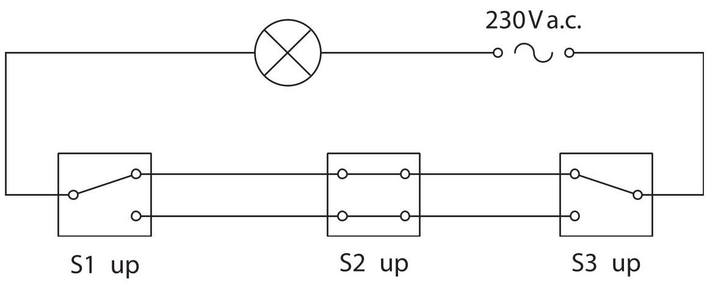

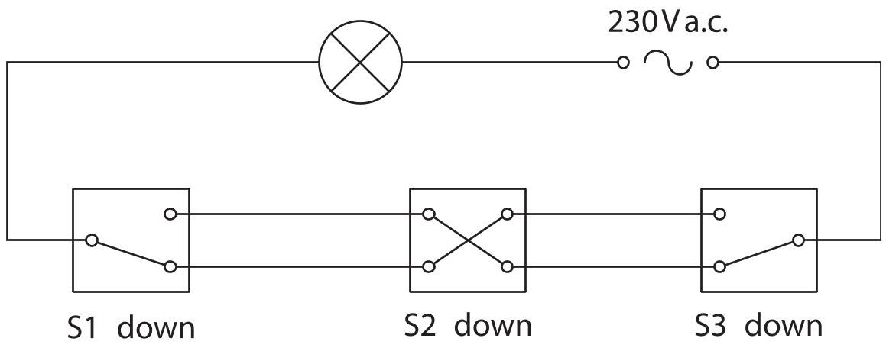

When all three switches are up,the lamp is on.

When all three switches are down,the lamp is off.

Complete the table by giving the missing information.

(3) 

<table border="1"><tr><td>S1</td><td>S2</td><td>S3</td><td>Lamp</td></tr><tr><td>up</td><td>up</td><td>up</td><td>on</td></tr><tr><td>down</td><td>down</td><td>down</td><td>off</td></tr><tr><td>up</td><td>up</td><td>down</td><td></td></tr><tr><td>down</td><td>up</td><td></td><td>off</td></tr><tr><td>up</td><td></td><td>down</td><td>on</td></tr></table>

(Total for Question 2 = 7 marks)

3 A student investigates different properties of waves.

(a) He uses this ripple tank to investigate diffraction.

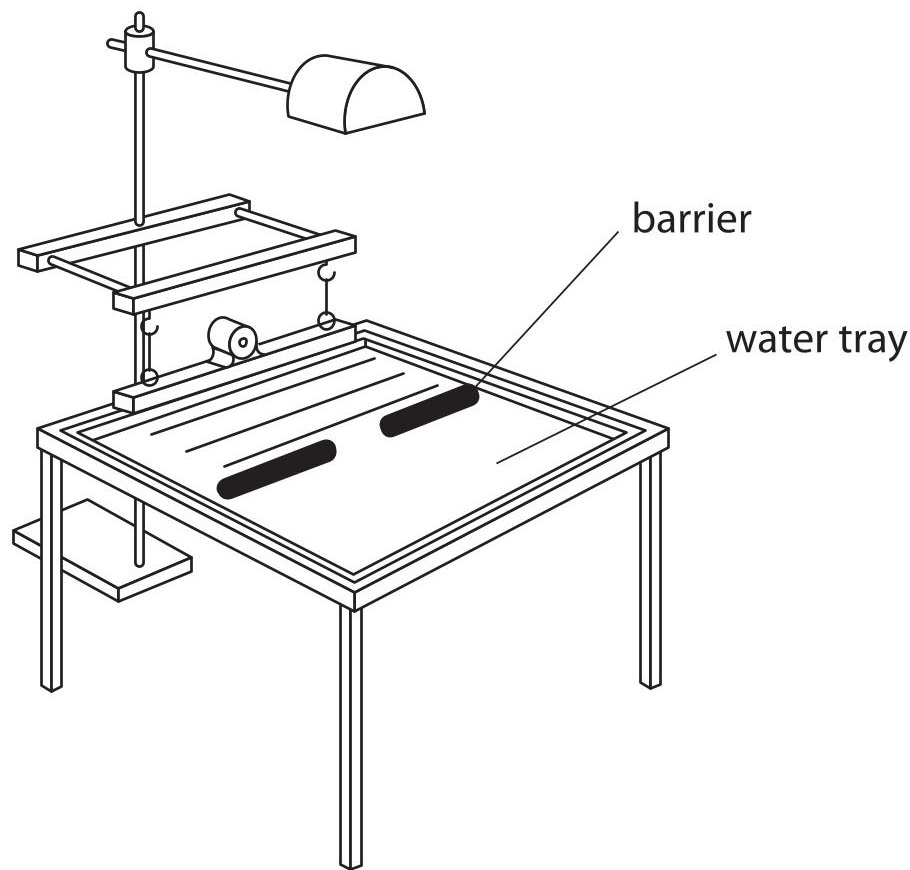

The ripple tank produces plane waves.

These waves hit a barrier with a gap in it.

The student keeps the wavelength constant but varies the size of the gap in the barrier.

Complete the diagrams to show what happens to the plane waves as they go through the different sized gaps in the barrier.

(3) 

(b) The student removes the barrier and investigates what happens when the plane wave travels into a shallow part of the ripple tank.

(i) State the relationship between the speed, frequency and wavelength of a wave.

(ii) Waves in the deep part of the ripple tank have a speed of 6.0 cm/s and a wavelength of 4.0cm.

Waves in the shallow part of the ripple tank have a speed of 4.0 cm/s.

The frequency of the waves stays the same.

Show that the wavelength in the shallow part of the ripple tank is approximately 3 cm.

4 This question is about collisions.

The diagram shows ball A moving in the direction shown by the arrow.

Ball A collides with ball B, a stationary ball of the same mass and size as ball A.

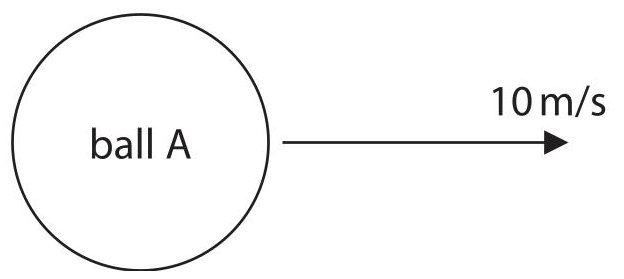

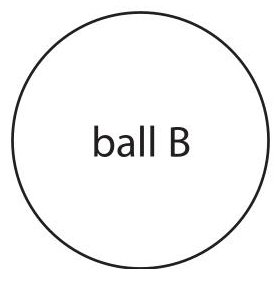

(a) State the principle of conservation of momentum.

(1) 

(b) Ball A collides with ball B.

- before the collision, ball A moves with a velocity of 10m/s

- after the collision, ball B moves in the same direction as ball A with a velocity of 8m/s

- ball A continues to move in the same direction, but at a lower velocity

Calculate the velocity of ball A after the collision. [mass of each ball = 0.16 kg]

(3) 

(c) During the collision some kinetic energy is lost.

Calculate the kinetic energy lost in the collision.

[kinetic energy $ = \frac{1}{2}\times\mathrm{mass}\times\mathrm{velocity}^{2} $]

kinetic energy lost=

(Total for Question 4 = 7 marks)

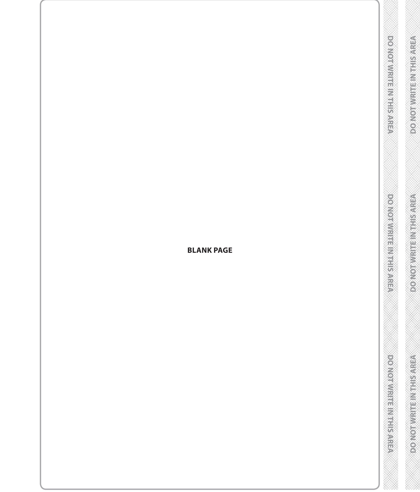

5 A teacher demonstrates the effect of air pressure.

(a) The teacher inflates a balloon and places it inside a bell jar.

He fixes the bell jar firmly to a bench.

He then uses a pump to remove some of the air from the bell jar.

The balloon increases in size.

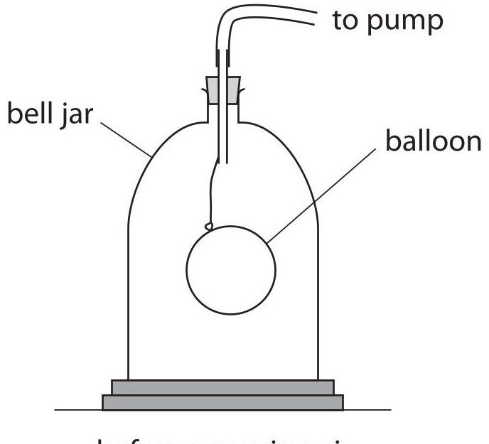

before removing air

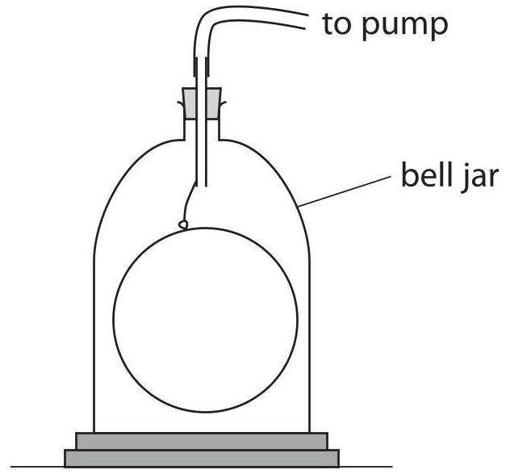

after removing air

Explain, in terms of kinetic theory of particles, why the balloon increases in size.

(4) 

(b) The teacher then sets up this apparatus.

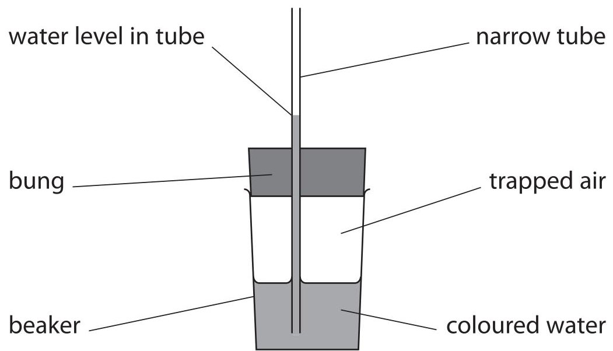

He uses a bung fitted with a narrow tube, and a beaker containing some coloured water. He pushes the bung into the beaker trapping some air. Water rises up the narrow tube.

(i) Explain what would happen to the pressure of the trapped air if the bung is pushed further into the beaker.

(ii) Explain what would happen to the water level in the narrow tube if the bung is pushed further into the beaker.

(iii) Explain what would happen to the water level in the narrow tube if the pressure of the air outside the beaker increases.

(Total for Question 5 = 10 marks)

6 A student uses this apparatus to investigate how the strength of the magnetic field in a current-carrying coil varies as the current changes.

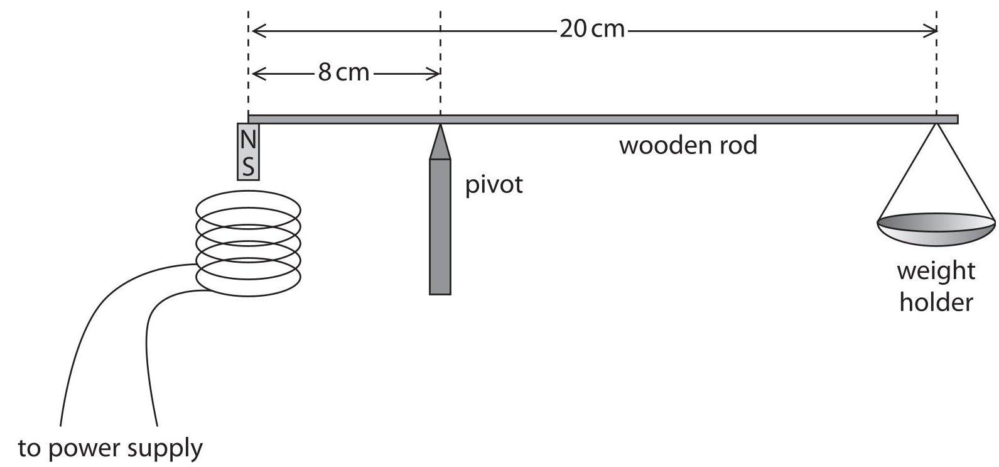

This is the student's method.

- attach a small magnet to one end of a wooden rod

- place the rod on a pivot that is 8cm from the magnet

- attach a weight holder to the other end of the rod

- place a current-carrying coil underneath the magnet

(a) A weight of 0.1 N is needed to balance the rod when the current in the coil is zero.

Calculate the weight of the magnet. [ignore weight of rod and weight holder]

weight of magnet = N

(b) The student increases the current and observes that the rod rotates anticlockwise and the magnet moves towards the coil.

Explain this observation.

(c) The student adds weights to balance the rod for different currents. The table shows her results.

<table border="1"><tr><td>Current in A</td><td>Total weight added in N</td></tr><tr><td>0.0</td><td>0.1</td></tr><tr><td>0.1</td><td>0.5</td></tr><tr><td>0.5</td><td>2.1</td></tr><tr><td>0.7</td><td>2.5</td></tr><tr><td>0.9</td><td>3.7</td></tr><tr><td>1.1</td><td>4.5</td></tr></table>

(i) Plot a graph of the student's results, with the independent variable on the x-axis.

(ii) Draw a straight line of best fit.

(iii) Suggest why the student should repeat the reading for a current of 0.7 A.

(iv) Describe the relationship between the current and the force produced by the magnetic field.

(v) Estimate the weight needed to balance the rod when the current is 2 A.

(Total for Question 6 = 17 marks)

7 A student uses a solution of solvent and oil to estimate the length of an oil molecule.

(a) (i) Name an instrument that the student could use to accurately measure $ 1 0 \mathrm{c m}^{3} $ of the solution.

(ii) The student uses a dropper to produce drops of the solution. There are 2000 drops in $ 1 0 \mathrm{c m}^{3} $ of the solution. Calculate the volume of 1 drop.

volume of 1 drop = ... cm $ ^{3} $

(b) The student adds a drop of the solution to a tray of water. She measures the diameter of the oil film that forms.

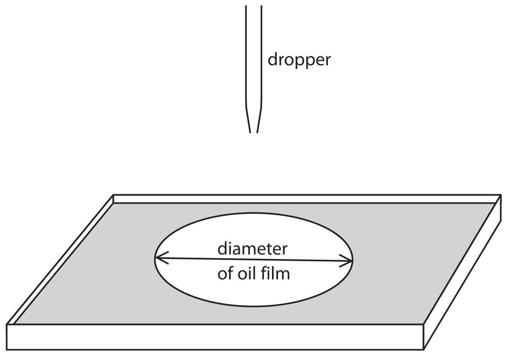

The student measures the diameter of the oil film several times. The table shows her results.

<table border="1"><tr><td>Diameter in mm</td><td>305</td><td>301</td><td>297</td><td>298</td><td>303</td></tr></table>

(i) Calculate the average (mean) diameter of the oil film.

Give your answer to three significant figures.

## average diameter =

(ii) When the drop touches the water, the solvent evaporates and an oil film forms with thickness equal to the length of one oil molecule.

The volume of the oil film is $ 1. 0 \mathrm{m m}^{3}. $

The thickness of the oil film can be found using the formula

$$
\mathrm {v o l u m e} = \pi \mathrm {r} ^ {2} \mathrm {t}
$$

[r = radius of film, t = thickness of film]

Calculate the length of one oil molecule.

length=.

(Total for Question 7 = 7 marks)

## BLANK PAGE

Every effort has been made to contact copyright holders to obtain their permission for the use of copyright material. Pearson Education Ltd. will, if notified, be happy to rectify any errors or omissions and include any such rectifications in future editions.

