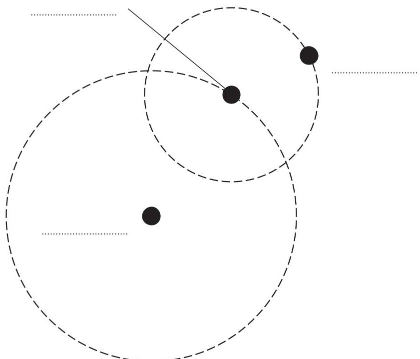
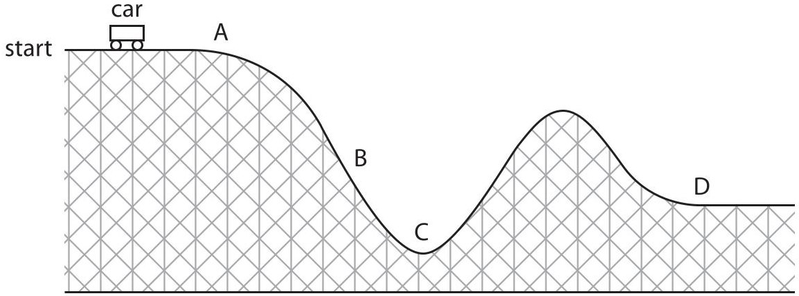
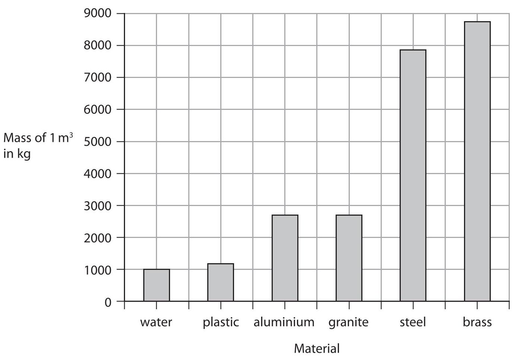
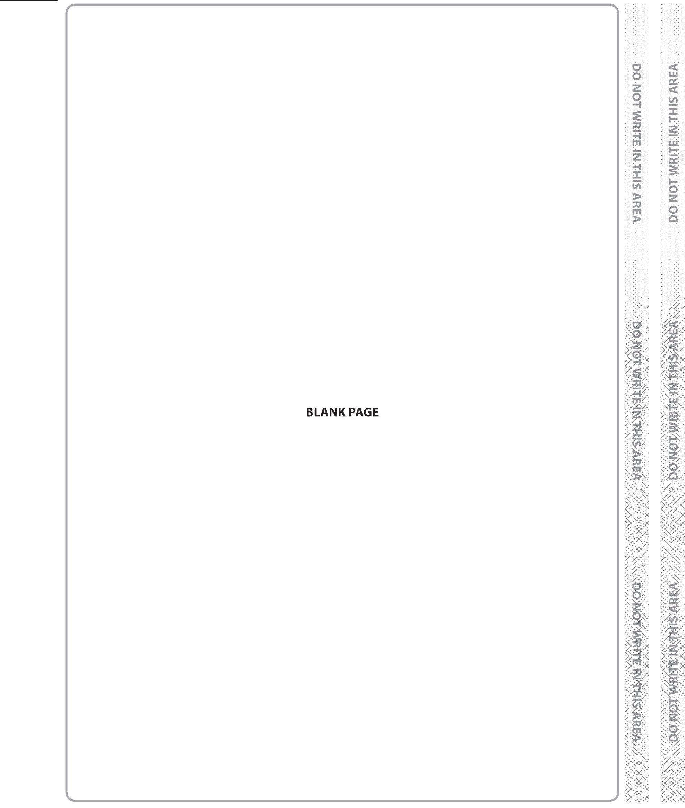
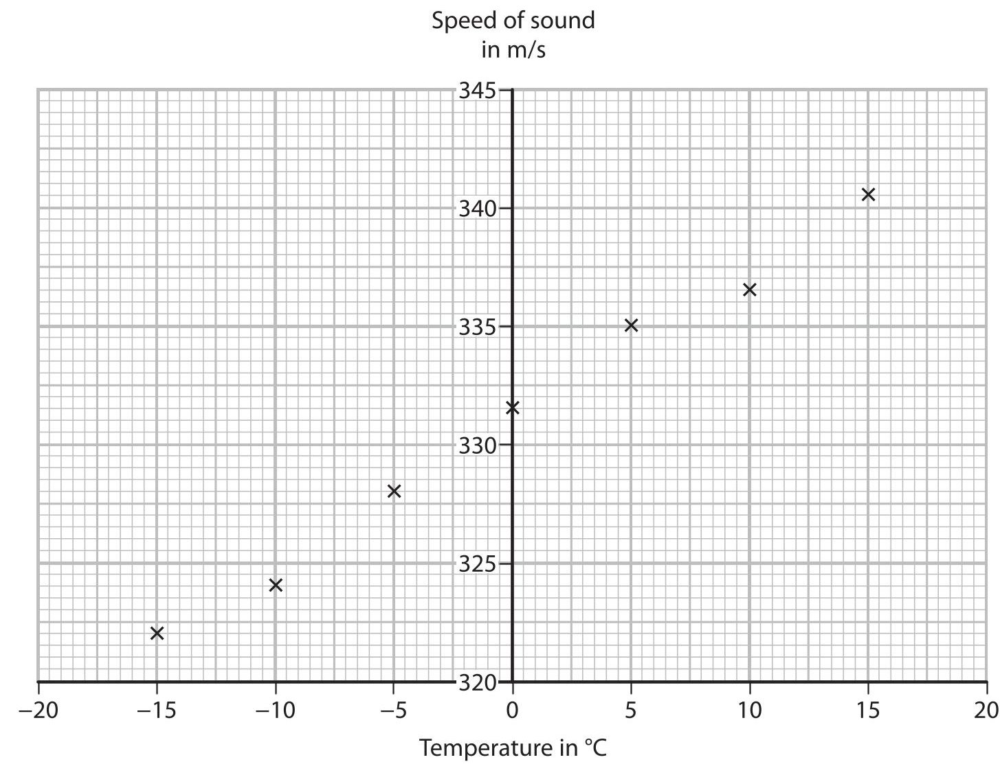
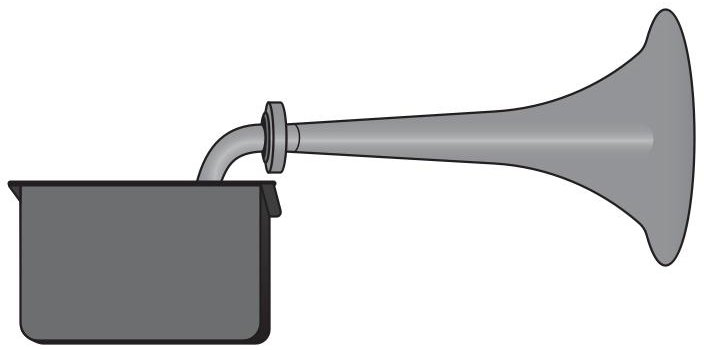
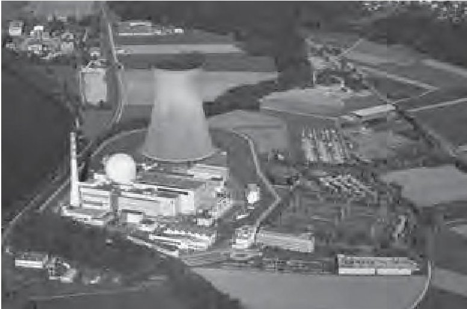
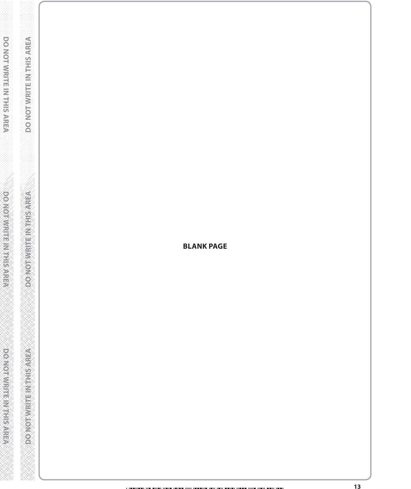
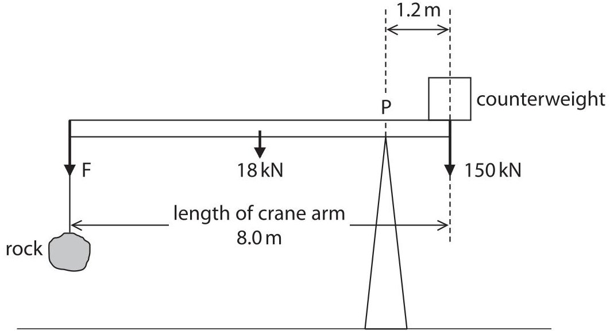

<table><tr><td colspan="3">Please check the examination details below before entering your candidate information</td></tr><tr><td>Candidate surname</td><td colspan="2">Other names</td></tr><tr><td>Pearson Edexcel International GCSE</td><td>Centre Number</td><td>Candidate Number</td></tr><tr><td colspan="3">Thursday 17 January 2019</td></tr><tr><td>Afternoon (Time: 1 hour)</td><td colspan="2">Paper Reference 4PH0/2P</td></tr><tr><td colspan="3">Physics
Unit: 4PH0
Paper: 2P</td></tr><tr><td colspan="2">You must have:
Calculator, ruler</td><td>Total Marks</td></tr></table>

## Instructions

- Use black ink or ball-point pen.

- Fill in the boxes at the top of this page with your name, centre number and candidate number.

- Answer all questions.

- Answer the questions in the spaces provided

- there may be more space than you need.

- Show all the steps in any calculations and state the units.

## Information

- The total mark for this paper is 60.

- The marks for each question are shown in brackets

## Advice

- use this as a guide as to how much time to spend on each question.

- Read each question carefully before you start to answer it.

- Write your answers neatly and in good English.

- Try to answer every question.

- Check your answers if you have time at the end.

Turn over

## EQUATIONS

You may find the following equations useful.

$$
\mathrm {e n e r g y t r a n s f e r r e d} = \mathrm {c u r r e n t} \times \mathrm {v o l t a g e} \times \mathrm {t i m e}
$$

$$
E = I \times V \times t
$$

$$
\mathrm {p r e s s u r e} \times \mathrm {v o l u m e} = \mathrm {c o n s t a n t}
$$

$$
p _ {1} \times V _ {1} = p _ {2} \times V _ {2}
$$

$$
\mathrm {f r e q u e n c y} = \frac {1}{\mathrm {t i m e p e r i o d}}
$$

$$
f = \frac {1}{T}
$$

$$
\mathrm {p o w e r} = \frac {\mathrm {w o r k d o n e}}{\mathrm {t i m e t a k e n}}
$$

$$
P = \frac {W}{t}
$$

$$
\mathrm {p o w e r} = \frac {\mathrm {e n e r g y t r a n s f e r r e d}}{\mathrm {t i m e t a k e n}}
$$

$$
P = \frac {W}{t}
$$

$$
\mathrm {o r b i t a l s p e e d} = \frac {2 \pi \times \mathrm {o r b i t a l r a d i u s}}{\mathrm {t i m e p e r i o d}}
$$

$$
v = \frac {2 \times \pi \times r}{T}
$$

$$
\frac {\mathrm {p r e s s u r e}}{\mathrm {t e m p e r a t u r e}} = \mathrm {c o n s t a n t}
$$

$$
\frac {p _ {1}}{T _ {1}} = \frac {p _ {2}}{T _ {2}}
$$

$$
\mathrm {f o r c e} = \frac {\mathrm {c h a n g e i n m o m e n t u m}}{\mathrm {t i m e t a k e n}}
$$

Where necessary, assume the acceleration of free fall, $ g=1 0 \mathrm{~ m} / \mathrm{s}^{2}. $

## Answer ALL questions.

1 Planets and moons in the Solar System move in orbits.

(a) Name the force that causes planets and moons to move in orbits.

(b) The diagram shows the orbits of a planet and a moon in the Solar System. The diagram is not to scale.

(i) On the diagram, label the planet, the moon and the Sun.

(ii) Explain how the time period of the moon's orbit is different to the time period of the planet's orbit.

(Total for Question 1 = 5 marks)

2 (a) Describe what is meant by the term vector quantity.

(b) Complete the table by ticking ( $ \surd $ ) the correct boxes to show whether each quantity is a scalar or a vector.

The first one has been done for you.

<table border="1"><tr><td>Quantity</td><td>Scalar</td><td>Vector</td></tr><tr><td>energy</td><td>√</td><td></td></tr><tr><td>speed</td><td></td><td></td></tr><tr><td>weight</td><td></td><td></td></tr><tr><td>acceleration</td><td></td><td></td></tr><tr><td>charge</td><td></td><td></td></tr><tr><td>moment</td><td></td><td></td></tr></table>

(Total for Question 2 = 5 marks)

3 The diagram shows part of a roller coaster ride.

The car is pulled towards point A and then released.

(a) Choose letters from the diagram to complete this sentence.

The car experiences the greatest downwards acceleration at point

and it has the most kinetic energy at point.

(b) The maximum gravitational potential energy of the car is 380 kJ. The maximum height of the car is 45 m. Calculate the mass of the car. [gravitational potential energy = mass $ \times $ g $ \times $ height]

(Total for Question 3 = 5 marks)

4 (a) A copper cube has a mass of 0.0717 kg.

(i) Calculate the weight of this copper cube. Give the unit.

(ii) State the equation linking density, mass and volume.

(iii) The density of copper in this cube is $ 8 9 6 0 \mathrm{k g} / \mathrm{m}^{3}. $ Calculate the volume of this copper cube.

(b) The graph shows the masses of some materials when their volume is $ 1 \mathrm{m}^{3}. $

(i) State the type of graph shown.

(ii) Use information from the graph to compare the densities of granite and steel.

(Total for Question 4 = 8 marks)

5 This question is about sound.

(a) Describe an investigation to measure the speed of sound in air. You may draw a diagram to help your answer.

(b) The speed of sound changes when the temperature changes.

A student investigates how the speed of sound in air varies with temperature.

The student's results are shown on the graph.

(i) Draw a line of best fit on the graph.

(ii) Use the graph to find the speed of sound when the air temperature is $ 2 0^{\circ} \mathrm{C}. $

$$
s p e e d o f s o u n d =
$$

(iii) A ship moves about in fog.

A foghorn is used to make a loud, low-pitched sound to warn any nearby ships.

The air temperature decreases while the foghorn emits sound waves of a constant frequency.

Explain how this decrease in temperature affects the wavelength of the sound waves.

(Total for Question 5 = 11 marks)

6 An energy company plans to build a new nuclear power station.

© Bildagentur Zoonar GmbH/Shutterstock

Discuss the advantages and disadvantages of using a nuclear power station to generate electricity.

advantages..

disadvantages.

(Total for Question 6 = 4 marks)

7 The photograph shows an electrical appliance plug containing a step-down transformer.

(a) Compare the number of turns on the primary coil of a step-down transformer with the number of turns on its secondary coil.

(b) This transformer is designed to reduce the voltage from 230V to 5.5V. The secondary current is 1.0A.

(i) State the equation linking primary voltage, primary current, secondary voltage and secondary current for a transformer.

(ii) Calculate the primary current in the transformer. [assume the transformer is 100% efficient]

(c) A student notices that the electrical appliance plug becomes warm when the appliance is working.

Suggest how this will affect the input to the transformer.

[secondary voltage and secondary current do not change]

(Total for Question 7 = 6 marks)

8 The simplified diagram shows a crane being used to lift a large rock. The diagram is not to scale.

(a) The table gives information about the forces acting on the uniform crane arm. Complete the table by giving the missing information.

(1) 

<table border="1"><tr><td>Force</td><td>Name of force</td></tr><tr><td>F</td><td>weight of rock</td></tr><tr><td>150kN</td><td>weight of counterweight</td></tr><tr><td>18kN</td><td></td></tr></table>

(b) (i) State the equation linking moment, force and perpendicular distance from the pivot.

(ii) Calculate the clockwise moment of the weight of the counterweight about the pivot, P.

(2) 

(c) (i) State the principle of moments.

(ii) Calculate the weight of the rock.

<table><tr><td>weight = ... N</td></tr><tr><td>(Total for Question 8 = 8 marks)</td></tr></table>

The toy train is released from rest and rolls down the slope.

9 A student investigates the motion of a toy train.

(a) The toy train has a mass of 0.039kg.

The toy train moves with a velocity of 0.56 m/s when it reaches the bottom of the slope.

(i) State the equation linking momentum, mass and velocity.

(ii) Calculate the momentum of the toy train when it reaches the bottom of the slope.

(iii) The toy train hits the truck and they stick together.

The train and truck move away together with a velocity of 0.26 m/s.

Calculate the mass of the truck.

## QUESTION 9 CONTINUES ON PAGE 20

(b) The student repeats the investigation using another identical truck connected to the first truck.

The student releases the toy train from the top of the slope in the same way as before.

The toy train hits the trucks and they stick together.

The toy train and trucks move away together.

The student concludes

"The two trucks are identical, so their velocity will be the same as when there was just one truck."

Discuss whether the student's conclusion is correct or not.

(Total for Question 9 = 8 marks)

TOTAL FOR PAPER = 60 MARKS

