<table><tr><td colspan="2">Please check the examination details below before entering your candidate information</td></tr><tr><td>Candidate surname</td><td>Other names</td></tr><tr><td colspan="2">Centre Number</td></tr><tr><td colspan="2">Candidate Number</td></tr><tr><td colspan="2">Pearson Edexcel
International GCSE (9-1)</td></tr><tr><td colspan="2">Friday 14 June 2019</td></tr><tr><td>Morning (Time: 1 hour 15 minutes)</td><td>Paper Reference 4PH1/2P</td></tr><tr><td colspan="2">Physics
Unit: 4PH1
Paper 2P</td></tr><tr><td colspan="2">You must have:
Calculator, ruler</td></tr><tr><td colspan="2">Total Marks</td></tr></table>

## Instructions

- Use black ink or ball-point pen.

- Fill in the boxes at the top of this page with your name, centre number and candidate number.

- Answer all questions.

- Answer the questions in the spaces provided - there may be more space than you need.

- Show all the steps in any calculations and state the units.

- Some questions must be answered with a cross in a box . If you change your mind about an answer, put a line through the box and then mark your new answer with a cross.

## Information

- The total mark for this paper is 70.

- The marks for each question are shown in brackets

- use this as a guide as to how much time to spend on each question.

- Write your answers neatly and in good English.

## Advice

- Read each question carefully before you start to answer it.

- Try to answer every question.

- Check your answers if you have time at the end.

Turn over

## FORMULAE

You may find the following formulae useful.

$$
\mathrm {e n e r g y t r a n s f e r r e d} = \mathrm {c u r r e n t} \times \mathrm {v o l t a g e} \times \mathrm {t i m e}
$$

$$
E = I \times V \times t
$$

$$
f r e q u e n c y = \frac {1}{t i m e p e r i o d}
$$

$$
f = \frac {1}{T}
$$

$$
\mathrm {p o w e r} = \frac {\mathrm {w o r k d o n e}}{\mathrm {t i m e t a k e n}}
$$

$$
P = \frac {W}{t}
$$

$$
\mathrm {p o w e r} = \frac {\mathrm {e n e r g y t r a n s f e r r e d}}{\mathrm {t i m e t a k e n}}
$$

$$
P = \frac {W}{t}
$$

$$
\mathrm {o r b i t a l s p e e d} = \frac {2 \pi \times \mathrm {o r b i t a l r a d i u s}}{\mathrm {t i m e p e r i o d}}
$$

$$
v = \frac {2 \times \pi \times r}{T}
$$

(final speed) $ ^{2} $ = (initial speed) $ ^{2} $ + (2 $ \times $ acceleration $ \times $ distance moved)

$$
v ^ {2} = u ^ {2} + (2 \times a \times s)
$$

$$
\mathrm {p r e s s u r e} \times \mathrm {v o l u m e} = \mathrm {c o n s t a n t}
$$

$$
p _ {1} \times V _ {1} = p _ {2} \times V _ {2}
$$

$$
\frac {\mathrm {p r e s s u r e}}{\mathrm {t e m p e r a t u r e}} = \mathrm {c o n s t a n t}
$$

$$
\frac {p _ {1}}{T _ {1}} = \frac {p _ {2}}{T _ {2}}
$$

$$
\mathrm {f o r c e} = \frac {\mathrm {c h a n g e i n m o m e n t u m}}{\mathrm {t i m e t a k e n}}
$$

$$
F = \frac {(m v - m u)}{t}
$$

$$
\frac {\mathrm {c h a n g e o f w a v e l e n g t h}}{\mathrm {w a v e l e n g t h}} = \frac {\mathrm {v e l o c i t y o f a g a l a y}}{\mathrm {s p e e d o f l i g h t}}
$$

$$
\frac {\lambda - \lambda_ {0}}{\lambda_ {0}} = \frac {\Delta \lambda}{\lambda_ {0}} = \frac {v}{c}
$$

change in thermal energy = mass $ \times $ specific heat capacity $ \times $ change in temperature

$$
\Delta Q = m \times c \times \Delta T
$$

Where necessary, assume the acceleration of free fall, g=10 m/s $ ^{2}. $

## Answer ALL questions.

1 (a) Which force is responsible for keeping satellites in orbit?

A electrostatic

B gravitational

C magnetic

D nuclear

(b) Which of these is the largest?

A galaxy

B planet

C star

D universe

(c) Which of these represents the brightness of stars at a standard distance?

A absolute magnitude

B colour

C diameter

D temperature

(Total for Question 1 = 3 marks)

2 A student investigates a transformer.

This is the student's method.

- use a primary coil with 10 turns

- connect the primary coil to a constant maximum input voltage

- measure the output voltage across the secondary coil

- repeat using an increasing number of turns on the primary coil

The table shows the student's results.

<table border="1"><tr><td>Number of turns on primary coil</td><td>Output voltage inV</td></tr><tr><td>10</td><td>39.6</td></tr><tr><td>20</td><td>19.7</td></tr><tr><td>40</td><td>9.9</td></tr><tr><td>60</td><td>6.6</td></tr><tr><td>80</td><td>5.0</td></tr><tr><td>100</td><td>4.0</td></tr></table>

(a) (i) Plot a graph of the student's results on the grid.

(ii) Draw a curve of best fit.

(1) 

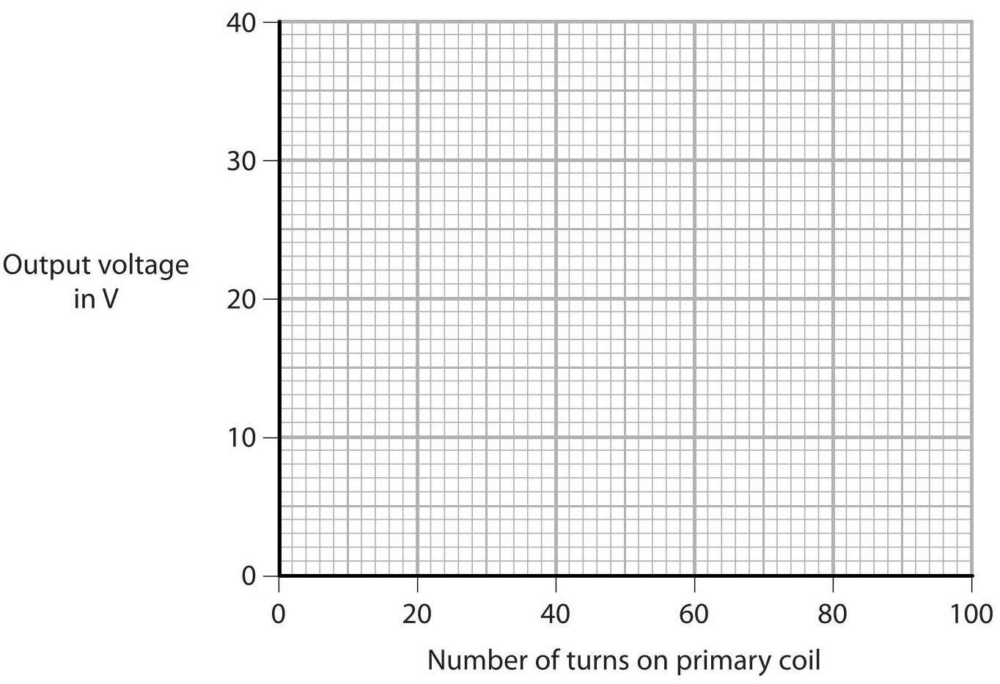

(iii) Describe the relationship between the output voltage and the number of turns on the primary coil.

(b) (i) State the formula linking input and output voltages and the turns ratio for the transformer.

(ii) The input voltage of the transformer is 6.8 V.

Calculate the number of turns on the secondary coil.

(Total for Question 2 = 7 marks)

3 This question is about sound waves.

(a) Describe an experiment to measure the speed of sound in air. You may draw a diagram to help your answer.

(b) An oscilloscope can be used to determine the frequency of a sound wave.

The diagram shows an oscilloscope trace of a sound wave.

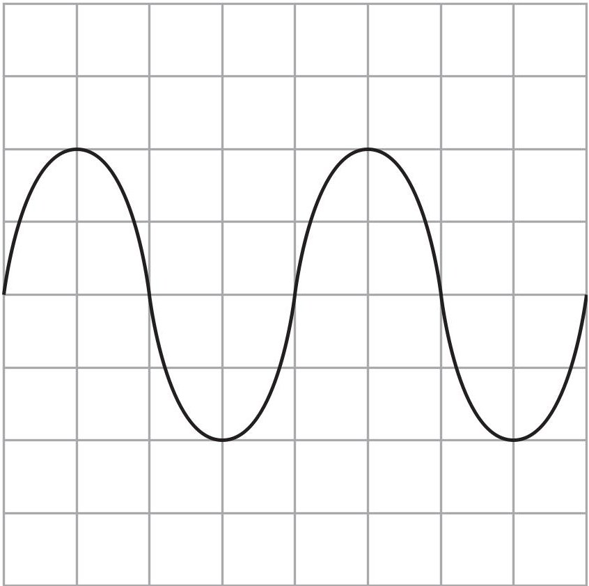

## Oscilloscope settings

y direction:1 square=1V

x direction: 1 square=0.25ms

(i) Calculate the period of this sound wave.

(3) 

(ii) Calculate the frequency of this sound wave.

period = ... s

(2) 

frequency = ... Hz

(Total for Question 3 = 10 marks)

4 This is a question about alpha particles.

(a) Describe the nature of an alpha particle.

(b) The diagram shows the path of an alpha particle as it passes close to a nucleus.

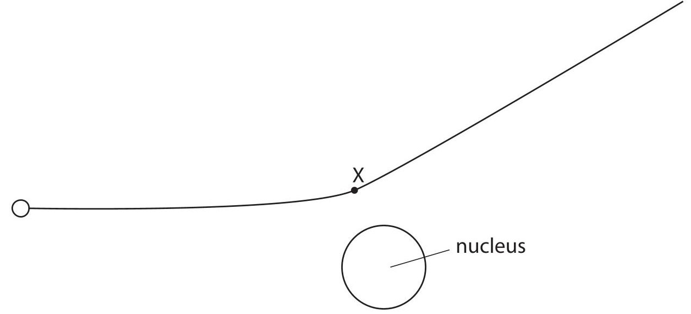

(i) Draw an arrow from point X to show the force on the alpha particle due to the nucleus. Label this force Y.

(ii) Draw an arrow to show the force on the nucleus due to the alpha particle. Label this force Z.

(iii) Explain how the path of the alpha particle shows whether the nucleus is positive, negative or neutral.

(c) The alpha particle experiences a resultant force of 3.6N and has a mass of $ 6. 6 \times1 0^{-2 7} $ kg. Calculate the acceleration of the alpha particle.

<table><tr><td>acceleration = ... m/s²</td></tr><tr><td>(Total for Question 4 = 11 marks)</td></tr></table>

5 A toy produces continuous waves when floating on the surface of a pool of water. The waves spread out as circular wavefronts.

Diagram 1 shows the wavefronts produced when the toy is not moving, as viewed from above.

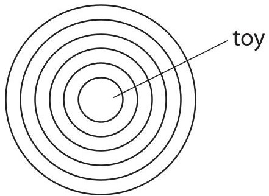

Diagram 1

Diagram 2 shows the wavefronts produced when the toy is moving across the surface of the pool of water.

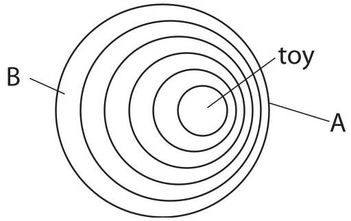

Diagram 2

(a) Draw an arrow on diagram 2 to show the direction the toy is moving.

(b) Explain how the frequency of the waves at point A is different to the frequency of the waves at point B.

(Total for Question 5 = 5 marks)

6 A dog sits on a water-filled bag to keep cool.

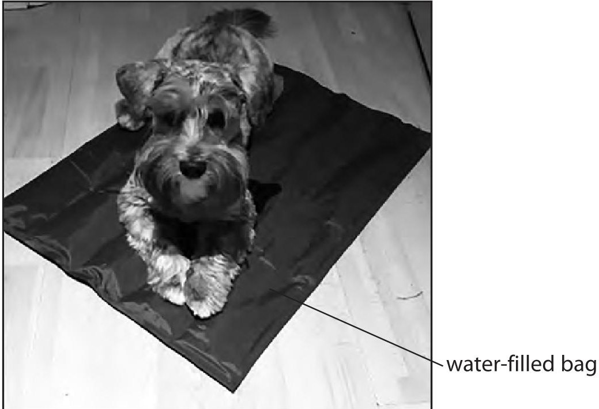

(a) The table shows some data about the dog and the water in the bag.

<table border="1"><tr><td>mass of water in kg</td><td>8.7</td></tr><tr><td>power output of dog by heating in W</td><td>75</td></tr><tr><td>specific heat capacity of water in J/kg $ ^{\circ} \mathrm{C} $</td><td>4200</td></tr><tr><td>initial temperature of water in $ ^{\circ} \mathrm{C} $</td><td>16</td></tr></table>

The dog sits on the bag for 22 minutes.

(i) Calculate the energy transferred from the dog to the water by heating in 22 minutes.

(ii) State an assumption you have made when calculating the energy transferred.

(iii) Calculate the temperature of the water after 22 minutes.

(b) Discuss why conduction is the main way that thermal energy is transferred from the dog to the water.

(Total for Question 6 = 11 marks)

7 (a) Give two pieces of evidence for the Big Bang theory.

(b) Explain how this evidence supports the Big Bang theory.

(Total for Question 7 = 6 marks)

8 The diagram shows a bottle supported by a finger.

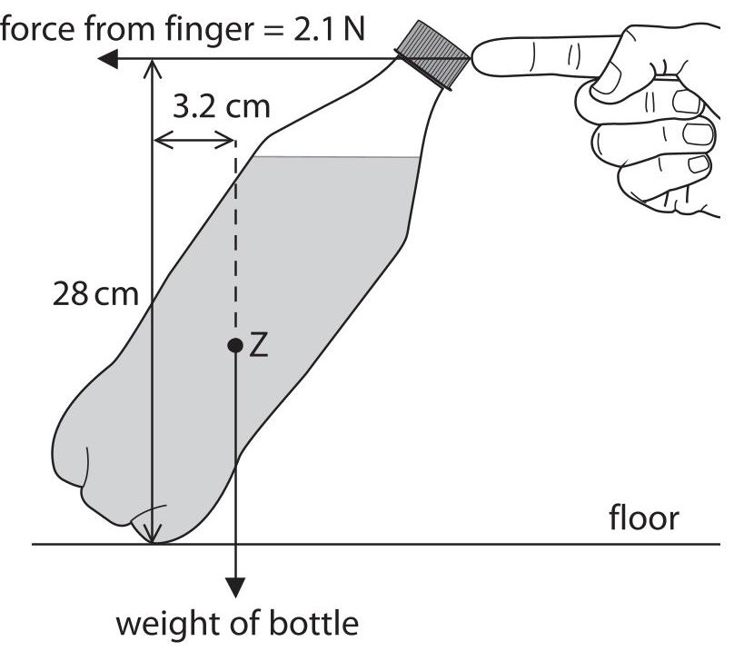

not to scale

(a) State the name of point Z.

(b) (i) State the formula linking moment, force and perpendicular distance from the pivot.

(ii) The bottle does not move. Calculate the weight of the bottle.

(Total for Question 8 = 6 marks)

9 This is a question about a melting ice cube.

(a) The diagram shows an ice cube placed on the ground.

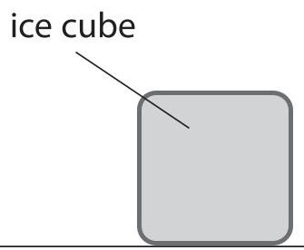

(i) The mass of the ice cube is 3.7 g and its area of contact with the ground is $ 2. 6 \times1 0^{-4} \mathrm{m}^{2}. $

Calculate the pressure the ice cube exerts on the ground.

## pressure=

(ii) The ice cube melts and becomes a puddle with a larger cross-sectional area. Explain how the pressure of the ice cube on the ground changes when it melts.

(b) Ice melts at a temperature of $ 0^{\circ} \mathrm{C}. $

On the axes, sketch how the temperature of the ice cube changes as it rises from a temperature of $ - 1 0^{\circ} \mathrm{C} $ to a temperature of $ 2 0^{\circ} \mathrm{C}. $

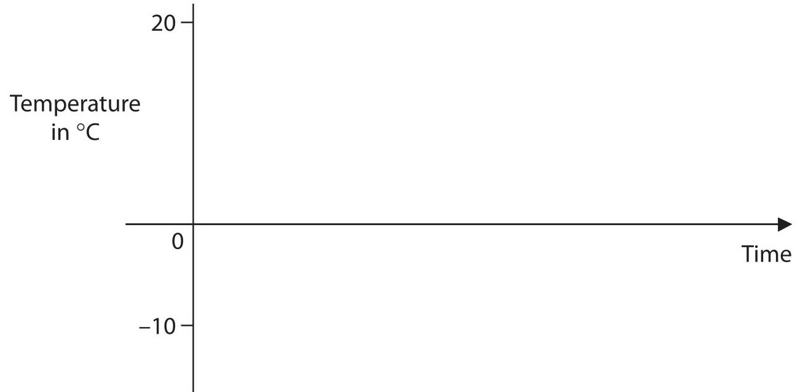

(c) Explain the changes that occur when a solid melts.

Refer to particles in your answer.

(Total for Question 9 = 11 marks)

TOTAL FOR PAPER = 70 MARKS

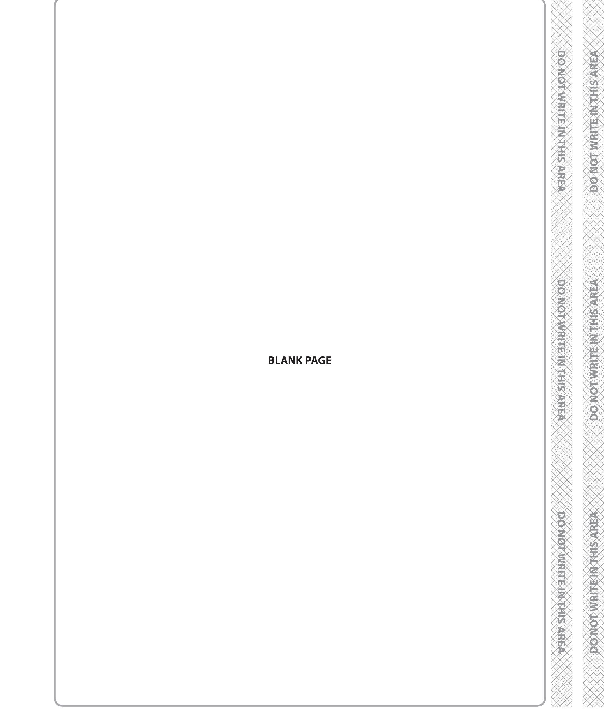

## BLANK PAGE

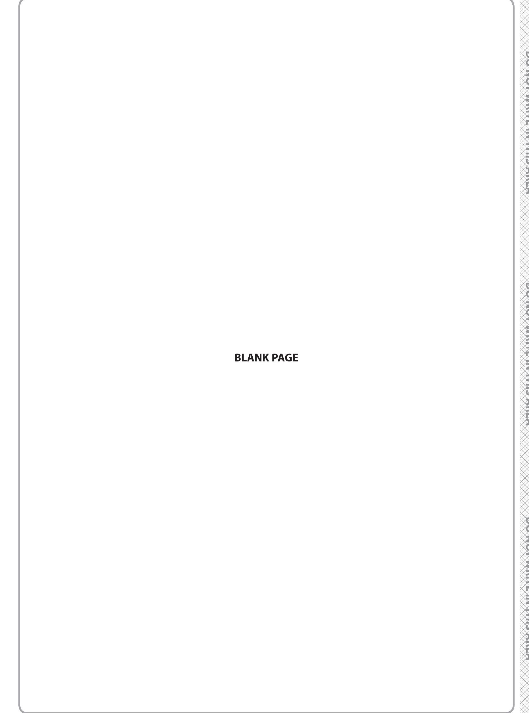

