<table><tr><td colspan="4">Please check the examination details below before entering your candidate information</td></tr><tr><td>Candidate surname</td><td colspan="3">Other names</td></tr><tr><td colspan="4">Centre Number Candidate Number</td></tr><tr><td colspan="4">Pearson Edexcel International GCSE (9-1)</td></tr><tr><td colspan="4">Friday 12 June 2020</td></tr><tr><td>Morning (Time: 1 hour 15 minutes)</td><td colspan="3">Paper Reference 4PH1/2P</td></tr><tr><td colspan="4">Physics
Unit: 4PH1
Paper: 2P</td></tr><tr><td colspan="4">You must have:
Ruler, calculator</td></tr><tr><td colspan="4">Total Marks</td></tr></table>

## Instructions

- Use black ink or ball-point pen.

- Fill in the boxes at the top of this page with your name, centre number and candidate number.

- Answer all questions.

- Answer the questions in the spaces provided

- there may be more space than you need.

- Show all the steps in any calculations and state the units.

- Some questions must be answered with a cross in a box . If you change your mind about an answer, put a line through the box and then mark your new answer with a cross.

## Information

- The total mark for this paper is 70.

- The marks for each question are shown in brackets

- use this as a guide as to how much time to spend on each question.

## Advice

- Read each question carefully before you start to answer it.

- Write your answers neatly and in good English.

- Try to answer every question.

- Check your answers if you have time at the end.

Turn over

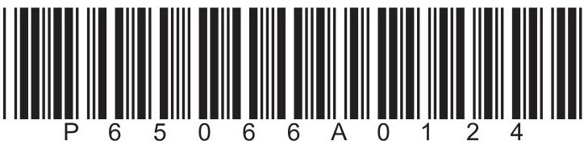

## FORMULAE

You may find the following formulae useful.

$$
\mathrm {e n e r g y t r a n s f e r r e d} = \mathrm {c u r r e n t} \times \mathrm {v o l t a g e} \times \mathrm {t i m e}
$$

$$
E = I \times V \times t
$$

$$
f r e q u e n c y = \frac {1}{t i m e p e r i o d}
$$

$$
f = \frac {1}{T}
$$

$$
\mathrm {p o w e r} = \frac {\mathrm {w o r k d o n e}}{\mathrm {t i m e t a k e n}}
$$

$$
P = \frac {W}{t}
$$

$$
\mathrm {p o w e r} = \frac {\mathrm {e n e r g y t r a n s f e r r e d}}{\mathrm {t i m e t a k e n}}
$$

$$
P = \frac {W}{t}
$$

$$
\mathrm {o r b i t a l s p e e d} = \frac {2 \pi \times \mathrm {o r b i t a l r a d i u s}}{\mathrm {t i m e p e r i o d}}
$$

$$
v = \frac {2 \times \pi \times r}{T}
$$

(final speed) $ ^{2} $ = (initial speed) $ ^{2} $ + (2 $ \times $ acceleration $ \times $ distance moved)

$$
v ^ {2} = u ^ {2} + (2 \times a \times s)
$$

$$
\mathrm {p r e s s u r e} \times \mathrm {v o l u m e} = \mathrm {c o n s t a n t}
$$

$$
p _ {1} \times V _ {1} = p _ {2} \times V _ {2}
$$

$$
\frac {\mathrm {p r e s s u r e}}{\mathrm {t e m p e r a t u r e}} = \mathrm {c o n s t a n t}
$$

$$
\frac {p _ {1}}{T _ {1}} = \frac {p _ {2}}{T _ {2}}
$$

$$
\mathrm {f o r c e} = \frac {\mathrm {c h a n g e i n m o m e n t u m}}{\mathrm {t i m e t a k e n}}
$$

$$
F = \frac {(m v - m u)}{t}
$$

$$
\frac {\mathrm {c h a n g e o f w a v e l e n g t h}}{\mathrm {w a v e l e n g t h}} = \frac {\mathrm {v e l o c i t y o f a g a l a x y}}{\mathrm {s p e e d o f l i g h t}}
$$

$$
\frac {\lambda - \lambda_ {0}}{\lambda_ {0}} = \frac {\Delta \lambda}{\lambda_ {0}} = \frac {v}{c}
$$

change in thermal energy = mass $ \times $ specific heat capacity $ \times $ change in temperature

$$
\Delta Q = m \times c \times \Delta T
$$

Where necessary, assume the acceleration of free fall, $ g=1 0 \mathrm{m} / \mathrm{s}^{2}. $

## BLANK PAGE

## Answer ALL questions.

1 This question is about liquid nitrogen.

(a) (i) The diagram shows the arrangement of particles in solid nitrogen. Draw the arrangement of particles in liquid nitrogen.

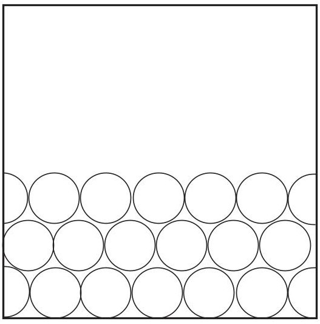

solid

liquid

(ii) Describe the motion of the particles in liquid nitrogen.

(b) A teacher uses this method to find the density of liquid nitrogen.

- measure the mass of a container

- pour liquid nitrogen into the container

- measure the total mass of the container and the liquid nitrogen

- read the volume of the liquid nitrogen from the scale on the side of the container

(i) Give a safety precaution the teacher should take when pouring the liquid nitrogen.

(ii) State the name of the apparatus that the teacher should use to measure the mass of the container.

(iii) The table shows the teacher's results.

<table border="1"><tr><td>mass of container in g</td><td>75</td></tr><tr><td>mass of container + liquid nitrogen in g</td><td>149</td></tr><tr><td>volume of liquid nitrogen in cm3</td><td>88</td></tr></table>

Calculate the mass of liquid nitrogen in the container.

(iv) State the formula linking density, mass and volume.

(v) Calculate the density of the liquid nitrogen.

Give a suitable unit.

(c) Over time, the liquid nitrogen warms up and changes state from a liquid into a gas.

Describe the changes to the arrangement and motion of particles when the liquid nitrogen changes state.

(Total for Question 1 = 13 marks)

## BLANK PAGE

2 This question is about a demonstration to show the link between current and charge. The diagram shows two metal plates, X and Y, with a metal ball moving between them.

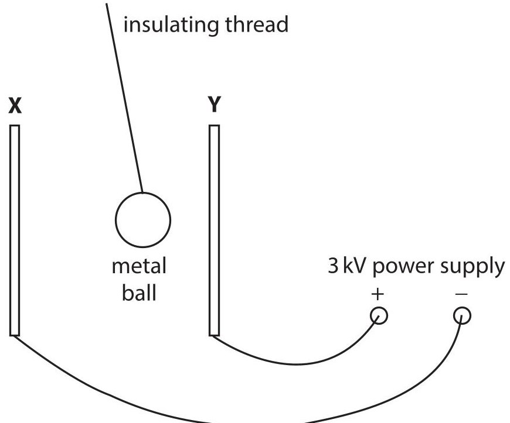

(a) The two metal plates have no charge before the power supply is connected.

When plate Y is connected to the positive terminal of the power supply, the plate becomes positively charged.

Explain how plate Y gains a positive charge.

(b) (i) The metal ball becomes positively charged when it touches plate Y. The metal ball then moves away from plate Y towards plate X. Explain why the metal ball moves away from plate Y.

(ii) Give a reason why the ball is made of metal.

(c) When the metal ball moves away from plate Y to plate X, a charge of $ 5. 1 \times1 0^{-6} \mathrm{C} $ is transferred.

(i) State the formula linking charge transferred, current and time taken.

(ii) Calculate the current if the metal ball takes 0.45 seconds to travel from plate Y to plate X.

(iii) Suggest why the current increases if the voltage of the power supply is increased.

(iv) Give the name of the apparatus that can be used to measure current.

(Total for Question 2 = 10 marks)

3 The diagram shows some of the forces acting on a large rubbish bin on wheels.

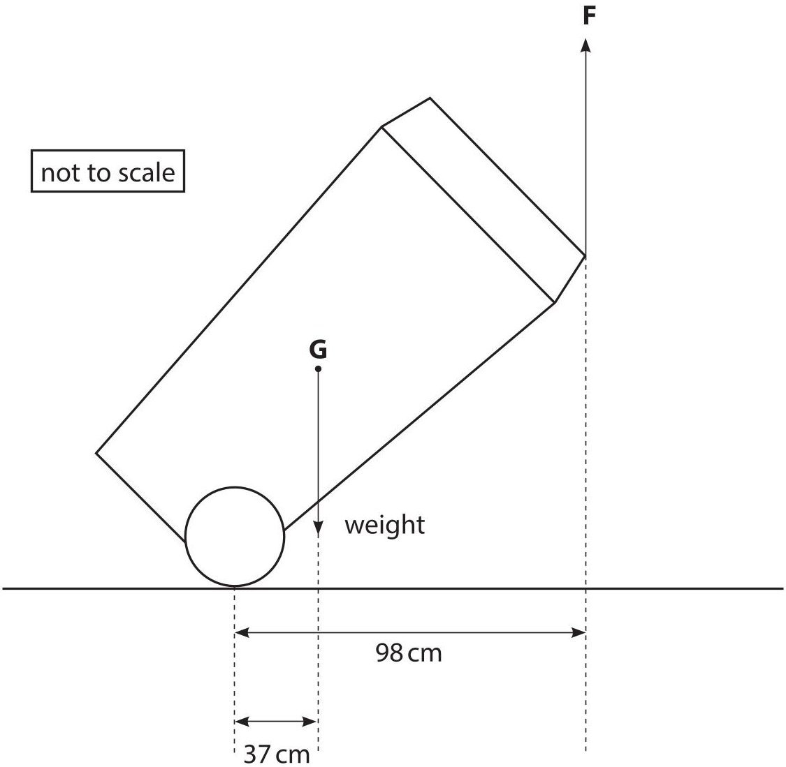

(a) The weight of the bin acts through point G. Give the name of point G.

(b) The mass of the bin is 23kg.

(i) What is the weight of the bin?

A 23kg

B 230kg

C 230N

D 23000N

(ii) State the principle of moments.

(iii) A person applies force F to the bin to keep it stationary. Calculate the magnitude of force F.

magnitude of force F = N

(iv) State the magnitude and direction of the force applied to the person by the bin.

magnitude = N

direction = ...

(Total for Question 3 = 9 marks)

4 The photograph shows a solar power farm.

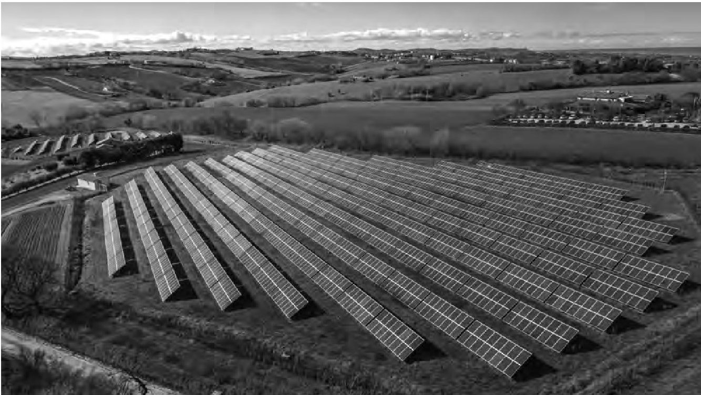

© Alessandro Pierpaoli/Shutterstock

(a) Discuss the advantages and disadvantages of using solar power rather than fossil fuels to generate electricity.

(b) Solar panels produce direct current (d.c.).

The National Grid in many countries operates on alternating current (a.c.).

Describe the difference between direct current (d.c.) and alternating current (a.c.).

(Total for Question 4=6 marks)

5 This question is about using radio waves to track an aeroplane.

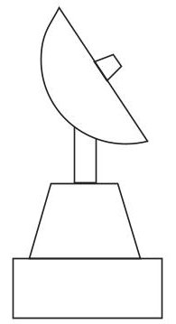

aerial at airport

(a) Radio waves are emitted from an aerial at an airport, and are then reflected back to the aerial from an aeroplane.

The time taken between emitting the radio waves and receiving the waves back at the aerial is 1.9 milliseconds.

Show that the aeroplane is approximately 300 km away from the aerial.

[speed of radio waves $ = 3.0\times10^{5}\mathrm{km / s} $]

(3) 

(b) As the aeroplane travels away from the airport, it sends a signal to the airport using radio waves with a wavelength of 1.2 m.

When the signal is received at the airport, the wavelength is $ 1. 1 \times1 0^{-6} \mathrm{~ m} $ longer than when it is emitted by the aeroplane.

Calculate the speed of the aeroplane using the formula

$ \frac{change of wavelength}{wavelength}=\frac{speed of aeroplane}{speed of radio wave} $

[speed of radio waves $ = 3. 0 \times1 0^{8} \mathrm{~ m / s} $]

speed of aeroplane=

(Total for Question 5 = 6 marks)

6 The Parker Solar Probe is a spacecraft that was launched in 2018 on a mission to explore the Sun.

The spacecraft is partly covered in tiles.

These tiles are filled with a solid containing small pockets of trapped air.

The outer surface of the tiles is painted white.

These tiles protect the electric circuits in the spacecraft from extreme temperatures.

(a) The diagram shows one of these tiles in cross-section.

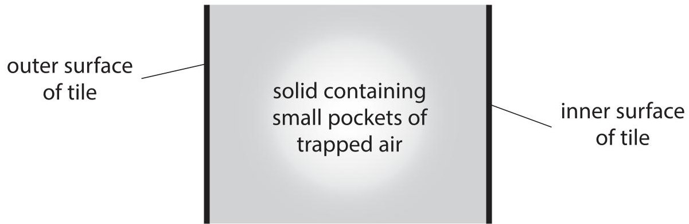

(i) Explain why the outer surface of the tile is painted white.

(ii) Explain how the small pockets of trapped air help to reduce thermal energy transfer from the outer surface to the inner surface of the tile.

(b) The electric circuits inside the spacecraft are cooled by 4.5 kg of water.

The initial temperature of the water is $ 3 5 \,^{\circ} \mathrm{C}. $

The thermal store of the water increases by 210 kJ.

Calculate the final temperature of the water.

[specific heat capacity of water = 4200 J/kg $ ^{\circ} \mathrm{C} $]

final temperature=

(Total for Question 6 = 8 marks)

7 Diagram 1 shows a loop of wire connected to a power supply.

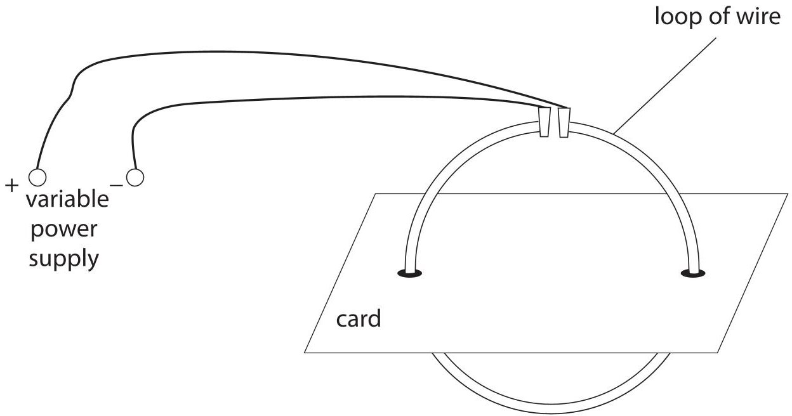

Diagram 1

(a) Describe how to find the shape of the magnetic field produced by the loop of wire.

(3) 

(b) Diagram 2 shows the view from above the card with two cross-sections of the loop of wire.

## Key

current out of page

current into page

Diagram 2

On diagram 2, draw the magnetic field produced by the two cross-sections of the loop of wire.

(c) (i) These diagrams show the magnetic field acting on a cross-section of wire when the current in the wire is out of the page.

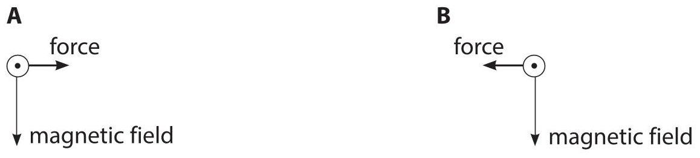

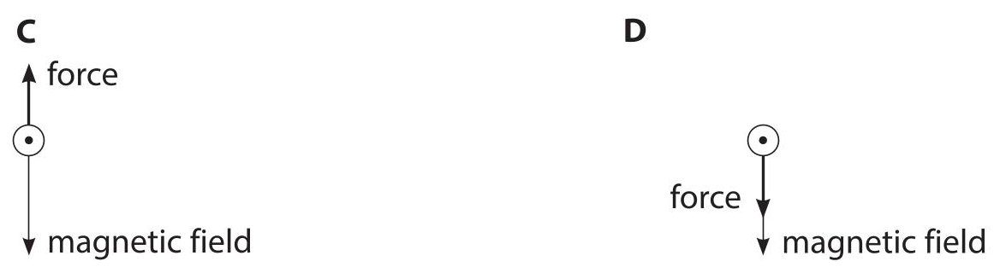

Which diagram shows the correct direction of the force acting on the cross-section of wire due to the magnetic field?

(ii) The magnetic field acting on the cross-section of wire is produced by the current in the other side of the loop of wire.

Explain why there is no effect on the direction of the force on the cross-section of wire when the direction of the current in the loop is reversed.

(Total for Question 7 =10 marks)

8 Welding is a process where pieces of metal are melted and then joined together.

The diagram shows apparatus used for welding.

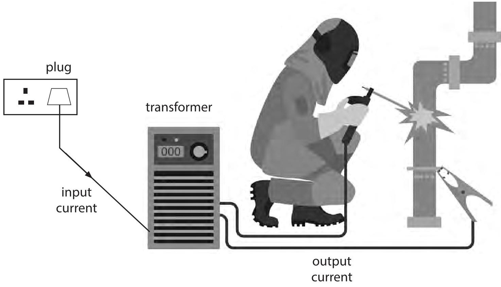

© Olha1981/Shutterstock

The welding apparatus uses the transformer to decrease the voltage from 230V.

(a) State the name of this type of transformer.

(b) State the formula linking the turns ratio, the input voltage and the output voltage for a transformer.

(c) The table gives some information about the transformer.

<table border="1"><tr><td>input voltage inV</td><td>230</td></tr><tr><td>number of turns on input coil</td><td>16</td></tr><tr><td>number of turns on output coil</td><td>4</td></tr><tr><td>input current inA</td><td>11</td></tr></table>

(i) Use information from the table to calculate the output current of the transformer. Assume that the transformer is 100% efficient.

current = ... A

(ii) A fuse is installed in the plug which supplies the input current. Which fuse should be used in this plug?

A 3 A

B 5 A

C 10 A

D 13 A

(Total for Question 8 = 8 marks)

TOTAL FOR PAPER=70 MARKS

## BLANK PAGE

