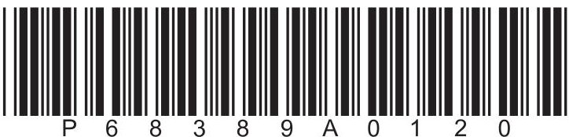
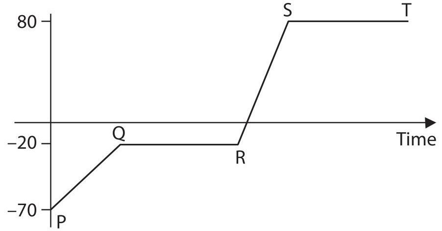
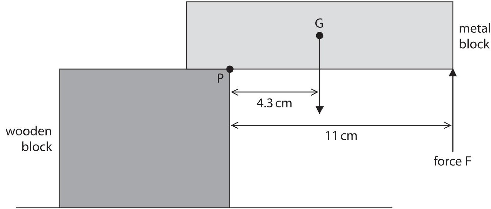
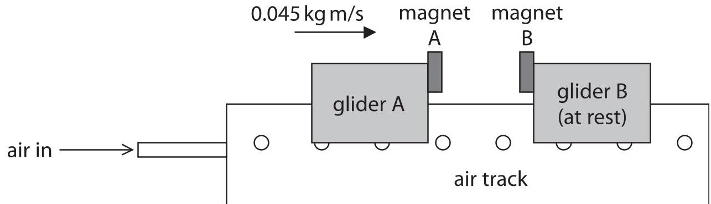
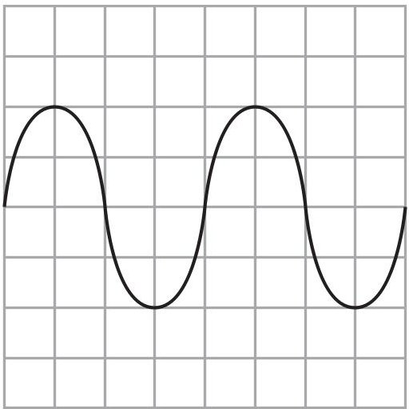
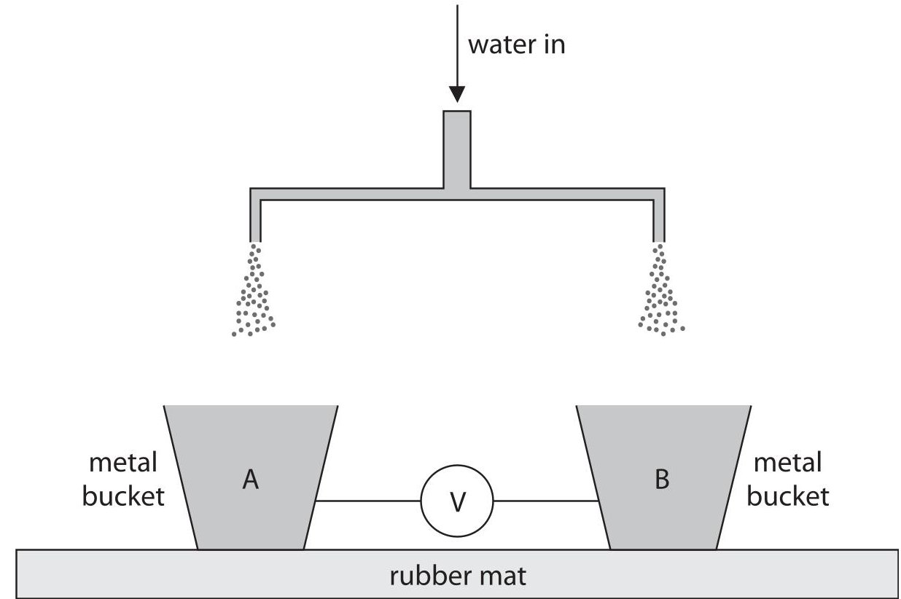
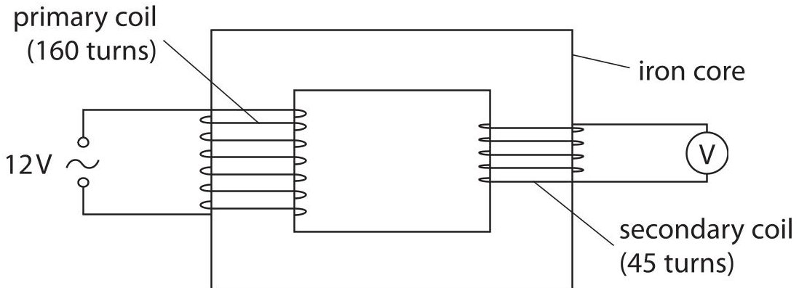

<table><tr><td colspan="3">Please check the examination details below before entering your candidate information</td></tr><tr><td>Candidate surname</td><td colspan="2">Other names</td></tr><tr><td colspan="3">Centre Number Candidate Number</td></tr><tr><td colspan="3">Pearson Edexcel International GCSE (9-1)</td></tr><tr><td colspan="3">Friday 15 January 2021</td></tr><tr><td>Afternoon (Time: 1 hour 15 minutes)</td><td colspan="2">Paper Reference 4PH1/2PR</td></tr><tr><td colspan="3">Physics
Unit: 4PH1
Paper: 2PR</td></tr><tr><td colspan="3">You must have:
Calculator, ruler</td></tr><tr><td colspan="3">Total Marks</td></tr></table>

## Instructions

- Use black ink or ball-point pen.

- Fill in the boxes at the top of this page with your name, centre number and candidate number.

- Answer all questions.

- there may be more space than you need.

- Answer the questions in the spaces provided

- Show all the steps in any calculations and state the units.

- Some questions must be answered with a cross in a box . If you change your mind about an answer, put a line through the box and then mark your new answer with a cross.

## Information

- The total mark for this paper is 70.

- The marks for each question are shown in brackets

- use this as a guide as to how much time to spend on each question.

## Advice

- Read each question carefully before you start to answer it.

- Write your answers neatly and in good English.

- Try to answer every question.

- Check your answers if you have time at the end.

Turn over

## FORMULAE

You may find the following formulae useful.

$$
\mathrm {e n e r g y t r a n s f e r r e d} = \mathrm {c u r r e n t} \times \mathrm {v o l t a g e} \times \mathrm {t i m e}
$$

$$
E = I \times V \times t
$$

$$
\mathrm {f r e q u e n c y} = \frac {1}{\mathrm {t i m e p e r i o d}}
$$

$$
f = \frac {1}{T}
$$

$$
\mathrm {p o w e r} = \frac {\mathrm {w o r k d o n e}}{\mathrm {t i m e t a k e n}}
$$

$$
P = \frac {W}{t}
$$

$$
\mathrm {p o w e r} = \frac {\mathrm {e n e r g y t r a n s f e r r e d}}{\mathrm {t i m e t a k e n}}
$$

$$
P = \frac {W}{t}
$$

$$
\mathrm {o r b i t a l s p e e d} = \frac {2 \pi \times \mathrm {o r b i t a l r a d i u s}}{\mathrm {t i m e p e r i o d}}
$$

$$
v = \frac {2 \times \pi \times r}{T}
$$

(final speed) $ ^{2} $ = (initial speed) $ ^{2} $ + (2 $ \times $ acceleration $ \times $ distance moved)

$$
v ^ {2} = u ^ {2} + (2 \times a \times s)
$$

$$
\mathrm {p r e s s u r e} \times \mathrm {v o l u m e} = \mathrm {c o n s t a n t}
$$

$$
p _ {1} \times V _ {1} = p _ {2} \times V _ {2}
$$

$$
\frac {\mathrm {p r e s s u r e}}{\mathrm {t e m p e r a t u r e}} = \mathrm {c o n s t a n t}
$$

$$
\frac {p _ {1}}{T _ {1}} = \frac {p _ {2}}{T _ {2}}
$$

$$
\mathrm {f o r c e} = \frac {\mathrm {c h a n g e i n m o m e n t u m}}{\mathrm {t i m e t a k e n}}
$$

$$
F = \frac {(m v - m u)}{t}
$$

$$
\frac {\mathrm {c h a n g e o f w a v e l e n g t h}}{\mathrm {w a v e l e n g t h}} = \frac {\mathrm {v e l o c i t y o f a g a l a x y}}{\mathrm {s p e e d o f l i g h t}}
$$

$$
\frac {\lambda - \lambda_ {0}}{\lambda_ {0}} = \frac {\Delta \lambda}{\lambda_ {0}} = \frac {v}{c}
$$

change in thermal energy = mass $ \times $ specific heat capacity $ \times $ change in temperature

$$
\Delta Q = m \times c \times \Delta T
$$

Where necessary, assume the acceleration of free fall, g = 10 m/s $ ^{2} $

## BLANK PAGE

## Answer ALL questions.

1 The diagram shows the temperature-time graph for a substance which is heated at a constant rate.

(a) (i) Which section of the graph shows when the substance is melting?

A PQ

B QR

C RS

D ST

(ii) Which section of the graph shows when all the substance is a solid?

A PQ

B QR

C RS

D ST

(iii) Draw particles in the box to show the arrangement of particles when the substance is a gas.

(iv) Which of these statements best describes the motion of particles in a gas?

A they vibrate about fixed points

B they are stationary

they slide past each other

D they move quickly and randomly

(b) (i) Name a piece of apparatus that could be used to measure the temperature of the substance.

(ii) Determine the boiling point of this substance.

boiling point=

Calculate the energy required to raise the temperature of the substance from $ 1 0^{\circ} \mathrm{C} $ to $ 3 7^{\circ} \mathrm{C}. $

(c) The substance has a mass of 1.2 kg.

[assume specific heat capacity of substance = 840 J/kg $ ^{\circ} \mathrm{C} $]

(Total for Question 1 = 9 marks)

2 The diagram shows a metal block on top of a wooden block.

The metal block is held stationary by force F.

(a) (i) The weight of the metal block acts through point G. Give the name of point G.

(ii) Name a piece of apparatus that could be used to measure the weight of the metal block.

(b) (i) State the formula linking moment, force and perpendicular distance from the pivot.

(ii) The weight of the metal block is 0.68 N.

Show that the moment of the weight of the metal block about point P is approximately 2.9Ncm.

(iii) Force F is applied to the metal block to stop it from moving. Calculate the magnitude of force F.

3 The diagram shows an air track that can be used to investigate motion without friction.

Air comes out through a series of small holes in the air track, which lifts the gliders slightly above the track.

There are two gliders on the track.

Each glider has a magnet.

The poles of the magnets nearest each other are alike.

(a) Explain the direction of the force acting on magnet A from magnet B.

(b) The gliders collide and the magnets cause them to rebound.

Before the collision, the momentum of glider A is 0.045 kg m/s to the right and glider B is at rest.

(i) State the total momentum of glider A and glider B after the collision.

total momentum=

(ii) After the collision, the momentum of glider A is 0.021 kg m/s to the left. Calculate the momentum of glider B after the collision.

(iii) The time taken for glider B to change its momentum is 0.19 seconds. Calculate the average force on glider B that causes this change in momentum.

(iv) Give the direction of the force on glider B from glider A.

(Total for Question 3 = 8 marks)

4 (a) A student uses an oscilloscope to determine the speed of sound.

The diagram shows the oscilloscope trace produced by the sound wave.

Oscilloscope settings

y direction:1 square=1 mV x direction:1 square=1 ms

The student uses two microphones and a ruler to determine the wavelength of the sound wave.

He finds that the wavelength is 1.4 m.

(i) State the formula linking the speed, frequency and wavelength of a wave.

(ii) Use the oscilloscope trace to calculate the speed of the wave.

(b) Another student uses this method to determine the speed of sound.

Step1 The student stands 50m away from her teacher, measuring the distance with a metre ruler.

Step 2 The teacher makes a loud sound and flashes a light at the same time.

Step 3 The student starts the stopwatch when she sees the flash of light.

Step 4 She stops the stopwatch when she hears the loud sound.

The speed of sound is calculated using the formula

$$
\mathrm {s p e e d o f s o u n d} = \frac {\mathrm {d i s t a n c e}}{\mathrm {t i m e t a k e n}}
$$

Evaluate whether this method could produce an accurate value for the speed of sound in air.

5 An aircraft travels along a runway.

(a) The aircraft starts from rest and has a constant acceleration of $ 4. 1 \mathrm{~ m} / \mathrm{s}^{2} $ Calculate the distance required to reach take-off speed of 75 m/s.

## distance =

(b) The aircraft takes off and reaches its maximum height above the ground.

At maximum height, the background radiation count rate is higher than on the ground.

(i) Explain what is meant by background radiation.

(ii) Suggest why there is a limit to the number of hours that an airline pilot can fly at maximum height.

(Total for Question 5 = 8 marks)

6 The Big Bang theory describes the evolution of the universe.

(a) Explain how cosmic microwave background radiation (CMBR) supports the Big Bang theory.

(b) Hydrogen gas in a laboratory on Earth emits light with a wavelength of 605 nm.

A distant galaxy contains hydrogen which emits light of the same wavelength.

The wavelength of the light from the distant galaxy is measured as 683 nm on Earth.

Calculate the speed of the distant galaxy.

[speed of light $ = 3. 0 \times1 0^{8} \mathrm{~ m / s} ] $

7 The diagram shows part of a device used to demonstrate electrostatic charge.

(a) Negatively charged water droplets fall into bucket A.

Describe how bucket A becomes negatively charged.

(b) Explain why the negatively charged droplets spread out as they fall.

(c) (i) A droplet hits bucket A with a speed of 3.8 m/s.

Calculate the kinetic energy of the droplet when it hits bucket A.

[mass of droplet = 6.2 $ \times10^{-9} $ kg]

## kinetic energy =

(ii) The total charge stored in bucket A is $ -1.1\times10^{-10} $ C.

This charge passes through the air between the buckets in $ 9. 2 \times1 0^{-3} \mathrm{s} $ causing a spark between bucket A and bucket B.

Calculate the mean current between the buckets.

## mean current=

(iii) The spark transfers a charge of $ - 1. 1 \times1 0^{-1 0} $ C.

The mean voltage between the buckets is 1.7 kV.

Calculate the energy transferred by the spark.

(Total for Question 7 = 13 marks)

8 The diagram shows a step-down transformer.

(a) Explain the operation of a step-down transformer.

(b) (i) State the formula linking input voltage, output voltage and the turns ratio of a transformer.

(ii) Calculate the output voltage for the transformer.

## BLANK PAGE

## BLANK PAGE

## BLANK PAGE

