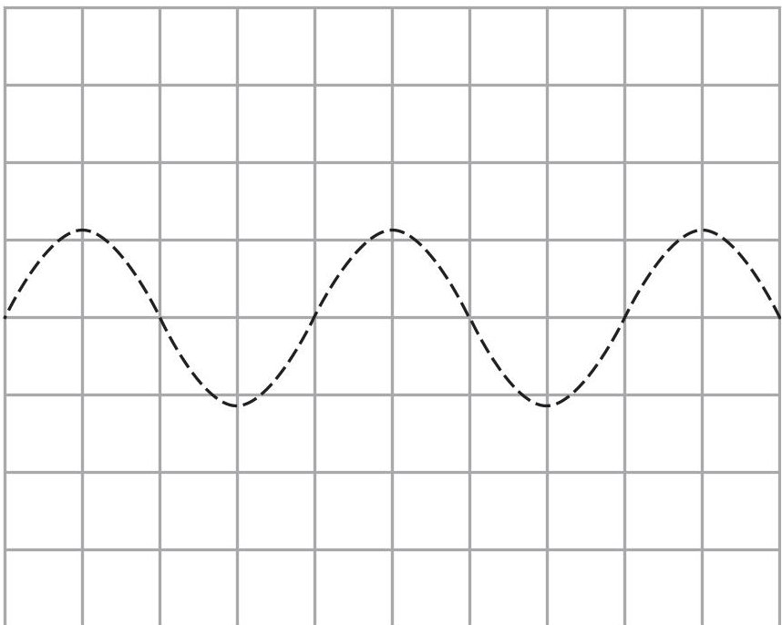
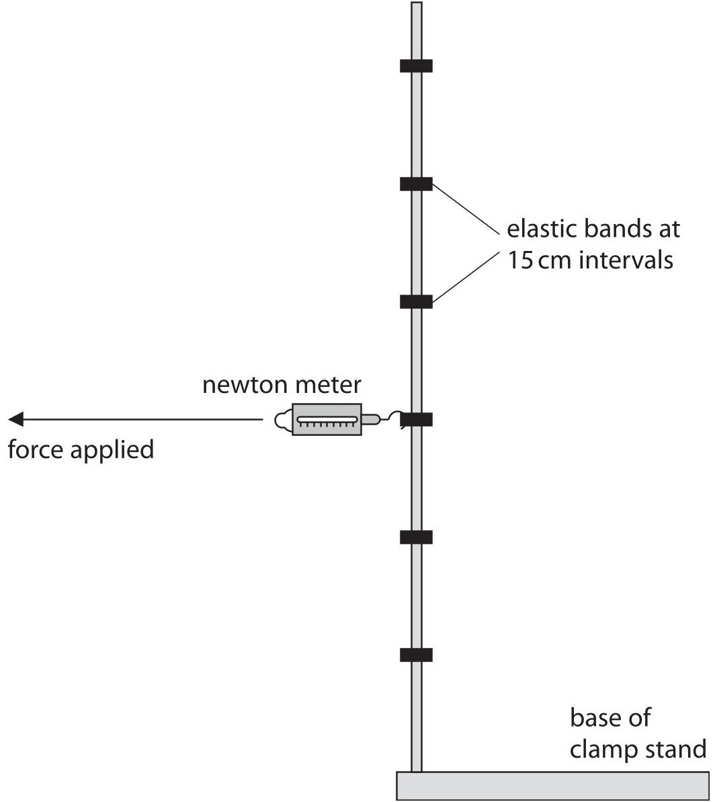
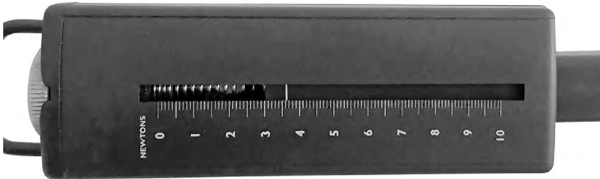
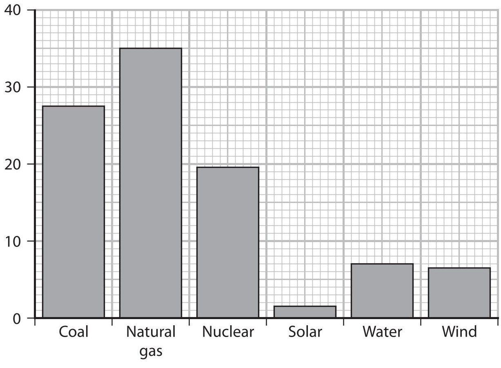
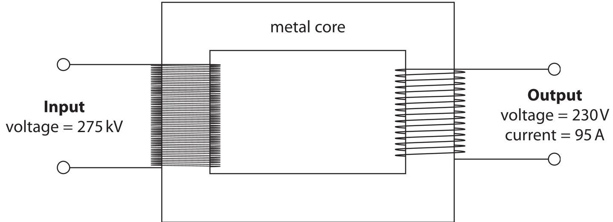
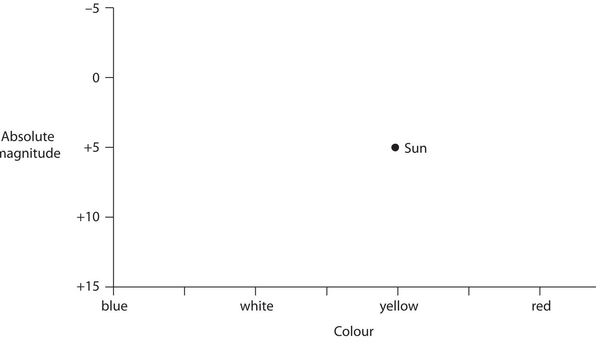
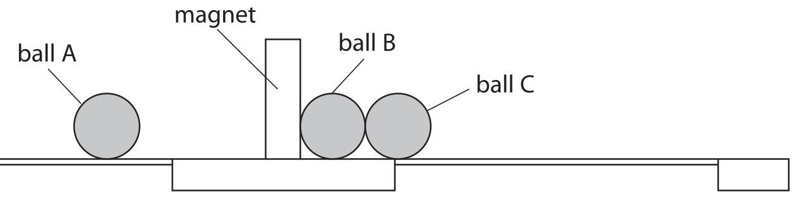

<table><tr><td colspan="3">Please check the examination details below before entering your candidate information</td></tr><tr><td>Candidate surname</td><td colspan="2">Other names</td></tr><tr><td colspan="3">Centre Number Candidate Number</td></tr><tr><td colspan="3">Pearson Edexcel International GCSE (9-1)</td></tr><tr><td colspan="3">Friday 15 January 2021</td></tr><tr><td>Afternoon (Time: 1 hour 15 minutes)</td><td colspan="2">Paper Reference 4PH1/2P</td></tr><tr><td colspan="3">Physics
Unit: 4PH1
Paper: 2P</td></tr><tr><td colspan="3">You must have:
Calculator, ruler</td></tr><tr><td colspan="3">Total Marks</td></tr></table>

## Instructions

- Use black ink or ball-point pen.

- Fill in the boxes at the top of this page with your name, centre number and candidate number.

- Answer all questions.

- there may be more space than you need.

- Answer the questions in the spaces provided

- Show all the steps in any calculations and state the units.

- Some questions must be answered with a cross in a box . If you change your mind about an answer, put a line through the box and then mark your new answer with a cross.

## Information

- The total mark for this paper is 70.

- The marks for each question are shown in brackets

- use this as a guide as to how much time to spend on each question.

## Advice

- Read each question carefully before you start to answer it.

- Write your answers neatly and in good English.

- Try to answer every question.

- Check your answers if you have time at the end.

Turn over

## FORMULAE

You may find the following formulae useful.

$$
\mathrm {e n e r g y t r a n s f e r r e d} = \mathrm {c u r r e n t} \times \mathrm {v o l t a g e} \times \mathrm {t i m e}
$$

$$
E = I \times V \times t
$$

$$
\mathrm {f r e q u e n c y} = \frac {1}{\mathrm {t i m e p e r i o d}}
$$

$$
f = \frac {1}{T}
$$

$$
\mathrm {p o w e r} = \frac {\mathrm {w o r k d o n e}}{\mathrm {t i m e t a k e n}}
$$

$$
P = \frac {W}{t}
$$

$$
\mathrm {p o w e r} = \frac {\mathrm {e n e r g y t r a n s f e r r e d}}{\mathrm {t i m e t a k e n}}
$$

$$
P = \frac {W}{t}
$$

$$
\mathrm {o r b i t a l s p e e d} = \frac {2 \pi \times \mathrm {o r b i t a l r a d i u s}}{\mathrm {t i m e p e r i o d}}
$$

$$
v = \frac {2 \times \pi \times r}{T}
$$

(final speed) $ ^{2} $ = (initial speed) $ ^{2} $ + (2 $ \times $ acceleration $ \times $ distance moved)

$$
v ^ {2} = u ^ {2} + (2 \times a \times s)
$$

$$
\mathrm {p r e s s u r e} \times \mathrm {v o l u m e} = \mathrm {c o n s t a n t}
$$

$$
p _ {1} \times V _ {1} = p _ {2} \times V _ {2}
$$

$$
\frac {\mathrm {p r e s s u r e}}{\mathrm {t e m p e r a t u r e}} = \mathrm {c o n s t a n t}
$$

$$
\frac {p _ {1}}{T _ {1}} = \frac {p _ {2}}{T _ {2}}
$$

$$
\mathrm {f o r c e} = \frac {\mathrm {c h a n g e i n m o m e n t u m}}{\mathrm {t i m e t a k e n}}
$$

$$
F = \frac {(m v - m u)}{t}
$$

$$
\frac {\mathrm {c h a n g e o f w a v e l e n g t h}}{\mathrm {w a v e l e n g t h}} = \frac {\mathrm {v e l o c i t y o f a g a l a x y}}{\mathrm {s p e e d o f l i g h t}}
$$

$$
\frac {\lambda - \lambda_ {0}}{\lambda_ {0}} = \frac {\Delta \lambda}{\lambda_ {0}} = \frac {v}{c}
$$

change in thermal energy = mass $ \times $ specific heat capacity $ \times $ change in temperature

$$
\Delta Q = m \times c \times \Delta T
$$

Where necessary, assume the acceleration of free fall, g=10 m/s $ ^{2} $

## BLANK PAGE

## Answer ALL questions.

1 The photograph shows a security camera.

The camera detects light waves and sound waves.

(a) State two differences between light waves and sound waves.

(b) The camera detects infrared waves, which allow the camera to record videos in the dark.

(i) Which of these electromagnetic waves has a longer wavelength than infrared waves?

A gamma rays

B microwaves

ultraviolet rays

D visible light waves

(ii) Which of these is another use for infrared waves?

A fluorescent lamps

B heating lamps

satellite transmissions

sterilising medical equipment

(iii) Which of these is a harmful effect of infrared waves?

A blindness

B cancer

C internal heating of body tissue

D skin burns

(c) The grid shows the oscilloscope trace for a quiet, low-pitch sound wave. The security camera has an alarm that produces a loud, high-pitch sound. On the grid, draw a trace to represent the sound wave produced by the alarm.

2 The nuclear equation shows how a nucleus of uranium-236 may undergo nuclear fission.

$$
{ } _ { 9 2 } ^ { 2 3 6 } \mathrm { U } \rightarrow { } _ { 5 4 } ^ { 1 4 0 } \mathrm { X e } + { } _ { 3 8 } ^ { 9 4 } \mathrm { S r } + \boxed { } { } _ { 0 } ^ { 1 } \mathrm { n }
$$

(a) Determine how many neutrons are released in this fission process.

$$
\mathrm {n u m b e r o f n e u t r o n s} =
$$

(b) The table gives some of the constituents of this nuclear fission.

Complete the table by putting one tick ( $ \checkmark $ ) in each row to show whether the constituent is a parent nucleus or a daughter nucleus.

<table border="1"><tr><td>Constituent</td><td>Parent nucleus</td><td>Daughter nucleus</td></tr><tr><td>strontium-94</td><td></td><td></td></tr><tr><td>uranium-236</td><td></td><td></td></tr><tr><td>xenon-140</td><td></td><td></td></tr></table>

(c) Describe how the neutrons released in this fission process can cause a chain reaction.

3 A student uses this apparatus to investigate moments.

This is the student's method.

- attach elastic bands at 15 cm intervals on a one metre tall clamp stand

- attach a newton meter to the highest elastic band and measure the horizontal force required to tilt the stand

- repeat the method at each 15 cm interval

(a) Name an instrument that the student should use to accurately measure the distances on the clamp stand.

(b) The table shows the student's results.

<table border="1"><tr><td>Distance in cm</td><td>Force applied in N</td></tr><tr><td>15.0</td><td>10.0</td></tr><tr><td>30.0</td><td>5.6</td></tr><tr><td>45.0</td><td></td></tr><tr><td>60.0</td><td>2.6</td></tr><tr><td>75.0</td><td>2.2</td></tr><tr><td>90.0</td><td>1.8</td></tr></table>

(i) The photograph shows the reading on the newton meter when the distance is 45.0cm.

Use the photograph to determine the force required to tilt the stand when the distance is 45.0cm.

(ii) Give a reason why this newton meter is unsuitable for measuring the force for distances less than 15.0cm.

(c) (i) Plot a graph of the student's results on the grid.

(ii) Draw the curve of best fit.

(d) The student concludes that the moment required to tilt the clamp stand does not change when the distance is varied.

Use data from the table or the graph to evaluate the student's conclusion.

(Total for Question 3 = 11 marks)

4 The bar chart gives information about how some of the electrical power in the United States of America (USA) was generated in the year 2018.

(a) Most of the electricity generated in the USA uses non-renewable energy resources.

(i) State what is meant by the term non-renewable.

(ii) Determine the percentage of electrical power generated using the non-renewable energy resources shown on the bar chart.

(b) In 2018, the USA generated more than half of its electrical power by burning fossil fuels.

Explain one way that burning fossil fuels can be harmful to the environment.

(c) The mean total electrical power output of the USA in 2018 was $ 4. 7 6 \times1 0^{1 1} $ W.

(i) Calculate the mean electrical power output from solar energy resources.

(ii) The mean total electrical power output of the USA in 2018 was $ 4. 7 6 \times1 0^{1 1} $ W.

A typical solar farm generates 250W of electrical power for every 1.0 m $ ^{2} $ of land area used.

Calculate the amount of land area needed if the USA were to generate all of its electrical power using solar energy resources.

(iii) The total land area of the USA is $ 9.83\times10^{1 2} \mathrm{m}^{2}. $

Discuss whether the USA could generate all of its electrical power using solar energy resources.

## BLANK PAGE

5 Transformers are useful in the transmission of electricity.

(a) The diagram shows a step-down transformer.

(i) Give the name of a suitable metal that could be used in the core of the transformer.

(ii) State the formula linking input power and output power for a transformer.

(iii) The step-down transformer has an input voltage of 275 kV and an output voltage of 230V.

The transformer has an output current of 95 A.

Calculate the input current to the transformer.

Assume the transformer is 100% efficient.

(b) Explain how transformers are useful in the large-scale transmission of electricity. You may draw a diagram to support your answer.

6 The Hertzsprung-Russell diagram shows the relationship between the absolute magnitude and colour of stars.

The position of the Sun is shown on the Hertzsprung-Russell diagram.

(a) Star W is a white dwarf.

Add a W to the Hertzsprung-Russell diagram to show the position of star W.

(b) Star X is a red giant. Add an X to the Hertzsprung-Russell diagram to show the position of star X.

(c) Star Y is a main sequence star that is much larger than the Sun. Add a Y to the Hertzsprung-Russell diagram to show the position of star Y.

(d) Star Z has the same surface temperature as the Sun, but would be dimmer than the Sun if it were the same distance away from Earth as the Sun.

Add a Z to the Hertzsprung-Russell diagram to show the position of star Z.

(e) The Moon is the brightest object in the night sky.

Suggest why the Moon cannot be shown on the Hertzsprung-Russell diagram.

(Total for Question 6 = 5 marks)

7 The diagram shows a child's toy for accelerating steel balls.

This is how the toy works.

- the toy uses three identical steel balls, each with a mass of 4.1 g

- ball A moves towards the magnet

- ball B is in contact with the magnet

- balls B and C are initially at rest and are in contact with each other

- when ball A collides with the magnet, ball C moves away from the magnet

(a) Ball A moves towards the magnet with an initial velocity of 0.15 m/s. Calculate the initial momentum of ball A.

$$
\mathrm {i n i t i a l m o m e n t u m} =
$$

(b) Ball A is attracted to the magnet.

Explain how this attraction affects the momentum of ball A as it approaches the magnet.

(c) When ball A collides with the magnet, a force of 1.3 N is exerted on ball C for a time of 0.0025 s.

This causes ball C to move away from the magnet.

Calculate the change in velocity of ball C due to this force.

(Total for Question 7 = 7 marks)

8 The diagram shows a simplified view of part of an inkjet printer.

$$
\begin{array}{l} \mathrm {n e g a t i v e l y c h a r g e d} \\ \mathrm {i n k d r o p} \\ \mathrm {n e g a t i v e l y c h a r g e d} \\ \mathrm {p o s i t i v e l y c h a r g e d} \\ \mathrm {p l a t e} \\ \mathrm {p a p e r} \\ \end{array}
$$

A negatively charged ink drop falls vertically between a pair of charged plates.

(a) The ink drop experiences a horizontal electrostatic force as it falls.

Explain the direction of the electrostatic force exerted on the ink drop by the charged plates.

(b) On the diagram, draw the path of the ink drop as it falls between the charged plates until it hits the paper.

(c) (i) The ink drop experiences a horizontal force of $ 8. 5 \times1 0^{-7} \mathrm{N} $ when it is between the charged plates.

The mass of the ink drop is $ 1. 1 \times1 0^{-1 0} \mathrm{k g}. $

Calculate the horizontal acceleration of the ink drop when it is between the charged plates.

(ii) The ink drop has no initial horizontal velocity before it passes between the charged plates.

After passing between the charged plates, the horizontal velocity of the ink drop is 3.9 m/s.

Calculate the horizontal distance travelled by the ink drop as it passes between the charged plates.

Give your answer in mm.

distance=

(d) Explain how another ink drop could be deflected in the opposite direction by a greater distance using the charged plates in the inkjet printer.

(Total for Question 8 = 13 marks)

TOTAL FOR PAPER = 70 MARKS

## BLANK PAGE

## BLANK PAGE

