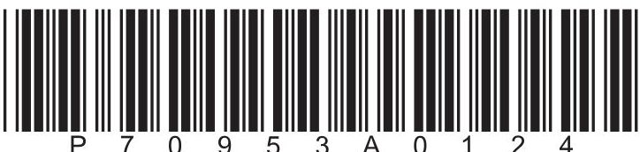
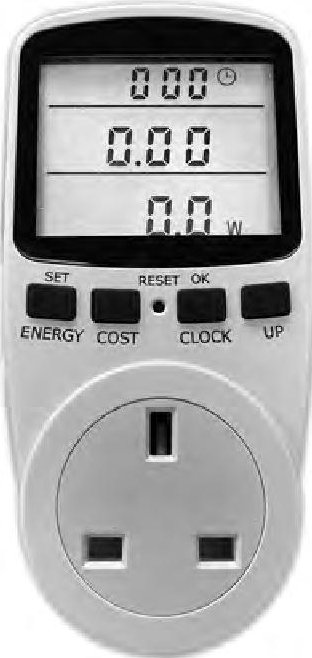
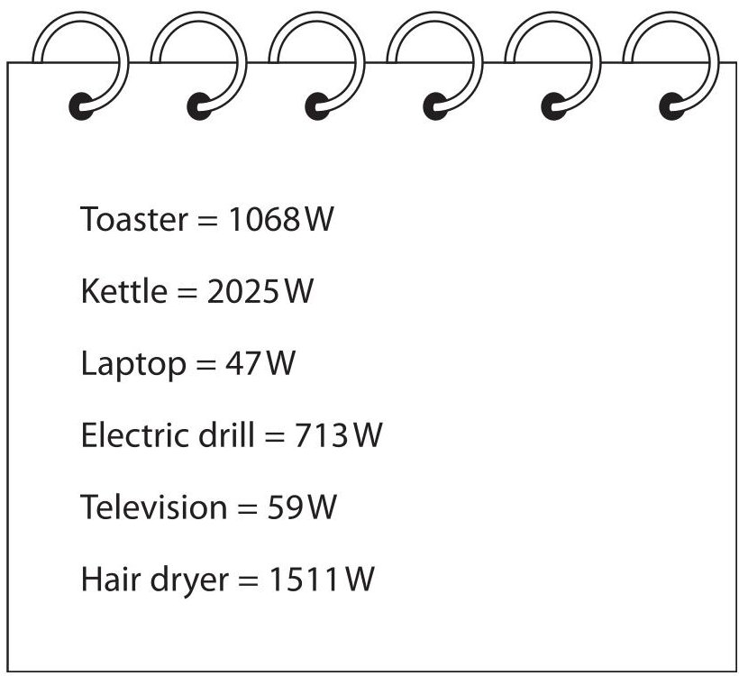
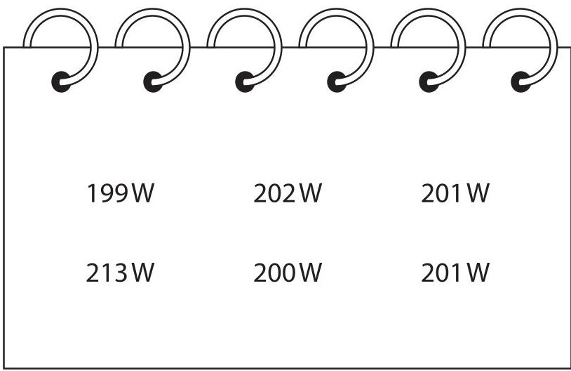
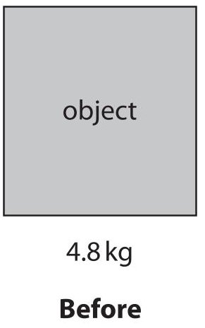
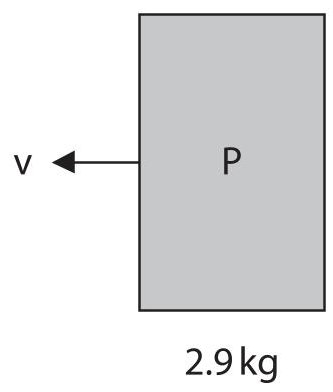
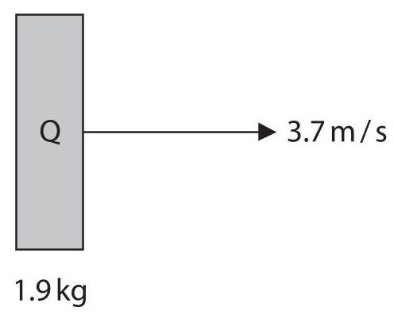
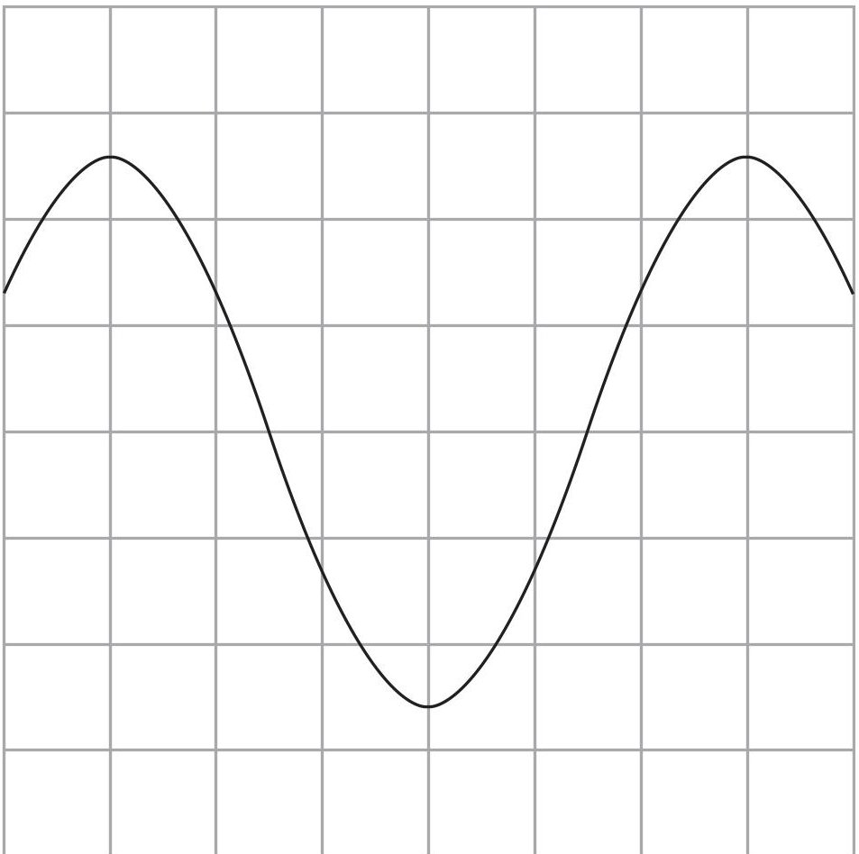
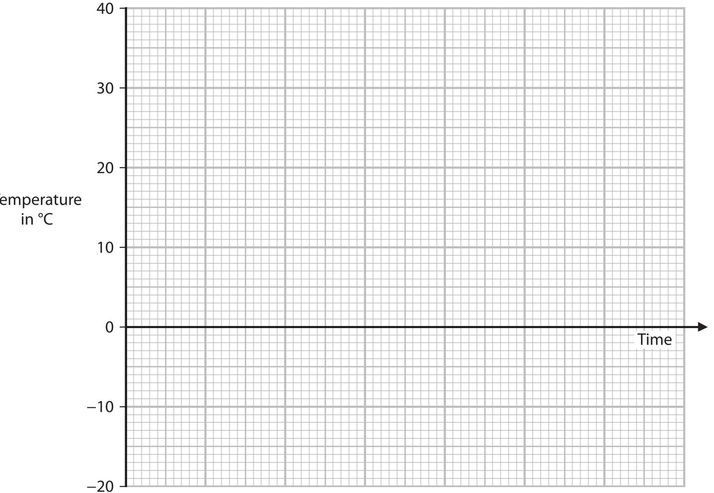

<table><tr><td colspan="3">Please check the examination details below before entering your candidate information</td></tr><tr><td colspan="2">Candidate surname</td><td>Other names</td></tr><tr><td>Centre Number</td><td colspan="2">Candidate Number</td></tr><tr><td colspan="3">Pearson Edexcel International GCSE (9-1)</td></tr><tr><td>Time</td><td>1 hour 15 minutes</td><td>Paper reference 4PH1/2P</td></tr><tr><td colspan="3">Physics
UNIT: 4PH1
PAPER: 2P</td></tr><tr><td colspan="3">You must have:
Ruler, calculator, Equation Booklet (enclosed)</td></tr><tr><td colspan="3">Total Marks</td></tr></table>

## Instructions

- Use black ink or ball-point pen.

- Fill in the boxes at the top of this page with your name, centre number and candidate number.

- Answer all questions.

- Answer the questions in the spaces provided

- there may be more space than you need.

- Show all the steps in any calculations and state the units.

## Information

- The total mark for this paper is 70.

- The marks for each question are shown in brackets

- use this as a guide as to how much time to spend on each question.

## Advice

- Read each question carefully before you start to answer it.

- Write your answers neatly and in good English.

- Try to answer every question.

- Check your answers if you have time at the end.

Turn over

## FORMULAE

You may find the following formulae useful.

$$
\mathrm {e n e r g y t r a n s f e r r e d} = \mathrm {c u r r e n t} \times \mathrm {v o l t a g e} \times \mathrm {t i m e}
$$

$$
E = I \times V \times t
$$

$$
\mathrm {f r e q u e n c y} = \frac {1}{\mathrm {t i m e p e r i o d}}
$$

$$
f = \frac {1}{T}
$$

$$
\mathrm {p o w e r} = \frac {\mathrm {w o r k d o n e}}{\mathrm {t i m e t a k e n}}
$$

$$
P = \frac {W}{t}
$$

$$
\mathrm {p o w e r} = \frac {\mathrm {e n e r g y t r a n s f e r r e d}}{\mathrm {t i m e t a k e n}}
$$

$$
P = \frac {W}{t}
$$

$$
\mathrm {o r b i t a l s p e e d} = \frac {2 \pi \times \mathrm {o r b i t a l r a d i u s}}{\mathrm {t i m e p e r i o d}}
$$

$$
v = \frac {2 \times \pi \times r}{T}
$$

(final speed) $ ^{2} $ = (initial speed) $ ^{2} $ + (2 $ \times $ acceleration $ \times $ distance moved)

$$
v ^ {2} = u ^ {2} + (2 \times a \times s)
$$

$$
\mathrm {p r e s s u r e} \times \mathrm {v o l u m e} = \mathrm {c o n s t a n t}
$$

$$
p _ {1} \times V _ {1} = p _ {2} \times V _ {2}
$$

$$
\frac {\mathrm {p r e s s u r e}}{\mathrm {t e m p e r a t u r e}} = \mathrm {c o n s t a n t}
$$

$$
\frac {p _ {1}}{T _ {1}} = \frac {p _ {2}}{T _ {2}}
$$

$$
\mathrm {f o r c e} = \frac {\mathrm {c h a n g e i n m o m e n t u m}}{\mathrm {t i m e t a k e n}}
$$

$$
F = \frac {(m v - m u)}{t}
$$

$$
\frac {\mathrm {c h a n g e o f w a v e l e n g t h}}{\mathrm {w a v e l e n g t h}} = \frac {\mathrm {v e l o c i t y o f a g a l a x y}}{\mathrm {s p e e d o f l i g h t}}
$$

$$
\frac {\lambda - \lambda_ {0}}{\lambda_ {0}} = \frac {\Delta \lambda}{\lambda_ {0}} = \frac {v}{c}
$$

change in thermal energy = mass $ \times $ specific heat capacity $ \times $ change in temperature

$$
\Delta Q = m \times c \times \Delta T
$$

Where necessary, assume the acceleration of free fall, g=10 m/s $ ^{2}. $

## Answer ALL questions.

Some questions must be answered with a cross in a box. If you change your mind about an answer, put a line through the box and then mark your new answer with a cross.

1 A student uses a watt-meter to measure the power of electrically-operated appliances.

(a) State what is meant by the term power.

(1) 

(b) The student measures the mean power output (in watts) for six different appliances.

Diagram 1 shows their results.

Diagram 1

Draw a results table for the student's results.

(2) 

(c) The student measures the power output for a different appliance.

Diagram 2 shows their raw data.

Diagram 2

(i) The student identifies an anomalous result in their data. Draw a circle around the anomalous result.

(ii) Calculate the mean power output for this appliance Give your answer to three significant figures.

## BLANK PAGE

2 This question is about momentum.

(a) Which of these is the correct unit for momentum?

A kg/m/s

(1) 

B $ \mathrm{k g^{2} m / s} $

C kg m/s²

D kg m/s

(b) The diagram shows an object before and after an explosion.

The object breaks into two parts, P and Q.

The parts move away from each other in opposite directions.

stationary

(i) State what is meant by the principle of conservation of momentum.

(1) 

(ii) Calculate the magnitude of the velocity of part P after the explosion.

(3) 

(c) A child drops an egg from a height of 10cm and the egg lands on the floor.

Explain why the egg is less likely to break if the floor is covered with a thick carpet than if the floor were covered in hard tiles.

(Total for Question 2 = 8 marks)

3 Mobile phone charger X contains a transformer and is used to charge the phone's battery.

Diagram 1 shows the information on charger X.

Input voltage = 230V Output voltage = 5.0V Output current = 1.2A

## Diagram 1

(a) (i) The power of the charger can be calculated using the formula

power = current x voltage

Calculate the output power of charger X.

output power=

(ii) Calculate the input current to charger X.

Assume that charger X is 100% efficient.

(b) Charger X transfers a charge of 10500C to the mobile phone battery.

(i) State the formula linking charge, current and time.

(ii) Calculate the time in minutes to transfer a charge of 10500C to the battery.

## (iii) Charger Y can also be used to charge the mobile phone battery.

Diagram 2 shows the information label for charger Y.

Input voltage = 230V Output voltage = 5.0V Output current = 2.1A

## Diagram 2

Explain how the time taken to transfer the same amount of charge to the mobile phone battery will be affected when charger Y is used instead of charger X.

(c) Both chargers contain step-down transformers.

Explain how a step-down transformer works.

You may include a diagram to support your answer.

(Total for Question 3 = 15 marks)

## BLANK PAGE

4 Sound waves with a frequency above the range of human hearing are known as ultrasound.

(a) State the frequency range for human hearing.

(b) The frequency of ultrasound waves can be determined using an oscilloscope.

(i) Give the name of the piece of apparatus that could be connected to the oscilloscope to detect the ultrasound waves.

(ii) The time period of the ultrasound waves must be measured to determine their frequency.

Describe how the oscilloscope is used to measure the time period of the ultrasound waves.

(c) The diagram shows the oscilloscope screen when an ultrasound wave is detected.

The oscilloscope settings are also shown.

oscilloscope settings:

y direction:1 square=2V

x direction: 1 square=5 $ \times10^{-6} $ s

(i) Determine the time period of the ultrasound waves.

(ii) Calculate the frequency of the ultrasound waves.

frequency = ... Hz

(Total for Question 4 = 10 marks)

5 (a) The table gives some statements about different parts of a nuclear reactor.

Place ticks ( $ \checkmark $ ) in the boxes to show which statements are about the moderator and which statements are about a control rod in a nuclear reactor.

<table border="1"><tr><td></td><td>Moderator</td><td>Control rod</td></tr><tr><td>absorbs excess neutrons</td><td></td><td></td></tr><tr><td>can be made of boron</td><td></td><td></td></tr><tr><td>can be made of water or graphite</td><td></td><td></td></tr><tr><td>is lowered into or raised from the reactor core to adjust the rate of reaction</td><td></td><td></td></tr><tr><td>reduces the speed of neutrons so they are more likely to cause fission</td><td></td><td></td></tr></table>

(b) Describe the role of shielding around a nuclear reactor.

(c) A uranium fuel rod is made from fuel pellets that contain uranium-235 and uranium-238.

Only uranium-235 undergoes nuclear fission in the reactor core.

Energy is released when the uranium-235 nuclei undergo fission.

The box gives some data about a typical uranium fuel pellet.

<table border="1"><tr><td>Total mass of uranium in fuel pellet</td><td>0.0088kg</td></tr><tr><td>Percentage(by mass)of uranium-235in fuel pellet</td><td>3.0%</td></tr><tr><td>Mass of uranium-235atom</td><td>$3.90\times10^{-25}kg$</td></tr><tr><td>Total energy released from fuel pellet due to fission</td><td>$2.17\times10^{10}J$</td></tr></table>

(i) Calculate the number of uranium-235 atoms in the fuel pellet.

## number of uranium-235 atoms=

(ii) Calculate the energy released when the nucleus of a single atom of uranium-235 undergoes fission.

(Total for Question 5 = 9 marks)

6 The universe began with an event known as the Big Bang.

(a) Describe how the size and temperature of the universe have changed since the Big Bang.

(b) Discuss two pieces of evidence that support the Big Bang theory.

(Total for Question 6 = 8 marks)

7 This question is about specific heat capacity.

(a) State what is meant by the term specific heat capacity.

(b) A student uses this method to measure the specific heat capacity of water.

- place an aluminium block of known mass in an oven at a temperature of $ 2 2 0^{\circ} \mathrm{C} $

- place water of known mass in a container at a temperature of $ 2 0^{\circ} \mathrm{C} $

- leave the aluminium block in the oven for 10 minutes

- remove the aluminium block from the oven and place the block in the water

- measure the maximum temperature of the water after it has been heated by the aluminium block

The student uses their data to calculate the specific heat capacity of water.

Give two ways that they could improve their method to increase the accuracy of their value of specific heat capacity.

(c) The box shows the student's data.

Mass of aluminium block = 1.6kg

Mass of water = 2.3 kg

Initial temperature of water = 20 $ ^{\circ} C $

Maximum temperature of water = 38 $ ^{\circ} C $

(i) When the water reaches its maximum temperature, the water and aluminium block are in thermal equilibrium.

State the temperature of the aluminium block as it reaches thermal equilibrium with the water.

temperature of aluminium =

(ii) Calculate the temperature change of the water when it has been heated to its maximum temperature.

(iii) The water gains 190000 J of energy in its thermal store as it is heated to its maximum temperature.

Calculate the specific heat capacity of water.

specific heat capacity of water=

$$
\mathrm {J / k g} ^ {\circ} \mathrm {C}
$$

(d) After finishing the experiment, the student removes the aluminium block and places the container of water into a freezer.

The water loses energy at a constant rate and cools from $ 3 8^{\circ} \mathrm{C} $ to $ -2 0^{\circ} \mathrm{C}. $

The water freezes and turns into ice at 0 $ ^{\circ} \mathrm{C}. $

Ice has a lower specific heat capacity than water.

Use the axes to sketch a temperature-time graph from when the water is placed in the freezer until it reaches its lowest temperature.

No calculations are required.

(Total for Question 7 = 13 marks)

TOTAL FOR PAPER = 70 MARKS

## BLANK PAGE

## BLANK PAGE

## BLANK PAGE

