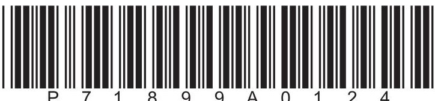
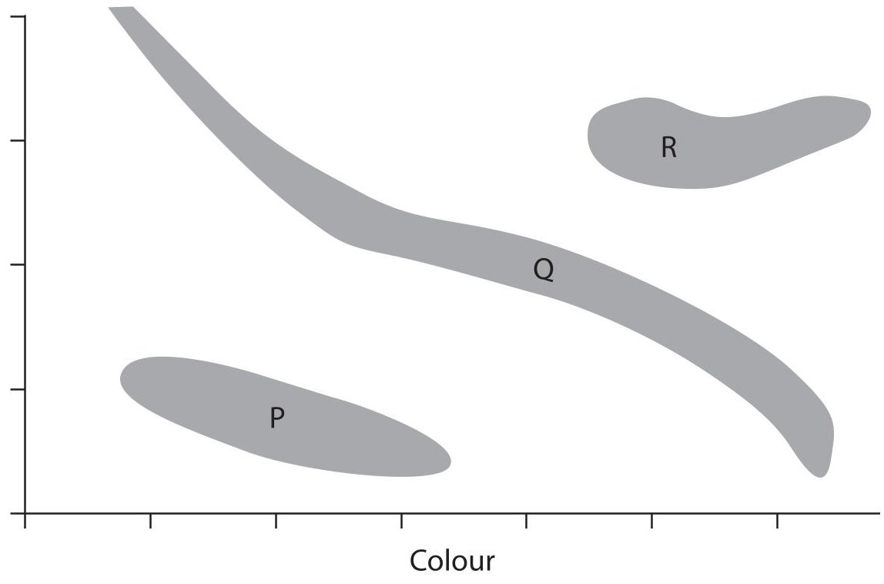
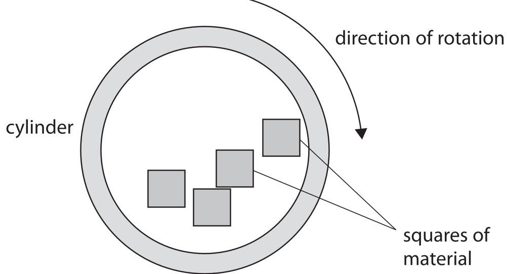
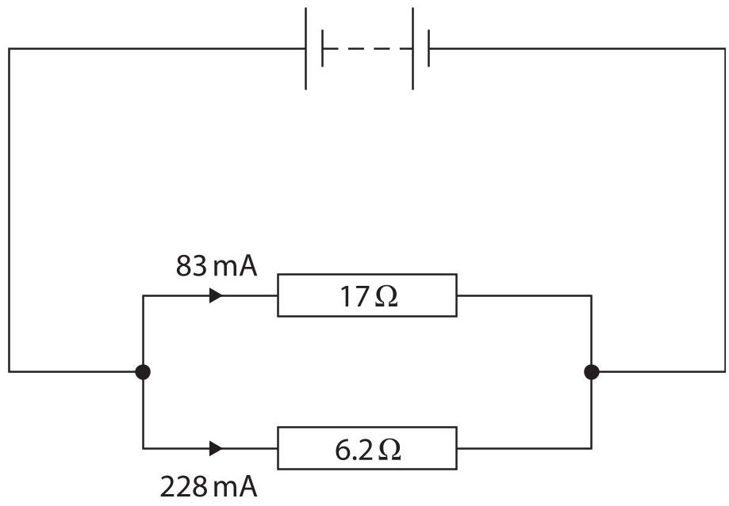
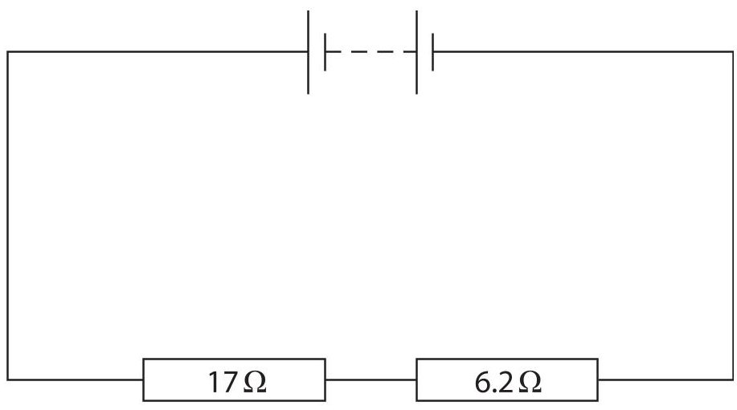
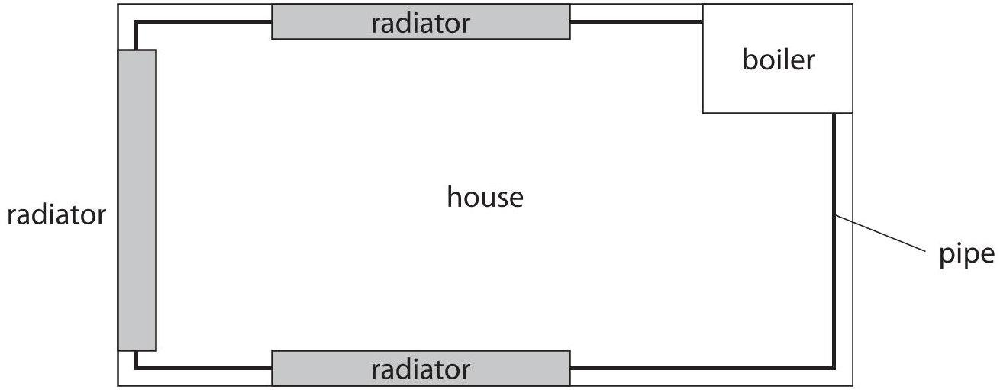
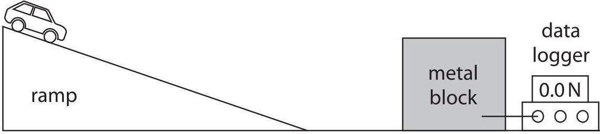
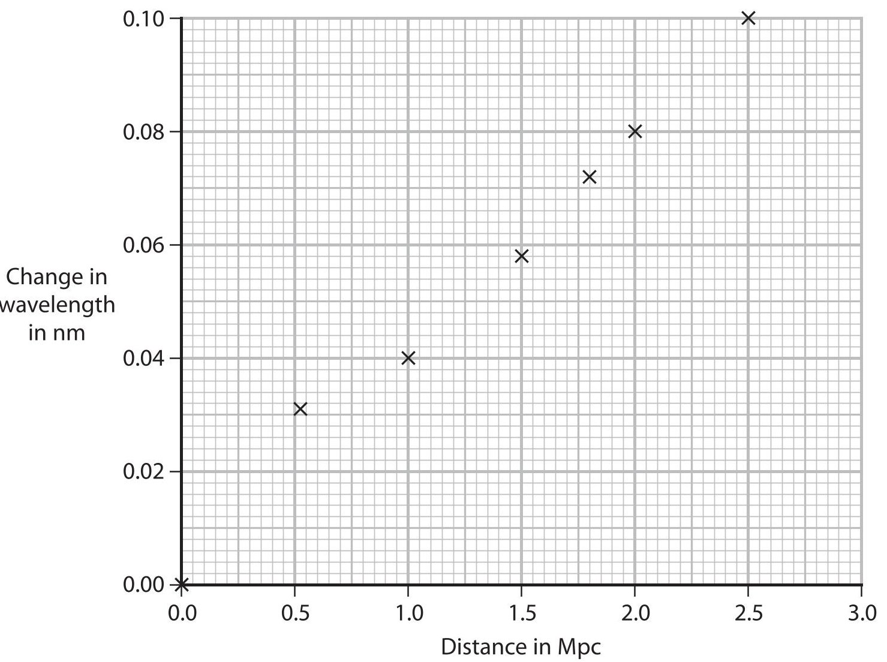

<table><tr><td colspan="3">Please check the examination details below before entering your candidate information</td></tr><tr><td colspan="2">Candidate surname</td><td>Other names</td></tr><tr><td>Centre Number</td><td colspan="2">Candidate Number</td></tr><tr><td colspan="3">Pearson Edexcel International GCSE (9-1)</td></tr><tr><td>Time</td><td>1 hour 15 minutes</td><td>Paper reference 4PH1/2PR</td></tr><tr><td colspan="3">Physics
UNIT: 4PH1
PAPER: 2PR</td></tr><tr><td colspan="3">You must have:
Ruler, calculator</td></tr><tr><td colspan="3">Total Marks</td></tr></table>

## Instructions

- Use black ink or ball-point pen.

- If pencil is used for diagrams/sketches/graphs it must be dark (HB or B).

- Fill in the boxes at the top of this page with your name, centre number and candidate number.

- Answer all questions.

- Answer the questions in the spaces provided

- there may be more space than you need.

- Show all the steps in any calculations and state the units.

## Information

- The total mark for this paper is 70.

- The marks for each question are shown in brackets

- use this as a guide as to how much time to spend on each question.

## Advice

- Read each question carefully before you start to answer it.

- Write your answers neatly and in good English.

- Try to answer every question.

- Check your answers if you have time at the end.

Turn over

## FORMULAE

You may find the following formulae useful.

$$
\mathrm {e n e r g y t r a n s f e r r e d} = \mathrm {c u r r e n t} \times \mathrm {v o l t a g e} \times \mathrm {t i m e}
$$

$$
E = I \times V \times t
$$

$$
\mathrm {f r e q u e n c y} = \frac {1}{\mathrm {t i m e p e r i o d}}
$$

$$
f = \frac {1}{T}
$$

$$
\mathrm {p o w e r} = \frac {\mathrm {w o r k d o n e}}{\mathrm {t i m e t a k e n}}
$$

$$
P = \frac {W}{t}
$$

$$
\mathrm {p o w e r} = \frac {\mathrm {e n e r g y t r a n s f e r r e d}}{\mathrm {t i m e t a k e n}}
$$

$$
P = \frac {W}{t}
$$

$$
\mathrm {o r b i t a l s p e e d} = \frac {2 \pi \times \mathrm {o r b i t a l r a d i u s}}{\mathrm {t i m e p e r i o d}}
$$

$$
v = \frac {2 \times \pi \times r}{T}
$$

(final speed) $ ^{2} $ = (initial speed) $ ^{2} $ + (2 $ \times $ acceleration $ \times $ distance moved)

$$
v ^ {2} = u ^ {2} + (2 \times a \times s)
$$

$$
\mathrm {p r e s s u r e} \times \mathrm {v o l u m e} = \mathrm {c o n s t a n t}
$$

$$
p _ {1} \times V _ {1} = p _ {2} \times V _ {2}
$$

$$
\frac {\mathrm {p r e s s u r e}}{\mathrm {t e m p e r a t u r e}} = \mathrm {c o n s t a n t}
$$

$$
\frac {p _ {1}}{T _ {1}} = \frac {p _ {2}}{T _ {2}}
$$

$$
\mathrm {f o r c e} = \frac {\mathrm {c h a n g e i n m o m e n t u m}}{\mathrm {t i m e t a k e n}}
$$

$$
F = \frac {(m v - m u)}{t}
$$

$$
\frac {\mathrm {c h a n g e o f w a v e l e n g t h}}{\mathrm {w a v e l e n g t h}} = \frac {\mathrm {v e l o c i t y o f a g a l a x y}}{\mathrm {s p e e d o f l i g h t}}
$$

$$
\frac {\lambda - \lambda_ {0}}{\lambda_ {0}} = \frac {\Delta \lambda}{\lambda_ {0}} = \frac {v}{c}
$$

change in thermal energy = mass $ \times $ specific heat capacity $ \times $ change in temperature

$$
\Delta Q = m \times c \times \Delta T
$$

Where necessary, assume the acceleration of free fall, g = 10 m/s $ ^{2} $

## Answer ALL questions.

Some questions must be answered with a cross in a box. If you change your mind about an answer, put a line through the box and then mark your new answer with a cross.

1 The diagram is an incomplete Hertzsprung-Russell diagram which astronomers use to compare stars.

(a) The y-axis label is missing.

Which of these is the correct label for the y-axis?

A absolute magnitude

(1) 

B apparent magnitude

C scalar magnitude

D vector magnitude

(b) The box contains words to identify the shaded areas P, Q and R on the Hertzsprung-Russell diagram.

<table border="1"><tr><td>white dwarfs</td><td>main sequence</td><td>red giants</td></tr><tr><td>black holes</td><td>supernovae</td><td>dwarf planets</td></tr></table>

Use words from the box to identify P, Q and R.

(c) Explain which side of the diagram contains stars with the highest surface temperature.

(Total for Question 1 = 6 marks)

2 This is a question about electromagnetic waves.

(a) State which colour in the visible spectrum has the shortest wavelength.

(b) Explain a hazard of ultraviolet radiation to the human body.

(c) (i) State the formula linking speed, wavelength and frequency of a wave.

(ii) Calculate the frequency of radio waves with a wavelength of 15 m. [speed of light = 300000000 m/s]

(Total for Question 2 = 6 marks)

## BLANK PAGE

3 A tumble dryer is a household device that dries clothes.

The clothes rotate in a heated cylinder.

Clothes often stick together when they are dry because they become electrostatically charged.

A student investigates how different materials charge electrostatically in a model tumble dryer.

The diagram shows the model tumble dryer.

This is the student's method.

- put four dry squares of the same material into the cylinder

- rotate the cylinder at constant speed for three minutes

- remove any squares that are stuck together

- measure the force needed to pull the squares apart

- repeat this for squares of different material

(a) (i) Name a device the student could use to measure a force.

(ii) State the independent and dependent variables in this investigation.

independent

dependent.

(iii) State a control variable in this investigation.

(b) Explain how the squares of material stick together. Use ideas about electrostatic charge in your answer.

(c) The table shows some of the student's results.

<table border="1"><tr><td>Material</td><td>Mean force to separate squares inN</td></tr><tr><td>wool</td><td>5.4</td></tr><tr><td>polyester</td><td>3.2</td></tr><tr><td>acrylic</td><td>6.5</td></tr></table>

Explain which type of graph is the most appropriate to present the results from this investigation.

(d) (i) State the formula linking charge, current and time.

(ii) When the squares of material are pulled apart there is a small spark. There is a current of $ 4. 3 \times1 0^{-6} $ A in the air for a time of $ 2. 3 \times1 0^{-3} $ s. Calculate the charge that is transferred.

(Total for Question 3 = 12 marks)

4 Diagram 1 shows a circuit built by a student.

Diagram 1

(a) (i) State the formula linking voltage, current and resistance.

(ii) Calculate the voltage across the 17 $ \Omega $ resistor.

(iii) State the voltage across the 6.2 $ \Omega $ resistor.

(iv) Calculate the current in the battery.

(b) Diagram 2 shows a second circuit built by the student using the same battery and resistors.

Diagram 2

Explain how the current in the battery will change now the resistors are connected in series.

You do not need to do any calculations in your answer.

(Total for Question 4 = 10 marks)

5 A transformer is used to charge a mobile phone.

The diagram shows a label on the transformer.

input voltage:230V

input current:0.067A

output voltage:5.0V

output current:3.1A

(a) Explain how the information in the label shows that the transformer is a step-down transformer.

(b) Show that the transformer is approximately 100% efficient.

(c) (i) State the formula linking input voltage, output voltage and turns ratio for a transformer.

(ii) The primary coil has 1500 turns. Calculate the number of turns on the secondary coil.

6 This question is about the use of water in central heating systems.

(a) A student does an investigation to find the specific heat capacity of water.

This is the list of equipment they use.

- heater with a power output of 50 W

- power supply

- beaker

- water

- thermometer

- stopwatch

- connecting leads

- balance

Describe an investigation the student could use to find the specific heat capacity of water.

You may draw a diagram to help your answer.

(b) The diagram shows a simplified central heating system viewed from above.

Pipes transport hot water around a house to radiators and back to the boiler.

The boiler heats water from $ 1 6^{\circ} \mathrm{C} $ to $ 6 5^{\circ} \mathrm{C}. $

(i) Calculate the energy transferred from the boiler to 75kg of water to raise the temperature of the water from $ 1 6^{\circ} \mathrm{C} $ to $ 6 5^{\circ} \mathrm{C}. $

[for water, specific heat capacity = 4200 J/kg $ ^{\circ} \mathrm{C} $]

(ii) The radiators transfer energy from the water to the air in the house.

The temperature of the water in the heating system decreases by $ 4^{\circ} \mathrm{C} $ due to heat transferred to the air.

This causes the air in the house to increase in temperature by $ 1 5^{\circ} \mathrm{C}. $

The mass of air in the house and the mass of water in the heating system are approximately the same.

Explain why there is a larger temperature change in the air.

(Total for Question 6 = 11 marks)

7 A crumple zone is a safety feature in a car.

It is a part of the car that is designed to collapse during a collision.

A student investigates the effectiveness of crumple zones.

The student rolls two model cars down a ramp.

Each car comes to rest when it hits a large metal block.

A data logger measures the mean force applied to the car during the collision with the block.

The diagram shows the equipment used in the investigation.

Car 1 has a paper crumple zone at the front.

Car 2 has no paper crumple zone.

The table shows the student's results.

<table border="1"><tr><td>Car</td><td>Mean force on car from block inN</td><td>Velocity just before car hits block inm/s</td></tr><tr><td>1</td><td>2.5</td><td>3.0</td></tr><tr><td>2</td><td>4.9</td><td>3.0</td></tr></table>

(a) The mass of each car is 0.074 kg.

Calculate the time taken for the velocity of car 1 to decrease from 3.0 m/s to 0.0 m/s.

(b) State the magnitude and direction of the force on the metal block, when car 2 collides with the block.

$$
\mathrm {m a g n i t u d e} =
$$

(c) Explain why the mean force from the block on car 1 is smaller than the mean force on car 2.

direction=

(Total for Question 7 = 7 marks)

8 Between 1929 and 1931, physicists Hubble and Humason investigated the red-shift of light from galaxies at different distances from the Earth.

The distance unit they used is the megaparsec (Mpc).

(a) Describe what is meant by the term red-shift.

(b) The graph shows some of the results of their investigation.

(i) Draw a circle to show the anomalous data point.

(ii) Draw the line of best fit on the graph.

(iii) The reference wavelength of the light used in this investigation is 660 nm.

Use information from the graph to determine the velocity of a galaxy at a distance of 0.75 Mpc.

[speed of light = 300000 km/s]

(iv) Explain why the graph from Hubble's investigation provides evidence for the expansion of the universe.

(Total for Question 8 = 9 marks)

TOTAL FOR PAPER = 70 MARKS

## BLANK PAGE

