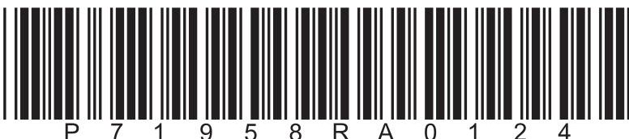
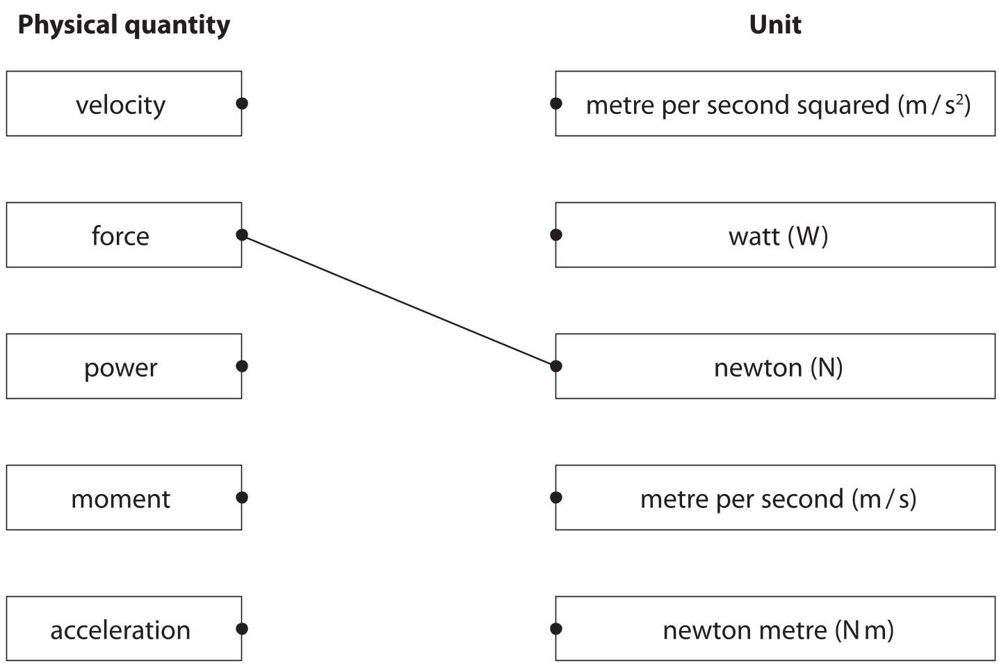
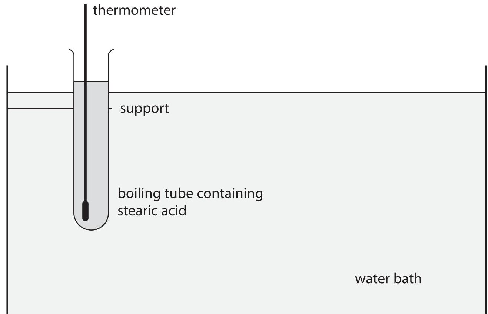
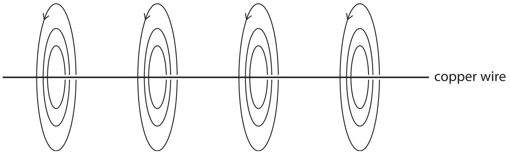
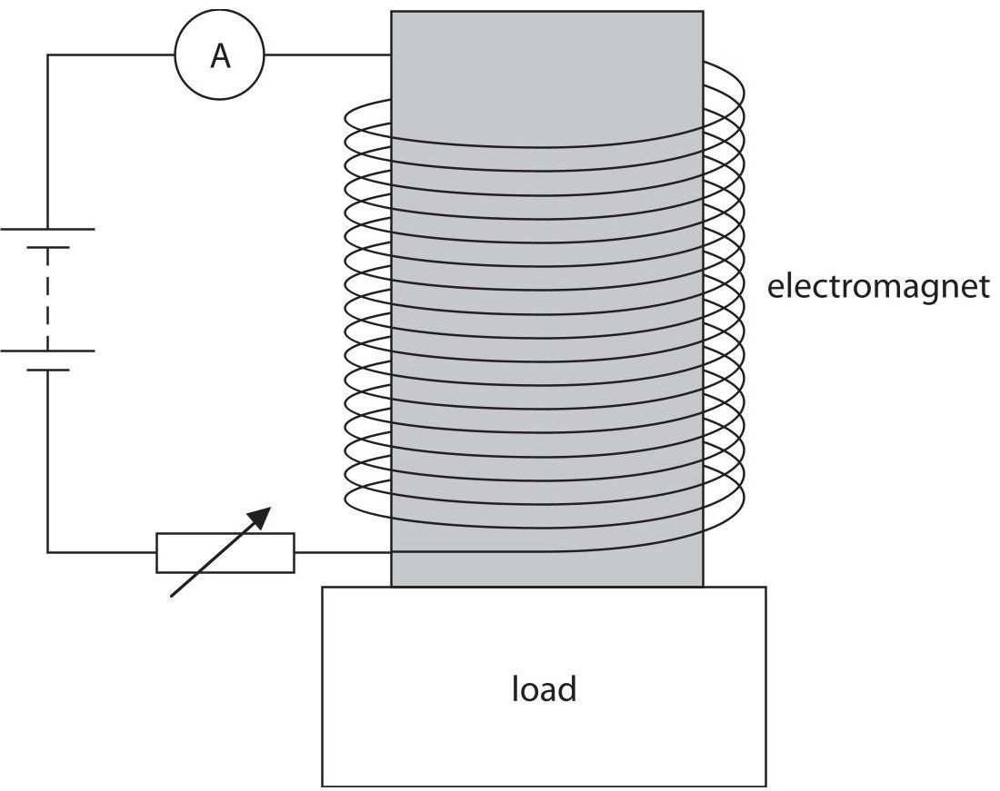
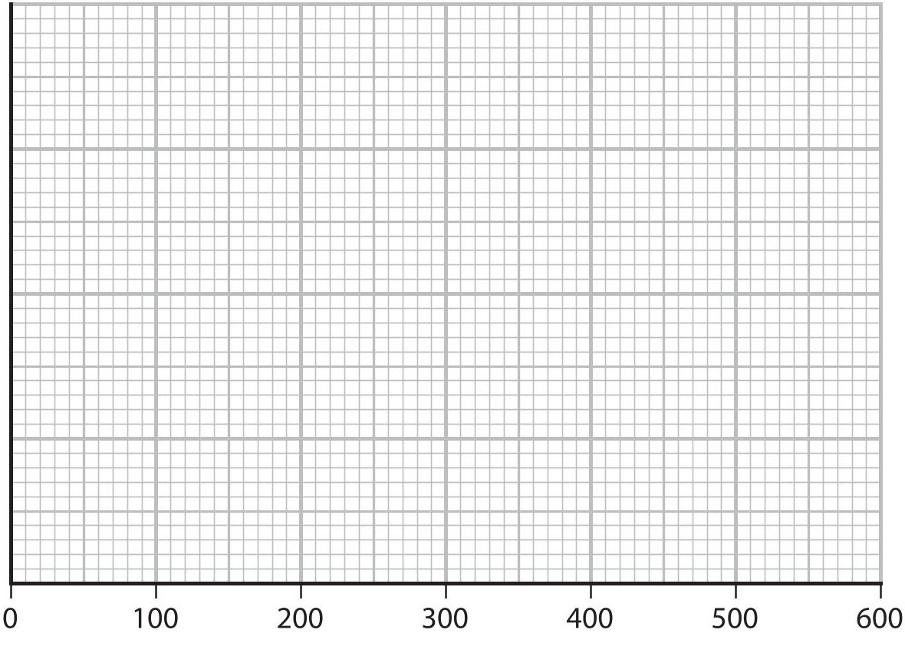
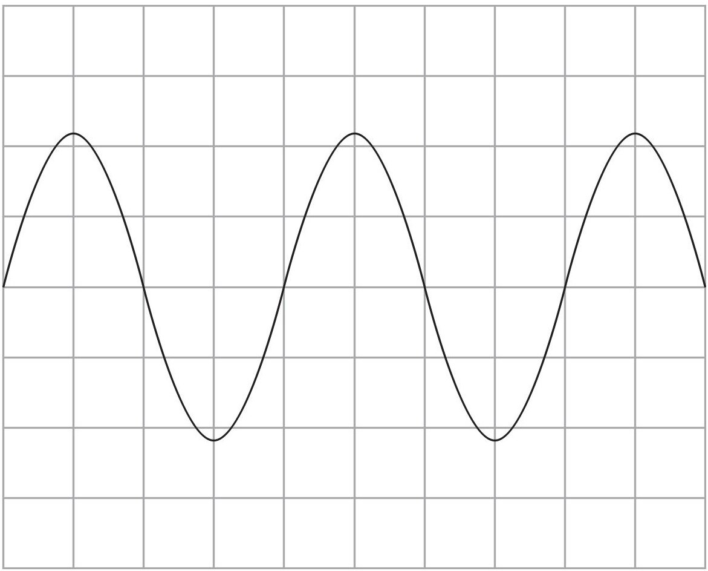

<table><tr><td colspan="3">Please check the examination details below before entering your candidate information</td></tr><tr><td colspan="2">Candidate surname</td><td>Other names</td></tr><tr><td>Centre Number</td><td colspan="2">Candidate Number</td></tr><tr><td colspan="3">Pearson Edexcel International GCSE (9-1)</td></tr><tr><td colspan="3">Friday 16 June 2023</td></tr><tr><td colspan="3">Morning (Time: 1 hour 15 minutes) Paper reference 4PH1/2PR</td></tr><tr><td colspan="3">Physics UNIT: 4PH1 PAPER: 2PR</td></tr><tr><td colspan="3">You must have: Ruler, calculator, Equation Booklet (enclosed)</td></tr><tr><td colspan="3">Total Marks</td></tr></table>

## Instructions

- Use black ink or ball-point pen.

- If pencil is used for diagrams/sketches/graphs it must be dark (HB or B).

- Fill in the boxes at the top of this page with your name, centre number and candidate number.

- Answer all questions.

- Answer the questions in the spaces provided

- there may be more space than you need.

- Show all the steps in any calculations and state the units.

## Information

- The total mark for this paper is 70.

- The marks for each question are shown in brackets

- use this as a guide as to how much time to spend on each question.

## Advice

- Read each question carefully before you start to answer it.

- Write your answers neatly and in good English.

- Try to answer every question.

- Check your answers if you have time at the end.

Turn over

## FORMULAE

You may find the following formulae useful.

$$
\mathrm {e n e r g y t r a n s f e r r e d} = \mathrm {c u r r e n t} \times \mathrm {v o l t a g e} \times \mathrm {t i m e}
$$

$$
E = I \times V \times t
$$

$$
\mathrm {f r e q u e n c y} = \frac {1}{\mathrm {t i m e p e r i o d}}
$$

$$
f = \frac {1}{T}
$$

$$
\mathrm {p o w e r} = \frac {\mathrm {w o r k d o n e}}{\mathrm {t i m e t a k e n}}
$$

$$
P = \frac {W}{t}
$$

$$
\mathrm {p o w e r} = \frac {\mathrm {e n e r g y t r a n s f e r r e d}}{\mathrm {t i m e t a k e n}}
$$

$$
P = \frac {W}{t}
$$

$$
\mathrm {o r b i t a l s p e e d} = \frac {2 \pi \times \mathrm {o r b i t a l r a d i u s}}{\mathrm {t i m e p e r i o d}}
$$

$$
v = \frac {2 \times \pi \times r}{T}
$$

(final speed) $ ^{2} $ = (initial speed) $ ^{2} $ + (2 $ \times $ acceleration $ \times $ distance moved)

$$
v ^ {2} = u ^ {2} + (2 \times a \times s)
$$

$$
\mathrm {p r e s s u r e} \times \mathrm {v o l u m e} = \mathrm {c o n s t a n t}
$$

$$
p _ {1} \times V _ {1} = p _ {2} \times V _ {2}
$$

$$
\frac {\mathrm {p r e s s u r e}}{\mathrm {t e m p e r a t u r e}} = \mathrm {c o n s t a n t}
$$

$$
\frac {p _ {1}}{T _ {1}} = \frac {p _ {2}}{T _ {2}}
$$

$$
\mathrm {f o r c e} = \frac {\mathrm {c h a n g e i n m o m e n t u m}}{\mathrm {t i m e t a k e n}}
$$

$$
F = \frac {(m v - m u)}{t}
$$

$$
\frac {\mathrm {c h a n g e o f w a v e l e n g t}}{\mathrm {w a v e l e n g t}} = \frac {\mathrm {v e l o c i t y o f a g a l a x y}}{\mathrm {s p e e d o f l i g h t}}
$$

$$
\frac {\lambda - \lambda_ {0}}{\lambda_ {0}} = \frac {\Delta \lambda}{\lambda_ {0}} = \frac {v}{c}
$$

change in thermal energy = mass $ \times $ specific heat capacity $ \times $ change in temperature

$$
\Delta Q = m \times c \times \Delta T
$$

Where necessary, assume the acceleration of free fall, g = 10 m/s $ ^{2} $

## Answer ALL questions.

1 (a) The boxes show some physical quantities and their units.

Draw a straight line from each physical quantity to its correct unit.

One has been done for you.

(b) Some physical quantities are scalars and other physical quantities are vectors.

(i) State the difference between a scalar quantity and a vector quantity.

(ii) Give an example of a scalar quantity.

(Total for Question 1 = 5 marks)

2 This question is about different methods of generating electricity.

(a) Natural gas can be burned to generate electricity.

Name the energy store that decreases when natural gas is burned.

(b) Burning natural gas and the movement of water waves can both be used to generate electricity.

Discuss the advantages and disadvantages of these two methods of generating electricity.

## (Total for Question 2 = 5 marks)

## BLANK PAGE

3 A cleaning product is applied to a car using a sponge pad.

The sponge pad is rubbed against the car to apply the cleaning product.

(Source: $ \textcircled{c} $ Nor Gal/Shutterstock)

(a) Some parts of the car are made of metal and other parts are made of plastic.

The metal parts of the car are earthed.

Explain why the pad becomes charged when rubbing the plastic parts, but not when rubbing the metal parts.

(b) The sponge pad is held near a metal post that is connected to the ground. The sponge pad discharges with a small spark through the air to the metal post.

(i) The sponge pad stores 5.0 mJ of energy in its electrostatic store.

The voltage between the sponge pad and the metal post is 6000V.

Calculate the charge transferred by the spark.

## charge transferred =

(ii) The small spark between the sponge pad and the metal post demonstrates that the sponge pad is charged.

Describe a different experiment that could demonstrate that the sponge pad is charged.

You may draw a diagram to support your answer.

4 The photograph shows a dummy during a test of the safety features of a car in a collision.

(Source: $ \circ $ fStop Images GmbH/Alamy Stock Photo)

Before the collision, the dummy in the car is travelling at a velocity of 14 m/s.

The dummy has a momentum of 1100 kg m/s.

(a) (i) State the formula linking momentum, mass and velocity.

(ii) Show that the mass of the dummy is approximately 80 kg.

(b) The dummy is brought to rest during the collision by a mean force of 15 kN. Calculate the time taken for the dummy to be brought to rest in the collision.

(c) The car being tested is fitted with airbags.

Using ideas about momentum, explain how an airbag reduces the force experienced by the dummy in the collision.

(Total for Question 4 = 9 marks)

5 This question is about specific heat capacity.

(a) State what is meant by the term specific heat capacity.

(b) The diagram shows a sample of solid stearic acid being heated in a boiling tube using a water bath.

The mass of stearic acid in the boiling tube is 58 g.

When the boiling tube is placed in the water bath, the temperature of the stearic acid increases from 21 $ ^{\circ} \mathrm{C} $ to 37 $ ^{\circ} \mathrm{C} $ . The stearic acid does not melt.

As the temperature of the stearic acid increases, an additional 3500 J of energy needs to be transferred electrically to the water bath.

(i) Using this data, show that the specific heat capacity of the solid stearic acid is approximately $ 4 \mathrm{~J} / \mathrm{g}^{\circ} \mathrm{C}. $

(ii) The true value for the specific heat capacity of solid stearic acid is $ 2. 3 \mathrm{J} / \mathrm{g} \mathrm{^{\circ} C}. $ Give a reason for the difference between the value in (i) and the true value.

(Total for Question 5 = 7 marks)

## BLANK PAGE

6 This question is about electromagnetism.

(a) Diagram 1 shows the magnetic field around a straight section of copper wire.

Diagram 1

Explain why the copper wire has the magnetic field shown in the diagram.

(b) A student investigates how the strength of an electromagnet varies with the current in the electromagnet.

The diagram shows their apparatus.

This is the student's method.

- switch on the electromagnet at its maximum current

- place a load of 100g so that it is held above the floor by the electromagnet

- slowly reduce the current in the electromagnet until the load falls from the electromagnet

- record the current at which the load falls

- record the current at which the same load falls two more times Repeat the method for loads of different masses.

(i) Suggest a suitable safety precaution for the student's investigation.

(ii) The table shows the student's results.

<table border="1"><tr><td rowspan="2">Mass of load in g</td><td colspan="4">Current at which the load falls in A</td></tr><tr><td>1</td><td>2</td><td>3</td><td>Mean</td></tr><tr><td>100</td><td>0.28</td><td>0.31</td><td>0.31</td><td>0.30</td></tr><tr><td>200</td><td>0.60</td><td>0.57</td><td>0.57</td><td>0.58</td></tr><tr><td>300</td><td>0.91</td><td>0.90</td><td>0.86</td><td>0.89</td></tr><tr><td>400</td><td>1.19</td><td>1.23</td><td>1.27</td><td>1.23</td></tr><tr><td>500</td><td>1.45</td><td>1.57</td><td>1.48</td><td>1.50</td></tr><tr><td>600</td><td>1.79</td><td>1.84</td><td>1.87</td><td></td></tr></table>

Calculate the mean current when the mass of the load was 600 g.

Give your answer to a suitable number of significant figures.

(iii) On the grid, plot a graph of the mean current against the mass of the load.

The scale for the mass axis has been done for you.

(iv) Draw the line of best fit.

Mass in g

(v) The student predicts that a load of 1.0kg will fall when the current in the electromagnet is 3.0 A.

Comment on the student's prediction.

(Total for Question 6 = 12 marks)

7 This question is about sound waves.

(a) The table gives the frequencies of some different sound waves.

Place ticks ( $ \checkmark $ ) in the table to show which sound waves can be heard by humans.

<table border="1"><tr><td>Sound wave</td><td>Frequency in Hz</td><td>Can be heard by humans</td></tr><tr><td>A</td><td>10</td><td></td></tr><tr><td>B</td><td>30</td><td></td></tr><tr><td>C</td><td>500</td><td></td></tr><tr><td>D</td><td>2000</td><td></td></tr><tr><td>E</td><td>10000</td><td></td></tr><tr><td>F</td><td>25000</td><td></td></tr></table>

(b) The diagram shows the screen of an oscilloscope when a sound wave is detected.

Add to the diagram by drawing the trace of another sound wave that has a lower pitch and is quieter than the sound wave shown.

(c) The speed of sound in air varies with temperature.

A student finds a formula in a textbook that links the speed of sound waves in air to the temperature of the air, measured in kelvin.

$$
\mathrm {s p e e d o f s o u n d i n a i r} = (0. 6 0 6 \times \mathrm {t e m p e r a t u r e i n k e l v i n}) + 1 6 6
$$

(i) Calculate the speed of sound when the air temperature is $ 4 6^{\circ} \mathrm{C}. $

(ii) Calculate the wavelength of a sound wave with a frequency of 15000 Hz when the air temperature is $ 4 6^{\circ} \mathrm{C}. $

8 This question is about stars.

(a) The table gives some information about four stars.

<table border="1"><tr><td>Star</td><td>Mass in solar masses</td><td>Colour</td><td>Absolute magnitude</td></tr><tr><td>A</td><td>0.7</td><td>orange</td><td>+7.5</td></tr><tr><td>B</td><td>1.0</td><td>yellow</td><td>+4.8</td></tr><tr><td>C</td><td>2.0</td><td>blue</td><td>+1.4</td></tr><tr><td>D</td><td>17.1</td><td>blue</td><td>-16.8</td></tr></table>

(i) Star C is much more powerful than star A.

Stars A and C appear to have the same brightness when viewed from Earth. Suggest how this is possible.

(ii) Using information from the table, explain which star is in the supernova stage of its evolution.

(b) Explain how a main sequence star evolves into a supernova.

(c) Astronomers have used supernovas in distant galaxies to investigate the expansion of the universe.

(i) Light emitted from a supernova at a wavelength of $ 7. 7 7 4 \times1 0^{-7} \mathrm{m} $ was detected at Earth with a wavelength of $ 7. 7 8 0 \times1 0^{-7} \mathrm{m}. $

Calculate the speed at which the galaxy containing this supernova was moving away from the Earth.

[speed of light=3.0 $ \times10^{8} $ m/s]

(ii) The astronomers investigated supernovas that showed a red-shift in the wavelengths detected in different galaxies.

The astronomers discovered that the red-shifted light detected from supernovas in nearby galaxies had shorter wavelengths than the red-shifted light detected from supernovas in galaxies further away.

Explain how this discovery supports the Big Bang theory.

(Total for Question 8 = 15 marks)

TOTAL FOR PAPER = 70 MARKS

## BLANK PAGE

## BLANK PAGE

## BLANK PAGE

<table><tr><td colspan="2">Pearson Edexcel International GCSE (9-1)</td></tr><tr><td colspan="2">Friday 16 June 2023</td></tr><tr><td>Morning (Time: 1 hour 15 minutes)</td><td>Paper reference 4PH1/2PR</td></tr><tr><td colspan="2">Physics
UNIT: 4PH1
PAPER: 2PR</td></tr><tr><td colspan="2">Equation Booklet
Do not return this Booklet with the question paper.</td></tr></table>

Turn over

These equations may be required for both International GCSE Physics (4PH1) and International GCSE Combined Science (4SD0) papers.

<table border="1"><tr><td colspan="2">1. Forces and Motion</td></tr><tr><td colspan="2">average speed $=\frac{distance\ moved}{time\ taken}$</td></tr><tr><td>acceleration $=\frac{change\ in\ velocity}{time\ taken}$</td><td>$a=\frac{(v-u)}{t}$</td></tr><tr><td colspan="2">$(final\ speed)^2=(initial\ speed)^2+(2\times acceleration\times distance\ moved)$
$v^2=u^2+(2\times a\times s)$</td></tr><tr><td>force $=$ mass $\times$ acceleration</td><td>F=m$\times$a</td></tr><tr><td>weight $=$ mass $\times$ gravitational field strength</td><td>W=m$\times$g</td></tr><tr><td colspan="2">2. Electricity</td></tr><tr><td>power $=$ current $\times$ voltage</td><td>P=I$\times$V</td></tr><tr><td>energy transferred $=$ current $\times$ voltage $\times$ time</td><td>E=I$\times$V$\times$t</td></tr><tr><td>voltage $=$ current $\times$ resistance</td><td>V=I$\times$R</td></tr><tr><td>charge $=$ current $\times$ time</td><td>Q=I$\times$t</td></tr><tr><td>energy transferred $=$ charge $\times$ voltage</td><td>E=Q$\times$V</td></tr><tr><td colspan="2">3. Waves</td></tr><tr><td>wave speed $=$ frequency $\times$ wavelength</td><td>v=f$\times$λ</td></tr><tr><td>frequency $=\frac{1}{time\ period}$</td><td>f=$\frac{1}{T}$</td></tr><tr><td>refractive index $=\frac{\sin(\angle\ of\ incidence)}{\sin(\angle\ of\ refraction)}$</td><td>n=$\frac{\sin i}{\sin r}$</td></tr><tr><td>$\sin(\mathrm{critical\ angle})=\frac{1}{\mathrm{refractive\ index}}$</td><td>$\sin c=\frac{1}{n}$</td></tr></table>

<table border="1"><tr><td colspan="2">4. Energy resources and energy transfers</td></tr><tr><td colspan="2">efficiency $=\frac{\text{useful energy output}}{\text{total energy output}}\times100\%$</td></tr><tr><td>work done = force $\times$ distance moved</td><td>W=F$\times$d</td></tr><tr><td colspan="2">gravitational potential energy = mass $\times$ gravitational field strength $\times$ height</td></tr><tr><td colspan="2">GPE=m$\times$g$\times$h</td></tr><tr><td>kinetic energy $=\frac{1}{2}\times$ mass $\times$ speed$^{2}$</td><td>KE=$\frac{1}{2}\times$ m$\times$v$^{2}$</td></tr><tr><td>power $=\frac{\text{work done}}{\text{time taken}}$</td><td>P=$\frac{W}{t}$</td></tr><tr><td colspan="2">5. Solids, liquids and gases</td></tr><tr><td>density $=\frac{\text{mass}}{\text{volume}}$</td><td>$\rho=\frac{m}{V}$</td></tr><tr><td>pressure $=\frac{\text{force}}{\text{area}}$</td><td>$p=\frac{F}{A}$</td></tr><tr><td colspan="2">pressure difference = height $\times$ density $\times$ gravitational field strength</td></tr><tr><td colspan="2">p=h$\times$\rho$\times$g</td></tr><tr><td>$\frac{\text{pressure}}{\text{temperature}}=\text{constant}$</td><td>$\frac{p_{1}}{T_{1}}=\frac{p_{2}}{T_{2}}$</td></tr><tr><td>pressure $\times$ volume = constant</td><td>$p_{1}\times V_{1}=p_{2}\times V_{2}$</td></tr><tr><td colspan="2">8. Astrophysics</td></tr><tr><td>orbital speed $=\frac{2\times\pi\times\text{orbital radius}}{\text{time period}}$</td><td>$v=\frac{2\times\pi\times r}{T}$</td></tr></table>

The equations on the following page will only be required for International GCSE Physics.

<table border="1"><tr><td colspan="2">1. Forces and Motion</td></tr><tr><td>momentum=mass×velocity</td><td>p=m×v</td></tr><tr><td>force=$\frac{\text{change in momentum}}{\text{time taken}}$</td><td>F=$\frac{(mv-mu)}{t}$</td></tr><tr><td colspan="2">moment=force×perpendicular distance from the pivot</td></tr><tr><td colspan="2">5. Solids, liquids and gases</td></tr><tr><td colspan="2">change in thermal energy=mass×specific heat capacity×change in temperature
$\Delta Q=m\times c\times \Delta T$</td></tr><tr><td colspan="2">6. Magnetism and electromagnetism</td></tr><tr><td colspan="2">relationship between input and output voltages for a transformer
$\frac{\text{input (primary) voltage}}{\text{output (secondary) voltage}}=\frac{\text{primary turns}}{\text{secondary turns}}$</td></tr><tr><td colspan="2">input power=output power
$V_{p}I_{p}=V_{s}I_{s}$
for 100% efficiency</td></tr><tr><td colspan="2">8. Astrophysics</td></tr><tr><td>$\frac{\text{change in wavelength}}{\text{reference wavelength}}=\frac{\text{velocity of a galaxy}}{\text{speed of light}}$</td><td>$\frac{\lambda-\lambda_{0}}{\lambda_{0}}=\frac{\Delta\lambda}{\lambda_{0}}=\frac{v}{c}$</td></tr></table>

END OF EQUATION LIST

