<table><tr><td colspan="3">Please check the examination details below before entering your candidate information</td></tr><tr><td colspan="2">Candidate surname</td><td>Other names</td></tr><tr><td>Centre Number</td><td colspan="2">Candidate Number</td></tr><tr><td colspan="3">Pearson Edexcel International GCSE (9-1)</td></tr><tr><td colspan="3">Friday 16 June 2023</td></tr><tr><td colspan="2">Morning (Time: 1 hour 15 minutes)</td><td>Paper reference 4PH1/2P</td></tr><tr><td colspan="3">Physics
UNIT: 4PH1
PAPER: 2P</td></tr><tr><td colspan="3">You must have:
Ruler, calculator, protractor, Equation Booklet (enclosed)</td></tr><tr><td colspan="3">Total Marks</td></tr></table>

## Instructions

- Use black ink or ball-point pen.

- If pencil is used for diagrams/sketches/graphs it must be dark (HB or B).

- Fill in the boxes at the top of this page with your name, centre number and candidate number.

- Answer all questions.

- Answer the questions in the spaces provided - there may be more space than you need.

- Show all the steps in any calculations and state the units.

## Information

- The total mark for this paper is 70.

- The marks for each question are shown in brackets

- use this as a guide as to how much time to spend on each question.

## Advice

- Read each question carefully before you start to answer it.

- Write your answers neatly and in good English.

- Try to answer every question.

- Check your answers if you have time at the end.

Turn over

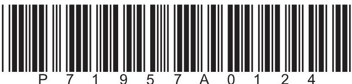

## FORMULAE

You may find the following formulae useful.

$$
\mathrm {e n e r g y t r a n s f e r r e d} = \mathrm {c u r r e n t} \times \mathrm {v o l t a g e} \times \mathrm {t i m e}
$$

$$
E = I \times V \times t
$$

$$
\mathrm {f r e q u e n c y} = \frac {1}{\mathrm {t i m e p e r i o d}}
$$

$$
f = \frac {1}{T}
$$

$$
\mathrm {p o w e r} = \frac {\mathrm {w o r k d o n e}}{\mathrm {t i m e t a k e n}}
$$

$$
P = \frac {W}{t}
$$

$$
\mathrm {p o w e r} = \frac {\mathrm {e n e r g y t r a n s f e r r e d}}{\mathrm {t i m e t a k e n}}
$$

$$
P = \frac {W}{t}
$$

$$
\mathrm {o r b i t a l s p e e d} = \frac {2 \pi \times \mathrm {o r b i t a l r a d i u s}}{\mathrm {t i m e p e r i o d}}
$$

$$
v = \frac {2 \times \pi \times r}{T}
$$

(final speed) $ ^{2} $ = (initial speed) $ ^{2} $ + (2 $ \times $ acceleration $ \times $ distance moved)

$$
v ^ {2} = u ^ {2} + (2 \times a \times s)
$$

$$
\mathrm {p r e s s u r e} \times \mathrm {v o l u m e} = \mathrm {c o n s t a n t}
$$

$$
p _ {1} \times V _ {1} = p _ {2} \times V _ {2}
$$

$$
\frac {\mathrm {p r e s s u r e}}{\mathrm {t e m p e r a t u r e}} = \mathrm {c o n s t a n t}
$$

$$
\frac {p _ {1}}{T _ {1}} = \frac {p _ {2}}{T _ {2}}
$$

$$
\mathrm {f o r c e} = \frac {\mathrm {c h a n g e i n m o m e n t u m}}{\mathrm {t i m e t a k e n}}
$$

$$
F = \frac {(m v - m u)}{t}
$$

$$
\frac {\mathrm {c h a n g e o f w a v e l e n g t}}{\mathrm {w a v e l e n g t}} = \frac {\mathrm {v e l o c i t y o f a g a l a x y}}{\mathrm {s p e e d o f l i g h t}}
$$

$$
\frac {\lambda - \lambda_ {0}}{\lambda_ {0}} = \frac {\Delta \lambda}{\lambda_ {0}} = \frac {v}{c}
$$

change in thermal energy = mass $ \times $ specific heat capacity $ \times $ change in temperature

$$
\Delta Q = m \times c \times \Delta T
$$

Where necessary, assume the acceleration of free fall, g = 10 m/s $ ^{2} $

## BLANK PAGE

## Answer ALL questions.

Some questions must be answered with a cross in a box. If you change your mind about an answer, put a line through the box and then mark your new answer with a cross.

1 A pencil has a weight of 0.16 N.

(a) What is the mass of the pencil?

A 1.6g

B 16g

C 160g

D 1600g

(b) The diagram shows the pencil with one end resting on a small block.

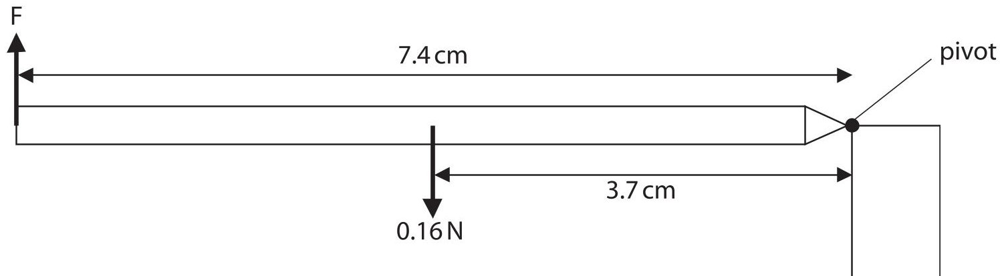

A finger provides an upwards force, F, to keep the pencil horizontal.

(i) The weight of the pencil is 0.16 N.

Calculate the moment of the weight of the pencil about the pivot. Use the formula moment = force $ \times $ perpendicular distance from the pivot

(ii) State the moment of the force F.

(iii) Show that force F is 0.080N.

<table><tr><td>(Total for Question 1 = 6 marks)</td></tr></table>

2 A solid bar of chocolate is taken from a refrigerator.

(Source:  $ \textcircled{c} $ MarySan/Shutterstock)

(a) The temperature of the chocolate bar is $ 5^{\circ} \mathrm{C}. $

Describe the arrangement and motion of the particles inside the chocolate bar.

(b) The chocolate is heated at a constant rate until the temperature reaches $ 4 5^{\circ} \mathrm{C} $ The chocolate has a melting point of $ 3 2^{\circ} \mathrm{C} $ and a boiling point of $ 5 5^{\circ} \mathrm{C} $

(i) Describe the motion of the particles in the chocolate when the chocolate is at a temperature of $ 4 5^{\circ} \mathrm{C} $

(ii) Which of these is used to measure the temperature of the chocolate?

A balance

(1) 

B ruler

stopwatch

D thermometer

(iii) Use the axes to sketch a graph of how the temperature of the chocolate changes with time when it is heated from $ 5^{\circ} \mathrm{C} $ to $ 45^{\circ} \mathrm{C}. $

Temperature in $ ^{\circ} \mathrm{C} $

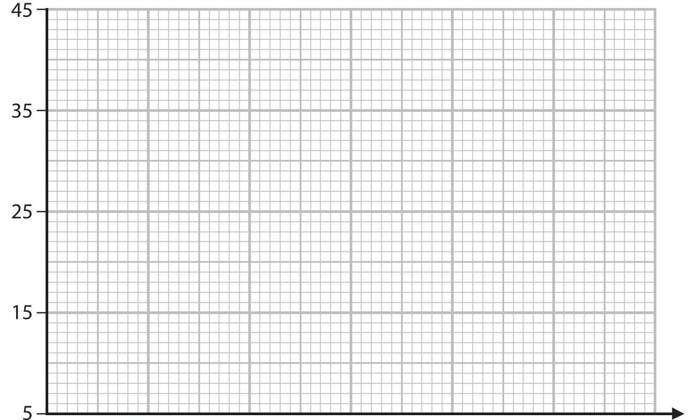

Time

(Total for Question 2 = 8 marks)

## BLANK PAGE

3 The diagram shows the inside of an oscilloscope.

Electrons leave the electron supply and accelerate towards the screen.

The stream of electrons hits the screen.

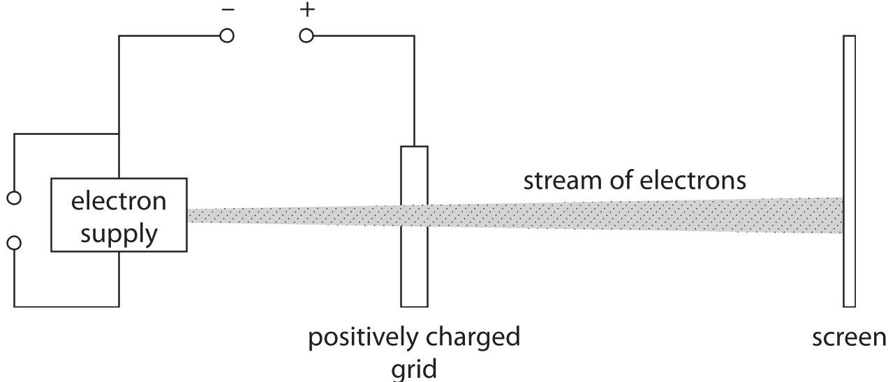

(a) The grid is connected to the positive terminal of a high voltage power supply.

(i) Explain, in terms of the movement of particles, how the grid has become positively charged.

(ii) State the formula linking kinetic energy, mass and speed.

(iii) Calculate the speed of an electron when it has $ 1. 3 \times1 0^{-1 5} $ J of kinetic energy. The mass of an electron is $ 9. 1 \times1 0^{-3 1} $ kg.

(b) The stream of electrons spreads out as it travels towards the screen. Explain why the electrons in the stream move apart from each other.

(c) The oscilloscope can cause the electrons to move in a circle. This produces a circular pattern on the screen.

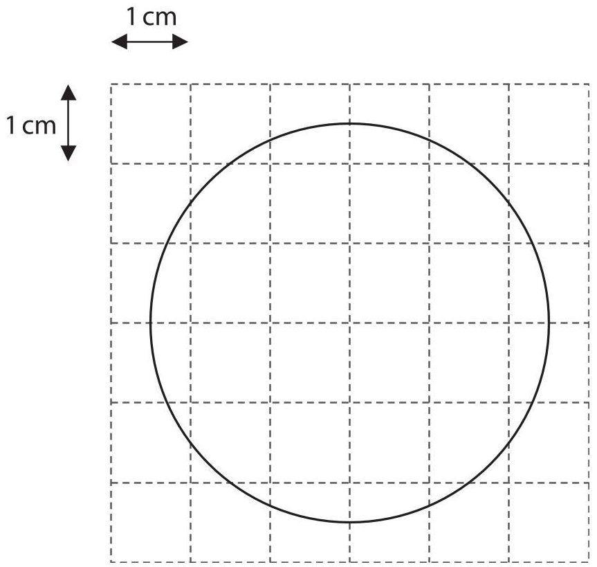

(i) Use the scale to determine the radius of the circle.

(ii) The time taken for the electrons to complete one orbit of the circle is 24 ms.

Calculate the orbital speed of the electrons.

Use the formula

$$
\mathrm {o r b i t a l s p e e d} = \frac {2 \pi \times \mathrm {o r b i t a l r a d i u s}}{\mathrm {t i m e p e r i o d}}
$$

<table border="1"><tr><td>orbital speed $= \frac{2v_{orbital}}{time period}$</td><td>(3)</td></tr><tr><td>orbital speed $= $ m/s</td><td></td></tr><tr><td colspan="2">(Total for Question 3 = 12 marks)</td></tr></table>

4 The diagram shows two birds, just before bird X catches the smaller bird Y. Both birds are travelling horizontally at constant velocity.

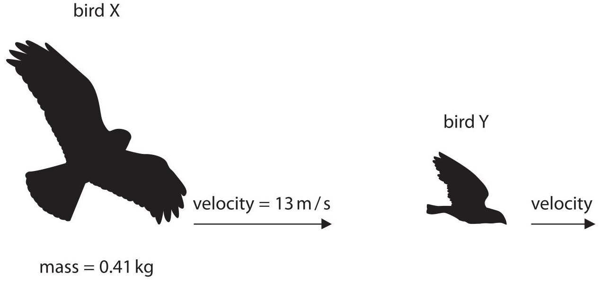

(a) Show that the momentum of bird X is about 5 kg m/s.

(b) The momentum of bird Y just before it is caught is 0.15kgm/s.

Calculate the total momentum of the birds just before bird X catches bird Y.

$$
\mathrm {m o m e n t u m} =
$$

(c) State the total momentum of the birds just after bird X has caught bird Y.

$$
\mathrm {m o m e n t u m} =
$$

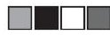

(d) Bird Y has a mass of 0.17 kg.

<table><tr><td>(d) Bird I has a mass of 0.17 kg.
Calculate the velocity of the birds just after bird X has caught bird Y.</td><td>(3)</td></tr><tr><td colspan="2">velocity = ... m/s</td></tr><tr><td colspan="2">(Total for Question 4 = 7 marks)</td></tr></table>

5 The diagram shows some of the components of a nuclear fission reactor.

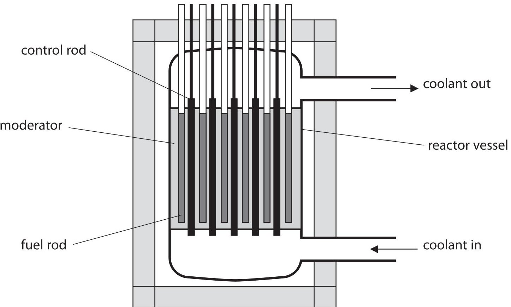

(a) Describe how a chain reaction occurs in a nuclear fission reactor.

(b) Describe the role of the control rods in a nuclear fission reactor.

(c) Describe how the process of nuclear fission is different from the process of nuclear fusion.

(d) (i) Which of these is the name of the nuclear process that is the main energy source for stars?

A alpha decay

fusion

D gamma decay

B fission

(ii) Give a reason why the nuclear process in stars does not happen at low temperatures and pressures.

(Total for Question 5 = 9 marks)

6 The National Grid is used in the United Kingdom for the large-scale transmission of electricity. The photograph shows solar panels connected to the National Grid.

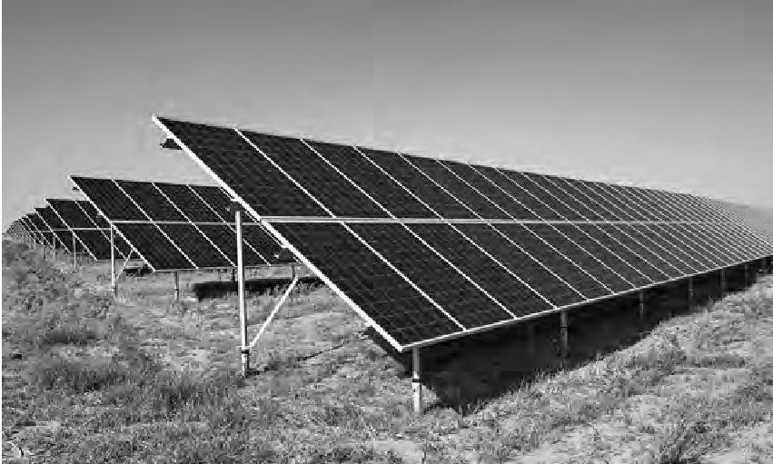

(Source: $ \textcircled{c} $ Jenson/Shutterstock)

(a) Solar panels provide direct current to a device that outputs an alternating current so that the energy from the solar panels can be supplied to the National Grid.

(i) Explain why a step-up transformer is used to supply the National Grid.

(ii) This is the label on the step-up transformer.

input voltage = 15kV output voltage = 340kV number of turns on primary coil = 1400

State the formula linking input voltage, output voltage and turns ratio for a transformer.

(iii) Calculate the number of turns on the secondary coil of the step-up transformer.

number of turns=

(b) Solar panels produce constant direct current (d.c.).

Explain why a transformer will not work when connected to constant direct current.

(Total for Question 6 = 9 marks)

## BLANK PAGE

7 (a) A glass prism can be used to refract light.

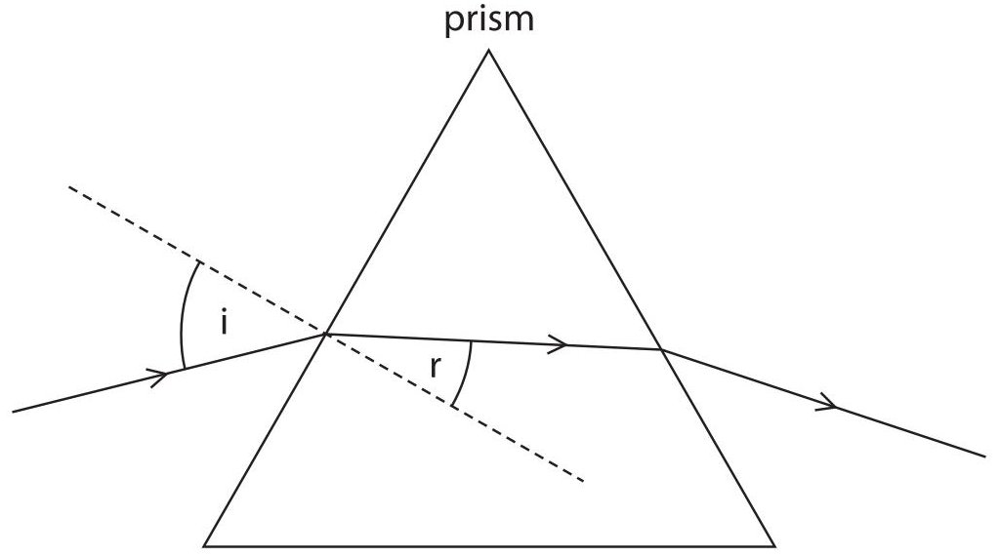

(i) State the name of the piece of equipment used to measure angles.

(ii) Measure the angle of incidence and the angle of refraction for the light entering the prism.

angle of incidence = degrees

angle of refraction = degrees

(iii) State the formula linking refractive index, angle of incidence and angle of refraction.

(iv) Calculate the refractive index of the glass.

(b) Two galaxies, A and B, emit red light with a reference wavelength of 630 nm.

An astronomer measures the wavelength of red light from galaxy A when the light arrives at the Earth.

The astronomer's value for the wavelength is 645 nm.

(i) Calculate the difference between the astronomer's value for the wavelength and the reference wavelength of red light.

(ii) The change in wavelength happens because galaxy A is moving away from the Earth.

Calculate the speed of galaxy A.

[speed of light=3.0 $ \times10^{8} $ m/s]

(iii) Light from galaxy B has twice the redshift as light from galaxy A. Galaxy B is twice as far away from Earth as galaxy A.

Explain how these observations support the Big Bang theory of the origin of the Universe.

(Total for Question 7 = 12 marks)

8 Concrete on top of buildings can be used to heat water.

The photograph shows a concrete and water heating system being built into the roof of a house.

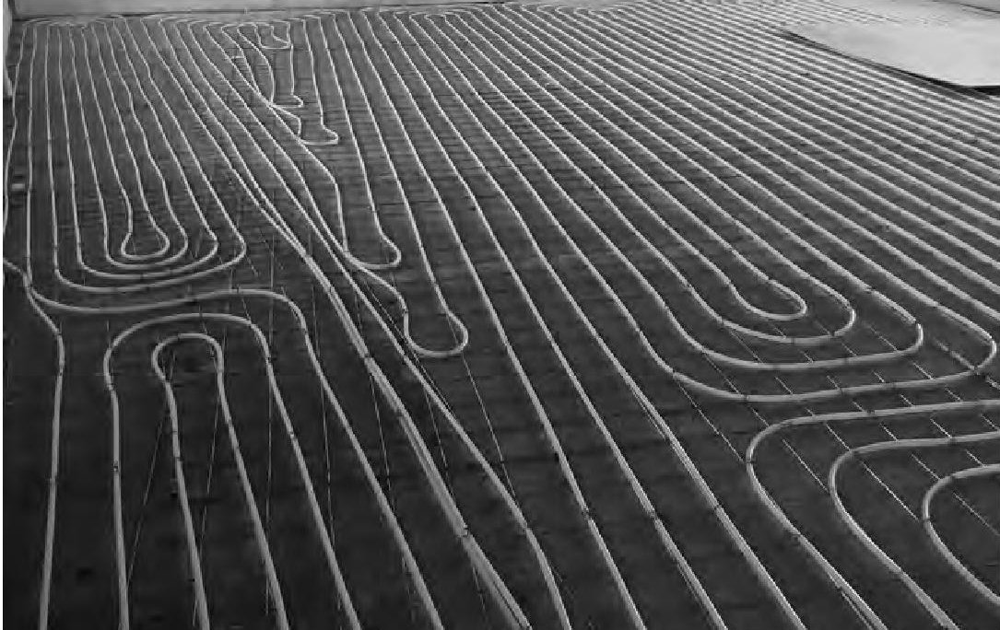

(Source: $ \textcircled{c} $ejhgndrn/Shutterstock)

(a) A scientist wants to determine the specific heat capacity of concrete.

The diagram shows some of the equipment they could use.

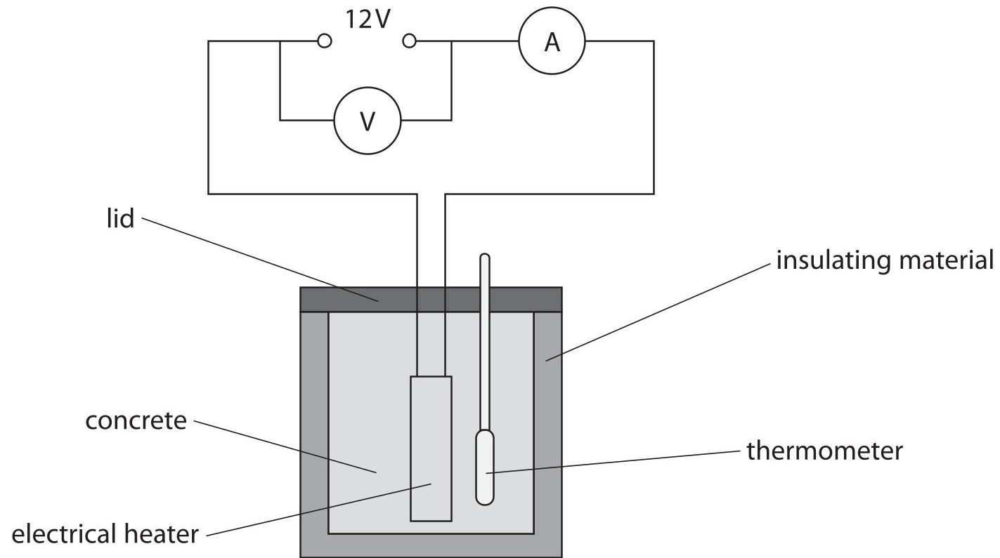

Describe a suitable method to find the specific heat capacity of concrete.

(b) Explain the advantage of the concrete having a high specific heat capacity when it is used to heat water in the heating system.

(Total for Question 8 = 7 marks)

## TOTAL FOR PAPER = 70 MARKS

## BLANK PAGE

<table><tr><td colspan="2">Pearson Edexcel International GCSE (9-1)</td></tr><tr><td colspan="2">Friday 16 June 2023</td></tr><tr><td>Morning (Time: 1 hour 15 minutes)</td><td>Paper reference 4PH1/2P</td></tr><tr><td colspan="2">Physics
UNIT: 4PH1
PAPER: 2P</td></tr><tr><td colspan="2">Equation Booklet
Do not return this Booklet with the question paper.</td></tr></table>

Turn over

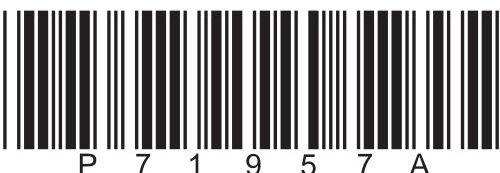

These equations may be required for both International GCSE Physics (4PH1) and International GCSE Combined Science (4SD0) papers.

<table border="1"><tr><td colspan="2">1. Forces and Motion</td></tr><tr><td colspan="2">average speed $=\frac{distance\ moved}{time\ taken}$</td></tr><tr><td>acceleration $=\frac{change\ in\ velocity}{time\ taken}$</td><td>$a=\frac{(v-u)}{t}$</td></tr><tr><td colspan="2">$(final\ speed)^2=(initial\ speed)^2+(2\times acceleration\times distance\ moved)$
$v^2=u^2+(2\times a\times s)$</td></tr><tr><td>force $=$ mass $\times$ acceleration</td><td>F=m$\times$a</td></tr><tr><td>weight $=$ mass $\times$ gravitational field strength</td><td>W=m$\times$g</td></tr><tr><td colspan="2">2. Electricity</td></tr><tr><td>power $=$ current $\times$ voltage</td><td>P=I$\times$V</td></tr><tr><td>energy transferred $=$ current $\times$ voltage $\times$ time</td><td>E=I$\times$V$\times$t</td></tr><tr><td>voltage $=$ current $\times$ resistance</td><td>V=I$\times$R</td></tr><tr><td>charge $=$ current $\times$ time</td><td>Q=I$\times$t</td></tr><tr><td>energy transferred $=$ charge $\times$ voltage</td><td>E=Q$\times$V</td></tr><tr><td colspan="2">3. Waves</td></tr><tr><td>wave speed $=$ frequency $\times$ wavelength</td><td>v=f$\times$λ</td></tr><tr><td>frequency $=\frac{1}{time\ period}$</td><td>f=$\frac{1}{T}$</td></tr><tr><td>refractive index $=\frac{\sin(\angle\ of\ incidence)}{\sin(\angle\ of\ refraction)}$</td><td>n=$\frac{\sin i}{\sin r}$</td></tr><tr><td>$\sin(\mathrm{critical\ angle})=\frac{1}{\mathrm{refractive\ index}}$</td><td>$\sin c=\frac{1}{n}$</td></tr></table>

<table border="1"><tr><td colspan="2">4. Energy resources and energy transfers</td></tr><tr><td colspan="2">efficiency $=\frac{\text{useful energy output}}{\text{total energy output}}\times100\%$</td></tr><tr><td>work done $=\text{force}\times\text{distance moved}$</td><td>$W=F\times d$</td></tr><tr><td colspan="2">gravitational potential energy $=\text{mass}\times\text{gravitational field strength}\times\text{height}$</td></tr><tr><td colspan="2">GPE $=m\times g\times h$</td></tr><tr><td>kinetic energy $=\frac{1}{2}\times\text{mass}\times\text{speed}^{2}$</td><td>$KE=\frac{1}{2}\times m\times v^{2}$</td></tr><tr><td>power $=\frac{\text{work done}}{\text{time taken}}$</td><td>$P=\frac{W}{t}$</td></tr><tr><td colspan="2">5. Solids, liquids and gases</td></tr><tr><td>density $=\frac{\text{mass}}{\text{volume}}$</td><td>$\rho=\frac{m}{V}$</td></tr><tr><td>pressure $=\frac{\text{force}}{\text{area}}$</td><td>$p=\frac{F}{A}$</td></tr><tr><td colspan="2">pressure difference $=\text{height}\times\text{density}\times\text{gravitational field strength}$</td></tr><tr><td colspan="2">$p=h\times\rho\times g$</td></tr><tr><td>$\frac{\text{pressure}}{\text{temperature}}=\text{constant}$</td><td>$\frac{p_{1}}{T_{1}}=\frac{p_{2}}{T_{2}}$</td></tr><tr><td>pressure $\times$ volume $=\text{constant}$</td><td>$p_{1}\times V_{1}=p_{2}\times V_{2}$</td></tr><tr><td colspan="2">8. Astrophysics</td></tr><tr><td>orbital speed $=\frac{2\times\pi\times\text{orbital radius}}{\text{time period}}$</td><td>$v=\frac{2\times\pi\times r}{T}$</td></tr></table>

The equations on the following page will only be required for International GCSE Physics.

<table border="1"><tr><td colspan="2">1. Forces and Motion</td></tr><tr><td>momentum=mass×velocity</td><td>p=m×v</td></tr><tr><td>force=$\frac{\text{change in momentum}}{\text{time taken}}$</td><td>F=$\frac{(mv-mu)}{t}$</td></tr><tr><td colspan="2">moment=force×perpendicular distance from the pivot</td></tr><tr><td colspan="2">5. Solids, liquids and gases</td></tr><tr><td colspan="2">change in thermal energy=mass×specific heat capacity×change in temperature
$\Delta Q=m\times c\times \Delta T$</td></tr><tr><td colspan="2">6. Magnetism and electromagnetism</td></tr><tr><td colspan="2">relationship between input and output voltages for a transformer
$\frac{\text{input (primary) voltage}}{\text{output (secondary) voltage}}=\frac{\text{primary turns}}{\text{secondary turns}}$</td></tr><tr><td colspan="2">input power=output power
$V_{p}I_{p}=V_{s}I_{s}$
for 100% efficiency</td></tr><tr><td colspan="2">8. Astrophysics</td></tr><tr><td>$\frac{\text{change in wavelength}}{\text{reference wavelength}}=\frac{\text{velocity of a galaxy}}{\text{speed of light}}$</td><td>$\frac{\lambda-\lambda_{0}}{\lambda_{0}}=\frac{\Delta\lambda}{\lambda_{0}}=\frac{v}{c}$</td></tr></table>

END OF EQUATION LIST

