<table><tr><td colspan="3">Please check the examination details below before entering your candidate information</td></tr><tr><td colspan="2">Candidate surname</td><td>Other names</td></tr><tr><td>Centre Number</td><td colspan="2">Candidate Number</td></tr><tr><td colspan="3">Pearson Edexcel International GCSE (9-1)</td></tr><tr><td colspan="3">Friday 14 June 2024</td></tr><tr><td colspan="2">Afternoon (Time: 1 hour 15 minutes)</td><td>Paper reference 4PH1/2PR</td></tr><tr><td colspan="3">Physics
UNIT: 4PH1
PAPER: 2PR</td></tr><tr><td colspan="3">You must have:
Ruler, calculator, Equation Booklet (enclosed)</td></tr><tr><td colspan="3">Total Marks</td></tr></table>

## Instructions

- Use black ink or ball-point pen.

- Fill in the boxes at the top of this page with your name, centre number and candidate number.

- Answer all questions.

- Answer the questions in the spaces provided - there may be more space than you need.

- Show all the steps in any calculations and state the units.

## Information

- The total mark for this paper is 70.

- The marks for each question are shown in brackets

- use this as a guide as to how much time to spend on each question.

## Advice

- Read each question carefully before you start to answer it.

- Write your answers neatly and in good English.

- Try to answer every question.

- Check your answers if you have time at the end.

Turn over

## FORMULAE

You may find the following formulae useful.

$$
\mathrm {e n e r g y t r a n s f e r r e d} = \mathrm {c u r r e n t} \times \mathrm {v o l t a g e} \times \mathrm {t i m e}
$$

$$
E = I \times V \times t
$$

$$
\mathrm {f r e q u e n c y} = \frac {1}{\mathrm {t i m e p e r i o d}}
$$

$$
f = \frac {1}{T}
$$

$$
\mathrm {p o w e r} = \frac {\mathrm {w o r k d o n e}}{\mathrm {t i m e t a k e n}}
$$

$$
P = \frac {W}{t}
$$

$$
\mathrm {p o w e r} = \frac {\mathrm {e n e r g y t r a n s f e r r e d}}{\mathrm {t i m e t a k e n}}
$$

$$
P = \frac {W}{t}
$$

$$
\mathrm {o r b i t a l s p e e d} = \frac {2 \pi \times \mathrm {o r b i t a l r a d i u s}}{\mathrm {t i m e p e r i o d}}
$$

$$
v = \frac {2 \times \pi \times r}{T}
$$

(final speed) $ ^{2} $ = (initial speed) $ ^{2} $ + (2 $ \times $ acceleration $ \times $ distance moved)

$$
v ^ {2} = u ^ {2} + (2 \times a \times s)
$$

$$
\mathrm {p r e s s u r e} \times \mathrm {v o l u m e} = \mathrm {c o n s t a n t}
$$

$$
p _ {1} \times V _ {1} = p _ {2} \times V _ {2}
$$

$$
\frac {\mathrm {p r e s s u r e}}{\mathrm {t e m p e r a t u r e}} = \mathrm {c o n s t a n t}
$$

$$
\frac {p _ {1}}{T _ {1}} = \frac {p _ {2}}{T _ {2}}
$$

$$
\mathrm {f o r c e} = \frac {\mathrm {c h a n g e i n m o m e n t u m}}{\mathrm {t i m e t a k e n}}
$$

$$
F = \frac {(m v - m u)}{t}
$$

$$
\frac {\mathrm {c h a n g e o f w a v e l e n g t}}{\mathrm {w a v e l e n g t}} = \frac {\mathrm {v e l o c i t y o f a g a l a x y}}{\mathrm {s p e e d o f l i g h t}}
$$

$$
\frac {\lambda - \lambda_ {0}}{\lambda_ {0}} = \frac {\Delta \lambda}{\lambda_ {0}} = \frac {v}{c}
$$

change in thermal energy = mass $ \times $ specific heat capacity $ \times $ change in temperature

$$
\Delta Q = m \times c \times \Delta T
$$

Where necessary, assume the acceleration of free fall, g = 10 m/s $ ^{2} $

## BLANK PAGE

## Answer ALL questions.

Some questions must be answered with a cross in a box. If you change your mind about an answer, put a line through the box and then mark your new answer with a cross.

1 This question is about stars.

The diagram shows an incomplete Hertzsprung-Russell (H-R) diagram.

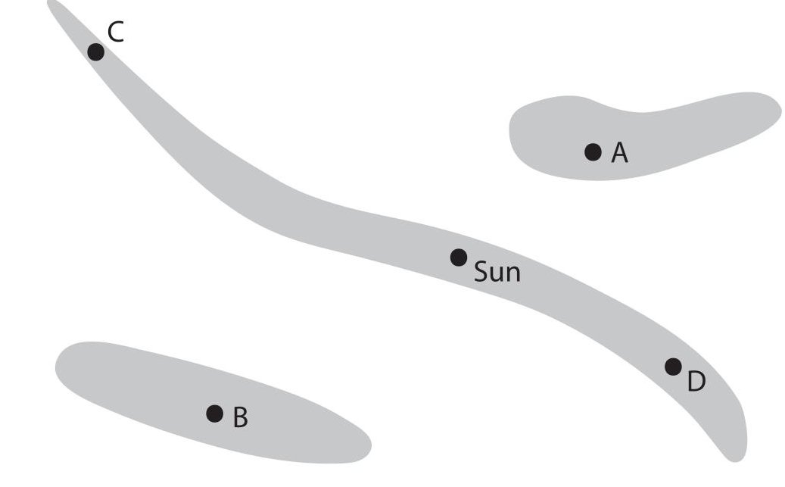

(a) Label the axes on the diagram.

(b) There are three shaded areas on the diagram.

State the name of the shaded area that contains the Sun.

(c) Which star is a white dwarf?

A

B

C

D

(d) At a standard distance from the Earth, which star is brighter than the Sun and has a greater surface temperature than the Sun? (1)

A

B

C

D

(Total for Question 1 = 5 marks)

2 This question is about nuclear fission and nuclear fusion.

(a) The table gives some statements about nuclear fission, or nuclear fusion, or both nuclear fission and nuclear fusion.

Place ticks ( $ \checkmark $ ) in the table to show which statements are about nuclear fission and which statements are about nuclear fusion.

<table border="1"><tr><td>Statement</td><td>Nuclear fission</td><td>Nuclear fusion</td></tr><tr><td>requires high pressure and high temperature</td><td></td><td></td></tr><tr><td>energy is released</td><td></td><td></td></tr><tr><td>radioactive daughter nuclei are produced</td><td></td><td></td></tr></table>

(b) Nuclear fission reactors use control rods and a moderator.

Describe the function of the control rods and the function of the moderator in a nuclear fission reactor.

control rods

moderator

(Total for Question 2 = 5 marks)

## BLANK PAGE

3 A sample of liquid gallium is allowed to cool in a laboratory.

The liquid gallium freezes to become a solid.

(a) Complete the diagram by drawing the arrangement of particles in a liquid and the arrangement of particles in a solid.

The first particle in each box has been drawn for you.

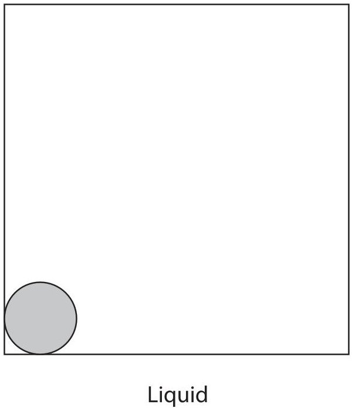

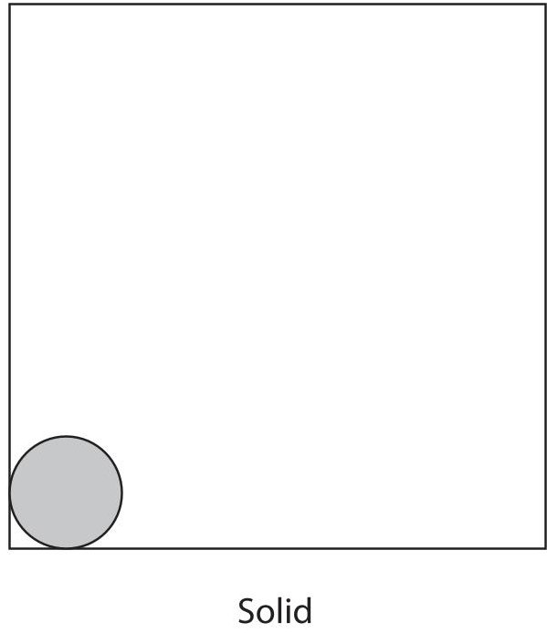

(b) The initial temperature of the sample of liquid gallium is $ 8 0^{\circ} \mathrm{C}. $

The freezing temperature of gallium is $ 3 0^{\circ} \mathrm{C}. $

The final temperature of the solid gallium is $ 2 0^{\circ} \mathrm{C}. $

Complete the graph to show how the temperature of the gallium changes during the time that it cools to $ 2 0^{\circ} \mathrm{C} $

Add appropriate values to the temperature axis.

$$
^{\circ} C
$$

4 The photograph shows transmission cables used for long-distance transmission of electricity.

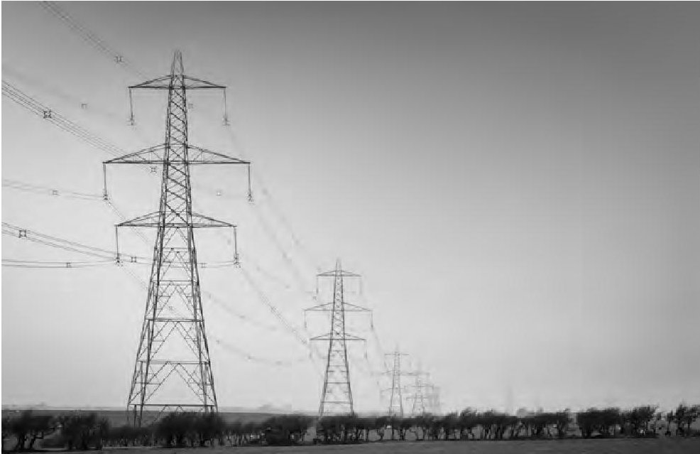

(Source: $ \textcircled{c} $ Paul Maguire / Shutterstock)

(a) The diagram shows a power station and a school.

Add to the diagram by drawing the structures needed to efficiently transfer energy from the power station to the school using electricity.

Power station

School

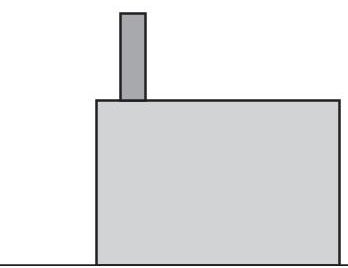

(b) Explain how the amount of current in the transmission cables increases the efficiency of the transmission of electricity.

(Total for Question 4 = 6 marks)

## BLANK PAGE

5 The diagram shows the collision between two balls, A and B.

The masses and velocities of both balls are shown before and after the collision. Ball B is stationary before the collision.

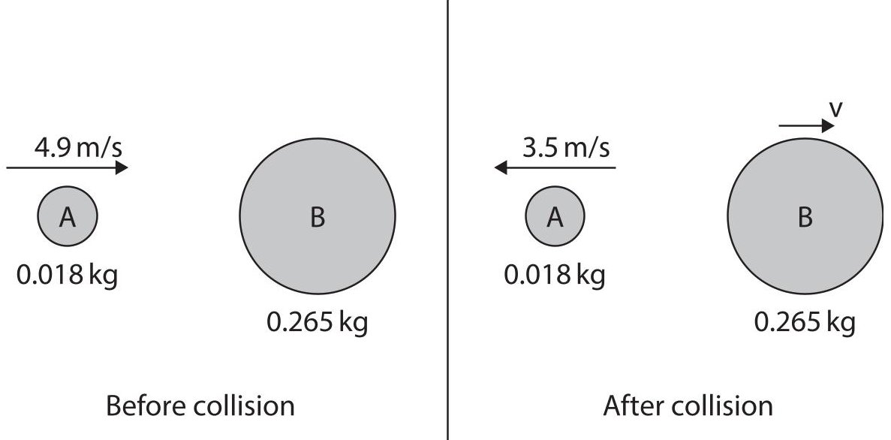

(a) When the balls collide, ball B applies a force on ball A, which causes the velocity of ball A to change.

Ball A also applies a force on ball B during the collision.

Describe how the force applied on ball A compares with the force applied on ball B during the collision.

(b) Calculate the momentum of ball A before the collision.

(c) Show that the velocity, v, of ball B after the collision is about 0.6 m/s.

(d) A collision is considered elastic if the total kinetic energy before the collision is equal to the total kinetic energy after the collision.

Using data from the diagram, deduce whether this collision is elastic.

(Total for Question 5 = 12 marks)

## BLANK PAGE

6 This question is about generating electricity from renewable energy resources.

(a) Photograph 1 shows a solar farm in the United Kingdom and photograph 2 shows a geothermal power station in Iceland.

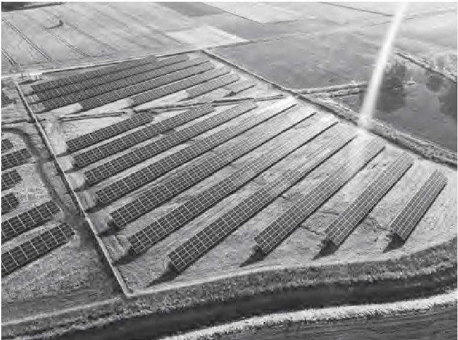

Photograph 1

(Source: $ \textcircled{c} $ Marcin Jucha / Shutterstock)

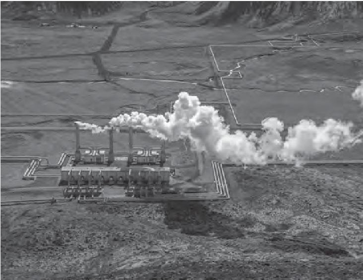

Photograph 2

(Source: $ \textcircled{c} $ Javarman / Shutterstock)

Discuss the advantages and disadvantages of generating electricity using solar power and geothermal resources.

(b) A student investigates how the amount of light affects the output voltage of a solar cell.

Photograph 3 shows how the student sets up their equipment.

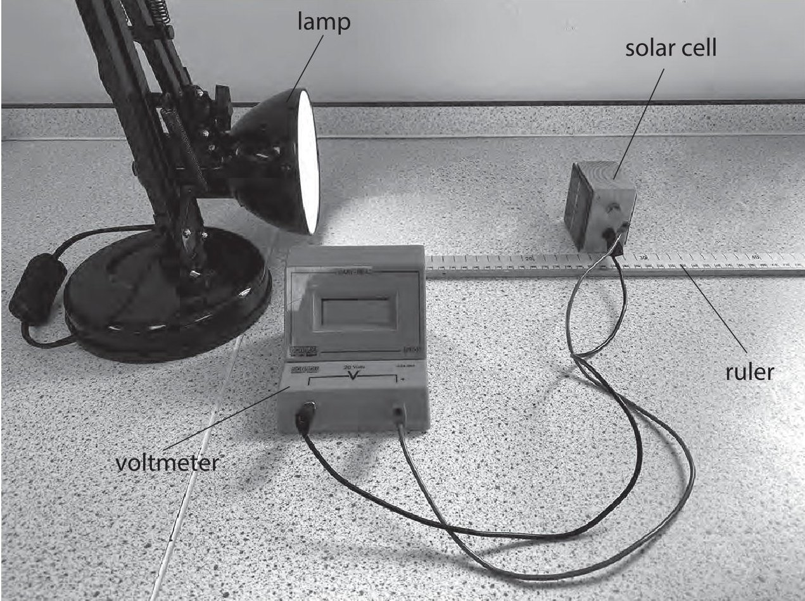

## Photograph 3

(i) The student varies the distance between the solar cell and the lamp and measures the output voltage of the solar cell at each distance.

The student's results are shown below.

<table border="1"><tr><td>5cm,0.45V</td><td>14cm,0.06V</td></tr><tr><td>8cm,0.18V</td><td>17cm,0.04V</td></tr><tr><td>11cm,0.10V</td><td>20cm,0.03V</td></tr></table>

Draw a table showing the student's results.

(ii) Give a control variable for the student's investigation.

(iii) The student states that the solar cell could be used as a power source for the lamp.

They suggest that this would work if

- the solar cell is connected directly to the lamp

- the light from the lamp is used to produce the output power from the solar cell

Explain, with reference to the principle of conservation of energy, why the student's suggestion would not work.

7 The diagram shows two students doing an experiment to measure the speed of sound in air.

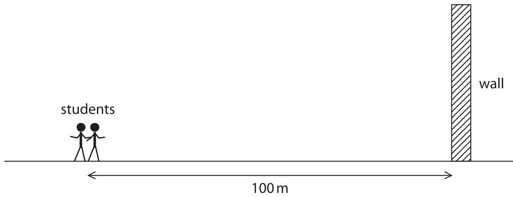

This is their method.

- both students stand 100 m away from a large flat wall

- student A makes a sound by hitting two blocks of wood together

- the sound waves travel to the wall and reflect back to the students as an echo

- student A hits the blocks together again when the echo is heard

- student A continues to hit the blocks together every time an echo is heard

- student B starts a timer when the blocks are hit together and stops the timer when the blocks have been hit together 20 more times

(a) Give a reason why the students do not stand nearer to the wall.

(1) 

(b) The students repeat their method five times. The table shows the students' results.

<table border="1"><tr><td colspan="6">Time between starting and stopping timer in seconds</td></tr><tr><td>test1</td><td>test2</td><td>test3</td><td>test4</td><td>test5</td><td>mean</td></tr><tr><td>11.80</td><td>11.18</td><td>11.76</td><td>11.75</td><td>11.72</td><td></td></tr></table>

(i) The students decide that one of their tests shows an anomalous result. Circle the anomalous result in the table.

(ii) Suggest a reason for the anomalous result.

(iii) Calculate the mean time between starting and stopping the timer. Give your answer to a suitable number of decimal places.

(iv) The speed of sound in air can be calculated using the formula

$$
\mathrm {s p e e d} = \frac {\mathrm {d i s t a n c e t r a v e l l e d}}{\mathrm {t i m e t a k e n}}
$$

Use the students' results to calculate a value for the speed of sound in air.

(Total for Question 7 = 9 marks)

8 The diagram shows a machine that can be used to measure the speed of fast-moving protons.

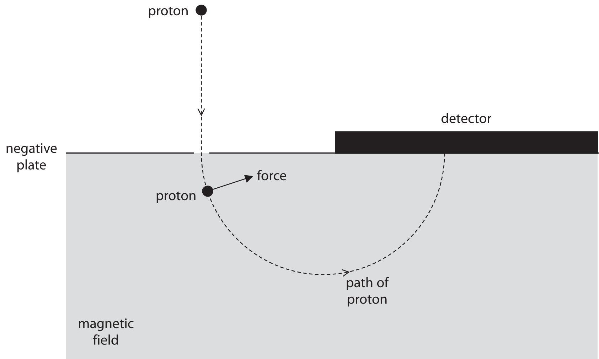

(a) At the start, the proton is attracted towards a negatively charged plate.

(i) Give a reason why the proton is attracted to the negatively charged plate.

(ii) The proton accelerates at $ 1. 9 0 \times1 0^{1 1} \mathrm{m} / \mathrm{s}^{2} $ from rest to a speed of $ 1. 3 8 \times1 0^{5} \mathrm{m} / \mathrm{s}. $

Show that the time taken for this acceleration is about $ 7\times10^{-7} \mathrm{s} $

(b) The proton passes through a hole in the negatively charged plate and enters an area where there is a magnetic field.

The magnetic field exerts a force on the proton, as shown in the diagram.

This force causes the proton to follow a circular path without changing speed.

(i) Give the direction of the magnetic field.

(ii) Suggest how increasing the strength of the magnetic field will affect the proton when it is moving in the magnetic field.

(Total for Question 8 = 7 marks)

9 An oscilloscope can be used to determine the frequency of a sound wave.

(a) Give the name of the piece of apparatus that must be connected to the oscilloscope to detect the sound wave.

(b) The diagram shows the screen of the oscilloscope and the oscilloscope settings.

<table border="1"><tr><td></td><td></td><td></td><td></td><td></td><td></td><td></td><td></td></tr><tr><td></td><td></td><td></td><td></td><td></td><td></td><td></td><td></td></tr><tr><td></td><td></td><td></td><td></td><td></td><td></td><td></td><td></td></tr><tr><td></td><td></td><td></td><td></td><td></td><td></td><td></td><td></td></tr><tr><td></td><td></td><td></td><td></td><td></td><td></td><td></td><td></td></tr><tr><td></td><td></td><td></td><td></td><td></td><td></td><td></td><td></td></tr></table>

oscilloscope settings:

y direction: 1 square=2V

x direction: 1 square=0.001s

A sound wave of frequency 250 Hz is detected.

The sound wave produces a trace on the oscilloscope of amplitude 4V.

Complete the diagram by drawing the trace of this sound wave on the oscilloscope screen.

(c) The graph shows how the wavelength of sound waves in air varies with their frequency.

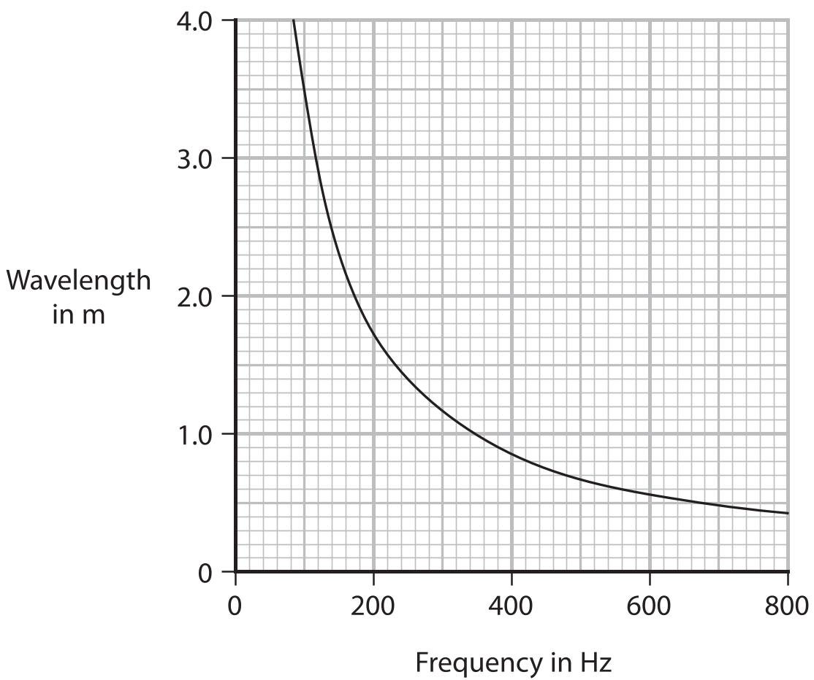

If wavelength and frequency are inversely proportional, then

Using the graph, evaluate whether the wavelength of sound waves in air is inversely proportional to their frequency.

TOTAL FOR PAPER = 70 MARKS

## BLANK PAGE

<table><tr><td colspan="2">Pearson Edexcel International GCSE (9-1)</td></tr><tr><td colspan="2">Friday 14 June 2024</td></tr><tr><td>Paper reference</td><td>4PH1/2PR</td></tr><tr><td colspan="2">Physics
UNIT: 4PH1
PAPER: 2PR</td></tr><tr><td colspan="2">Equation Booklet
Do not return this Booklet with the question paper.</td></tr></table>

Turn over

These equations may be required for both International GCSE Physics (4PH1) and International GCSE Combined Science (4SD0) papers.

<table border="1"><tr><td colspan="2">1. Forces and Motion</td></tr><tr><td colspan="2">average speed $=\frac{distance\ moved}{time\ taken}$</td></tr><tr><td>acceleration $=\frac{change\ in\ velocity}{time\ taken}$</td><td>$a=\frac{(v-u)}{t}$</td></tr><tr><td colspan="2">$(final\ speed)^2=(initial\ speed)^2+(2\times acceleration\times distance\ moved)$
$v^2=u^2+(2\times a\times s)$</td></tr><tr><td>force $=$ mass $\times$ acceleration</td><td>F=m$\times$a</td></tr><tr><td>weight $=$ mass $\times$ gravitational field strength</td><td>W=m$\times$g</td></tr><tr><td colspan="2">2. Electricity</td></tr><tr><td>power $=$ current $\times$ voltage</td><td>P=I$\times$V</td></tr><tr><td>energy transferred $=$ current $\times$ voltage $\times$ time</td><td>E=I$\times$V$\times$t</td></tr><tr><td>voltage $=$ current $\times$ resistance</td><td>V=I$\times$R</td></tr><tr><td>charge $=$ current $\times$ time</td><td>Q=I$\times$t</td></tr><tr><td>energy transferred $=$ charge $\times$ voltage</td><td>E=Q$\times$V</td></tr><tr><td colspan="2">3. Waves</td></tr><tr><td>wave speed $=$ frequency $\times$ wavelength</td><td>v=f$\times$λ</td></tr><tr><td>frequency $=\frac{1}{time\ period}$</td><td>f=$\frac{1}{T}$</td></tr><tr><td>refractive index $=\frac{\sin(\angle\ of\ incidence)}{\sin(\angle\ of\ refraction)}$</td><td>n=$\frac{\sin i}{\sin r}$</td></tr><tr><td>$\sin(\mathrm{critical\ angle})=\frac{1}{\mathrm{refractive\ index}}$</td><td>$\sin c=\frac{1}{n}$</td></tr></table>

<table border="1"><tr><td colspan="2">4. Energy resources and energy transfers</td></tr><tr><td colspan="2">efficiency $=\frac{\text{useful energy output}}{\text{total energy output}}\times100\%$</td></tr><tr><td>work done $=\text{force}\times\text{distance moved}$</td><td>$W=F\times d$</td></tr><tr><td colspan="2">gravitational potential energy $=\text{mass}\times\text{gravitational field strength}\times\text{height}$</td></tr><tr><td colspan="2">GPE $=m\times g\times h$</td></tr><tr><td>kinetic energy $=\frac{1}{2}\times\text{mass}\times\text{speed}^{2}$</td><td>$KE=\frac{1}{2}\times m\times v^{2}$</td></tr><tr><td>power $=\frac{\text{work done}}{\text{time taken}}$</td><td>$P=\frac{W}{t}$</td></tr><tr><td colspan="2">5. Solids, liquids and gases</td></tr><tr><td>density $=\frac{\text{mass}}{\text{volume}}$</td><td>$\rho=\frac{m}{V}$</td></tr><tr><td>pressure $=\frac{\text{force}}{\text{area}}$</td><td>$p=\frac{F}{A}$</td></tr><tr><td colspan="2">pressure difference $=\text{height}\times\text{density}\times\text{gravitational field strength}$</td></tr><tr><td colspan="2">$p=h\times\rho\times g$</td></tr><tr><td>$\frac{\text{pressure}}{\text{temperature}}=\text{constant}$</td><td>$\frac{p_{1}}{T_{1}}=\frac{p_{2}}{T_{2}}$</td></tr><tr><td>pressure $\times$ volume $=\text{constant}$</td><td>$p_{1}\times V_{1}=p_{2}\times V_{2}$</td></tr><tr><td colspan="2">8. Astrophysics</td></tr><tr><td>orbital speed $=\frac{2\times\pi\times\text{orbital radius}}{\text{time period}}$</td><td>$v=\frac{2\times\pi\times r}{T}$</td></tr></table>

The equations on the following page will only be required for International GCSE Physics.

<table border="1"><tr><td colspan="2">1. Forces and Motion</td></tr><tr><td>momentum=mass×velocity</td><td>p=m×v</td></tr><tr><td>force=$\frac{\text{change in momentum}}{\text{time taken}}$</td><td>F=$\frac{(mv-mu)}{t}$</td></tr><tr><td colspan="2">moment=force×perpendicular distance from the pivot</td></tr><tr><td colspan="2">5. Solids, liquids and gases</td></tr><tr><td colspan="2">change in thermal energy=mass×specific heat capacity×change in temperature
$\Delta Q=m\times c\times \Delta T$</td></tr><tr><td colspan="2">6. Magnetism and electromagnetism</td></tr><tr><td colspan="2">relationship between input and output voltages for a transformer
$\frac{\text{input (primary) voltage}}{\text{output (secondary) voltage}}=\frac{\text{primary turns}}{\text{secondary turns}}$</td></tr><tr><td colspan="2">input power=output power
$V_{p}I_{p}=V_{s}I_{s}$
for 100% efficiency</td></tr><tr><td colspan="2">8. Astrophysics</td></tr><tr><td>$\frac{\text{change in wavelength}}{\text{reference wavelength}}=\frac{\text{velocity of a galaxy}}{\text{speed of light}}$</td><td>$\frac{\lambda-\lambda_{0}}{\lambda_{0}}=\frac{\Delta\lambda}{\lambda_{0}}=\frac{v}{c}$</td></tr></table>

END OF EQUATION LIST