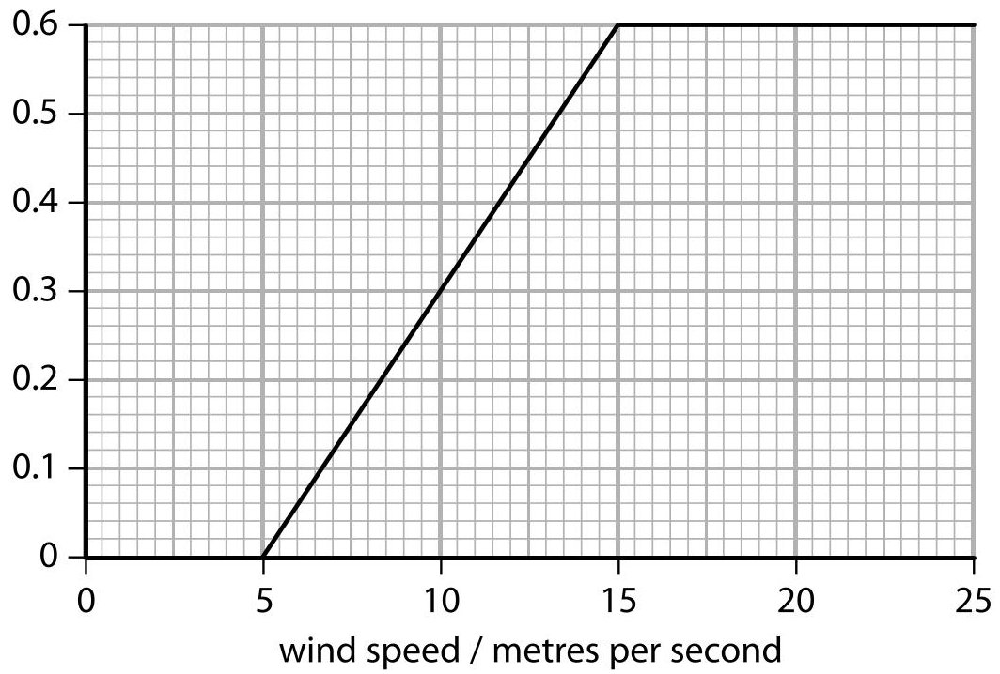
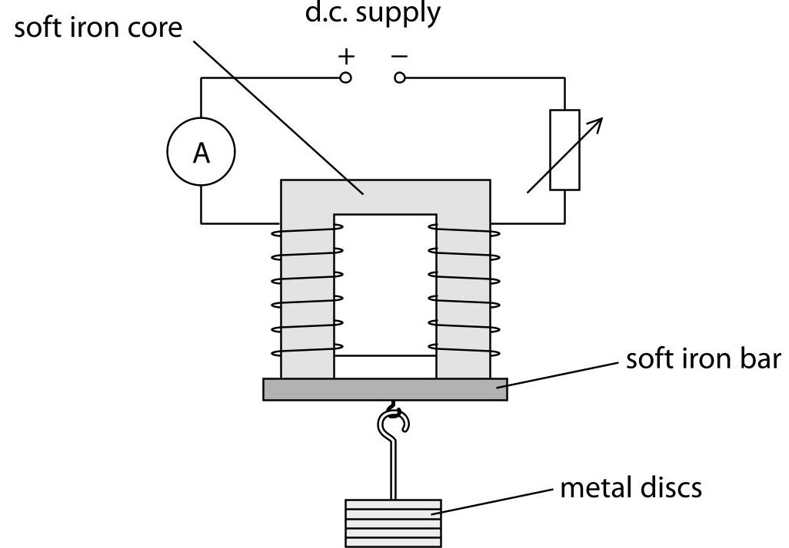
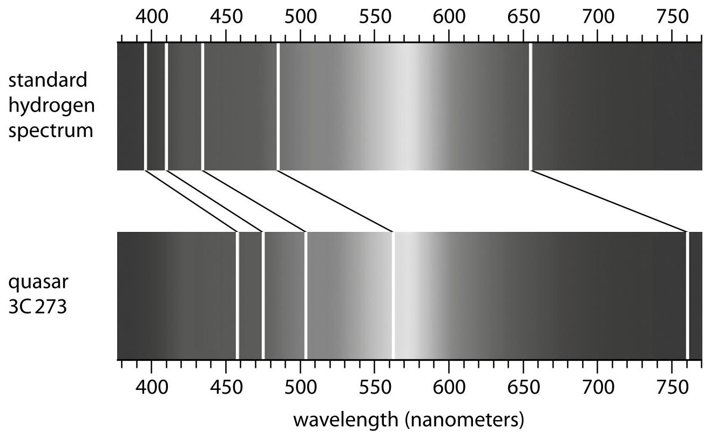
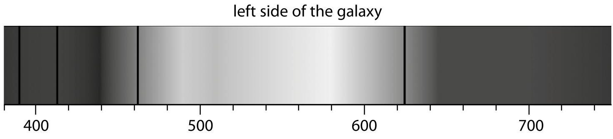
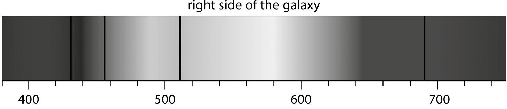
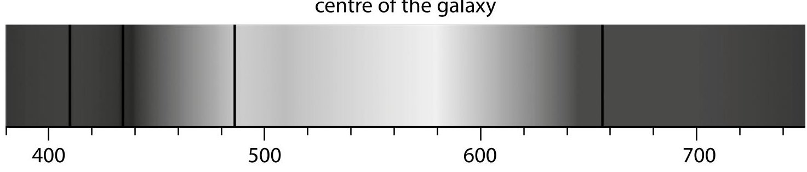

<table><tr><td colspan="2">Write your name here</td></tr><tr><td>Surname</td><td>Other names</td></tr><tr><td colspan="2">Centre Number</td></tr><tr><td colspan="2">Candidate Number</td></tr><tr><td colspan="2">Pearson Edexcel International GCSE (9 - 1)</td></tr><tr><td colspan="2">Physics
Paper 2</td></tr><tr><td colspan="2">Sample Assessment Material for first teaching September 2017
Time: 1 hour 15 minutes</td></tr><tr><td colspan="2">Paper Reference
4PH1/2P</td></tr><tr><td colspan="2">You must have:
Calculator, ruler</td></tr><tr><td colspan="2">Total Marks</td></tr></table>

## Instructions

- Use black ink or ball-point pen.

- Fill in the boxes at the top of this page with your name, centre number and candidate number.

- Answer all questions.

- Answer the questions in the spaces provided

- there may be more space than you need.

- Calculators may be used.

- You must show all your working out with your answer clearly identified at the end of your solution.

- Some questions must be answered with a cross in a box . If you change your mind about an answer, put a line through the box and then mark your new answer with a cross.

## Information

- The total mark for this paper is 70.

- The marks for each question are shown in brackets

- use this as a guide as to how much time to spend on each question.

## Advice

- Read each question carefully before you start to answer it.

- Try to answer every question.

- Check your answers if you have time at the end.

S52918A

## EQUATIONS

You may find the following equations useful.

$$
\mathrm {e n e r g y t r a n s f e r r e d} = \mathrm {c u r r e n t} \times \mathrm {v o l t a g e} \times \mathrm {t i m e}
$$

$$
E = I \times V \times t
$$

$$
\mathrm {f r e q u e n c y} = \frac {1}{\mathrm {t i m e p e r i o d}}
$$

$$
f = \frac {1}{T}
$$

$$
\mathrm {p o w e r} = \frac {\mathrm {w o r k d o n e}}{\mathrm {t i m e t a k e n}}
$$

$$
P = \frac {W}{t}
$$

$$
\mathrm {p o w e r} = \frac {\mathrm {e n e r g y t r a n s f e r r e d}}{\mathrm {t i m e t a k e n}}
$$

$$
P = \frac {W}{t}
$$

$$
\mathrm {o r b i t a l s p e e d} = \frac {2 \pi \times \mathrm {o r b i t a l r a d i u s}}{\mathrm {t i m e p e r i o d}}
$$

$$
V = \frac {2 \times \pi \times r}{T}
$$

$$
(\mathrm {f i n a l s p e e d}) ^ {2} = (\mathrm {i n i t i a l s p e e d}) ^ {2} + (2 \times \mathrm {a c c e l e r a t i o n} \times \mathrm {d i s t a n c e m o v e d})
$$

$$
v ^ {2} = u ^ {2} + (2 \times a \times s)
$$

$$
\mathrm {p r e s s u r e} \times \mathrm {v o l u m e} = \mathrm {c o n s t a n t}
$$

$$
p _ {1} \times V _ {1} = p _ {2} \times V _ {2}
$$

$$
\frac {\mathrm {p r e s s u r e}}{\mathrm {t e m p e r a t u r e}} = \mathrm {c o n s t a n t}
$$

$$
\frac {p _ {1}}{T _ {1}} = \frac {p _ {2}}{T _ {2}}
$$

$$
\mathrm {f o r c e} = \frac {\mathrm {c h a n g e i n m o m e n t u m}}{\mathrm {t i m e t a k e n}}
$$

$$
F = \frac {(m v - m u)}{t}
$$

$$
\frac {\mathrm {c h a n g e o f w a v e l e n g t h}}{\mathrm {w a v e l e n g t h}} = \frac {\mathrm {v e l o c i t y o f a g a l a y}}{\mathrm {s p e e d o f l i g h t}}
$$

$$
\frac {\lambda - \lambda_ {0}}{\lambda_ {0}} = \frac {\Delta \lambda}{\lambda_ {0}} = \frac {v}{c}
$$

change in thermal energy = mass $ \times $ specific heat capacity $ \times $ change in temperature

$$
\Delta Q = m \times c \times \Delta T
$$

Where necessary, assume the acceleration of free fall, g = 10 m/s $ ^{2} $

## TURN THE PAGE OVER FOR QUESTION 1

## Answer ALL questions. Write your answers in the spaces provided.

1 A tennis racket is used to hit a tennis ball.

The ball is in contact with the racket for 0.20 seconds and leaves the racket with a horizontal velocity of 46 m/s.

(a) (i) State the equation relating acceleration, change in velocity and time taken.

(ii) Calculate the acceleration of the tennis ball assuming it is at rest when it is hit. Give the unit.

(b) The tennis ball has a mass of 57 grams.

(i) State the equation relating momentum, mass and velocity.

(ii) Calculate the momentum of the tennis ball when its velocity is 46 m/s.

## momentum=

(c) The bottom of a tennis player's shoes are thick and made from a material that compresses when the player's feet land on the ground.

Explain why these shoes reduce the risk of injury to the tennis player.

(Total for Question 1 = 11 marks)

2 Lightning strikes the Earth frequently and often starts in rain clouds.

Inside the clouds, powerful winds move ice particles and tiny water droplets.

The bottom of the clouds becomes negatively charged and the top becomes positively charged.

(a) Give a reason why the clouds become charged.

(b) The ground below the cloud becomes positively charged.

Explain why the ground becomes charged.

You should use ideas about electron movement in your answer.

(c) The build-up of charge in the cloud and in the ground causes the air to ionise. This means that the air becomes a conductor, and a low resistance path from the cloud to the ground is formed.

(i) State what is meant by the term ionise.

(ii) State the relationship between charge, current and time.

(iii) During one lightning strike, the mean current is 32 kA and the mean charge transferred is 15 C.

Calculate the mean time duration of a lightning strike.

$$
\mathrm {m e a n t i m e} =
$$

(iv) The mean energy transferred during the lightning strike is $ 5 1 0 \times1 0^{6} \mathrm{J}. $ Show that the resistance of the air is approximately $ 1 0 0 0 \Omega. $

3 Wind is a renewable resource used to generate electricity.

(a) (i) State one advantage and one disadvantage of producing electricity using wind turbines.

Advantage.

Disadvantage

(ii) The graph shows how the power output of a wind turbine varies with wind speed.

Describe how the power output of a wind turbine varies with wind speed.

You should use data points from the graph in your answer.

(b) A wind turbine produces an alternating voltage of 600V.

The voltage needs to be increased to 132kV before transmission to a nearby town.

The size of the voltage is changed using a transformer.

Describe the structure and operation of a suitable transformer.

You may use a diagram in your answer.

(Total for Question 3 = 10 marks)

4 This question is about heating water.

(a) Liquid water boils and becomes a gas at $ 1 0 0^{\circ} \mathrm{C} $

Describe the differences between the arrangement and motion of particles in a liquid and in a gas.

You may include a diagram in your answer.

(b) A teacher uses a 2200W kettle to heat water.

The kettle is switched on for 2 minutes.

(i) Calculate the energy transferred by the kettle.

energy transferred =

(ii) State the equation relating change in thermal energy, mass, specific heat capacity and change in temperature.

(iii) The mass of water in the kettle is 1.1 kg and its initial temperature is $ 2 0^{\circ} \mathrm{C} $.

Calculate the final temperature of the water after it has been heated for 2.0 minutes.

[the specific heat capacity of water is 4200 J/kg $ ^{\circ} \mathrm{C} $]

final temperature =

(c) The teacher measures the final temperature of the water after heating it for 2 minutes.

(i) Name a piece of equipment the teacher could use to measure the temperature of the water.

(ii) Explain why the measured final temperature is different from your calculated value.

(Total for Question 4 = 14 marks)

5 A student investigates how the minimum current required to support a load using an electromagnet varies as the load is increased.

He uses metal discs to increase the load and changes the current using a variable resistor.

(a) (i) State the independent variable in this investigation.

(ii) Give a reason for using a core and a bar made from soft iron.

(b) The student's results are given in the table.

<table border="1"><tr><td>Number of metal discs</td><td>Minimum current/mA</td></tr><tr><td>0</td><td>30</td></tr><tr><td>2</td><td>48</td></tr><tr><td>5</td><td>75</td></tr><tr><td>6</td><td>78</td></tr><tr><td>7</td><td>93</td></tr><tr><td>10</td><td>120</td></tr></table>

(i) On the grid, draw a bar chart of current against number of metal discs.

(ii) State why a current is needed when there are no metal discs added to the load.

(iii) Explain how the student can improve his results.

## (Total for Question 5 = 10 marks)

6 This question is about astrophysics.

(a) (i) What is a star formed from?

A a black dwarf

B a nebula

C a planet

D a white dwarf

(ii) Which of these indicates that the Universe is expanding?

A galaxies are moving further away from each other

B galaxies rotate

C it takes millions of light years for light to reach us from some stars

D some stars in the Milky Way are accelerating towards our Sun

(iii) Which of these provides evidence for the Big Bang theory?

A cosmic microwave background radiation

B nebulae

neutron stars

D ultrasound radiation

(iv) Which of these does red-shift provide evidence for?

A galaxies are moving away from each other

B nebulae contract to form stars

C red giants shrink to red dwarfs

D white dwarfs expand into red giants

(b) The spectra of stars and galaxies show lines at specific wavelengths that correspond to the spectra of hydrogen, helium and carbon.

Give reasons why lines corresponding to these elements are found in spectra from typical galaxies.

(c) The spectrum of light from an astronomical object called a quasar can be compared to the spectrum of hydrogen on Earth.

(i) Calculate the change in wavelength, $ \Delta \lambda $ , for the line at the red end of the spectrum.

$$
\Delta \lambda =
$$

(ii) Calculate a value for the recessional velocity of the quasar using your value for $ \Delta\lambda. $

speed of light in free space, $ c=3.0\times10^{5} $ km/s

(d) An astronomer observes the light from a nearby galaxy.

She notices that the spectra for hydrogen from the right side and left side of the galaxy are different.

She compares them to the spectrum for hydrogen from the centre of the galaxy.

Explain what information the two spectra give about the movement of the galaxy.

(Total for Question 6 = 14 marks)

TOTAL FOR PAPER = 70 MARKS

## BLANK PAGE